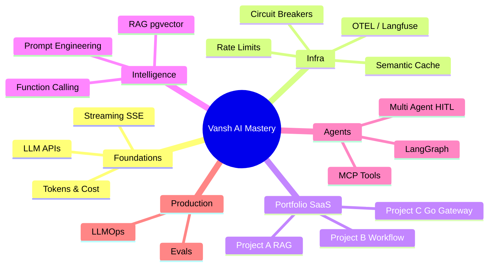
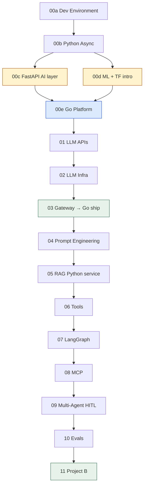

# AI Development — Learning Plan

> **Pace**: ~1–2 weeks per concept module, ~2–3 weeks per project. Adjust karo — quality > calendar.  
> **Visual learner**: Har module mein `## Visual map` hai — `@VISUAL-STUDY-GUIDE.md` se shuru karo.

## North star

Seekh kar **teen defendable SaaS products** ship karo — **har `@Prompt.md` hot topic** covered (`@TOPIC-COVERAGE.md`). CV pe likh sako aur interview mein depth se bacha sako. Full spec: `@Projects.md`. Coach style: `@Prompt.md`.

**Curriculum** (modules 00a→00e→11) = concept order. **Ship order** = A (RAG) → B (Workflow) → C (Go Gateway).  
**Polyglot**: Go = platform spine · Python = AI services (`@Projects.md`).

---

## Visual overview (mind map)



## Dependency graph (kya pehle, kya baad)



---

## Track 0 — Prerequisites (~2 weeks)

> **00a → 00b → 00c + 00d → 00e Go → 01**

### Module 00a — Dev Environment

**Folder**: `modules/00a-dev-environment`  
Docker, Postgres, Redis, Python venv, `.env` hygiene.

### Module 00b — Python Async & Pydantic

**Folder**: `modules/00b-python-async`  
`async/await`, type hints, Pydantic (= tumhara Zod), `httpx`.

### Module 00c — FastAPI

**Folder**: `modules/00c-fastapi`  
Routes, `Depends`, middleware, SSE stub — **Project A/B ka FastAPI stack**.

### Module 00d — ML & AI Foundations (TensorFlow intro)

**Folder**: `modules/00d-ml-ai-foundations`  
Training vs inference, embeddings, NumPy, TensorFlow/Keras hello world.  
**Honest scope**: interview + RAG prep — inference mostly OpenAI API, not TF training.

### Module 00e — Go Platform Backend

**Folder**: `modules/00e-go-platform`  
Go HTTP (chi), middleware, goroutines, proxy to Python. **Platform spine** — auth, metering, billing, public API. Project C gateway ship yahi stack.

---

## Phase 0 — Setup (merged into 00a)

Pehle `00a-dev-environment` MODULE follow karo — wahi Phase 0 ka kaam hai.

---

## Module 01 — LLM APIs

**Agent folder**: `modules/01-llm-apis`

| Topic | Learning hook (teraa brain) |
|-------|----------------------------|
| Chat completions vs messages API | REST endpoint jaisa — request/response contract |
| System / user / assistant roles | Pipeline stages — har role ka alag responsibility |
| Tokens & pricing | Order book fees — har unit ka cost |
| Temperature, max_tokens | Slippage controls — kitna random / kitna fill |
| Streaming (SSE) | Redis Pub/Sub → WebSocket — token events |

**Exit criteria**

- [ ] 1M tokens ka monthly cost estimate 3 models ke liye verbally explain
- [ ] Streaming vs non-streaming trade-offs likh (latency, UX, error handling)
- [ ] Assignment: incomplete FastAPI route complete karo — sync + stream dono

---

## Module 02 — LLM Infra Patterns

**Agent folder**: `modules/02-llm-infra`

| Topic | Learning hook |
|-------|---------------|
| Rate limiting (token bucket) | Exchange order rate limits |
| Per-user budgets | Trading limits per account |
| Semantic caching (Redis) | Matching similar orders — fuzzy key |
| Circuit breakers + fallback | Provider down = alternate liquidity venue |
| Cost tracking per request | Per-trade fee accounting |
| OpenTelemetry spans | Prometheus counters tum already jaante ho |

**Exit criteria**

- [ ] Redis cache hit/miss metric design explain
- [ ] Fallback order diagram (OpenAI → Anthropic) banao
- [ ] Assignment: rate limiter stub complete + test cases pass

---

## Module 03 — LLM Gateway (concepts → Project C)

**Agent folder**: `modules/03-project-llm-gateway` · **Ship spec**: `@Projects.md` **Project C** (Go). Yeh module gateway patterns seekhata hai; production ship Go mein baad mein.

**Features checklist**

- [ ] Model routing by complexity (Haiku / Sonnet / Opus)
- [ ] Semantic cache (Redis)
- [ ] Rate limit + per-user token budget
- [ ] Circuit breaker + provider fallback
- [ ] Cost tracking + OTEL/Langfuse tracing
- [ ] SSE streaming

**CV bullet target**

> Built LLM gateway routing across Opus/Sonnet/Haiku by query complexity with Redis semantic caching, cutting per-query cost ~40%; added circuit breakers and OpenTelemetry tracing.

**Interview hooks**: cost modeling, p99 latency, cache invalidation, multi-tenant budgets.

---

## Module 04 — Prompt Engineering

**Agent folder**: `modules/04-prompt-engineering`

| Topic | Learning hook |
|-------|---------------|
| System prompt design | Business rules engine — refund policy text |
| Few-shot examples | Test cases in recon matching |
| Chain-of-thought (when/when not) | Debug logs — verbose vs production |
| JSON / structured prompt constraints | Zod schemas — same mental model |

**Exit criteria**

- [ ] Same task ke 2 prompts compare — quality vs token cost
- [ ] Prompt injection attack + mitigation explain
- [ ] Assignment: broken system prompt fix karo — output format stable ho

---

## Module 05 — RAG + pgvector

**Agent folder**: `modules/05-rag-pgvector`

| Topic | Learning hook |
|-------|---------------|
| Embeddings | Hash/fingerprint — similar text → similar vector |
| Chunking strategies | CSV chunked import — platform limits |
| pgvector vs dedicated vector DB | Postgres tumhara home turf |
| Retrieval + reranking | 4-strategy cascade recon — try cheapest first |
| Hybrid search (keyword + vector) | IBAN lookup + invoice match combo |

**Exit criteria**

- [ ] Chunk size trade-offs diagram
- [ ] "Lost in the middle" problem explain
- [ ] Assignment: retrieval pipeline stub — embedding + top-k query complete

---

## Module 06 — Tools & Function Calling

**Agent folder**: `modules/06-tools-function-calling`

| Topic | Learning hook |
|-------|---------------|
| Tool schemas (OpenAI / Anthropic) | Zod API contracts |
| Structured outputs (Pydantic) | Prisma + Zod validation chain |
| Parallel vs sequential tools | Async chain stages — debit→AP→apply |
| Idempotent tool design | Exactly-once payment — duplicate call safe |

**Exit criteria**

- [ ] Tool failure retry policy likh
- [ ] Schema drift kaise handle karoge — versioning
- [ ] Assignment: 2-tool agent loop stub complete

---

## Module 07 — Agents & LangGraph

**Agent folder**: `modules/07-agents-langgraph`

| Topic | Learning hook |
|-------|---------------|
| Agent loop (think → act → observe) | Worker consuming Kafka messages |
| State graph / nodes / edges | Refund 5-stage state machine |
| Checkpointing | Savepoints — resume after crash |
| Short-term vs long-term memory | Session vs Postgres ledger |

**Exit criteria**

- [ ] LangGraph state diagram apne words mein
- [ ] Infinite loop prevention strategies
- [ ] Assignment: 3-node graph stub — routing logic complete

---

## Module 08 — MCP (Model Context Protocol)

**Agent folder**: `modules/08-mcp`

| Topic | Learning hook |
|-------|---------------|
| MCP server vs client | Microservice exposing REST tools |
| Tool discovery | OpenAPI spec listing endpoints |
| Auth & sandboxing | JWT-scoped API access |
| Zapier actions as MCP tools | Existing integrations reuse |

**Exit criteria**

- [ ] MCP vs raw function calling — kab MCP?
- [ ] Assignment: mock MCP tool server — 1 read + 1 write tool

---

## Module 09 — Multi-Agent & Human-in-the-Loop

**Agent folder**: `modules/09-multi-agent-hitl`

| Topic | Learning hook |
|-------|---------------|
| Planner / executor split | Orchestrator vs worker services |
| Human approval gates | Irreversible refund — manager sign-off |
| Excessive agency mitigation | Atomic deactivation — safety before action |
| Agent-to-agent messaging | Kafka topics between services |

**Exit criteria**

- [ ] HITL latency vs safety trade-off essay (short)
- [ ] Assignment: approval checkpoint stub — state pause/resume

---

## Module 10 — Evals & LLMOps

**Agent folder**: `modules/10-evals-llmops`

| Topic | Learning hook |
|-------|---------------|
| Trajectory evals | Integration test — full refund chain |
| Regression datasets | Golden CSV recon cases |
| Langfuse traces | Prometheus + structured logs |
| Cost dashboards | Exchange fee dashboard |
| CI for prompts | GitHub Actions — tum already use karte ho |

**Exit criteria**

- [ ] 5 eval metrics define (accuracy, latency, cost, safety, consistency)
- [ ] Assignment: 3 golden tests + pass/fail scorer stub

---

## Module 11 — PROJECT: Agentic Workflow (→ Project B)

**Agent folder**: `modules/11-project-agentic-workflow` · **Ship spec**: `@Projects.md` **Project B**

**Features checklist**

- [ ] NL → workflow plan (LangGraph)
- [ ] MCP tool integration
- [ ] Structured outputs (Pydantic)
- [ ] HITL before irreversible steps
- [ ] Outbox + Kafka exactly-once execution
- [ ] Eval harness (agent trajectory scoring)

**Domain anchor**: Crypto/payment/refund workflows — domain defend kar paoge.

**CV bullet target**

> Built agentic workflow engine on Kafka outbox with HITL checkpoints and MCP tools; trajectory evals reduced bad executions in regression suite.

---

## Weekly rhythm (suggested)

| Day | Focus |
|-----|-------|
| Mon–Tue | Concept + active recall (coach agent) |
| Wed–Thu | Assignment implementation (Cursor) |
| Fri | Scale & YC review + NOTES.md update |
| Sat | Spaced recall — bina notes ke explain karo |
| Sun | Buffer / catch-up |

---

## Spaced repetition checklist (har 2 modules ke baad)

- [ ] Tokens → dollars conversion verbal
- [ ] RAG failure modes (3)
- [ ] Agent loop diagram draw from memory
- [ ] Gateway features list from memory
- [ ] Eval vs unit test difference

---

## Agent spawn cheat sheet

```
Module 01 agent: @Memory.md @LEARNING-PLAN.md @modules/01-llm-apis/MODULE.md
Module 03 agent: @Memory.md @Projects.md @modules/03-project-llm-gateway/MODULE.md
Build agent: @Projects.md (paste full spec) — name Project A, B, or C
Coach persona: @Prompt.md @Memory.md
...
```

Har agent sirf apna module padhaye — cross-module spoiler mat do unless prerequisite recap chahiye.
