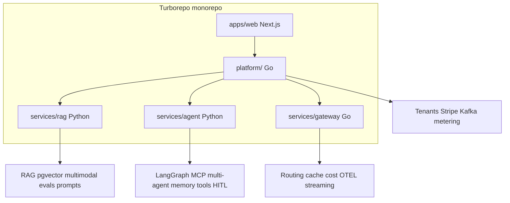

# Topic Coverage — Zero Gaps

> **Rule**: `@Prompt.md` mein jo bhi hot topic likha hai — **teeno projects + modules mila ke 100% cover**.  
> Koi checkbox empty = ship incomplete. **Chodna nahi.**

## Master checklist (`@Prompt.md` hot topics)

| # | Topic | Module (seekh) | Project A (RAG) | Project B (Workflow) | Project C (Gateway) |
|---|--------|----------------|-----------------|----------------------|---------------------|
| 1 | **RAG** | 05 | ✅ Agentic RAG core | ✅ RAG tools in workflows | — |
| 2 | **LangChain / LangGraph** | 07 | ✅ LCEL loaders, chains in ingest | ✅ **LangGraph** orchestration | — |
| 3 | **LLM Agents** | 06, 07 | ✅ Query-planning agent | ✅ Planner + executor agents | — |
| 4 | **Agentic AI** | 07, 09 | ✅ Self-correcting retrieval loop | ✅ Full agentic automation | — |
| 5 | **AI Agent** (single) | 06, 07 | ✅ Retrieval sub-agent | ✅ Specialist agents | — |
| 6 | **Function Calling** | 06 | ✅ Structured tool steps | ✅ **Core** — every workflow step | — |
| 7 | **Structured Outputs** | 06, 00b | ✅ Citations JSON, plan schema | ✅ Pydantic workflow plans | — |
| 8 | **Vector DB (pgvector)** | 05 | ✅ **Primary** + Pinecone benchmark | ✅ Optional memory store | — |
| 9 | **Prompt Engineering** | 04 | ✅ Injection defense, few-shot | ✅ NL → workflow prompts | ✅ Router prompts |
| 10 | **Memory** | 07 | ✅ Session + doc context | ✅ **Thread + workflow memory** (Postgres/Redis) | — |
| 11 | **Tools integration** | 06, 08 | ✅ ERP/recon tool stubs | ✅ Webhooks, DB, APIs | — |
| 12 | **MCP** | 08 | — | ✅ **MCP tool servers** | — |
| 13 | **Multi-Agent** | 09 | — | ✅ Supervisor + specialists | — |
| 14 | **LLMOps** | 10 | ✅ Langfuse traces, CI eval | ✅ Trajectory + regression CI | ✅ OTEL + dashboards |
| 15 | **evals** | 10 | ✅ ragas, 200 cases, leakage tests | ✅ Trajectory scoring | ✅ Routing/cache A/B |
| 16 | **Multimodal basics** | 05 (appendix) | ✅ **Scanned invoice/PDF vision** ingest | ✅ Image attachment in workflow | — |

### Cross-cutting (Prompt stack + extras)

| Topic | Where covered |
|-------|----------------|
| **Postgres** | All — pgvector, outbox, tenant data, agent memory |
| **Redis** | C cache/rate limit; B quotas; A optional session |
| **Kafka** | B outbox workers; A ingestion pipeline optional |
| **FastAPI** | A, B Python services |
| **Go** | C gateway; A/B phase 2 platform spine |
| **Next.js + Turborepo + pnpm** | Monorepo `apps/web` — dashboard, HITL UI, demo |
| **SSE streaming** | C passthrough; B agent stream; A answer stream |
| **Cost control** | C primary; A/B per-tenant budgets via Go platform |
| **Observability** | Langfuse + OTEL all projects; Prometheus on Go |
| **Human-in-the-loop** | B approval gates; A optional “publish answer” |
| **Exactly-once / idempotency** | B outbox; Go metering spine |

---

## Visual — ek portfolio, saare topics



---

## Per-project — explicit additions (kuch chhoot na jaye)

### Project A — add these if missing

- [ ] **Multimodal**: scanned PDF/image invoices → vision model → text → chunk → embed
- [ ] **LangChain**: document loaders + chunking utilities (LangGraph for agentic loop)
- [ ] **Memory**: conversation history per doc-set (Redis or Postgres thread table)
- [ ] **Function calling**: agent calls `search_ledger`, `get_invoice` tools during RAG

### Project B — add these if missing

- [ ] **LangGraph** state graph (not optional — primary)
- [ ] **MCP** servers for at least 2 tools (read DB, write webhook)
- [ ] **Multi-agent**: supervisor routes planner vs executor vs critic
- [ ] **Memory**: workflow run context + user prefs across runs
- [ ] **Kafka outbox**: exactly-once execution (your Zapier clone brain)
- [ ] **HITL**: approve before irreversible tool (payment/refund stub)

### Project C — add these if missing

- [ ] **All LLM API patterns**: streaming SSE, token counting, fallback chain
- [ ] **Semantic + exact cache** (module 02 concepts)
- [ ] **Model routing** Haiku/Sonnet/Opus by complexity
- [ ] **Per-tenant cost ledger** — margin visible

---

## Module → project proof

| Module | Proof artifact |
|--------|----------------|
| 00a–00e | Docker stack runs whole monorepo |
| 01–03 | Project C ships |
| 04–05 | Project A phase 1 ships |
| 06–09 | Project B phase 1 ships |
| 10 | Eval CI on A + B; gateway benchmarks on C |
| 11 | Project B milestone checklist = done |

**Interview line**: *"I didn't tick boxes on a course — I shipped three SaaS products where each topic has a production artifact and a measured eval."*

---

## Ship gate (before “done”)

```
□ Har row in master checklist = ✅ in at least one project
□ README per project lists which topics with file paths
□ Live demo + 2-min Loom
□ One eval number per project on CV
□ Can defend every checkbox in mock interview without notes
```

**Chew glass mode**: empty checkbox = weekend not done.
