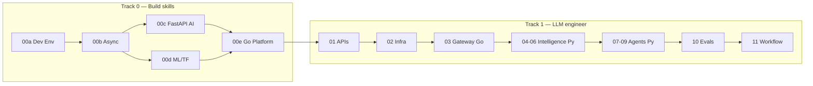

# Visual Study Guide — Vansh

> Tum **visual learner** ho — har module mein diagrams pehle, text baad. Yeh file = master cheat sheet.

## Full journey (bird's eye)



## CV → AI (visual bridge)

```
ROOTSTOCK / PROJECTS          AI CONCEPT
────────────────────          ──────────
Refund 5-stage chain    ───►  LangGraph + HITL
Savepoints              ───►  Agent checkpoints
Outbox + Kafka          ───►  Exactly-once agents
Matching engine         ───►  Model router
Redis Pub/Sub           ───►  SSE streaming
Prometheus              ───►  OTEL / Langfuse
Zod                     ───►  Pydantic tools
Bank recon cascade      ───►  Provider fallback
```

## Har session ka visual ritual

```
1. MODULE.md kholo
2. "Visual map" section dekho (2 min)
3. Topics padho — diagram ke saath map karo
4. Active recall — diagram BINA DEKHE redraw
5. NOTES.md mein apna version paste (photo/link ok)
```

## Obsidian tips

- **Reading view** (`Cmd+E`) — mermaid render hota hai
- **Graph view** — module links cluster dikhenge
- **Excalidraw plugin** (optional) — redraw challenge ke liye best
- Har NOTES.md mein section: `## My diagrams`

## Module quick visual index

| Module | Diagram type | Dekh kya samjhega |
|--------|--------------|-------------------|
| 00a | Box architecture | Docker + DB stack |
| 00b | Timeline | Sync vs async |
| 00e | Box architecture | **Go → Python split** |
| 00c | Request pipeline | FastAPI **AI service** |
| 00d | 2-path fork | Training vs API inference |
| 01 | Sequence | Token stream |
| 02 | Flow | Cache + breaker |
| 03 | System diagram | LLM Gateway |
| 04 | Layer stack | Prompt structure |
| 05 | Pipeline | RAG end-to-end |
| 06 | Loop | Tool calling |
| 07 | State graph | LangGraph |
| 08 | 3-tier | MCP |
| 09 | Swimlane | Multi-agent HITL |
| 10 | Flywheel | Eval loop |
| 11 | System diagram | Workflow engine |
