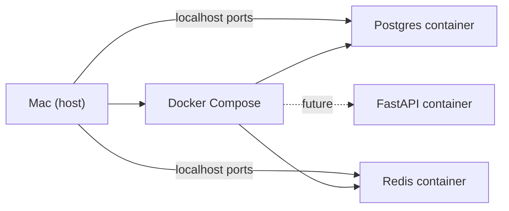

# Module 00a — Dev Environment

> **Agent spawn**: `@Memory.md` + this file + `@modules/00a-dev-environment/NOTES.md`  
> **Nav**: Start here · Next → [Module 00b Python Async](../00b-python-async/MODULE.md)

## At a glance

| | |
|---|---|
| Prerequisites | Mac terminal basics |
| Duration | ~2–3 sessions |
| Project? | No |
| Exit test | Docker mein Postgres+Redis up, FastAPI health 200 |

## Visual map

> **Kaise padho**: Pehle diagram dekho → topics padho → session end pe "Redraw challenge" bina dekhe draw karo



```
Mac (host machine)
    │
    └── docker compose up
            ├── postgres:5432  ←── DB volume
            ├── redis:6379     ←── cache volume
            └── fastapi:8000   ←── (future) health /health
```

### Mental model (1 line)

Mac pe code likho, containers mein services chalao — ek `docker compose up` se sab stack ek saath ready.

### Redraw challenge

Mac → Docker Compose → Postgres + Redis boxes draw karo; future FastAPI container ka dotted arrow add karo.

## Read order

1. Objectives → 2. Learning hooks → 3. Topics → 4. Assignments → 5. Coach se active recall

**Unlocks**: Module 00b, eventually sab kuch

## Objectives

1. Python project **properly** setup karo (`uv` ya `venv` + `pyproject.toml`)
2. Docker se Postgres + Redis local chalao
3. Env vars, `.env`, secrets hygiene samjho
4. Monorepo folder structure decide karo (gateway service ke liye)

## Learning hooks (CV → setup)

| Concept | Tera parallel |
|---------|---------------|
| Docker Compose | K8s/local dev — tum AWS/Docker CV pe hai |
| Postgres container | Prisma + Postgres projects |
| Redis container | Matching engine Redis |
| `.env` | API keys / DB URLs — JWT secrets jaisa |
| Health check endpoint | `/metrics` pattern from crypto exchange |

## Topics

- Python 3.11+ install verify (`python3 --version`)
- `uv` or `venv` + `pip` — dependency lock (`requirements.txt` / `pyproject.toml`)
- Docker Desktop + `docker compose up`
- Postgres: connection string, `psql` basics, one table create
- Redis: `redis-cli ping`, SET/GET
- `.env.example` vs `.gitignore` — **kabhi keys commit mat karo**
- Folder layout suggestion:
  ```
  services/
    llm-gateway/     # FastAPI app (baad mein)
  docker-compose.yml
  .env.example
  ```

## Assignments

| # | Task | Passing criteria |
|---|------|------------------|
| A1 | `docker-compose.yml` stub complete karo | `postgres` + `redis` healthy, ports exposed |
| A2 | Python venv + install `fastapi uvicorn httpx` | `import fastapi` no error |
| A3 | `.env.example` + load with `python-dotenv` | App prints DB URL (masked password ok) |
| A4 | Document: Node vs Python project layout diff | 5 bullets — tumhare Next.js brain se map |

## Active recall bank

1. Docker volume kyun chahiye Postgres ke liye?
2. Redis aur Postgres — gateway project mein alag kyun?
3. `.env` git mein kyun nahi jaata?

## Progress checklist

- [ ] Objectives recall bina notes ke
- [ ] Assignments A1–A4 pass
- [ ] NOTES.md session log updated

## Ship to NOTES.md

Har session: date, topic, 1-line takeaway, open questions.
