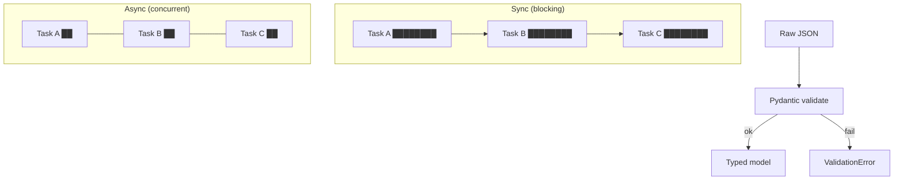

# Module 00b — Python Async & Pydantic

> **Padho**: Isi file mein **Theory** — bahar mat jao.  
> **Likho**: `practice/` folder. **Pucho**: Cursor chat `@MODULE.md`  
> **Nav**: ← [Module 00a](../00a-dev-environment/MODULE.md) · Next → [Module 00c](../00c-fastapi/MODULE.md)

## At a glance

|               |                                                               |
| ------------- | ------------------------------------------------------------- |
| Prerequisites | Module 00a                                                    |
| Duration      | ~3–4 sessions                                                 |
| Project?      | No                                                            |
| Exit test     | Async function + Pydantic model explain karo — Zod se compare |

## Visual map



```
SYNC timeline:  [====A====][====B====][====C====]  ← ek thread, wait karta hai

ASYNC timeline: [==A==]
                [==B==]     ← event loop switch karta hai jab I/O wait
                [==C==]

Pydantic:  JSON dict → validate fields → Model instance (ya error)
```

**Mental model**: Sync = ek kaam khatam, phir doosra; async = I/O wait pe switch; Pydantic = runtime pe Zod jaisa schema guard.

**Redraw challenge**: Sync vs async timeline (3 tasks) aur JSON → Pydantic → Model/Error flow bina dekhe draw karo.

---

## Read order

1. Visual map → 2. **Theory** (neeche) → 3. **Practice** → 4. Chat agar doubt → 5. NOTES

**Unlocks**: Module 00c FastAPI

---

## Learning hooks

| Concept                   | Tera parallel                              |
| ------------------------- | ------------------------------------------ |
| Pydantic `BaseModel`      | Zod schema + `.parse()`                    |
| `async def` route handler | Non-blocking I/O — WebSocket/Redis workers |
| `await httpx`             | `fetch` without blocking thread            |
| `Optional`, `list[str]`   | TypeScript generics                        |
| Exception → HTTP 422      | Zod validation error → 400                 |

---

## Theory

### 1. Sync vs async — kyun matter karta hai?

FastAPI + LLM gateway mein **zyada tar time I/O pe jaata hai** — DB query, Redis, OpenAI API call.  
CPU calculate nahi kar raha; **wait** kar raha hai network/disk ka.

| Sync                                | Async                             |
| ----------------------------------- | --------------------------------- |
| Ek request poori handle → phir next | I/O wait pe doosra task chalu     |
| `requests.get()` — thread block     | `await httpx.get()` — thread free |
| 3 API calls = 3× latency (serial)   | 3 parallel ≈ slowest call         |

**Tera hook**: Matching engine, gateway — agar har LLM call sync block kare, worker threads khatam; async se ek process mein hazaron concurrent connections possible (I/O bound pe).

```
Thread pool (sync):     [Req1████████][Req2████████][Req3████████]
Event loop (async):     [R1==][R2==][R3==][R1==][R2==]...  ← switch on await
```

---

### 2. Event loop — intuition (CS thesis nahi)

Python ka **asyncio** ek **event loop** chalata hai — single thread mein coroutines schedule karta hai.

```python
import asyncio

async def fetch_name():
  await asyncio.sleep(0.5)  # I/O wait simulate — real mein httpx/network
  return "gateway"

async def main():
  # Serial: ~1s total
  a = await fetch_name()
  b = await fetch_name()

  # Parallel: ~0.5s total
  a, b = await asyncio.gather(fetch_name(), fetch_name())

asyncio.run(main())
```

`async def` = coroutine function (callable abhi nahi chalti — schedule hoti hai)  
`await` = "yahan ruko, loop doosra kaam kar sakta hai jab tak yeh complete na ho"

```mermaid
sequenceDiagram
    participant Loop as Event loop
    participant A as coroutine A
    participant B as coroutine B
    Loop->>A: start
    A->>Loop: await I/O (yield)
    Loop->>B: start
    B->>Loop: await I/O (yield)
    Loop->>A: resume when ready
    A-->>Loop: done
```

**Type hints** — FastAPI + Pydantic in pe rely karte hain:

```python
def greet(name: str, count: int = 1) -> list[str]:
    return [name] * count

# Optional = str | None
from typing import Optional
def find_user(id: int) -> Optional[dict]: ...
```

Node parallel: `async function` + `await fetch()` — same brain, alag syntax.

---

### 3. Common mistakes — sync blocking inside `async def`

Yeh **production killer** hai:

```python
import time
import requests  # sync library

async def bad_handler():
    time.sleep(2)           # ❌ poora event loop freeze
    requests.get(url)       # ❌ blocking — thread pool exhaust
```

**Fix:**

```python
import asyncio
import httpx

async def good_handler():
    await asyncio.sleep(2)  # ✅ loop ko yield
    async with httpx.AsyncClient() as client:
        r = await client.get(url, timeout=10.0)  # ✅ non-blocking
```

| Galat                     | Sahi                                |
| ------------------------- | ----------------------------------- |
| `time.sleep` in async     | `await asyncio.sleep`               |
| `requests` in async route | `httpx.AsyncClient`                 |
| CPU-heavy loop in async   | `run_in_executor` ya worker process |

_(Active recall Q1: blocking sync call event loop ko freeze karta hai — sab concurrent requests wait.)_

---

### 4. Pydantic v2 — Zod Python mein

API pe **raw dict** unsafe — wrong types, missing fields, extra junk.

```python
from pydantic import BaseModel, Field

class ChatRequest(BaseModel):
    message: str = Field(min_length=1, max_length=4000)
    model: str = "gpt-4o-mini"
    stream: bool = False

class ChatResponse(BaseModel):
    reply: str
    tokens_used: int

# Validate
req = ChatRequest.model_validate({"message": "hello"})
# req.message → str, typed

# Invalid → ValidationError
ChatRequest.model_validate({"message": ""})  # min_length fail
```

| Zod (TS)                 | Pydantic (Python)            |
| ------------------------ | ---------------------------- |
| `z.object({...})`        | `class X(BaseModel)`         |
| `.parse(data)`           | `.model_validate(data)`      |
| `.safeParse`             | try/except `ValidationError` |
| `.shape`                 | model fields + types         |
| `z.infer<typeof schema>` | class annotations            |

**Serialize out** (API response):

```python
resp = ChatResponse(reply="Hi", tokens_used=12)
resp.model_dump()        # dict — JSON ke liye
resp.model_dump_json()   # str
```

**FastAPI integration** — route param type `ChatRequest` → auto validate body, invalid → **422 Unprocessable Entity** (Zod → 400 jaisa feel).

```python
@app.post("/chat")
async def chat(body: ChatRequest) -> ChatResponse:
    return ChatResponse(reply=f"Echo: {body.message}", tokens_used=5)
```

_(Active recall Q2: dataclass sirf types hold karta hai; Pydantic runtime validation + coercion + JSON schema.)_

---

### 5. httpx async — external APIs

LLM providers, embedding APIs — sab HTTP. `httpx` = modern `requests` + async support.

```python
import httpx
import asyncio

async def fetch_json(url: str) -> dict:
    async with httpx.AsyncClient(timeout=10.0) as client:
        response = await client.get(url)
        response.raise_for_status()
        return response.json()

async def fetch_all(urls: list[str]) -> list[dict]:
    tasks = [fetch_json(u) for u in urls]
    return await asyncio.gather(*tasks)  # parallel
```

**Timeout zaroori** — LLM hang = worker stuck forever.

```python
client = httpx.AsyncClient(timeout=httpx.Timeout(10.0, connect=5.0))
```

**POST with JSON:**

```python
await client.post(
    "https://api.openai.com/v1/chat/completions",
    headers={"Authorization": f"Bearer {api_key}"},
    json={"model": "gpt-4o-mini", "messages": [{"role": "user", "content": "hi"}]},
)
```

_(Active recall Q3: LLM call async honi chahiye taaki wait ke dauran server doosre clients serve kar sake.)_

---

### 6. Putting it together — gateway mental model

```
Client POST /chat
    → FastAPI validates body (Pydantic)
    → async handler
        → await redis.get(cache_key)
        → await httpx.post(openai_url)   # slow — loop free
        → await redis.set(cache_key)
    → ChatResponse (Pydantic) → JSON
```

Yahi stack Module 00c aur Project 1 gateway mein repeat hoga.

---

## Practice

> **Saare assignments ek jagah**: `[practice/README.md](practice/README.md)` — problem statements, instructions, pass criteria.  
> Code **tum** likhoge Cursor mein. Stubs `practice/` mein hain (`TODO` search).  
> Stuck? Chat: `@modules/00b-python-async/MODULE.md` + error paste karo.

| #   | File                         | Kya karna hai                                | Pass when                         |
| --- | ---------------------------- | -------------------------------------------- | --------------------------------- |
| A1  | `practice/chat_models.py`    | `ChatRequest` + `ChatResponse` TODO complete | Invalid input → `ValidationError` |
| A2  | `practice/parallel_fetch.py` | 3 URLs parallel `gather`                     | Total time ≈ slowest, not sum     |
| A3  | `practice/broken_async.py`   | Sync blocking fix karo                       | Explain bug + fix in NOTES        |
| A4  | `NOTES.md`                   | Zod schema → Pydantic side-by-side           | 1 schema, both versions           |

### A1 hints

- `Field(min_length=1)` message ke liye
- `tokens_used: int` response mein required

### A2 hints

- Public test URLs: `https://httpbin.org/delay/1` (3 alag paths)
- `time.perf_counter()` se before/after measure karo

### A3 hints

- `time.sleep` → `asyncio.sleep`
- `requests` → `httpx.AsyncClient`

---

## Active recall (khud jawab likho NOTES mein)

1. `async def` ke andar sync blocking kyun dangerous hai production mein?
2. Pydantic vs dataclass — kab Pydantic?
3. LLM API call async honi chahiye — one sentence why?

**Chat drill** (optional): "Module 00b recall — 3 questions test karo"

---

## Progress checklist

- [ ] Theory Section 1–6 padh liya
- [ ] Redraw challenge kiya
- [ ] Practice A1–A4 pass
- [ ] Active recall NOTES mein likha
- [ ] NOTES session log updated

---

## Optional appendix (zarurat ho tab)

- [asyncio — Coroutines and Tasks](https://docs.python.org/3/library/asyncio-task.html)
- [Pydantic — Models](https://docs.pydantic.dev/latest/concepts/models/)
- [httpx — AsyncClient](https://www.python-httpx.org/async/)
