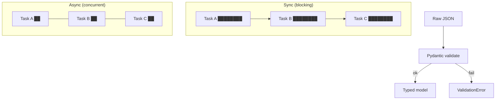

# Module 00b — Python Async & Pydantic

> **Agent spawn**: `@Memory.md` + this file + `@modules/00b-python-async/NOTES.md`  
> **Nav**: ← [00a Dev Environment](../00a-dev-environment/MODULE.md) · Next → [00c FastAPI](../00c-fastapi/MODULE.md)

## At a glance

| | |
|---|---|
| Prerequisites | Module 00a |
| Duration | ~3–4 sessions |
| Project? | No |
| Exit test | Async function + Pydantic model explain karo — Zod se compare |

## Visual map

> **Kaise padho**: Pehle diagram dekho → topics padho → session end pe "Redraw challenge" bina dekhe draw karo



```
SYNC timeline:  [====A====][====B====][====C====]  ← ek thread, wait karta hai

ASYNC timeline: [==A==]
                [==B==]     ← event loop switch karta hai jab I/O wait
                [==C==]

Pydantic:  JSON dict → validate fields → Model instance (ya error)
```

### Mental model (1 line)

Sync = ek kaam khatam, phir doosra; async = I/O wait pe switch; Pydantic = runtime pe Zod jaisa schema guard.

### Redraw challenge

Sync vs async timeline (3 tasks) aur JSON → Pydantic → Model/Error flow bina dekhe draw karo.

## Read order

1. Objectives → 2. Learning hooks → 3. Topics → 4. Assignments → 5. Coach se active recall

**Unlocks**: Module 00c FastAPI

## Objectives

1. `async`/`await` — **kyun** FastAPI + LLM I/O ke liye zaroori hai
2. Type hints confidently use karo
3. Pydantic v2 models — validation + serialization (tera **Zod** Python mein)
4. `httpx` async client — external API calls

## Learning hooks

| Concept | Tera parallel |
|---------|---------------|
| Pydantic `BaseModel` | Zod schema + `.parse()` |
| `async def` route handler | Non-blocking I/O — WebSocket/Redis workers |
| `await httpx` | `fetch` without blocking thread |
| `Optional`, `list[str]` | TypeScript generics |
| Exception → HTTP 422 | Zod validation error → 400 |

## Topics

- Sync vs async — thread pool vs event loop (intuition, not CS thesis)
- `asyncio.run`, `await`, concurrent tasks (`asyncio.gather`)
- Type hints: `str`, `int`, `Optional`, `list`, `dict`
- Pydantic: `BaseModel`, `Field`, validators, `model_dump()`
- `httpx.AsyncClient` — GET/POST with timeout
- Common mistakes: blocking call inside `async def` (`time.sleep` ❌)

## Assignments

| # | Task | Passing criteria |
|---|------|------------------|
| A1 | Pydantic model stub: `ChatRequest` + `ChatResponse` | Invalid input raises validation error |
| A2 | Async function calls 3 URLs in parallel (`gather`) | Total time ≈ slowest call, not sum |
| A3 | Fix broken async code (sync `requests` in async route) | Explain bug + fix |
| A4 | Map Zod schema → Pydantic model (same shape) | Side-by-side doc in NOTES |

## Active recall bank

1. `async def` ke andar sync blocking kyun dangerous hai production mein?
2. Pydantic vs dataclass — kab Pydantic?
3. LLM API call async honi chahiye — one sentence why?

## Progress checklist

- [ ] Objectives recall bina notes ke
- [ ] Assignments A1–A4 pass
- [ ] NOTES.md session log updated

## Ship to NOTES.md

Har session: date, topic, 1-line takeaway, open questions.
