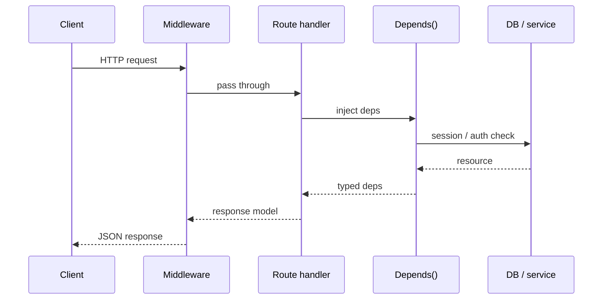

# Module 00c — FastAPI

> **Padho**: Isi file mein **Theory** — bahar mat jao.  
> **Likho**: `practice/` folder. **Pucho**: Cursor chat `@MODULE.md`  
> **Nav**: ← [Module 00b](../00b-python-async/MODULE.md) · Next → [Module 00d](../00d-ml-ai-foundations/MODULE.md)

> **Format note**: Yeh revision sheet nahi hai. Har section **pehli baar seekhne** ke liye likha hai — syntax line-by-line, phir practice. Ek section padho → uska assignment karo → agla section.

## At a glance

| | |
|---|---|
| Prerequisites | Module 00a, 00b (async + Pydantic) |
| Duration | ~4–6 sessions |
| Project? | No (but **Project A/B Python stack yahi hai**) |
| Exit test | CRUD + middleware + Depends bina notes ke explain + curl se demo |

## Visual map



**Mental model**: HTTP request pehle middleware se guzarti hai, phir route handler. FastAPI route ke andar **Pydantic** body validate karta hai aur **Depends()** extra cheezein inject karta hai (auth, DB) — Express + Zod jaisa feel, Python syntax mein.

**Redraw challenge**: Client → Middleware → Route → Depends → Response sequence draw karo.

---

## Read order (strict)

1. Theory §0–§2 padho → **Practice A1** karo  
2. Theory §3–§4 → **A2, A3**  
3. Theory §5 → **A4**  
4. Theory §6 → **A5**  
5. Theory §7 → **A6** + active recall → NOTES

**Unlocks**: Module 00d, 01 LLM APIs, Project A/B Python services

---

## Learning hooks

| Concept | Tera parallel |
|---------|---------------|
| `@app.post("/chat")` | Next.js Route Handler `export async function POST` |
| `Depends(get_db)` | Prisma middleware / shared auth helper |
| Pydantic body | Zod `.parse(req.body)` |
| Middleware | `app.use()` Express chain |
| `/docs` | Auto Swagger — Postman ki zarurat kam |

---

## Theory

### §0. FastAPI kya hai — Express wala HTTP, Python mein

Tum pehle se **HTTP API** banate ho (Express / Next Route Handlers). FastAPI wahi kaam karta hai:

```
Client  --HTTP GET/POST-->  Server  --handler-->  JSON response
```

**Farq kya hai?**

| Express (JS) | FastAPI (Python) |
|--------------|------------------|
| `app.get("/health", handler)` | `@app.get("/health")` + function |
| Manual body parse + Zod | Pydantic model = auto validate |
| Swagger alag setup | `/docs` free |
| `async (req,res)` optional | `async def` recommended (Module 00b) |

FastAPI **Starlette** (ASGI web framework) + **Pydantic** (validation) pe built hai. Tum sirf routes + types likhte ho.

**ASGI vs WSGI (ek line):**  
- WSGI = purana sync Python (Flask)  
- ASGI = async support — concurrent requests ke liye (uvicorn)

---

### §1. Pehla server — har line samjho (→ Practice A1)

**Step 1:** Folder banao `practice/app/` — Python **package** ke liye `app/` folder + andar files.

**Step 2:** `main.py` — entry point:

```python
from fastapi import FastAPI

# FastAPI() = app instance. Express mein: const app = express()
app = FastAPI(title="LLM Gateway", version="0.1.0")

# Decorator = route register karta hai
# @app.get("/health") matlab: GET /health pe yeh function chalega
@app.get("/health")
async def health():
    # dict return karo → FastAPI automatically JSON banata hai
    return {"status": "ok"}
```

**Line-by-line:**

| Line | Matlab |
|------|--------|
| `from fastapi import FastAPI` | Library import — `npm install fastapi` jaisa |
| `app = FastAPI(...)` | Ek app object — saari routes ispe register |
| `@app.get("/health")` | **Decorator** — function ke upar route chipka deta hai |
| `async def health()` | Async handler — I/O wait pe doosre requests serve ho sakte |
| `return {"status": "ok"}` | Python dict → JSON `{"status":"ok"}` |

**Step 3:** Server **run** karo — FastAPI khud HTTP nahi sunta, **uvicorn** sunta hai:

```bash
cd modules/00c-fastapi/practice
uvicorn app.main:app --reload --port 8000
#              ↑      ↑
#         module   FastAPI instance name (variable `app`)
```

**Step 4:** Test karo:

```bash
curl http://localhost:8000/health
# {"status":"ok"}

# Browser mein:
# http://localhost:8000/docs  ← Swagger UI, yahan se POST try kar sakte ho
```

**Common error:**

| Error | Fix |
|-------|-----|
| `ModuleNotFoundError: app` | `practice/` folder se run karo, `app/` folder exist kare |
| `Address already in use` | Port 8000 pe koi aur chal raha — kill karo ya `--port 8001` |
| Handler sync `def` vs `async def` | Dono chalega; I/O heavy routes pe `async def` use karo |

---

### §2. POST + Pydantic body — request validate karna (→ A1)

Module 00b mein `ChatRequest` Pydantic model banaya. Ab use **route** mein wire karte hain.

**Pehle model** (`app/models.py`):

```python
from pydantic import BaseModel, Field

class ChatRequest(BaseModel):
    message: str = Field(min_length=1, max_length=4000)

class ChatResponse(BaseModel):
    reply: str
    tokens_used: int
```

**Phir route** (`app/routes/chat.py` ya `main.py` mein):

```python
from fastapi import APIRouter
from app.models import ChatRequest, ChatResponse

router = APIRouter(tags=["chat"])

@router.post("/chat", response_model=ChatResponse)
async def chat(body: ChatRequest) -> ChatResponse:
    # body already validated — galat JSON aaya toh FastAPI 422 dega, yahan tak nahi pahunchega
    return ChatResponse(
        reply=f"Echo: {body.message}",
        tokens_used=len(body.message),
    )
```

**Magic kya hai?**

1. Client bhejta hai: `POST /chat` + `Content-Type: application/json` + body  
2. FastAPI body ko `ChatRequest` mein convert karta hai  
3. Fail → **422 Unprocessable Entity** (automatic)  
4. Pass → `body.message` typed `str` hai  

**curl test:**

```bash
# ✅ Valid
curl -X POST http://localhost:8000/chat \
  -H "Content-Type: application/json" \
  -d '{"message":"hello"}'

# ❌ Invalid — empty message
curl -X POST http://localhost:8000/chat \
  -H "Content-Type: application/json" \
  -d '{"message":""}'
# → 422 + error detail JSON
```

**Path vs Query vs Body — FastAPI ka rule:**

```python
@app.get("/items/{item_id}")                    # {item_id} = PATH param
async def get_item(
    item_id: int,                                # path se aaya
    q: str | None = None,                        # query ?q=hello
    skip: int = 0,                               # query ?skip=0 (default)
):
    return {"item_id": item_id, "q": q}

# POST + Pydantic class = BODY (JSON)
@router.post("/chat")
async def chat(body: ChatRequest): ...
```

| Argument type | Source | Example URL |
|---------------|--------|-------------|
| Name in `{braces}` path mein | Path | `/items/42` |
| `int`, `str` — path mein nahi | Query string | `/items/42?q=hi&skip=10` |
| Pydantic `BaseModel` | JSON body | POST body |

**`response_model=ChatResponse` kyun?**  
Extra fields response se **kat** jaate hain — API contract enforce. Galat shape return kiya toh error pakad sakte ho dev mein.

---

### §3. APIRouter — files split karna (→ A2)

Chhota demo = sab `main.py` mein OK. Real gateway = **split routes**.

**Pattern:**

```
app/
├── main.py          # app create, middleware, routers mount
├── models.py        # Pydantic schemas
├── routes/
│   ├── health.py    # GET /health
│   └── chat.py      # POST /chat
```

**`routes/health.py`:**

```python
from fastapi import APIRouter

router = APIRouter(tags=["health"])

@router.get("/health")
async def health():
    return {"status": "ok"}
```

**`main.py` — routers mount:**

```python
from fastapi import FastAPI
from app.routes.health import router as health_router
from app.routes.chat import router as chat_router

app = FastAPI()
app.include_router(health_router)   # /health
app.include_router(chat_router)     # /chat
# Prefix chahiye toh: app.include_router(chat_router, prefix="/v1")
```

Express parallel:

```javascript
// Express
const healthRouter = require('./routes/health');
app.use(healthRouter);

// FastAPI
app.include_router(health_router)
```

`/docs` kholo — dono endpoints dikhne chahiye.

---

### §4. HTTPException — controlled errors

Validation automatic hai (422). **Business logic errors** khud throw karo:

```python
from fastapi import HTTPException

@router.get("/users/{user_id}")
async def get_user(user_id: int):
    if user_id < 1:
        raise HTTPException(status_code=400, detail="Invalid user id")
    if user_id == 999:
        raise HTTPException(status_code=404, detail="User not found")
    return {"user_id": user_id}
```

Express: `return res.status(404).json({ detail: "..." })`  
FastAPI: `raise HTTPException(status_code=404, detail="...")`

| Code | Kab |
|------|-----|
| 400 | Tumne manually reject kiya |
| 401 | Auth fail (A4) |
| 404 | Resource nahi mila |
| 422 | Pydantic auto — body galat |
| 500 | Bug — handle karo prod mein |

---

### §5. Depends() — dependency injection step-by-step (→ A4)

**Problem:** Har protected route pe API key check copy-paste:

```python
# ❌ Repeat hell
@router.post("/chat")
async def chat(body: ChatRequest, x_api_key: str = Header(...)):
    if x_api_key != "dev-secret":
        raise HTTPException(401, ...)
    ...

@router.post("/documents")
async def docs(..., x_api_key: str = Header(...)):
    if x_api_key != "dev-secret":  # same code again
        ...
```

**Solution:** Ek function banao — FastAPI **khud call** karega before handler.

**`app/deps.py`:**

```python
from fastapi import Header, HTTPException

DEV_SECRET = "dev-secret"  # practice only — prod mein os.getenv

async def verify_api_key(x_api_key: str = Header(..., alias="X-API-Key")):
    # Header(...) = required header
    # alias="X-API-Key" = HTTP header name (Python variable alag ho sakta hai)
    if x_api_key != DEV_SECRET:
        raise HTTPException(status_code=401, detail="Invalid or missing API key")
    return x_api_key  # handler ko mil sakta hai agar chahiye
```

**Route mein use:**

```python
from fastapi import Depends
from app.deps import verify_api_key

@router.post("/chat")
async def chat(
    body: ChatRequest,
    api_key: str = Depends(verify_api_key),  # pehle yeh chalega
):
    return ChatResponse(reply=body.message, tokens_used=1)
```

**Flow:**

```
Request aayi
  → FastAPI dekha Depends(verify_api_key)
  → verify_api_key() chala
  → 401 ya return value
  → phir chat() chala
```

**Depends vs Middleware:**

| | Middleware | Depends |
|---|------------|---------|
| Scope | **Har** request (jo routes use karein) | Sirf jis route pe lagaya |
| Use | Request ID, CORS, logging | Auth, DB session, rate limit per route |
| Order | `add_middleware` order matter | Per-route chain |

Gateway mein: Request ID = **middleware** (sab routes). API key = **Depends** (sirf paid routes).

**Test:**

```bash
# ❌ No key
curl -X POST http://localhost:8000/chat \
  -H "Content-Type: application/json" \
  -d '{"message":"hi"}'
# 401

# ✅ With key
curl -X POST http://localhost:8000/chat \
  -H "Content-Type: application/json" \
  -H "X-API-Key: dev-secret" \
  -d '{"message":"hi"}'
```

---

### §6. Middleware — har response pe header (→ A3)

Depends route-level hai. **Middleware** = onion — request andar, response bahar.

**`app/middleware.py`:**

```python
import uuid
from starlette.middleware.base import BaseHTTPMiddleware

class RequestIDMiddleware(BaseHTTPMiddleware):
    async def dispatch(self, request, call_next):
        # request aayi — pehle yahan
        request_id = request.headers.get("X-Request-ID") or str(uuid.uuid4())

        # andar bhejo — routes + Depends chalenge
        response = await call_next(request)

        # response wapas aayi — header lagao
        response.headers["X-Request-ID"] = request_id
        return response
```

**`main.py` mein register:**

```python
from app.middleware import RequestIDMiddleware

app = FastAPI()
app.add_middleware(RequestIDMiddleware)  # sabse pehle add = bahar wala layer
```

**Flow:**

```
Request → [RequestIDMiddleware in] → Route → [RequestIDMiddleware out] → Response
```

**Test:**

```bash
curl -i http://localhost:8000/health
# Response headers mein: X-Request-ID: <uuid>
```

**Lifespan (bonus — Redis connect once):**

```python
from contextlib import asynccontextmanager

@asynccontextmanager
async def lifespan(app: FastAPI):
    # startup
    print("DB/Redis connect")
    yield
    # shutdown
    print("cleanup")

app = FastAPI(lifespan=lifespan)
```

Server start pe ek baar, shutdown pe ek baar — har request pe nahi.

---

### §7. SSE streaming — LLM preview (→ A5)

Normal response: poora body ek saath.  
LLM: tokens **drip drip** aate hain — **Server-Sent Events (SSE)**.

**Format rule:** Har chunk `data: ...\n\n` (do newline zaroori)

```python
from fastapi.responses import StreamingResponse
import asyncio

async def tick_generator():
    for i in range(5):
        yield f"data: tick {i}\n\n"
        await asyncio.sleep(1)

@router.get("/events")
async def events():
    return StreamingResponse(
        tick_generator(),
        media_type="text/event-stream",
    )
```

```bash
curl -N http://localhost:8000/events
# har second ek line
```

Module 01 mein yahi pattern OpenAI token stream pe lagega.

---

### §8. Poora `main.py` wire — mental checklist

Jab A1–A5 complete karo, `main.py` roughly aisa dikhega:

```python
from fastapi import FastAPI
from app.middleware import RequestIDMiddleware
from app.routes.health import router as health_router
from app.routes.chat import router as chat_router
from app.routes.events import router as events_router

app = FastAPI(title="Practice Gateway")
app.add_middleware(RequestIDMiddleware)
app.include_router(health_router)
app.include_router(chat_router)
app.include_router(events_router)
```

---

## Practice

> **Saare assignments**: [`practice/README.md`](practice/README.md)  
> **Rule**: Theory section padho → uska assignment → agla section. Ek saath mat karo.

| # | Theory § | File | Pass when |
|---|----------|------|-----------|
| A1 | §1–§2 | `app/main.py`, `models.py`, `routes/chat.py` | POST echo + 422 on bad body |
| A2 | §3 | `app/routes/` split | `/docs` pe health + chat |
| A3 | §6 | `app/middleware.py` | `curl -i` → `X-Request-ID` |
| A4 | §5 | `app/deps.py` | No key → 401 |
| A5 | §7 | `app/routes/events.py` | `curl -N` streams |
| A6 | §0 | `NOTES.md` | Express vs FastAPI table 5 rows |

### Run

```bash
cd modules/00c-fastapi/practice
python3 -m venv .venv && source .venv/bin/activate
pip install fastapi uvicorn httpx
uvicorn app.main:app --reload --port 8000
```

---

## Active recall (NOTES mein likho)

1. FastAPI body validation automatic kaise hota hai — kaun validate karta hai?
2. Middleware vs Depends — gateway mein dono ka ek example?
3. `uvicorn app.main:app` — `app.main` aur doosra `:app` kya mean?

---

## Progress checklist

- [ ] §0–§2 padha + A1 pass
- [ ] §3–§4 + A2 pass
- [ ] §5–§6 + A3, A4 pass
- [ ] §7 + A5 pass
- [ ] A6 + active recall NOTES mein
- [ ] Redraw challenge

---

## Optional appendix (sirf stuck pe)

- [FastAPI Tutorial](https://fastapi.tiangolo.com/tutorial/) — MODULE primary hai
