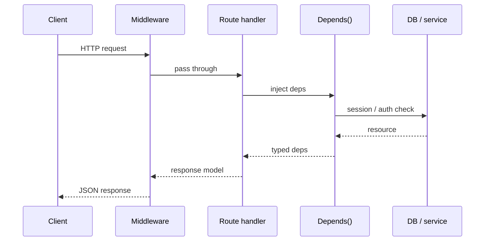

# Module 00c — FastAPI

> **Agent spawn**: `@Memory.md` + this file + `@modules/00c-fastapi/NOTES.md`  
> **Nav**: ← [00b Python Async](../00b-python-async/MODULE.md) · Next → [00d ML Foundations](../00d-ml-ai-foundations/MODULE.md)

## At a glance

| | |
|---|---|
| Prerequisites | Module 00a, 00b |
| Duration | ~4–6 sessions |
| Project? | No (but **Project 1 stack yahi hai**) |
| Exit test | CRUD + middleware + dependency injection bina notes ke explain |

## Visual map

> **Kaise padho**: Pehle diagram dekho → topics padho → session end pe "Redraw challenge" bina dekhe draw karo



```
Express stack          FastAPI stack
─────────────          ─────────────
req → middleware  ≈    req → middleware
    → route              → route + Depends()
    → handler            → Pydantic in/out
    → res.json()         → response_model JSON
```

### Mental model (1 line)

Request middleware se guzarti hai, route pe Depends() dependencies inject karta hai — Express jaisa stack, par types built-in.

### Redraw challenge

Client → Middleware → Route → Depends → DB → Response sequence aur Express vs FastAPI side-by-side draw karo.

## Read order

1. Objectives → 2. Learning hooks → 3. Topics → 4. Assignments → 5. Coach se active recall

**Unlocks**: Module 00d, phir 01 LLM APIs, Project 1 gateway

## Objectives

1. FastAPI routes, request/response models, status codes
2. **Dependency injection** (`Depends`) — auth, DB session pattern
3. Middleware — logging, request ID (gateway prep)
4. **StreamingResponse** / SSE intro (Module 01 prep)
5. FastAPI vs Express/Next.js API — mental map

## Learning hooks

| Concept | Tera parallel |
|---------|---------------|
| `@app.post("/chat")` | Next.js Route Handler |
| `Depends(get_db)` | Prisma client middleware |
| Pydantic response model | Zod output validation |
| Middleware | Express middleware chain |
| `BackgroundTasks` | Fire-and-forget Kafka publish |
| OpenAPI `/docs` | Swagger — auto API docs |

## Topics

- App setup: `FastAPI()`, `uvicorn` run
- Path/query/body params
- `HTTPException`, status codes
- `Depends`: reusable deps (DB, API key header)
- Middleware: `@app.middleware("http")`
- Lifespan events (startup/shutdown — Redis connect)
- `StreamingResponse` basics
- Testing: `TestClient` smoke test
- Project structure: `routers/`, `services/`, `models/`

## Assignments

| # | Task | Passing criteria |
|---|------|------------------|
| A1 | Hello API + Pydantic body echo | POST JSON → validated response |
| A2 | Router split: `routes/health.py`, `routes/chat.py` | `/docs` shows both |
| A3 | Middleware: inject `X-Request-ID` header | Every response has UUID |
| A4 | `Depends` fake auth: missing API key → 401 | Test with curl |
| A5 | SSE stub endpoint (timer ticks) | curl streams events |
| A6 | Compare table: Express route vs FastAPI route (5 rows) | NOTES mein likho |

## Active recall bank

1. FastAPI dependency injection production mein kya solve karta hai?
2. Middleware vs Depends — kab kya?
3. SSE streaming response ka content-type kya hota hai?

## Progress checklist

- [ ] Objectives recall bina notes ke
- [ ] Assignments A1–A6 pass
- [ ] NOTES.md session log updated

## Ship to NOTES.md

Har session: date, topic, 1-line takeaway, open questions.
