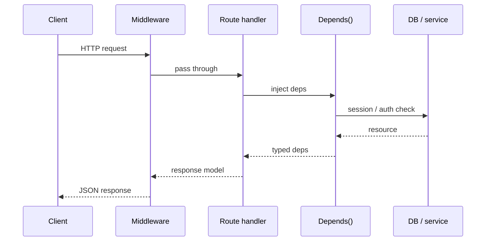

# Module 00c — FastAPI

> **Padho**: Isi file mein **Theory** — bahar mat jao.  
> **Likho**: `practice/` folder. **Pucho**: Cursor chat `@MODULE.md`  
> **Nav**: ← [Module 00b](../00b-python-async/MODULE.md) · Next → [Module 00d](../00d-ml-ai-foundations/MODULE.md)

## At a glance

| | |
|---|---|
| Prerequisites | Module 00a, 00b |
| Duration | ~4–6 sessions |
| Project? | No (but **Project 1 stack yahi hai**) |
| Exit test | CRUD + middleware + dependency injection bina notes ke explain |

## Visual map



```
Express stack          FastAPI stack
─────────────          ─────────────
req → middleware  ≈    req → middleware
    → route              → route + Depends()
    → handler            → Pydantic in/out
    → res.json()         → response_model JSON
```

**Mental model**: Request middleware se guzarti hai, route pe `Depends()` dependencies inject karta hai — Express jaisa stack, par types built-in.

**Redraw challenge**: Client → Middleware → Route → Depends → DB → Response sequence aur Express vs FastAPI side-by-side draw karo.

---

## Read order

1. Visual map → 2. **Theory** (neeche) → 3. **Practice** → 4. Chat agar doubt → 5. NOTES

**Unlocks**: Module 00d, phir 01 LLM APIs, Project 1 gateway

---

## Learning hooks

| Concept | Tera parallel |
|---------|---------------|
| `@app.post("/chat")` | Next.js Route Handler |
| `Depends(get_db)` | Prisma client middleware |
| Pydantic response model | Zod output validation |
| Middleware | Express middleware chain |
| `BackgroundTasks` | Fire-and-forget Kafka publish |
| OpenAPI `/docs` | Swagger — auto API docs |

---

## Theory

### 1. FastAPI app — minimum viable server

```python
from fastapi import FastAPI
import uvicorn

app = FastAPI(title="LLM Gateway", version="0.1.0")

@app.get("/health")
async def health():
    return {"status": "ok"}

# Run: uvicorn main:app --reload --port 8000
```

| Piece | Kaam |
|-------|------|
| `FastAPI()` | App instance — routes register |
| `async def` handler | Non-blocking I/O (Module 00b) |
| `uvicorn` | ASGI server — actually HTTP sunta hai |
| `/docs` | Auto OpenAPI UI — test without Postman |

**Express parallel:**

```javascript
// Express
app.get("/health", (req, res) => res.json({ status: "ok" }));

// FastAPI — types + auto docs built-in
@app.get("/health")
async def health(): return {"status": "ok"}
```

---

### 2. Routes — path, query, body

```python
from pydantic import BaseModel

class ChatBody(BaseModel):
    message: str

@app.get("/items/{item_id}")          # path param
async def get_item(item_id: int, q: str | None = None):  # query optional
    return {"item_id": item_id, "q": q}

@app.post("/chat", status_code=201)   # explicit status
async def chat(body: ChatBody):       # JSON body → Pydantic
    return {"reply": body.message}
```

| Param type | Source | Example |
|------------|--------|---------|
| Function arg name in path | Path | `/users/{user_id}` |
| Simple type, not in path | Query | `?skip=0&limit=10` |
| Pydantic model | Body | POST JSON |

**Response model** — output bhi validate/filter:

```python
class ChatOut(BaseModel):
    reply: str

@app.post("/chat", response_model=ChatOut)
async def chat(body: ChatBody) -> ChatOut:
    return ChatOut(reply=body.message.upper())
```

Extra fields response se strip ho jaate hain — API contract enforce.

---

### 3. HTTPException — controlled errors

```python
from fastapi import HTTPException

@app.get("/users/{user_id}")
async def get_user(user_id: int):
    if user_id < 1:
        raise HTTPException(status_code=400, detail="Invalid user id")
    if user_id == 999:
        raise HTTPException(status_code=404, detail="User not found")
    return {"user_id": user_id}
```

| Status | Kab |
|--------|-----|
| 400 | Bad client input (manual check) |
| 401 | Auth missing/invalid |
| 404 | Resource not found |
| 422 | Pydantic validation fail (automatic) |
| 500 | Unhandled server error |

Express: `res.status(404).json({ error: "..." })` — same idea.

---

### 4. Depends() — dependency injection

**Problem**: Har route pe DB session, API key check, rate limit — copy-paste hell.

**Solution**: Reusable dependency functions — FastAPI inject karta hai.

```python
from fastapi import Depends, Header

async def verify_api_key(x_api_key: str = Header(...)):
    if x_api_key != "dev-secret":
        raise HTTPException(status_code=401, detail="Invalid API key")
    return x_api_key

@app.post("/chat")
async def chat(
    body: ChatBody,
    api_key: str = Depends(verify_api_key),  # runs first
):
    return {"reply": body.message, "authenticated": True}
```


**Sub-dependencies** — `get_db` khud `get_settings` pe depend kar sakta hai.

| Middleware | Depends |
|------------|---------|
| Har request/response wrap | Specific routes pe |
| Logging, CORS, request ID | Auth, DB, business deps |
| Order: outer → inner | Per-route, composable |

*(Active recall Q2: middleware = cross-cutting; Depends = per-route injectable logic.)*

**Tera hook**: Gateway mein `Depends(verify_api_key)` + `Depends(get_redis)` — same pattern Prisma middleware jaisa.

---

### 5. Middleware — request ID, logging

```python
import uuid
from starlette.middleware.base import BaseHTTPMiddleware

class RequestIDMiddleware(BaseHTTPMiddleware):
    async def dispatch(self, request, call_next):
        request_id = request.headers.get("X-Request-ID") or str(uuid.uuid4())
        response = await call_next(request)
        response.headers["X-Request-ID"] = request_id
        return response

app.add_middleware(RequestIDMiddleware)
```

**Flow:**

```
Request → Middleware 1 → Middleware 2 → Route → Middleware 2 → Middleware 1 → Response
```

**Lifespan** (startup/shutdown) — Redis/DB connect once:

```python
from contextlib import asynccontextmanager

@asynccontextmanager
async def lifespan(app: FastAPI):
  # startup: await redis.ping()
  yield
  # shutdown: await redis.close()

app = FastAPI(lifespan=lifespan)
```

---

### 6. StreamingResponse & SSE stub

LLM tokens **ek saath nahi** aate — stream chahiye. Module 01 mein depth; abhi stub.

**Server-Sent Events (SSE)** — server → client one-way stream.

```python
from fastapi.responses import StreamingResponse
import asyncio

async def tick_generator():
    for i in range(5):
        yield f"data: tick {i}\n\n"  # SSE format
        await asyncio.sleep(1)

@app.get("/events")
async def events():
    return StreamingResponse(
        tick_generator(),
        media_type="text/event-stream",
    )
```

| | Regular JSON | SSE stream |
|---|--------------|------------|
| Content-Type | `application/json` | `text/event-stream` |
| Connection | close after body | keep-alive, chunks |
| Use | CRUD, chat full reply | LLM token stream, live updates |

**curl test:** `curl -N http://localhost:8000/events` — lines drip hongi.

*(Active recall Q3: SSE content-type = `text/event-stream`.)*

---

### 7. Project structure — Express vs FastAPI

**Chhota script** — sab `main.py` mein OK. **Gateway** — split karo:

```
services/llm-gateway/          practice/app/  (is module)
├── app/
│   ├── main.py              # FastAPI(), middleware, include_router
│   ├── deps.py              # Depends: auth, redis, db
│   ├── middleware.py
│   ├── routes/
│   │   ├── health.py
│   │   └── chat.py
│   ├── models/              # Pydantic schemas
│   └── services/            # business logic (OpenAI calls)
├── tests/
└── pyproject.toml / requirements.txt
```

```
Express monolith              FastAPI equivalent
────────────────              ──────────────────
routes/users.js               routes/users.py (APIRouter)
middleware/auth.js            deps.py + middleware
controllers/                  services/
validators/ (Zod)             models/ (Pydantic)
app.js mount routes           main.py include_router
```

**APIRouter** — modular routes:

```python
# routes/health.py
from fastapi import APIRouter
router = APIRouter(tags=["health"])

@router.get("/health")
async def health():
    return {"status": "ok"}

# main.py
from routes.health import router as health_router
app.include_router(health_router)
```

---

### 8. Smoke testing — TestClient

```python
from fastapi.testclient import TestClient
from app.main import app

client = TestClient(app)

def test_health():
    r = client.get("/health")
    assert r.status_code == 200
    assert r.json()["status"] == "ok"
```

CI mein bina server start kiye routes verify — gateway ke liye habit banao.

---

## Practice

> Code **tum** likhoge Cursor mein. Stubs `practice/` mein hain.  
> Stuck? Chat: `@modules/00c-fastapi/MODULE.md` + error paste karo.

| # | File | Kya karna hai | Pass when |
|---|------|---------------|-----------|
| A1 | `practice/app/main.py` + models | POST echo with Pydantic | Valid JSON → validated response |
| A2 | `practice/app/routes/` | Split health + chat routers | `/docs` shows both |
| A3 | `practice/app/middleware.py` | `X-Request-ID` on every response | curl shows UUID header |
| A4 | `practice/app/deps.py` | Missing API key → 401 | curl without header fails |
| A5 | `practice/app/routes/events.py` | SSE timer ticks stub | `curl -N` streams events |
| A6 | `NOTES.md` | Express vs FastAPI table (5 rows) | Self-check / coach |

### Run locally

```bash
cd modules/00c-fastapi/practice
python3 -m venv .venv && source .venv/bin/activate
pip install fastapi uvicorn httpx
uvicorn app.main:app --reload --port 8000
# Open http://localhost:8000/docs
```

### A4 hints

- Header name: `X-API-Key`
- Dev secret: `dev-secret` (practice only — prod mein `.env`)

### A5 hints

- `media_type="text/event-stream"`
- Each event: `f"data: {payload}\n\n"`

---

## Active recall (khud jawab likho NOTES mein)

1. FastAPI dependency injection production mein kya solve karta hai?
2. Middleware vs Depends — kab kya?
3. SSE streaming response ka content-type kya hota hai?

**Chat drill** (optional): "Module 00c recall — 3 questions test karo"

---

## Progress checklist

- [ ] Theory Section 1–8 padh liya
- [ ] Redraw challenge kiya
- [ ] Practice A1–A6 pass
- [ ] Active recall NOTES mein likha
- [ ] NOTES session log updated

---

## Optional appendix (zarurat ho tab)

- [FastAPI Tutorial](https://fastapi.tiangolo.com/tutorial/)
- [FastAPI — Dependencies](https://fastapi.tiangolo.com/tutorial/dependencies/)
- [FastAPI — StreamingResponse](https://fastapi.tiangolo.com/advanced/custom-response/#streamingresponse)
