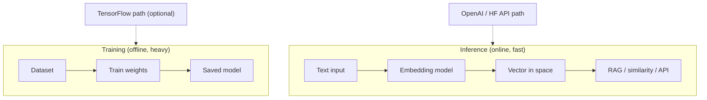

# Module 00d — ML & AI Foundations (incl. TensorFlow intro)

> **Agent spawn**: `@Memory.md` + this file + `@modules/00d-ml-ai-foundations/NOTES.md`  
> **Nav**: ← [00c FastAPI](../00c-fastapi/MODULE.md) · Next → [Module 01 LLM APIs](../01-llm-apis/MODULE.md)

## At a glance

| | |
|---|---|
| Prerequisites | Module 00b (Python, basic math ok) |
| Duration | ~4–5 sessions |
| Project? | No |
| Exit test | Training vs inference, embeddings, TF vs API-LLM path explain karo |

## Visual map

> **Kaise padho**: Pehle diagram dekho → topics padho → session end pe "Redraw challenge" bina dekhe draw karo



```
TRAINING (seekho awareness)     INFERENCE (daily job path)
─────────────────────────     ───────────────────────────
data → fit weights → save     text → embed → vector space
         ↑                              ↓
    TF optional                   cosine search / RAG

API-LLM path: prompt → provider → tokens (no local training)
```

### Mental model (1 line)

Training weights banata hai; inference un weights (ya API) se prediction/embeddings deta hai — tumhara path zyada tar inference + embeddings hai.

### Redraw challenge

Training vs inference split, text→embedding→vector space, aur TF optional vs API path teen arrows ke saath draw karo.

## Honest scope (important)

**Tera 2026 job path = LLM APIs + RAG + Agents**, mostly **inference**, not training models from scratch.

| Seekho depth mein | Sirf awareness |
|-------------------|----------------|
| Embeddings, vectors, cosine similarity | Full CNN/RNN architecture design |
| Inference vs training | Production TF Serving at scale |
| NumPy intuition | Kaggle grandmaster skills |
| TensorFlow **hello world** + read code | Become ML researcher |

TensorFlow yahan **interview literacy + RAG foundation** ke liye hai — har din TF nahi likhoge, par "samajh aa jaye" chahiye.

## Read order

1. Objectives → 2. Learning hooks → 3. Topics → 4. Assignments → 5. Coach se active recall

**Unlocks**: Module 01 (LLM APIs), Module 05 (RAG) — embeddings ab familiar honge

## Objectives

1. ML basics: model, weights, training, loss, inference — **Hinglish mein**
2. Neural network intuition (layers, forward pass) — diagram se
3. **Embeddings** — text → vector (RAG ka foundation)
4. TensorFlow/Keras: install, 1 tiny model, predict — hands-on once
5. PyTorch vs TensorFlow vs "just call OpenAI" — kab kya

## Learning hooks

| Concept | Tera parallel |
|---------|---------------|
| Embedding vector | Hash/fingerprint — similar → close in space |
| Cosine similarity | Fuzzy match score in bank recon |
| Inference latency | LLM API p99 — same "model run" brain |
| Batch vs realtime | CSV chunked import vs single query |
| Pre-trained model | Vendor API — tum train nahi karte, use karte ho |

## Topics

### Block A — Concepts (no heavy code)
- AI vs ML vs DL vs LLM — one slide each
- Supervised learning intuition
- What is a **tensor** (multi-dim array — NumPy)
- Training vs inference (cost, GPU, when each happens)
- Embeddings: word → vector, sentence embeddings
- Cosine similarity vs Euclidean distance

### Block B — NumPy lite
- `array`, shape, dot product
- Normalize vector → cosine sim manually

### Block C — TensorFlow intro (hands-on)
- Install: `tensorflow` (or `tensorflow-macos` on Apple Silicon)
- Keras Sequential: 1 dense layer toy example (XOR ya mnist subset)
- `model.fit()` vs `model.predict()` — training vs inference
- Save/load model — artifact concept
- **Don't** deep dive CNNs unless time — awareness enough

### Block D — LLM engineer path (what YOU actually ship)
- OpenAI embeddings API vs local `sentence-transformers`
- Fine-tuning mention — when startups do it (rare early)
- Hugging Face hub — browse models, read cards
- Your projects: **no TF required** for Gateway; RAG uses embeddings API or lightweight libs

## Assignments

| # | Task | Passing criteria |
|---|------|------------------|
| A1 | NumPy: 2 vectors cosine similarity function | Matches `sklearn` or manual formula |
| A2 | Diagram (paper/Excalidraw): training vs inference flow | Coach approve |
| A3 | TensorFlow/Keras: train tiny model on 10 samples | `predict()` works on new input |
| A4 | OpenAI OR local embedding: 3 sentences → show similar pair | Top match makes sense |
| A5 | Essay (200 words): "Mere projects mein TF kahan nahi chahiye?" | Names Gateway, RAG, agents correctly |

## Active recall bank

1. Embedding dimension 1536 ka matlab kya hai practically?
2. Training GPU kyun chahiye, inference kab CPU ok?
3. TensorFlow vs calling GPT-4 API — trade-off 3 bullets?

## Progress checklist

- [ ] Objectives recall bina notes ke
- [ ] Assignments A1–A5 pass
- [ ] NOTES.md session log updated

## Ship to NOTES.md

Har session: date, topic, 1-line takeaway, open questions.
