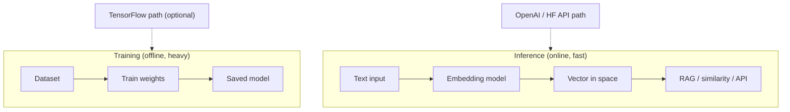
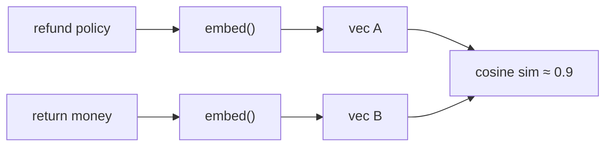
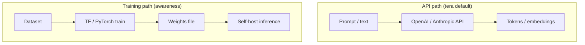

# Module 00d — ML & AI Foundations (incl. TensorFlow intro)

> **Padho**: Isi file mein **Theory** — bahar mat jao.  
> **Likho**: `practice/` folder. **Pucho**: Cursor chat `@MODULE.md`  
> **Nav**: ← [Module 00c](../00c-fastapi/MODULE.md) · Next → [Module 00e Go Platform](../00e-go-platform/MODULE.md)

> **Format**: Textbook — §0 pehle (AI/ML terms from zero). `@MODULE-TEACHING-STANDARD.md`

## At a glance

| | |
|---|---|
| Prerequisites | Module 00b (Python basics). 00c helpful par required nahi |
| Duration | ~4–5 sessions (embedding + TF alag din) |
| Project? | No |
| Exit test | Training vs inference, embeddings, TF vs API-LLM path explain karo — apne words mein |

## Read order (strict — mat chhodna)

| Session | Padho | Karo (Practice) |
|---------|-------|-----------------|
| 1 | **§0 Terms pehli baar** | Analogies NOTES mein likho |
| 2 | Honest scope + **Visual map** | Redraw challenge start |
| 3 | §1 AI/ML/DL/LLM hierarchy | — |
| 4 | §2 Model, weights, training vs inference | **A2** diagram |
| 5 | §3 NumPy tensors | — |
| 6 | §4 Embeddings | — |
| 7 | §5 Cosine similarity | **A1** |
| 8 | §6 TensorFlow hello | **A3** |
| 9 | §7 API path vs training + §8 HF hub | **A4**, **A5** |

**Pehle §0 terms, phir diagram.** Visual map Session 2 mein — token/embedding samjhe bina mat dekho.

**Unlocks**: Module 01 (LLM APIs), Module 05 (RAG) — embeddings familiar honge.

---

## Honest scope (important — Session 2)

**Tera 2026 job path = LLM APIs + RAG + Agents**, mostly **inference**, not training models from scratch.

| Seekho depth mein | Sirf awareness |
|-------------------|----------------|
| Embeddings, vectors, cosine similarity | Full CNN/RNN architecture design |
| Inference vs training | Production TF Serving at scale |
| NumPy intuition | Kaggle grandmaster skills |
| TensorFlow **hello world** + read code | Become ML researcher |

TensorFlow yahan **interview literacy + RAG foundation** ke liye hai — har din TF nahi likhoge, par code padh paoge aur trade-offs bol paoge.

---

## Learning hooks (optional — tera parallel)

| Concept | Tera parallel |
|---------|---------------|
| Embedding vector | Hash/fingerprint — similar input → close numeric signature |
| Cosine similarity | Fuzzy match score — bank recon / dedup |
| Inference latency | LLM API p99 — same "model run" brain |
| Batch vs realtime | CSV chunked import vs single user query |
| Pre-trained model | Vendor API — tum train nahi, **use** karte ho |

---

## Theory

### §0. AI/ML terms — pehli baar (45 min, diagram se pehle)

Tum TS/Node background se aaye ho — **zero prior AI**. Is section ke baad Module 01–11 ki har line mein yeh words recognizable honge. **Architecture diagram §0 ke baad.**

#### 0.1 Token — LLM ki chhoti unit

**Token** = text ka **chhota piece** jise model padhta/likhta hai. Poora word nahi hota — subword bhi.

| Example text | Rough tokens (idea) |
|--------------|---------------------|
| `"hello"` | ~1 token |
| `"refund policy"` | ~2–3 tokens |
| Long paragraph | hundreds |

**Analogy (Hinglish):** WhatsApp message ko network **packets** mein todta hai — LLM text ko **tokens** mein todta hai. Billing bhi often **per token**.

```python
# Conceptual — actual count API se aata hai (Module 01)
text = "Return my money please"
# Model internally: ["Return", " my", " money", " please"]  ← ~4 tokens (approx)
```

| Symbol / term | Matlab |
|---------------|--------|
| Token | Model input/output ki atomic unit |
| Tokenize | String → token ID list |
| Token ID | Integer — vocabulary mein index |

**Tera daily work:** API response mein `usage.prompt_tokens` — kitna input consume hua.

#### 0.2 Embedding — text → numbers ki list

**Embedding** = text ko **fixed-length vector** (floats ki list) mein map karna taaki **meaning** numeric ho.

```
"refund policy"  →  [0.02, -0.11, 0.88, ..., 0.05]   # e.g. 384 ya 1536 numbers
"return money"   →  [0.01, -0.09, 0.85, ..., 0.04]   # similar meaning → similar numbers
"banana bread"   →  [-0.4, 0.7, 0.1, ..., -0.2]      # alag topic → door numbers
```

**Analogy:** Har sentence ka **GPS coordinate** — similar sentences paas, alag door. Search "keyword match" nahi — **meaning match**.

| Term | Matlab |
|------|--------|
| Vector | Numbers ki ordered list — `[0.1, 0.2, ...]` |
| Dimension | Vector ki length — 1536 = 1536 floats |
| `embed()` / embeddings API | Function jo text le ke vector de |

**RAG preview (Module 05):** Docs embed karo → DB store → user query embed → **closest vectors** fetch → LLM ko context do.

#### 0.3 Model aur weights

**Model** = ek **function** jiske andar **learned numbers (weights)** hain. Input aata hai → layers → output.

```
Input (tokens/embeddings) → [Layer 1 weights] → [Layer 2 weights] → Output (next token / class / vector)
```

| Term | Matlab |
|------|--------|
| Weights | Trainable parameters — millions/billions of floats |
| Architecture | Layers ka design — kitne layers, kitna wide |
| Pre-trained | Pehle se train ho chuka — GPT, BGE, etc. |
| Checkpoint / `.h5` / `.safetensors` | Saved weights file |

**Analogy:** Model = **compiled program**; weights = **internal state** jo training se set hui.

#### 0.4 Training vs inference — sabse important split

| | **Training** | **Inference** |
|---|--------------|---------------|
| Matlab | Weights **seekhna / update** karna | Weights **fixed** — sirf predict |
| Kab | Offline, rare (lab / fine-tune) | Har user request pe |
| Compute | GPU, hours–days | ms–seconds |
| Data | Large dataset (thousands+) | Single prompt / batch |
| API | Nahi — tum run karte ho | OpenAI `chat.completions` = inference |
| TF function | `model.fit()` | `model.predict()` |

**Analogy (Hinglish):**
- **Training** = exam ki **preparation** — notes padhke brain update
- **Inference** = **exam day** — brain fixed, sirf answer do

```
TRAINING:   data → model.fit() → weights change → save file
INFERENCE:  input → model.predict() / API call → output (weights touch nahi)
```

**Tera path:** 95% **inference** — API call, embeddings, RAG search. Training sirf awareness.

#### 0.5 Loss — training mein error score

**Loss** = model ne kitna **galat** predict kiya — number jo **kam** hona chahiye training ke dauran.

```
prediction = model(input)
loss = compare(prediction, true_answer)   # e.g. cross-entropy
# backprop → weights thoda adjust → loss kam
```

Inference mein loss **nahi** — sirf output chahiye.

#### 0.6 Cosine similarity — preview (detail §5)

Do embeddings **kitne similar** — angle se measure (direction matter, length kam):

```
cosine ≈ 1.0  → same direction (very similar meaning)
cosine ≈ 0.0  → orthogonal (unrelated)
```

RAG: query vector vs sab doc vectors → **top-k highest cosine** → LLM context.

#### 0.7 §0 term checklist

| Term | Ek line mein |
|------|--------------|
| Token | Text ka piece — billing + model input |
| Embedding | Text → float vector — meaning search |
| Weights | Model ke andar learned numbers |
| Training | Weights update — offline, heavy |
| Inference | Fixed weights se output — daily API work |
| Loss | Training error — minimize karte hain |
| Vector dimension | Embedding list ki length — e.g. 1536 |

#### §0 common errors (conceptual — galat soch)

| Galat belief | Sach |
|--------------|------|
| "Har AI project mein training karni padti hai" | Mostly pre-trained + inference |
| "Embedding = keyword search" | Semantic — synonyms paas aate hain |
| "1536 = 1536 words" | 1536 **numbers** (features), words nahi |
| "Token = character" | Subword — `ing` alag token ho sakta |

#### §0 checkpoint (NOTES mein likho)

1. Training aur inference — ek example each (API vs `fit`)?
2. Embedding 1536-dim practically kya store karta hai?
3. Token kyun matter karta hai cost mein?

**§0 done?** Ab honest scope + visual map (Session 2).

---

## Visual map (§0 ke baad — ab padho)



```
TRAINING (awareness)              INFERENCE (daily job)
────────────────────              ────────────────────
labeled data → fit → save weights   text → embed → vector
         ↑                                    ↓
    TF / PyTorch optional              cosine search / RAG / chat API

API-LLM path: prompt → provider → tokens out (no local training)
```

**Mental model**: Training weights **banata** hai; inference un weights (ya hosted API) se **output** deta hai — tumhara ship path zyada tar inference + embeddings.

**Redraw challenge**: Training vs inference split, text→embedding→vector, TF optional vs API path — teen arrows ke saath paper pe draw karo.

---

### §1. AI vs ML vs DL vs LLM — umbrella se specific

**Problem kya hai:** "AI" har jagah marketing word — interview aur docs mein precise terms chahiye.

| Term | Matlab (Hinglish) |
|------|-------------------|
| **AI** | Machines jo "smart" tasks karein — **umbrella** |
| **ML** | AI ka subset — data se **learn**, hardcoded `if/else` nahi |
| **DL** | ML + **neural networks** (layers) — images, text, speech |
| **LLM** | DL model trained on massive text — **next token** predict |

```
AI
 └── ML (learn from data)
      └── DL (neural nets, many layers)
           └── LLM (GPT, Claude, Llama — text in, text out)
```

| Level | Example product |
|-------|-----------------|
| AI | Self-driving (broad) |
| ML | Spam filter learned from emails |
| DL | Image recognition |
| LLM | ChatGPT — tumhara daily tool |

**Tera daily work**: LLM **API** + RAG + agents — **inference layer**, lab training nahi.

> **→ Practice A5** (later): Gateway/RAG/agents mein TF kahan **nahi** chahiye — yahan se vocabulary aayegi.

---

### §2. Model, weights, training loop — intuition

**Problem kya hai:** "Model train karo" sunke lagta hai magic — actually ek **repeat loop** hai jo weights adjust karta hai.

**Model** = function with **learnable parameters (weights)**.

**Training loop (numbered flow):**

```
1. Load batch of (input, correct_label) pairs
2. Forward pass: prediction = model(input)
3. Loss = error(prediction, correct_label)
4. Backprop: loss se gradient — kaunse weights blame
5. Optimizer: weights thoda update
6. Repeat epoch until loss acceptable
7. model.save() — artifact disk pe
```

**Inference loop:**

```
1. Load saved weights (weights frozen)
2. input = user text / image
3. output = model(input)   # forward only — no step 4–5
4. Return prediction / embedding / tokens
```

| | Training | Inference |
|---|----------|-----------|
| Weights | Update hote hain | Frozen |
| `model.fit()` | ✅ | ❌ |
| `model.predict()` | ❌ (eval mode alag) | ✅ |
| GPU | Often needed | Small model CPU ok; API = provider GPU |
| Data size | Large dataset | 1 prompt |

*(Active recall tie-in: training GPU-heavy kyunki millions of updates; inference ek forward pass — API pe provider handle karta hai.)*

> **→ Practice A2** (pass): Training vs inference diagram paper/Excalidraw — §0 + is section se labels.

---

### §3. Tensor — multi-dim array (NumPy)

**Problem kya hai:** Embeddings aur weights **lists of numbers** hain — NumPy se manipulate karna seekho before TensorFlow.

```python
import numpy as np

v = np.array([0.1, 0.5, -0.3])      # 1D — embedding jaisa
m = np.array([[1, 2], [3, 4]])      # 2D matrix
v.shape   # (3,)
m.shape   # (2, 2)

np.dot(np.array([1, 2]), np.array([3, 4]))  # 1*3 + 2*4 = 11
```

| Line / symbol | Matlab |
|---------------|--------|
| `import numpy as np` | NumPy convention |
| `np.array([...])` | Python list → numeric array |
| `.shape` | Dimensions tuple — `(3,)` = 3 elements |
| `np.dot(a, b)` | Dot product — cosine §5 mein use |

**Expected in REPL:**

```python
>>> v = np.array([0.1, 0.5, -0.3])
>>> v.shape
(3,)
>>> np.dot(np.array([1, 2]), np.array([3, 4]))
11
```

**TensorFlow tensors** ≈ NumPy arrays + GPU placement + autograd (training ke liye gradients).

#### §3 common errors

| Error message | Kyun | Fix |
|---------------|------|-----|
| `ModuleNotFoundError: numpy` | Install nahi | `pip install numpy` in venv |
| `ValueError: shapes not aligned` | Dot product dimension mismatch | Vectors same length check |
| `.shape` confusion | 1D vs 2D | Print `arr.shape` debug |

---

### §4. Embeddings — text → vector (RAG foundation)

**Problem kya hai:** Keyword search `"refund"` miss kare `"return money"`. **Semantic search** chahiye — meaning se match.

Words/sentences → **dense vectors** — similar meaning → **close** in high-dimensional space.

```
"refund policy"  → [0.02, -0.11, 0.88, ...]   # 1536 dims (OpenAI ada-002 example)
"return money"   → [0.01, -0.09, 0.85, ...]   # high cosine vs above
"banana bread"   → [-0.4, 0.7, 0.1, ...]      # low cosine vs refund pair
```

| Concept | Practical matlab |
|---------|------------------|
| 1536 dimensions | Vector = **1536 floats** — DB `vector` column (pgvector baad mein) |
| Same dim required | Query aur docs same model — warna compare invalid |
| Normalization | Often unit length — cosine stable |

**Embedding flow (numbered):**

```
1. Raw text string
2. Tokenize (internal to model)
3. Neural net forward → hidden state
4. Pool to single vector (e.g. 1536 floats)
5. Store in DB / compare with query vector
```



**Use cases:** semantic search, RAG retrieval, clustering, dedup, recommendations.

*(Active recall Q1: 1536 = embedding size; fixed-length fingerprint for compare/search.)*

> **→ Practice A4** (prep): 3 sentences embed karke similar pair dhundho — §5 cosine ke baad full pass.

---

### §5. Cosine similarity vs Euclidean

**Problem kya hai:** Do vectors "kitne similar" — distance measure chahiye. Text embeddings pe **cosine** standard.

**Cosine** = angle between vectors (direction matter, magnitude kam):

\[
\text{cosine}(A, B) = \frac{A \cdot B}{\|A\| \|B\|}
\]

Range: **-1 to 1** (normalized vectors pe often 0–1 for similar docs).

```python
import numpy as np

def cosine_sim(a: np.ndarray, b: np.ndarray) -> float:
    a_norm = a / np.linalg.norm(a)
    b_norm = b / np.linalg.norm(b)
    return float(np.dot(a_norm, b_norm))

a = np.array([1.0, 0.0])
b = np.array([0.9, 0.1])
cosine_sim(a, b)  # ~0.99 — similar direction
```

| Line / symbol | Matlab |
|---------------|--------|
| `np.linalg.norm(a)` | Vector length (magnitude) |
| `a / norm` | Unit vector — direction preserve |
| `np.dot(a_norm, b_norm)` | Cosine when both normalized |
| `~0.99` | Almost same direction |

| Metric | Kab use |
|--------|---------|
| Cosine | Text embeddings, high-dim |
| Euclidean | Physical coords, low-dim distance |

**RAG retrieval flow:**

```
1. query_vec = embed(user_question)
2. For each doc_vec in database: score = cosine(query_vec, doc_vec)
3. Sort scores descending → top-k docs
4. Concatenate doc text → LLM prompt context
```

**Run A1 stub (after implement):**

```bash
cd modules/00d-ml-ai-foundations/practice
python cosine_similarity.py
# Expected: tests pass — identical → 1.0, orthogonal → ~0.0
```

#### §5 common errors

| Error message / bug | Kyun | Fix |
|---------------------|------|-----|
| `ZeroDivisionError` | Zero vector | Check embedding non-empty |
| Similarity > 1 | Norm skip kiya | Normalize pehle |
| Wrong pair wins A4 | Model not loaded / random vecs | Same embed model for all 3 sentences |

> **→ Practice A1** (pass): `cosine_similarity.py` — manual formula match; identical → 1.0.

---

### §6. TensorFlow/Keras — minimal hello (training path awareness)

**Problem kya hai:** Interview / docs mein `model.fit`, `Dense`, `Sequential` dikhe — ek baar haath se chalao taaki **training code padh sako**, daily use nahi.

```python
import numpy as np
import tensorflow as tf

# Toy: AND gate — 2 inputs → 1 output
X = np.array([[0,0],[0,1],[1,0],[1,1]], dtype=float)
y = np.array([[0],[0],[0],[1]], dtype=float)

model = tf.keras.Sequential([
    tf.keras.layers.Dense(4, activation="relu", input_shape=(2,)),
    tf.keras.layers.Dense(1, activation="sigmoid"),
])

model.compile(optimizer="adam", loss="binary_crossentropy", metrics=["accuracy"])
model.fit(X, y, epochs=50, verbose=0)   # TRAINING — weights update

pred = model.predict([[1, 1]], verbose=0)   # INFERENCE → ~[[1.0]]
```

| Line / symbol | Matlab |
|---------------|--------|
| `Sequential([...])` | Layers stack — bottom to top |
| `Dense(4, activation="relu")` | Fully connected, 4 neurons, ReLU |
| `input_shape=(2,)` | 2 features per sample |
| `sigmoid` | Output 0–1 — binary classification |
| `model.compile(...)` | Optimizer + loss define — training setup |
| `model.fit(X, y, epochs=50)` | **Training** — 50 passes over data |
| `model.predict([[1,1]])` | **Inference** — forward only |

| API | Phase |
|-----|-------|
| `model.fit()` | Training |
| `model.predict()` | Inference |
| `model.save()` | Artifact export |

**Expected after `python tf_hello.py` (A3):**

```
# Loss decreases over epochs (verbose=1)
# predict [[1,1]] → ~1.0 (AND true)
```

**Apple Silicon:** `pip install tensorflow-macos` + `tensorflow-metal` — ya Google Colab.

#### §6 common errors

| Error message | Kyun | Fix |
|---------------|------|-----|
| `No module named 'tensorflow'` | Not installed | `pip install tensorflow` / macos variant |
| Loss not decreasing | LR / architecture / data | Toy AND should work — check X,y shapes |
| `input_shape` warning | Keras 3 style | Still runs — follow stub |

> **→ Practice A3** (pass): Tiny Keras model — `predict()` new input pe kaam kare.

---

### §7. API path vs training path — tum kya ship karoge

**Problem kya hai:** "Model banayein?" — team ko clear answer: **default API + embeddings**, training exception.



| Approach | Pros | Cons |
|----------|------|------|
| **GPT-4 API** | Best quality, zero ML ops | Cost, latency, vendor |
| **Embeddings API** | Easy RAG | Per-token cost |
| **Local sentence-transformers** | Free inference, privacy | Ops, GPU for scale |
| **Fine-tune / train TF** | Custom domain | Data, GPU, skill |

| Project | TF training? | Inference how |
|---------|--------------|---------------|
| LLM Gateway | ❌ | FastAPI + httpx → OpenAI |
| RAG app | ❌ | Embeddings API or local encode |
| Agents | ❌ | LLM API + tools |
| Custom vision 2050 | Maybe | Fine-tune — rare early career |

*(Active recall Q3: API = fast ship, no weight ops; TF train = control at scale but heavy upfront.)*

> **→ Practice A4** (pass): 3 sentences → top similar pair.  
> **→ Practice A5** (pass): ~200 words NOTES — TF kahan **nahi** chahiye; Gateway, RAG, agents name karo.

---

### §8. Hugging Face hub — browse, don't boil ocean

**Problem kya hai:** "Kaunsa model?" — HF pe **cards** padhna = interview + local embed choose karna.

Models **hub** pe published — size, license, task (embeddings, chat, etc.).

```
huggingface.co → search "bge-small" / "all-MiniLM-L6-v2"
```

| Card field | Kyun dekho |
|------------|------------|
| Task | `sentence-similarity` vs `text-generation` |
| Dimensions | Must match your DB schema |
| License | Commercial ok? |
| Size | Laptop pe chalega? |

**Flow — local embed (A4 Option B):**

```
1. pip install sentence-transformers
2. model = SentenceTransformer('all-MiniLM-L6-v2')
3. vectors = model.encode(["sentence1", "sentence2", ...])
4. cosine_sim from A1 → best_pair()
```

Tum **train nahi** — **artifact download** + `encode` = same brain as OpenAI embeddings API, local version.

#### §8 common errors

| Error message | Kyun | Fix |
|---------------|------|-----|
| Model download slow | First run pulls GB | Wait; cache `~/.cache/huggingface` |
| CUDA errors local | GPU driver | CPU mode ok for MiniLM |
| API 401 A4 Option A | Missing `OPENAI_API_KEY` | `.env` from Module 00a pattern |

---

## Practice

> **Saare assignments ek jagah**: [`practice/README.md`](practice/README.md) — problem statements, instructions, pass criteria.  
> Code **tum** likhoge Cursor mein. Stubs `practice/` mein hain (`TODO` search).  
> Stuck? Chat: `@modules/00d-ml-ai-foundations/MODULE.md` + error paste karo.

| # | Theory § | File | Kya karna hai | Pass when |
|---|----------|------|---------------|-----------|
| A1 | §5 | `practice/cosine_similarity.py` | Cosine function TODO | Manual formula match; identical → 1.0; orthogonal → ~0.0 |
| A2 | §0, §2 | Paper / Excalidraw | Training vs inference diagram | Self-check / coach — labels from §0 |
| A3 | §6 | `practice/tf_hello.py` | Tiny Keras model TODO | `predict()` on new input works |
| A4 | §4, §5, §8 | `embeddings_local.py` or `embeddings_api.py` + `embeddings_common.py` | 3 sentences → find top pair | Similar pair ranks highest |
| A5 | §1, §7 | `NOTES.md` | ~200 words: TF kahan **nahi** chahiye? | Names Gateway, RAG, agents |

### Setup

```bash
cd modules/00d-ml-ai-foundations/practice
python3 -m venv .venv && source .venv/bin/activate
pip install numpy
# A3: pip install tensorflow  (or tensorflow-macos on M1/M2)
# A4 Option A: pip install openai python-dotenv  → embeddings_api.py
# A4 Option B: pip install sentence-transformers  → embeddings_local.py (recommended)
```

### A1 hints

- `np.linalg.norm` for magnitude
- Test: identical vectors → 1.0; orthogonal → 0.0

### A3 hints

- XOR ya simple 2-input AND enough
- `epochs=50`, `verbose=1` se loss dekho

### A4 hints

- **Option A** (`embeddings_api.py`): OpenAI embeddings API + cosine
- **Option B** (`embeddings_local.py`): `sentence-transformers` local — no API key
- **Shared** (`embeddings_common.py`): `best_pair()` — A1 cosine import
- 3 sentences: 2 similar topic, 1 random

---

## Active recall (khud jawab likho NOTES mein)

1. Embedding dimension 1536 ka matlab kya hai practically?
2. Training GPU kyun chahiye, inference kab CPU ok?
3. TensorFlow vs calling GPT-4 API — trade-off 3 bullets?

**Chat drill** (optional): "Module 00d recall — 3 questions test karo"

---

## Progress checklist

- [ ] §0 terms + checkpoint NOTES mein
- [ ] Honest scope samjha
- [ ] Visual map redraw challenge kiya
- [ ] Theory §1–§8 padh liya (session table follow)
- [ ] Practice A1–A5 pass
- [ ] Active recall NOTES mein likha
- [ ] NOTES session log updated

---

## Optional appendix (zarurat ho tab)

- [NumPy Quickstart](https://numpy.org/doc/stable/user/quickstart.html)
- [OpenAI — Embeddings guide](https://platform.openai.com/docs/guides/embeddings)
- [TensorFlow — Quickstart for beginners](https://www.tensorflow.org/tutorials/quickstart/beginner)
- [3Blue1Brown — Neural Networks Ch.1](https://www.youtube.com/watch?v=aircAruvnKk) (visual optional)
