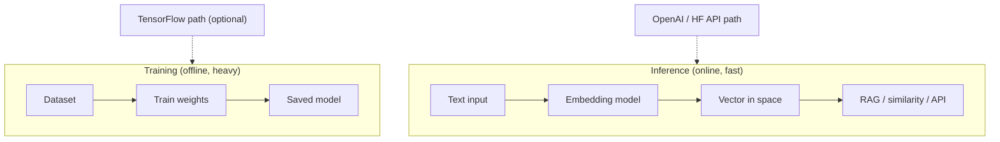
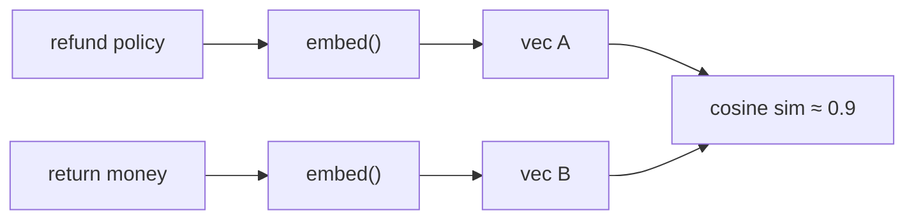
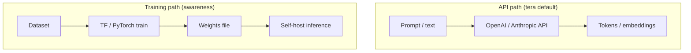

# Module 00d — ML & AI Foundations (incl. TensorFlow intro)

> **Padho**: Isi file mein **Theory** — bahar mat jao.  
> **Likho**: `practice/` folder. **Pucho**: Cursor chat `@MODULE.md`  
> **Nav**: ← [Module 00c](../00c-fastapi/MODULE.md) · Next → [Module 01](../01-llm-apis/MODULE.md)

## At a glance

| | |
|---|---|
| Prerequisites | Module 00b (Python, basic math ok) |
| Duration | ~4–5 sessions |
| Project? | No |
| Exit test | Training vs inference, embeddings, TF vs API-LLM path explain karo |

## Visual map



```
TRAINING (seekho awareness)     INFERENCE (daily job path)
─────────────────────────     ───────────────────────────
data → fit weights → save     text → embed → vector space
         ↑                              ↓
    TF optional                   cosine search / RAG

API-LLM path: prompt → provider → tokens (no local training)
```

**Mental model**: Training weights banata hai; inference un weights (ya API) se prediction/embeddings deta hai — tumhara path zyada tar inference + embeddings hai.

**Redraw challenge**: Training vs inference split, text→embedding→vector space, aur TF optional vs API path teen arrows ke saath draw karo.

---

## Honest scope (important)

**Tera 2026 job path = LLM APIs + RAG + Agents**, mostly **inference**, not training models from scratch.

| Seekho depth mein | Sirf awareness |
|-------------------|----------------|
| Embeddings, vectors, cosine similarity | Full CNN/RNN architecture design |
| Inference vs training | Production TF Serving at scale |
| NumPy intuition | Kaggle grandmaster skills |
| TensorFlow **hello world** + read code | Become ML researcher |

TensorFlow yahan **interview literacy + RAG foundation** ke liye hai — har din TF nahi likhoge, par "samajh aa jaye" chahiye.

---

## Read order

1. Visual map → 2. **Theory** (neeche) → 3. **Practice** → 4. Chat agar doubt → 5. NOTES

**Unlocks**: Module 01 (LLM APIs), Module 05 (RAG) — embeddings ab familiar honge

---

## Learning hooks

| Concept | Tera parallel |
|---------|---------------|
| Embedding vector | Hash/fingerprint — similar → close in space |
| Cosine similarity | Fuzzy match score in bank recon |
| Inference latency | LLM API p99 — same "model run" brain |
| Batch vs realtime | CSV chunked import vs single query |
| Pre-trained model | Vendor API — tum train nahi karte, use karte ho |

---

## Theory

### 1. AI vs ML vs DL vs LLM — ek slide each

| Term | Matlab (Hinglish) |
|------|-----------------|
| **AI** | Machines jo "smart" tasks karein — umbrella term |
| **ML** | AI ka subset — data se **learn** karna, hardcoded rules nahi |
| **DL** | ML + **neural networks** (layers) — images, text, speech |
| **LLM** | DL model trained on massive text — next token predict |

```
AI
 └── ML (learn from data)
      └── DL (neural nets)
           └── LLM (GPT, Claude, Llama)
```

**Tera daily work**: LLM **API** call karna, RAG, agents — training lab mein nahi, production inference mein.

---

### 2. Model, weights, training, loss — intuition

**Model** = function with **learnable parameters (weights)**.  
Input → layers → output.

**Training** = labeled data pe weights adjust karna taaki **loss** (error) kam ho.

```
Epoch loop:
  prediction = model(input)
  error = loss(prediction, true_label)
  backprop → update weights
```

**Inference** = weights **fixed** — sirf forward pass, predict.

| | Training | Inference |
|---|----------|-----------|
| Weights | Update hote hain | Frozen |
| Compute | GPU, hours/days | CPU/GPU, ms |
| Kab | Offline, rare | Har user request |
| Data | Large dataset | Single/batch input |

*(Active recall Q2: training GPU-heavy; inference often CPU ok for small models, API pe provider handle karta hai.)*

---

### 3. Tensor — multi-dim array (NumPy)

```python
import numpy as np

v = np.array([0.1, 0.5, -0.3])      # 1D vector — embedding jaisa
m = np.array([[1, 2], [3, 4]])      # 2D matrix
v.shape   # (3,)
m.shape   # (2, 2)

# Dot product
np.dot(np.array([1, 2]), np.array([3, 4]))  # 11
```

**TensorFlow** tensors ≈ NumPy arrays + GPU + autograd for training.

---

### 4. Embeddings — text → vector (RAG foundation)

Words/sentences ko **dense vectors** mein map karo — similar meaning → **close** in space.

```
"refund policy"  → [0.02, -0.11, 0.88, ...]   # 1536 dims (OpenAI example)
"return money"   → [0.01, -0.09, 0.85, ...]   # similar → high cosine sim
"banana bread"   → [-0.4, 0.7, 0.1, ...]      # far away
```

**Dimension 1536** = vector ki length — har number ek learned feature direction. Practically: **list of 1536 floats** — DB mein `vector` column (pgvector baad mein).



**Use cases**: semantic search, RAG retrieval, clustering, dedup.

*(Active recall Q1: 1536 = embedding size; compare/search ke liye fixed-length numeric fingerprint.)*

---

### 5. Cosine similarity vs Euclidean

**Cosine** = angle between vectors (direction matter, length kam) — text similarity ke liye standard.

\[
\text{cosine}(A, B) = \frac{A \cdot B}{\|A\| \|B\|}
\]

Range: **-1 to 1** (normalized vectors pe often 0–1).

```python
import numpy as np

def cosine_sim(a: np.ndarray, b: np.ndarray) -> float:
    a_norm = a / np.linalg.norm(a)
    b_norm = b / np.linalg.norm(b)
    return float(np.dot(a_norm, b_norm))

a = np.array([1.0, 0.0])
b = np.array([0.9, 0.1])
cosine_sim(a, b)  # ~0.99 — similar direction
```

| Metric | Kab use |
|--------|---------|
| Cosine | Text embeddings, high-dim sparse feel |
| Euclidean | Physical distance, low-dim coords |

RAG: query embed → DB mein sab doc vectors → **top-k highest cosine** → LLM ko context do.

---

### 6. TensorFlow/Keras — minimal hello (training path)

**Ek baar haath se** — baad mein code padh sakoge.

```python
import tensorflow as tf

# Toy: AND gate — 2 inputs → 1 output
X = np.array([[0,0],[0,1],[1,0],[1,1]], dtype=float)
y = np.array([[0],[0],[0],[1]], dtype=float)

model = tf.keras.Sequential([
    tf.keras.layers.Dense(4, activation="relu", input_shape=(2,)),
    tf.keras.layers.Dense(1, activation="sigmoid"),
])

model.compile(optimizer="adam", loss="binary_crossentropy", metrics=["accuracy"])
model.fit(X, y, epochs=50, verbose=0)   # TRAINING

pred = model.predict([[1, 1]])         # INFERENCE → ~1.0
```

| API | Phase |
|-----|-------|
| `model.fit()` | Training — weights update |
| `model.predict()` | Inference — forward only |
| `model.save()` | Artifact — deploy / reload |

**Apple Silicon**: `pip install tensorflow-macos` + `tensorflow-metal` (optional) — ya Colab pe try karo.

---

### 7. API path vs training path — tum kya ship karoge



| Approach | Pros | Cons |
|----------|------|------|
| **GPT-4 API** | Best quality, zero ML ops | Cost, latency, vendor lock |
| **Embeddings API** | Easy RAG | Per-token cost |
| **Local sentence-transformers** | Free inference, privacy | Ops, GPU for scale |
| **Fine-tune / train TF** | Custom domain | Data, GPU, team skill |

**Gateway project**: TF **nahi** chahiye — FastAPI + httpx + Redis.  
**RAG project**: embeddings API ya lightweight local model — TF training **nahi**.  
**Agents**: LLM API + tools — inference only.

*(Active recall Q3: API = fast to ship, no weight management; TF train = control + cost at scale but heavy upfront.)*

---

### 8. Hugging Face & pre-trained — browse, don't boil ocean

Models **hub** pe published — cards padho: size, license, task (embeddings, chat, etc.).

```
huggingface.co → search "bge-small" / "all-MiniLM"
```

Tum **train** nahi kar rahe — **artifact download** karke `predict` / `encode` — same brain as OpenAI embeddings API, local version.

---

## Practice

> Code **tum** likhoge Cursor mein. Stubs `practice/` mein hain.  
> Stuck? Chat: `@modules/00d-ml-ai-foundations/MODULE.md` + error paste karo.

| # | File | Kya karna hai | Pass when |
|---|------|---------------|-----------|
| A1 | `practice/cosine_similarity.py` | Cosine function TODO | Matches manual formula on test vectors |
| A2 | Paper/Excalidraw | Training vs inference diagram | Self-check / coach |
| A3 | `practice/tf_hello.py` | Tiny Keras model TODO | `predict()` on new input works |
| A4 | `practice/embeddings_stub.py` | 3 sentences → find top pair | Similar pair ranks highest |
| A5 | `NOTES.md` | 200 words: TF kahan **nahi** chahiye? | Names Gateway, RAG, agents |

### Setup

```bash
cd modules/00d-ml-ai-foundations/practice
python3 -m venv .venv && source .venv/bin/activate
pip install numpy
# A3: pip install tensorflow  (or tensorflow-macos on M1/M2)
# A4: pip install openai python-dotenv  OR sentence-transformers
```

### A1 hints

- `np.linalg.norm` for magnitude
- Test: identical vectors → 1.0; orthogonal → 0.0

### A3 hints

- XOR ya simple 2-input AND enough
- `epochs=50`, `verbose=1` se loss dekho

### A4 hints

- Option A: OpenAI embeddings API + dot/cosine
- Option B: `sentence-transformers` local — no API key
- 3 sentences: 2 similar topic, 1 random

---

## Active recall (khud jawab likho NOTES mein)

1. Embedding dimension 1536 ka matlab kya hai practically?
2. Training GPU kyun chahiye, inference kab CPU ok?
3. TensorFlow vs calling GPT-4 API — trade-off 3 bullets?

**Chat drill** (optional): "Module 00d recall — 3 questions test karo"

---

## Progress checklist

- [ ] Theory Section 1–8 padh liya
- [ ] Honest scope samjha
- [ ] Redraw challenge kiya
- [ ] Practice A1–A5 pass
- [ ] Active recall NOTES mein likha
- [ ] NOTES session log updated

---

## Optional appendix (zarurat ho tab)

- [NumPy Quickstart](https://numpy.org/doc/stable/user/quickstart.html)
- [OpenAI — Embeddings guide](https://platform.openai.com/docs/guides/embeddings)
- [TensorFlow — Quickstart for beginners](https://www.tensorflow.org/tutorials/quickstart/beginner)
- [3Blue1Brown — Neural Networks Ch.1](https://www.youtube.com/watch?v=aircAruvnKk) (visual optional)
