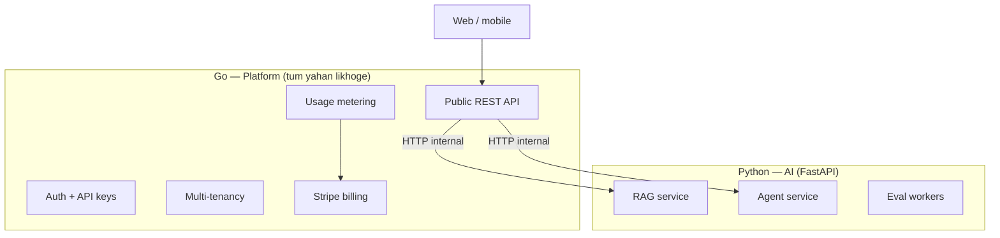

# Module 00e — Go Platform Backend

> **Padho**: Isi file mein **Theory** — bahar mat jao.  
> **Likho**: `practice/` folder. **Pucho**: Cursor chat `@MODULE.md`  
> **Nav**: ← [00d ML Foundations](../00d-ml-ai-foundations/MODULE.md) · Next → [Module 01 LLM APIs](../01-llm-apis/MODULE.md)

> **Role in portfolio**: **Go = app/platform backend** (auth, tenants, billing, metering, public API).  
> **Python = AI services** (RAG, agents, evals) — module 00c + Track 1.

## At a glance

| | |
|---|---|
| Prerequisites | 00a (Docker), 00c (HTTP API mental model helps) |
| Duration | ~4–6 sessions |
| Project? | No (enables **all Projects phase 2** + **Project C**) |
| Exit test | Explain Go platform → Python AI split; write middleware + proxy stub |

## Visual map



```
Client
   │
   ▼
┌──────────────────────────────┐
│  GO PLATFORM API             │
│  auth │ tenant │ meter │ $  │
└──────────────┬───────────────┘
               │  POST /internal/rag/query
               ▼
┌──────────────────────────────┐
│  PYTHON AI SERVICE           │
│  LangGraph │ pgvector │ eval │
└──────────────────────────────┘
```

**Mental model**: Go = **bank branch** (customers, accounts, billing). Python = **specialist desk** (AI work). Branch client ko serve karta hai, specialist ko call karta hai.

**Redraw challenge**: Go box + Python box + arrows (public vs internal) bina dekhe draw karo.

---

## Read order

1. Visual map → 2. **Theory** → 3. **Practice** → 4. Chat agar doubt → 5. NOTES

---

## Theory

### 1. Kyun Go platform, Python AI?

| Layer | Language | Kyun |
|-------|----------|------|
| **Platform** | **Go** | Fast HTTP, simple deploy, strong concurrency, low memory — billing/metering/proxy |
| **AI** | **Python** | LangGraph, ragas, pgvector, OpenAI SDK — ecosystem |
| **Frontend** | Next.js (optional) | Tum already jaante ho |

Yeh **2026 production pattern** hai — "right tool per workload." Interview line:

> "Platform spine Go mein — exactly-once metering aur tenant isolation. Agent orchestration Python microservice — LangGraph. Go BFF internal HTTP se call karta hai."

### 2. Go tumhare liye kyun hard nahi

| Go concept | Tera parallel |
|------------|---------------|
| `goroutine` | Kafka consumer thread / async worker |
| `channel` | Queue between stages |
| `struct` + methods | TypeScript interface + class |
| `error` return | `Result<T, E>` style — ignore mat karo |
| `context.Context` | Request timeout / cancellation — Express `req` lifecycle |
| `go mod` | `package.json` + lock |

Tumhe **poori Go** nahi — platform API + HTTP client + Postgres (`pgx`) + Redis pe focus.

### 3. Project repo layout (teeno SaaS ke liye)

```
portfolio/
├── platform/                 # GO — yahan app backend
│   ├── cmd/api/main.go
│   ├── internal/
│   │   ├── auth/
│   │   ├── tenant/
│   │   ├── metering/         # outbox-style exactly-once usage events
│   │   ├── billing/          # Stripe
│   │   └── proxy/            # forward to Python AI
│   └── go.mod
├── services/
│   ├── rag/                  # PYTHON — Project A AI
│   ├── agent/                # PYTHON — Project B AI
│   └── gateway/              # GO — Project C (ya platform ke andar)
├── docker-compose.yml
└── proto/ or openapi/        # contract Go ↔ Python
```

**Phase 1** (seekhte waqt): sirf `services/rag` Python — core AI.  
**Phase 2** (SaaS): `platform/` Go wrap — spine `@Projects.md`.

### 4. Go HTTP — Chi router (FastAPI ka cousin)

```go
r := chi.NewRouter()
r.Use(middleware.RequestID)
r.Use(middleware.RealIP)

r.Get("/health", func(w http.ResponseWriter, r *http.Request) {
    w.Write([]byte(`{"ok":true}`))
})

r.Route("/v1", func(r chi.Router) {
    r.Use(authMiddleware) // tenant from API key
    r.Post("/documents/query", proxyToRAG) // calls Python
})
```

| FastAPI | Go (chi) |
|---------|----------|
| `@app.get` | `r.Get` |
| `Depends(get_tenant)` | middleware chain |
| `HTTPException(401)` | `http.Error(w, ..., 401)` |
| `StreamingResponse` | `flusher` on `ResponseWriter` |

### 5. Goroutines — concurrency without asyncio headache

```go
// BAD: sequential
resp1 := callPythonRAG(ctx, q)
resp2 := callPythonEmbed(ctx, doc)

// GOOD: parallel
ch1 := make(chan Result, 1)
ch2 := make(chan Result, 1)
go func() { ch1 <- callPythonRAG(ctx, q) }()
go func() { ch2 <- callPythonEmbed(ctx, doc) }()
r1, r2 := <-ch1, <-ch2
```

**Rule**: shared data = mutex ya channels — matching engine order book jaisa socho.

### 6. Go → Python call (internal API)

Platform job:
1. Validate API key → `tenant_id`
2. Check quota / budget (Redis + Postgres)
3. Record usage event (outbox — exactly-once)
4. `POST http://rag-service:8001/internal/query` with `X-Tenant-ID` header
5. Return response to client + stream if needed

Python service **public internet expose nahi** — sirf Docker network / internal LB.

### 7. Metering in Go (tumhara moat)

```
Request completes
    → usage event {tenant_id, units, idempotency_key}
    → outbox table INSERT
    → worker publishes to Kafka / processes inline
    → Stripe meter report (idempotent)
```

Billing galat = company mar jati hai. **Yahi Rootstock + Zapier clone story.**

### 8. Kya Go mein mat likho

- LangGraph graphs
- RAG chunking / embeddings
- Eval harness / ragas

Woh Python mein rehne do — warna hire-worthy depth nahi milegi dono mein.

---

## Practice

| # | File | Kya | Pass when |
|---|------|-----|-----------|
| A1 | `practice/main.go` | Chi server + `/health` | `curl localhost:8080/health` → 200 |
| A2 | `practice/middleware.go` | Request ID + fake API key → tenant | Missing key → 401 |
| A3 | `practice/proxy_rag.go` | Proxy POST to Python stub URL | Forwards body + `X-Tenant-ID` |
| A4 | `NOTES.md` | FastAPI vs Chi table (5 rows) | Self-check |

Python stub for A3: `services/rag` baad mein — abhi `python -m http.server` ya 00c practice app use karo.

```bash
cd modules/00e-go-platform/practice
go mod tidy
go run .
```

---

## Active recall

1. Platform Go mein kyun, agents Python mein?
2. Python service ko public expose kyun nahi karte?
3. Goroutine vs OS thread — ek line?

---

## Progress checklist

- [ ] Theory 1–8 padha
- [ ] Redraw challenge
- [ ] Practice A1–A3 pass
- [ ] NOTES mein polyglot diagram apna version

---

## Optional appendix

- [Go tour](https://go.dev/tour/) — sirf extra practice, MODULE primary hai
