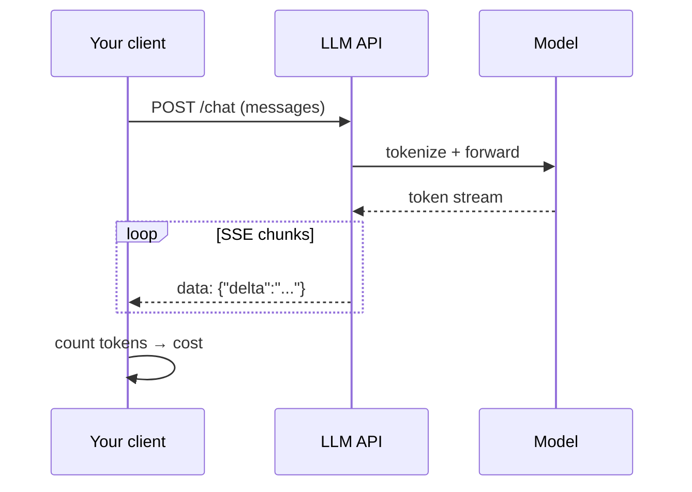
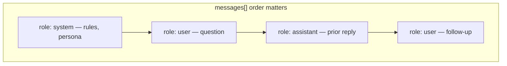
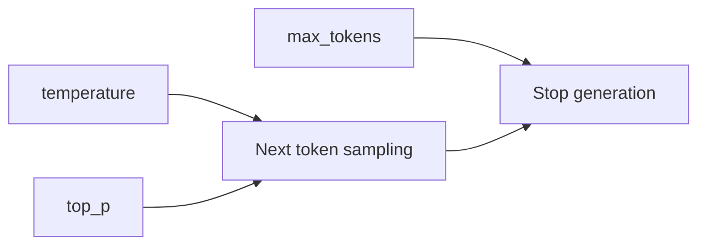
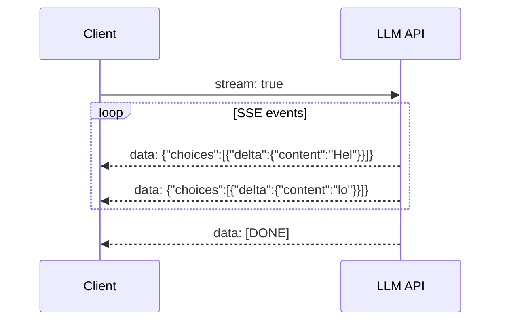
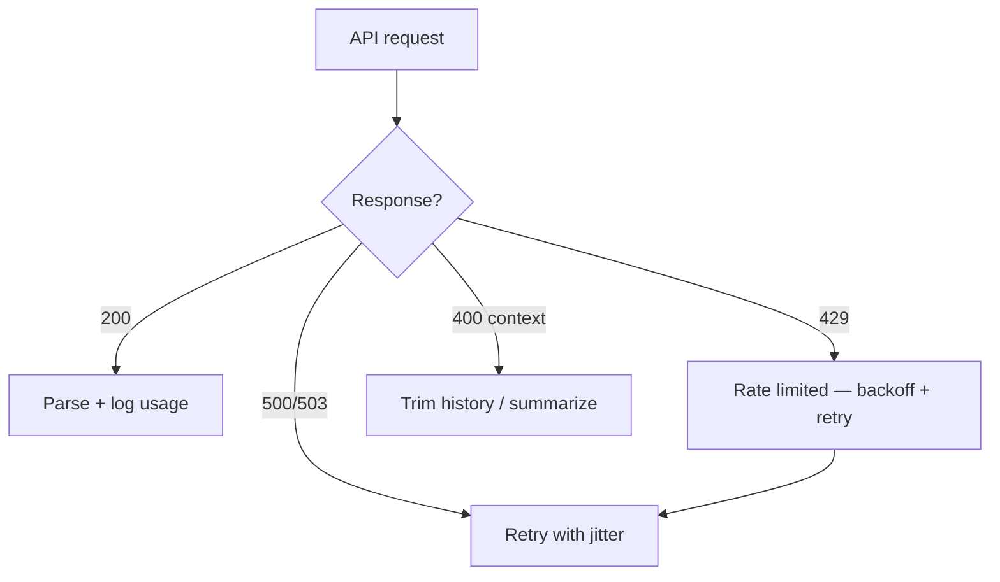

# Module 01 — LLM APIs

> **Padho**: Isi file mein **Theory** — bahar mat jao.  
> **Likho**: `practice/` folder. **Pucho**: Cursor chat `@MODULE.md`  
> **Nav**: ← [00d ML Foundations](../00d-ml-ai-foundations/MODULE.md) · Next → [Module 02](../02-llm-infra/MODULE.md)

## At a glance

| | |
|---|---|
| Prerequisites | **00a–00d** (dev env, Python async, FastAPI, ML basics) |
| Duration | ~3–5 sessions |
| Project? | No |
| Exit test | Token cost estimate + streaming trade-offs bina notes ke |

## Visual map



```
Your app ──HTTP──► LLM API ──► model
                      │
                      ├── prompt tokens  (input $)
                      ├── completion tokens (output $)
                      └── SSE stream: chunk…chunk…chunk… [DONE]
```

**Mental model**: Client API ko messages bhejta hai, tokens pe bill lagta hai; streaming SSE se response token-by-token aata hai.

**Redraw challenge**: Client → API → tokens flow aur streaming SSE chunks ka sequence bina dekhe draw karo.

---

## Read order

1. Visual map → 2. **Theory** (neeche) → 3. **Practice** → 4. Chat agar doubt → 5. NOTES

---

## Learning hooks (CV → AI)

| Concept | Tera parallel |
|---------|---------------|
| API request/response | Next.js API routes |
| Token = billable unit | Trade fee per fill |
| Streaming | Redis Pub/Sub events |
| Rate limits (provider-side) | Exchange throttle |

---

## Theory

### 1. LLM = probabilistic API, deterministic service nahi

Traditional API: same input → same output (mostly).  
LLM API: same input → **similar** output, har baar thoda alag.

```
HTTP POST /v1/chat/completions
  ├── messages[]     ← tumhara prompt stack
  ├── model          ← kaunsa brain
  ├── temperature    ← randomness dial
  └── stream: true   ← SSE on/off
        ↓
  { choices[0].message.content, usage: { prompt_tokens, completion_tokens } }
```

**Tera hook**: Exchange pe market order fill price har baar thoda alag — LLM bhi distribution se sample karta hai.

---

### 2. Tokens — billable unit samjho

Model text ko **tokens** mein todta hai — words ke tukde, subwords, punctuation.

```
"Hello world"  →  maybe ["Hello", " world"]  →  2 tokens
"Hinglish mix karo" → tokenizer model-specific
```

**Pricing formula:**

```
cost = (prompt_tokens × input_price_per_1M / 1_000_000)
     + (completion_tokens × output_price_per_1M / 1_000_000)
```

| Model tier | Input $/1M | Output $/1M | Kab use |
|------------|------------|-------------|---------|
| Small/fast | kam | kam | classification, routing |
| Large/smart | zyada | zyada | reasoning, codegen |

**Input vs output alag kyun?**  
Provider compute: output generation sequential hoti hai (har token pe forward pass). Output tokens zyada expensive — isliye output rate higher. *(Active recall Q1)*

**Mental math practice:**

```
1000 input tokens @ $3/1M  = $0.003
500 output tokens @ $15/1M = $0.0075
Total ≈ $0.0105 per call
```

---

### 3. Messages API — roles aur shape

OpenAI **Chat Completions** aur Anthropic **Messages API** dono `messages[]` array use karte hain.



```
┌─────────────────────────────────────┐
│ system: "You are a helpful assistant"│  ← instructions (provider-specific handling)
├─────────────────────────────────────┤
│ user: "Summarize this doc"          │
├─────────────────────────────────────┤
│ assistant: "Here is the summary…"   │  ← conversation history
├─────────────────────────────────────┤
│ user: "Make it shorter"             │  ← latest turn
└─────────────────────────────────────┘
```

| Role | Kaam |
|------|------|
| `system` | Rules, persona, guardrails — user se alag rakho taaki injection kam ho |
| `user` | Human input |
| `assistant` | Model ke prior replies — multi-turn memory |
| `tool` | Function calling results (Module 06) |

**System vs user alag kyun?** *(Active recall Q3)*  
- System = developer-controlled instructions  
- User = untrusted input — attacker "ignore previous instructions" yahan daal sakta hai  
- Alag role se model ko hierarchy milti hai

**Request body (OpenAI-style):**

```json
{
  "model": "gpt-4o-mini",
  "messages": [
    { "role": "system", "content": "Reply in Hinglish." },
    { "role": "user", "content": "Token kya hai?" }
  ],
  "max_tokens": 500,
  "temperature": 0.7
}
```

---

### 4. Parameters — temperature, max_tokens, top_p



| Param | Range | Effect |
|-------|-------|--------|
| `temperature` | 0–2 | 0 = deterministic-ish, 1+ = creative/random |
| `top_p` | 0–1 | Nucleus sampling — cumulative probability cutoff |
| `max_tokens` | int | Output cap — bill + context control |
| `stop` | string[] | Custom stop sequences |

```
temperature = 0.0     →  "The capital of France is Paris." (stable)
temperature = 1.2     →  varied phrasing, risky for JSON
max_tokens = 50       →  hard stop even mid-sentence
```

**Production defaults:**
- Classification / extraction → `temperature: 0`
- Creative writing → `0.7–1.0`
- JSON / structured → `0` + structured output mode (Module 04)

---

### 5. Streaming SSE — token-by-token response

Bina streaming: poora response ek JSON mein — user ko wait.



```
Batch response:
  wait 3s ──────────────────► full JSON

Streaming (SSE):
  chunk "Hel" → chunk "lo" → chunk "!" → [DONE]
  UX: typewriter effect, lower perceived latency
```

**SSE format:**

```
data: {"id":"...","choices":[{"delta":{"content":"Hi"}}]}

data: {"id":"...","choices":[{"delta":{"content":" there"}}]}

data: [DONE]
```

**Trade-offs:**

| Streaming ON | Streaming OFF |
|--------------|---------------|
| Better UX | Simpler client code |
| Partial display | Easier to cache full response |
| Client disconnect tricky | One-shot parse |

**Client disconnect pe cost?** *(Active recall Q2)*  
Provider usually **poora completion generate** kar chuka hota hai jab tak cancel signal fast na ho. Tum bill completion tokens ke liye liable ho sakte ho — production mein abort handling + `stream_options` check karo.

---

### 6. Errors — 429, 500, context length



| Error | Meaning | Action |
|-------|---------|--------|
| `429` | Rate limit / quota | Exponential backoff, queue |
| `500/503` | Provider down | Retry, fallback provider (Module 02) |
| `400` context length | Input too long | Trim messages, sliding window |
| `401` | Bad API key | Fix `.env`, rotate key |

**Context window trimmer strategy:**

```
messages[] too long?
  1. Keep system prompt always
  2. Drop oldest user/assistant pairs
  3. Or summarize middle turns into one assistant message
  4. Re-count tokens before send
```

---

## Practice

> Code **tum** likhoge Cursor mein. Stubs `practice/` mein hain.  
> Stuck? Chat: `@modules/01-llm-apis/MODULE.md` + error paste karo.

| # | File | Kya karna hai | Pass when |
|---|------|---------------|-----------|
| A1 | `practice/chat_route.py` | Non-streaming completion route | JSON + token usage logged |
| A2 | `practice/stream_route.py` | SSE streaming endpoint | Client gets incremental tokens |
| A3 | `practice/cost_calculator.py` | `TODO` — model + tokens → USD | ±1% of pricing page |
| A4 | `practice/context_trimmer.py` | `TODO` — truncate long history | Strategy documented + works |

### A1 hints

- `httpx` ya official SDK — `usage` field response mein aata hai
- Log `prompt_tokens` + `completion_tokens` structured JSON mein

### A3 hints

- Pricing dict per model — hardcode from provider page, comment date

---

## Active recall (khud jawab likho NOTES mein)

1. Input vs output tokens mein pricing kyun alag hoti hai?
2. Streaming mein agar client disconnect ho jaye toh provider cost kya hota hai?
3. System prompt user message se alag kyun rakhte hain?

**Chat drill** (optional): "Module 01 recall — 3 questions test karo"

---

## Progress checklist

- [ ] Theory Section 1–6 padh liya
- [ ] Redraw challenge kiya
- [ ] Practice A1–A4 pass
- [ ] Active recall NOTES mein likha
- [ ] NOTES session log updated

---

## Optional appendix (zarurat ho tab)

- [OpenAI Chat Completions API](https://platform.openai.com/docs/api-reference/chat) — field reference
- [Anthropic Messages API](https://docs.anthropic.com/en/api/messages) — roles + request shape
