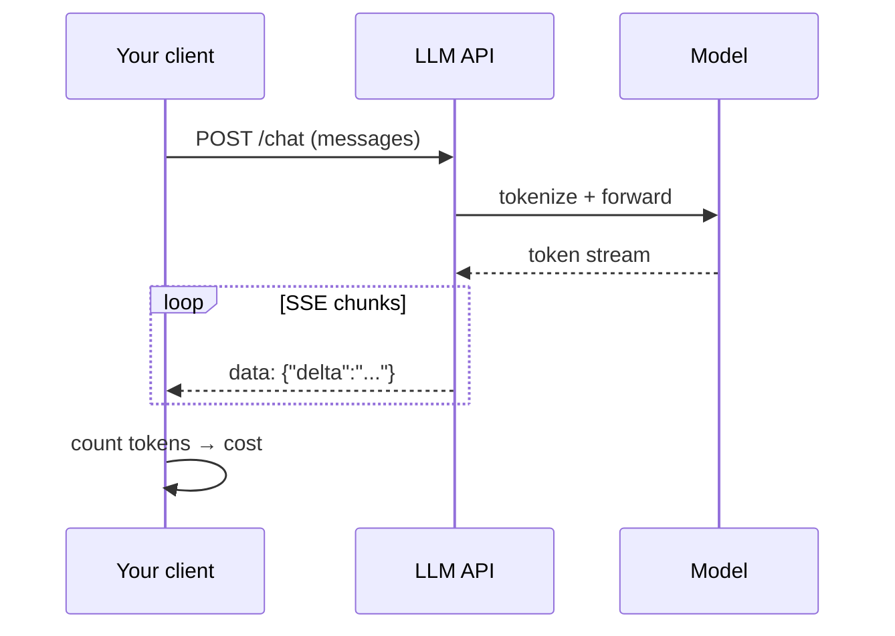

# Module 01 — LLM APIs

> **Agent spawn**: `@Memory.md` + this file + `@modules/01-llm-apis/NOTES.md`  
> **Nav**: ← [00d ML Foundations](../00d-ml-ai-foundations/MODULE.md) · Next → [Module 02](../02-llm-infra/MODULE.md)

## At a glance

| | |
|---|---|
| Prerequisites | **00a–00d** (dev env, Python async, FastAPI, ML basics) |
| Duration | ~3–5 sessions |
| Project? | No |
| Exit test | Token cost estimate + streaming trade-offs bina notes ke |

## Visual map

> **Kaise padho**: Pehle diagram dekho → topics padho → session end pe "Redraw challenge" bina dekhe draw karo



```
Your app ──HTTP──► LLM API ──► model
                      │
                      ├── prompt tokens  (input $)
                      ├── completion tokens (output $)
                      └── SSE stream: chunk…chunk…chunk… [DONE]
```

### Mental model (1 line)

Client API ko messages bhejta hai, tokens pe bill lagta hai; streaming SSE se response token-by-token aata hai.

### Redraw challenge

Client → API → tokens flow aur streaming SSE chunks ka sequence bina dekhe draw karo.

## Read order

1. Objectives → 2. Learning hooks → 3. Topics → 4. Assignments → 5. Coach se active recall

**Prerequisites**: Python basics, HTTP/REST familiarity  
**Duration**: ~3–5 sessions  
**Unlocks**: Module 02, eventually everything

## Objectives

1. Samjho LLM ek **probabilistic API** hai — deterministic service nahi
2. Messages API, roles, parameters confidently use karo
3. Token math → **dollar cost** mentally calculate karo
4. Streaming (SSE) vs batch response trade-offs

## Learning hooks (CV → AI)

| Concept | Tera parallel |
|---------|---------------|
| API request/response | Next.js API routes |
| Token = billable unit | Trade fee per fill |
| Streaming | Redis Pub/Sub events |
| Rate limits (provider-side) | Exchange throttle |

## Topics

- Chat Completions / Messages API (OpenAI + Anthropic)
- System / user / assistant / tool messages
- `temperature`, `max_tokens`, `top_p`, stop sequences
- Input vs output token pricing
- Streaming: chunks, flush, client disconnect handling
- Error types: 429, 500, context length exceeded

## Assignments (incremental)

| # | Task | Passing criteria |
|---|------|------------------|
| A1 | Incomplete FastAPI route: single non-streaming completion | Returns JSON + logs token usage |
| A2 | Add SSE streaming endpoint | Client receives tokens incrementally |
| A3 | Cost calculator function (stub) | Given model + tokens → USD ±1% |
| A4 | Context window trimmer stub | Long history truncate strategy documented + works |

## Active recall bank (coach use kare)

1. Input vs output tokens mein pricing kyun alag hoti hai?
2. Streaming mein agar client disconnect ho jaye toh provider cost kya hota hai?
3. System prompt user message se alag kyun rakhte hain?

## Progress checklist

- [ ] Objectives recall bina notes ke
- [ ] Assignments A1–A4 pass
- [ ] NOTES.md session log updated

## Ship to NOTES.md

Har session: date, topic, 1-line takeaway, open questions.
