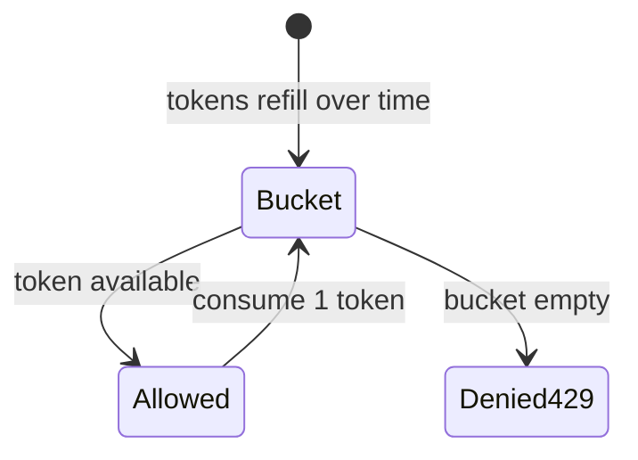
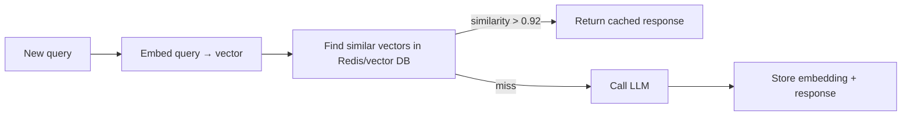
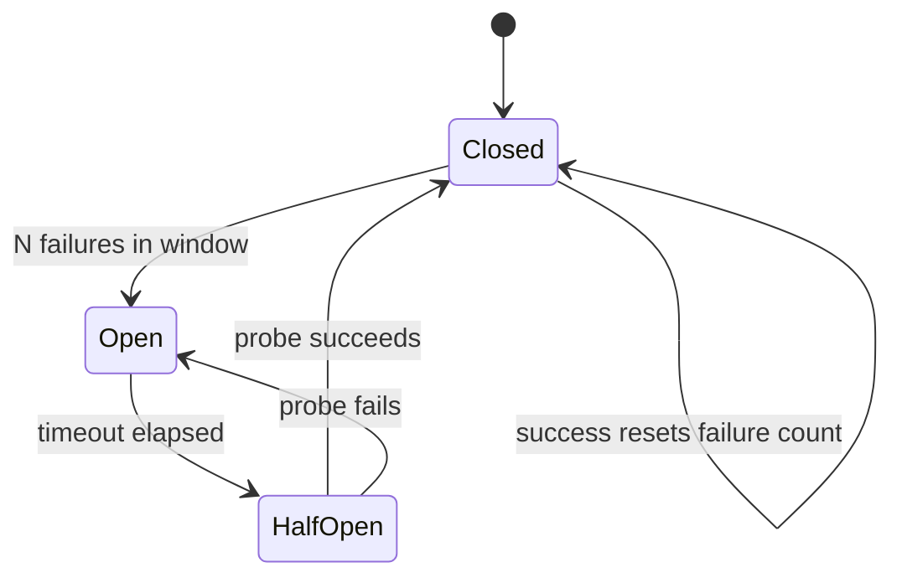
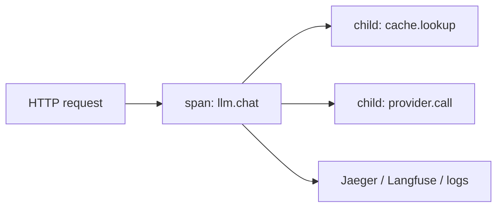

# Module 02 — LLM Infra Patterns

> **Padho**: Isi file mein **Theory** — bahar mat jao.  
> **Likho**: `practice/` folder. **Pucho**: Cursor chat `@MODULE.md`  
> **Nav**: ← [Module 01](../01-llm-apis/MODULE.md) · Next → [Module 03](../03-project-llm-gateway/MODULE.md)

> **Format**: Textbook — **§0 terms pehle** (rate limit, cache, circuit breaker). Architecture baad mein. Standard: `@MODULE-TEACHING-STANDARD.md`

> **Kaun ke liye:** Module 01 complete. TS/Node + Redis exposure (00a). Zero AI infra background OK.

## At a glance

| | |
|---|---|
| Prerequisites | Module 01 · 00a Redis (`docker compose up -d`). 01 skip kiya toh pehle §0 + Module 01 §0 terms |
| Duration | ~4–6 sessions |
| Project? | No |
| Exit test | Cache + circuit breaker design bina notes ke whiteboard karo |

## Visual map (simple — detail §0 ke baad)

```
request → [rate limit] → [cache hit?] ──yes──► response (fast, cheap)
                              │
                             miss
                              ↓
                         [circuit breaker closed?]
                              ↓
                         LLM provider
                              ↓
                         cache store + respond
```

**Mental model**: Har request pehle **gate** se guzarti hai (rate limit), phir **cheap path** (cache), phir **risk control** (circuit breaker), tab provider. Direct API call learning ke liye tha — production mein yeh layer mandatory.

**Redraw challenge**: Request → rate limiter → cache → circuit breaker → provider chain bina dekhe draw karo.

---

## Read order (strict — session table)

| Session | Padho | Karo |
|---------|-------|------|
| 1 | §0 Terms (rate limit, cache, circuit breaker, fallback) | Redis ping — `redis-cli PING` |
| 2 | §1 Proxy layer + §2 Rate limiting | **A1** rate limiter |
| 3 | §3 Semantic cache + exact cache intro | **A2** exact cache |
| 4 | §4 Circuit breaker | **A3** breaker wrapper |
| 5 | §5 Fallback + §6 Cost tracking | NOTES — cost JSON schema |
| 6 | §7 Observability + active recall | **A4** request middleware |

---

## Learning hooks (fintech parallels)

| Pattern | Tera parallel |
|---------|---------------|
| Token bucket rate limit | Order submission throttle per client |
| Exact cache | Identical order idempotency hit |
| Semantic cache | Fuzzy match in **bank reconciliation** |
| Circuit breaker | Venue down → stop sending orders |
| Fallback provider | Secondary **liquidity source** |
| Per-tenant budget | Account **trading limits** / credit line |
| OTEL spans | Prometheus `/metrics` + trace_id in logs |
| Structured cost log | **Billing event** per fill |

---

## Theory

### §0. Terms pehli baar — infra words architecture se pehle (35 min)

Module 01 mein tumne **provider API** direct call kiya. Ab production **patterns** — pehle vocabulary, phir diagrams.

#### 0.1 Rate limiting — zyada requests rokna

**Rate limit** = fixed window mein max N requests allow; uske baad reject (usually HTTP **429 Too Many Requests**).

| Term | Matlab |
|------|--------|
| **Quota** | Total allowance — e.g. 1000 req/day |
| **Throttle** | Slow down or reject when over limit |
| **429** | HTTP status — client ko backoff karna chahiye |
| **Token bucket** | Algorithm — bucket mein tokens, har request ek consume (§2) |
| **Sliding window** | Last N seconds count — precise, thoda zyada memory |

**Fintech analogy:** Exchange **order rate limit** — HFT client second mein 1000 orders nahi bhej sakta; yahan tenant second mein 60 LLM calls.

**Level kahan lagate hain:**

| Level | Key example | Kab |
|-------|-------------|-----|
| IP | `rl:ip:1.2.3.4` | Anonymous abuse |
| User / API key | `rl:key:sk-abc` | Fair use per customer |
| Tenant | `rl:tenant:org_42` | SaaS multi-tenant |

#### 0.2 Cache — purana jawab dubara compute mat karo

**Cache** = pehle compute kiya hua result store — next time **provider call skip**.

| Term | Matlab |
|------|--------|
| **Cache hit** | Key mil gayi — stored response return |
| **Cache miss** | Nahi mila — provider call karo, phir store |
| **TTL** | Time-to-live — entry kitni der valid |
| **Exact cache** | Same string prompt → hit |
| **Semantic cache** | **Similar meaning** prompt → hit (embeddings, §3) |
| **False positive** | Galat match — wrong answer served |

**Fintech analogy:** Exact cache = same **ISIN + qty + price** order replay. Semantic cache = "refund policy?" vs "how do refunds work?" — human alag, meaning same → **recon fuzzy match**.

#### 0.3 Circuit breaker — provider sick hai toh fail fast

**Circuit breaker** = wrapper jo provider failures track karta hai; bahut fail → **OPEN** → requests turant reject (provider call nahi).

| State | Matlab |
|-------|--------|
| **CLOSED** | Normal — requests provider ko jati hain |
| **OPEN** | Fail fast — save latency + money, don't hammer sick service |
| **HALF-OPEN** | Probe — ek test request; success → CLOSED, fail → OPEN |

**Fintech analogy:** Primary **matching engine** connectivity monitor — venue down → stop routing, periodic **probe order** se check recovery.

#### 0.4 Fallback — plan B provider

**Fallback** = primary fail (5xx, breaker OPEN) → secondary provider/model try karo.

```
Primary: Anthropic
    ↓ fail
Secondary: OpenAI
    ↓ fail
Tertiary: cached stale OR graceful 503
```

**Rule:** 400 (bad request) pe fallback **mat** karo — user error hai, doosra provider bhi fail karega.

#### 0.5 Observability terms (intro)

| Term | Matlab |
|------|--------|
| **trace_id** | Ek request ki poori journey track — UUID |
| **Span** | Ek operation ka timed slice (cache lookup, provider call) |
| **OTEL** | OpenTelemetry — vendor-neutral tracing standard |
| **Structured log** | JSON fields — grep/aggregate friendly |

#### 0.6 §0 checkpoint (NOTES)

1. Rate limit vs budget limit mein farq?
2. Semantic cache false positive dangerous kyun?
3. Circuit breaker OPEN mein provider ko call kyun nahi karte?

**Common errors (concept level):**

| Confusion | Sahi |
|-----------|------|
| "Cache hamesha safe" | Stale policy / wrong semantic match risk |
| "429 = bug" | Expected under load — backoff design karo |
| "Breaker = retry" | Breaker **stops** calls; retry alag policy |

---

### §1. Kyun proxy layer chahiye — direct API call production mein nahi

#### Problem kya hai?

Module 01: ek FastAPI route → OpenAI. Production: 10 microservices, har ek apni key, retry, logging copy-paste. Key leak, inconsistent cost data, no central throttle — **operational chaos**.

```
❌ 10 services × (API key + retry + logging + cache logic)
✅ 10 services → 1 LLM proxy/gateway → providers
```

**Fintech analogy:** Har desk apna **direct market access** vs bank ka central **OMS** — compliance, limits, audit ek jagah.

#### Proxy layer responsibilities

| Responsibility | Kyun centralize |
|----------------|-----------------|
| Rate limit | Fair use + abuse stop |
| Cache | Cost cut + latency cut |
| Circuit breaker | Provider outage isolate |
| Cost log | Per-tenant billing (Module 03) |
| Traces | Debug slow requests |

#### Request flow (with proxy)

```
Step 1 → Service calls internal proxy (not provider directly)
Step 2 → Proxy: auth + rate limit
Step 3 → Proxy: cache lookup
Step 4 → Proxy: circuit breaker check
Step 5 → Proxy: provider call
Step 6 → Proxy: log cost, update cache, return
```

**Common errors:**

| Mistake | Impact | Fix |
|---------|--------|-----|
| Provider key in frontend | Key steal → bankruptcy | Server-side proxy only |
| Each team own retry logic | Retry storm on 503 | Central exponential backoff |
| No request ID | Can't debug | trace_id middleware (§7) |

> **→ Practice A4** (later — trace_id + structured logs tie-in)

---

### §2. Rate limiting — token bucket vs sliding window

#### Problem kya hai?

Ek tenant loop mein 10,000 LLM calls bhej de → bill spike + provider 429 → sab users affect. **Per-tenant throttle** chahiye Redis pe.



#### Token bucket (line-by-line mental model)

```
Bucket capacity = 60 tokens
Refill rate     = 1 token per second
Each request    = costs 1 token

t=0:  bucket=60 → 60 requests burst OK
t=1:  refilled +1 if below cap
empty bucket → HTTP 429 + Retry-After header
```

| Concept | Matlab |
|---------|--------|
| Capacity | Max burst — short spike allow |
| Refill rate | Sustained throughput cap |
| Consume | Har allowed request −1 token |

**Sliding window:** "Last 60 seconds mein kitni requests?" — precise, Redis memory zyada. Production mein dono mix ho sakte hain.

#### Redis pattern (simple counter — learning)

```python
# Pseudocode — key per tenant per minute window
key = f"rl:{tenant_id}:{current_minute}"
count = redis.incr(key)
if count == 1:
    redis.expire(key, 60)
if count > LIMIT:
    raise HTTPException(429, "Rate limit exceeded")
```

| Line | Matlab |
|------|--------|
| `rl:{tenant_id}:{current_minute}` | Scoped key — tenant isolate |
| `INCR` | Atomic count badhao |
| `EXPIRE 60` | Window ke baad key auto delete |
| `count > LIMIT` | Over limit → 429 |

**Full request flow:**

```
1 → Extract tenant_id from API key
2 → Build Redis key for window
3 → INCR — if first, set TTL
4 → If over limit → 429 + Retry-After
5 → Else → pass to next middleware (cache)
```

**Common errors:**

| Error / symptom | Kyun | Fix |
|-----------------|------|-----|
| Everyone gets 429 | Key same for all tenants | Include tenant_id in key |
| Limit never resets | EXPIRE missing | Set TTL on first INCR |
| Burst then starve | Bucket too small | Tune capacity vs refill |
| Redis connection refused | 00a compose not running | `docker compose up -d` in 00a |

> **→ Practice A1** (pass: N requests/min ke baad 429)

---

### §3. Semantic cache — embedding similarity se cache hit

#### Problem kya hai?

Exact cache: user "refund policy?" vs "Refund policy?" — miss (string different). LLM dubara call → **latency + cost**. Semantic cache: **meaning similar** → hit.



#### Similarity example

```
Query A: "What is your refund policy?"
Query B: "How do refunds work?"

embed(A) · embed(B) → cosine_similarity ≈ 0.95
Threshold 0.92 → CACHE HIT (skip LLM)
```

| Term | Matlab |
|------|--------|
| **Embedding** | Text → float vector — meaning capture |
| **Cosine similarity** | 0–1 — 1 = same direction |
| **Threshold** | Kitna similar chahiye hit ke liye — usually 0.92+ |

#### Exact vs semantic (Module 03 gateway dono use karega)

| Type | Key | Hit when |
|------|-----|----------|
| Exact | `hash(prompt + model)` | Byte-identical prompt |
| Semantic | embedding nearest neighbor | Paraphrase similar |

#### Risks

| Risk | Production impact | Mitigation |
|------|-------------------|------------|
| False positive (threshold low) | **Wrong answer** — legal/compliance risk | Threshold 0.92+; human review bucket |
| Stale TTL | Old refund policy served | TTL + version in cache key |
| Cache poisoning | Attacker plants bad Q→A | Auth required; tenant-scoped keys |
| Side effects cached | "Transfer $100" cached — disaster | **Never cache** tool/action side effects |

**Fintech analogy:** False positive = wrong **trade matched** to wrong counterparty — catastrophic; threshold conservative rakho.

**Common errors:**

| Symptom | Kyun | Fix |
|---------|------|-----|
| Never hits | Threshold too high | Tune on labeled query pairs |
| Wrong answers | Threshold too low | Raise threshold; A/B measure |
| Cross-tenant leak | Key without tenant_id | Always scope `tenant_id` prefix |

> **→ Practice A2** (pass: exact duplicate prompt → second call skips LLM — semantic Module 03 M4)

---

### §4. Circuit breaker — closed, open, half-open

#### Problem kya hai?

Provider 503 de raha hai; tum har request 30s timeout wait karte ho → **queue pile-up**, users angry, **bill bhi** timeout retries se. Breaker **fail fast** when unhealthy.



#### States explained

```
CLOSED     → Normal. Count consecutive failures.
OPEN       → Reject immediately. No provider HTTP call.
HALF-OPEN  → Allow ONE probe request.
             Success → CLOSED, failure count reset
             Fail    → OPEN again
```

**Parameters (typical learning values):**

| Param | Example | Matlab |
|-------|---------|--------|
| `failure_threshold` | 3 | Itni fail → OPEN |
| `open_duration_sec` | 30 | Kitni der OPEN before half-open probe |
| `success_threshold` | 1 | Probes to close |

#### Wrapper pseudocode (line-by-line)

```python
def call_with_breaker(fn):
    if state == OPEN:
        if now - opened_at > open_duration:
            state = HALF_OPEN
        else:
            raise ServiceUnavailable("Circuit open")

    try:
        result = fn()          # actual provider call
        on_success()           # reset failure count, maybe CLOSED
        return result
    except ProviderError:
        on_failure()           # increment; maybe trip OPEN
        raise
```

| Line | Matlab |
|------|--------|
| `state == OPEN` | Fail fast path |
| `HALF_OPEN` | Single probe allowed |
| `fn()` | Real LLM HTTP call |
| `on_failure()` | Track failures — trip if threshold |

**Half-open kyun?** OPEN forever = provider recover ho gaya par tum kabhi try nahi karte. Probe = **health check trade** — chhota test before full traffic.

**Common errors:**

| Symptom | Kyun | Fix |
|---------|------|-----|
| Breaker never opens | Catching all exceptions as success | Only count provider 5xx/timeouts |
| Stuck OPEN | open_duration too long | Tune; log state transitions |
| Shared state lost | In-memory per process | Production: Redis-backed state |

> **→ Practice A3** (pass: 3 simulated fails → open; half-open retry works)

---

### §5. Fallback provider chain

#### Problem kya hai?

Ek provider outage = tumhara product down. Secondary **liquidity** chahiye — Module 01 API knowledge yahan wire hoti hai.

```
Step 1 → Try primary (e.g. Anthropic)
Step 2 → If 5xx OR breaker OPEN → secondary (OpenAI)
Step 3 → If both fail → return 503 + Retry-After
Step 4 → Log which path: primary | fallback | failed
```

#### Rules table

| Condition | Fallback? | Kyun |
|-----------|-----------|------|
| Primary 503 | Yes | Provider issue |
| Breaker OPEN | Yes | Primary unhealthy |
| 400 bad request | **No** | Prompt/schema broken — secondary bhi fail |
| 401 | **No** | Key config — fix ops |
| Different model quality | Log it | User expectation manage |

**Idempotency note:** Same user action double-submit ≠ double side effect — Module 06 tools; fallback mein **read-only** calls safer.

**Common errors:**

| Mistake | Fix |
|---------|-----|
| Fallback on 400 | Check status code before fallback |
| Silent quality drop | Response header `X-Model-Used` |
| Double billing same content | Cache before fallback where safe |

> **→ Practice A3** (breaker integrates with fallback in Module 03 M2)

---

### §6. Cost tracking per request

#### Problem kya hai?

CFO puche "Tenant X ka mahina kitna?" — bina structured log ke guess. Har LLM call = **billing event** — jaise har fill ka fee record.

#### Structured log shape (line-by-line)

```json
{
  "trace_id": "abc-123",
  "tenant_id": "org_42",
  "model": "gpt-4o-mini",
  "prompt_tokens": 1200,
  "completion_tokens": 340,
  "cost_usd": 0.0041,
  "cache_hit": false,
  "provider": "openai",
  "latency_ms": 842
}
```

| Field | Matlab |
|-------|--------|
| `trace_id` | Request correlation — logs + traces join |
| `tenant_id` | Who to bill |
| `prompt_tokens` / `completion_tokens` | From provider `usage` |
| `cost_usd` | Module 01 formula applied |
| `cache_hit` | true → LLM cost saved |
| `provider` | Primary vs fallback attribution |
| `latency_ms` | SLO monitoring |

#### Aggregation (downstream)

```
Daily: SUM(cost_usd) GROUP BY tenant_id
Alerts: tenant > budget → Slack
Dashboard: cache hit rate, avg tokens, p99 latency
```

**Fintech analogy:** Har fill → **outbox event** → billing pipeline. Yahan har LLM response → cost event → Stripe meter (Module 03 / Projects.md).

**Common errors:**

| Symptom | Kyun | Fix |
|---------|------|-----|
| Costs don't add up | Stream usage missed | Parse final stream chunk |
| Missing tenant | Auth middleware order wrong | Resolve tenant before call |
| Float rounding drift | Use Decimal for USD | `decimal.Decimal` in Python |

> **→ Practice A4** (pass: JSON log with trace_id + token fields per request)

---

### §7. Observability — structured logs + OTEL intro

#### Problem kya hai?

"p99 latency 3s ho gaya" — cache break hua? Opus routing badh gaya? Provider slow? Bina spans ke **guesswork**.



#### Structured logging example

```python
logger.info(
    "llm_request_complete",
    extra={
        "trace_id": trace_id,
        "tenant_id": tenant_id,
        "latency_ms": 420,
        "tokens_in": 100,
        "tokens_out": 50,
        "cache_hit": False,
        "cost_usd": 0.0023,
    },
)
```

| Field | Matlab |
|-------|--------|
| `"llm_request_complete"` | Event name — grep friendly |
| `extra={...}` | Structured fields — not string concat |
| `trace_id` | Same ID OTEL span mein bhi |

#### Tool pick

| Tool | Kab |
|------|-----|
| Raw OTEL + Jaeger | Infra team, custom dashboards |
| Langfuse | LLM-specific — prompts, eval scores |
| Plain JSON logs | MVP — Module 03 M6 start here |

**Common errors:**

| Symptom | Kyun | Fix |
|---------|------|-----|
| Can't correlate | trace_id missing in log | Middleware inject at edge |
| Span gap | Cache hit path no child span | Span around every branch |
| PII in logs | Full prompt logged | Log hash + length only |

> **→ Practice A4** (pass: one request → structured JSON line with trace_id)

---

## Practice

> **Saare assignments ek jagah**: [`practice/README.md`](practice/README.md) — **§0 se start**.  
> Code **tum** likhoge Cursor mein. Stubs `practice/` mein (`TODO` search).  
> Stuck? Chat: `@modules/02-llm-infra/MODULE.md` + error paste karo.

| # | Theory (Theory §) | File | Kya karna hai | Pass when |
|---|--------------|------|---------------|-----------|
| A1 | §2 | `practice/rate_limiter.py` | Redis token bucket | 429 after N req/min |
| A2 | §3 | `practice/exact_cache.py` | Exact prompt cache | Cache hit skips LLM |
| A3 | §4, §5 | `practice/circuit_breaker.py` | Breaker wrapper | Opens after 3 fails, half-open retry |
| A4 | §6, §7 | `practice/request_middleware.py` | trace_id + token counters | Structured JSON logs |

### Setup

```bash
cd modules/02-llm-infra/practice
python3 -m venv .venv && source .venv/bin/activate
pip install redis httpx fastapi uvicorn python-dotenv
# Redis: 00a/practice → docker compose up -d
```

---

## Active recall (khud jawab likho NOTES mein)

1. Semantic cache false positive ka production impact kya hai?
2. Circuit breaker half-open state kyun chahiye?
3. Rate limit user-level vs IP-level — kab kya?
4. Proxy layer direct provider call se cost/latency kaise better karta hai (2 reasons)?

**Chat drill** (optional): "Module 02 recall — 4 questions test karo"

---

## Progress checklist

- [ ] §0 terms padh liye — checkpoint NOTES mein
- [ ] Theory §1–§7 padh liya (section → practice rhythm)
- [ ] Redraw challenge kiya
- [ ] Practice A1–A4 pass
- [ ] Active recall NOTES mein likha
- [ ] NOTES session log updated

---

## Optional appendix (zarurat ho tab)

- [Martin Fowler — Circuit Breaker](https://martinfowler.com/bliki/CircuitBreaker.html) — state machine deep dive
- [Redis rate limiting patterns](https://redis.io/glossary/rate-limiting/) — token bucket implementation
- [OpenTelemetry concepts](https://opentelemetry.io/docs/concepts/) — traces vs metrics
