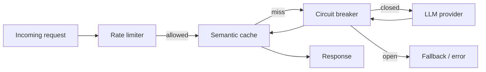
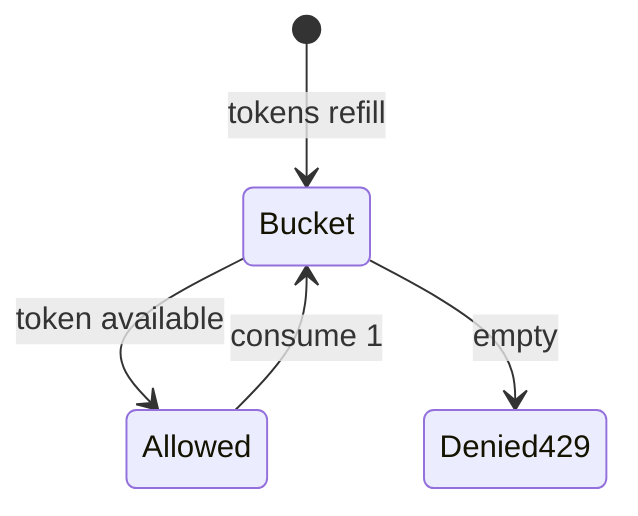
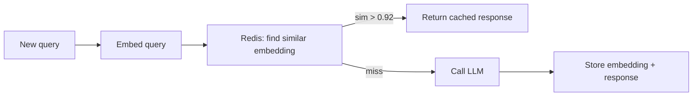
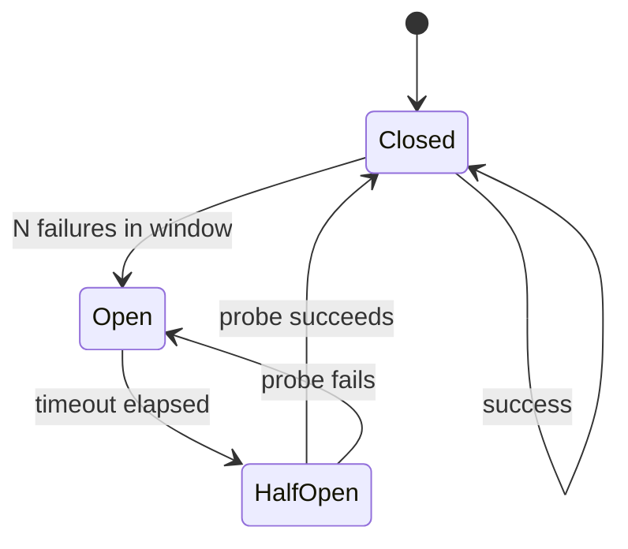
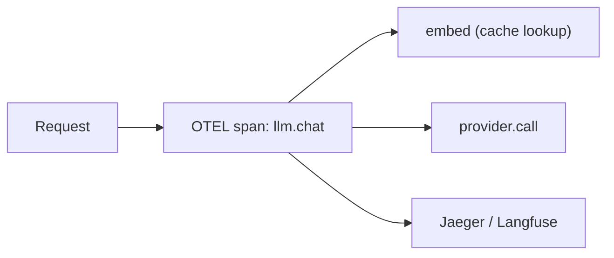

# Module 02 — LLM Infra Patterns

> **Padho**: Isi file mein **Theory** — bahar mat jao.  
> **Likho**: `practice/` folder. **Pucho**: Cursor chat `@MODULE.md`  
> **Nav**: ← [Module 01](../01-llm-apis/MODULE.md) · Next → [Module 03](../03-project-llm-gateway/MODULE.md)

## At a glance

| | |
|---|---|
| Prerequisites | Module 01 |
| Duration | ~4–6 sessions |
| Project? | No |
| Exit test | Cache + circuit breaker design bina notes ke |

## Visual map



```
request → [rate limit] → [cache hit?] ──yes──► response
                              │
                             miss
                              ↓
                         [circuit breaker]
                              ↓
                         LLM provider
                              ↓
                         cache + respond
```

**Mental model**: Har request pehle rate limit aur cache check karti hai; circuit breaker provider fail hone pe trip ho kar protect karta hai.

**Redraw challenge**: Request → rate limiter → cache → circuit breaker → provider chain bina dekhe draw karo.

---

## Read order

1. Visual map → 2. **Theory** (neeche) → 3. **Practice** → 4. Chat agar doubt → 5. NOTES

---

## Learning hooks

| Pattern | Tera parallel |
|---------|---------------|
| Token bucket rate limit | Order submission throttle |
| Semantic cache | Fuzzy match in bank recon |
| Circuit breaker | Fail fast when venue down |
| Fallback provider | Secondary liquidity source |
| Per-tenant budget | Account trading limits |
| OTEL spans | Prometheus `/metrics` |

---

## Theory

### 1. Kyun proxy layer chahiye — direct API call production mein nahi

Module 01 mein tumne direct provider call kiya. Production mein har service alag-alag keys, retries, logging rakhegi → chaos.

```
❌ 10 microservices → 10 places pe OpenAI key + retry logic
✅ 10 microservices → 1 LLM proxy (gateway) → provider
```

Proxy layer pe centralize: rate limit, cache, breaker, cost, traces.

---

### 2. Rate limiting — token bucket vs sliding window



**Token bucket:**
```
Bucket capacity = 60 tokens
Refill rate = 1 token/sec
Request costs 1 token → allowed until empty → 429
```

**Sliding window:** last N seconds mein kitni requests — precise but Redis memory zyada.

| Level | Kab |
|-------|-----|
| IP | anonymous abuse stop |
| User/API key | fair use per customer |
| Tenant | SaaS multi-tenant quotas |

*(Active recall Q3: user-level vs IP-level)*

**Redis pattern:**

```
INCR ratelimit:{tenant}:{minute}
EXPIRE ratelimit:{tenant}:{minute} 60
if count > LIMIT → return 429
```

---

### 3. Semantic cache — embedding similarity se cache hit

Exact-match cache: same string → hit.  
Semantic cache: **similar meaning** → hit.



```
Query A: "What is your refund policy?"
Query B: "How do refunds work?"
         ↓
cosine_similarity(embed(A), embed(B)) = 0.95 → CACHE HIT
```

**Risks:**

| Risk | Impact |
|------|--------|
| False positive (threshold too low) | Wrong answer served — dangerous |
| Stale TTL | outdated policy returned |
| Cache poisoning | attacker plants bad Q→A pairs |

*(Active recall Q1: false positive production impact)*

**Mitigations:** high threshold (0.92+), TTL, tenant-scoped keys, never cache tool-call side effects.

---

### 4. Circuit breaker — closed, open, half-open



```
CLOSED    → normal, requests pass through
OPEN      → fail fast, no provider call (save $ + latency)
HALF-OPEN → 1 probe request — success → CLOSED, fail → OPEN
```

**Tera hook:** Exchange connectivity monitor — venue down → stop sending orders, try probe later.

*(Active recall Q2: half-open kyun? — blindly OPEN forever = never recover)*

---

### 5. Fallback provider chain

```
Primary: Anthropic Claude
    ↓ 5xx or breaker OPEN
Secondary: OpenAI GPT
    ↓ fail
Tertiary: cached response or graceful error
```

**Rules:**
- Fallback model quality alag ho sakti hai — log which path taken
- Don't fallback on 400 (bad request) — user error
- Idempotency: same request twice ≠ double side effect (Module 06)

---

### 6. Cost tracking per request

Har request pe log karo:

```json
{
  "trace_id": "abc-123",
  "tenant_id": "org_42",
  "model": "gpt-4o-mini",
  "prompt_tokens": 1200,
  "completion_tokens": 340,
  "cost_usd": 0.0041,
  "cache_hit": false,
  "provider": "openai"
}
```

**Aggregation:** per tenant daily budget, margin dashboard, FinOps alerts.

---

### 7. Observability — structured logs + OTEL intro



**Structured logging:**

```python
logger.info("llm_request", extra={
    "trace_id": trace_id,
    "latency_ms": 420,
    "tokens_in": 100,
    "tokens_out": 50,
})
```

| Tool | Kab |
|------|-----|
| Raw OTEL | Infra teams, Prometheus, custom dashboards |
| Langfuse | LLM-specific — prompts, traces, eval scores |

Module 03 gateway in dono ko wire karega.

---

## Practice

> **Saare assignments ek jagah**: [`practice/README.md`](practice/README.md) — problem statements, instructions, pass criteria.  
> Code **tum** likhoge Cursor mein. Stubs `practice/` mein hain (`TODO` search).  
> Stuck? Chat: `@modules/02-llm-infra/MODULE.md` + error paste karo.

| # | File | Kya karna hai | Pass when |
|---|------|---------------|-----------|
| A1 | `practice/rate_limiter.py` | Redis token bucket | 429 after N req/min |
| A2 | `practice/exact_cache.py` | Exact prompt cache | Cache hit skips LLM |
| A3 | `practice/circuit_breaker.py` | Breaker wrapper | Opens after 3 fails, half-open retry |
| A4 | `practice/request_middleware.py` | trace_id + token counters | Structured JSON logs |

### A1 hints

- Redis from Module 00a `docker compose` — `redis://localhost:6379`
- Key pattern: `rl:{identifier}:{window}`

### A3 hints

- In-memory state OK for learning — production mein Redis shared state

---

## Active recall (khud jawab likho NOTES mein)

1. Semantic cache false positive ka production impact kya hai?
2. Circuit breaker half-open state kyun chahiye?
3. Rate limit user-level vs IP-level — kab kya?

**Chat drill** (optional): "Module 02 recall — 3 questions test karo"

---

## Progress checklist

- [ ] Theory Section 1–7 padh liya
- [ ] Redraw challenge kiya
- [ ] Practice A1–A4 pass
- [ ] Active recall NOTES mein likha
- [ ] NOTES session log updated

---

## Optional appendix (zarurat ho tab)

- [Martin Fowler — Circuit Breaker](https://martinfowler.com/bliki/CircuitBreaker.html) — state machine deep dive
- [Redis rate limiting patterns](https://redis.io/glossary/rate-limiting/) — token bucket implementation
