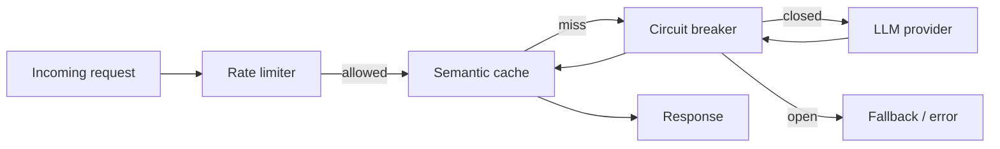

# Module 02 — LLM Infra Patterns

> **Agent spawn**: `@Memory.md` + this file + `@modules/02-llm-infra/NOTES.md`  
> **Nav**: ← [Module 01](../01-llm-apis/MODULE.md) · Next → [Module 03](../03-project-llm-gateway/MODULE.md)

## At a glance

| | |
|---|---|
| Prerequisites | Module 01 |
| Duration | ~4–6 sessions |
| Project? | No |
| Exit test | Cache + circuit breaker design bina notes ke |

## Visual map

> **Kaise padho**: Pehle diagram dekho → topics padho → session end pe "Redraw challenge" bina dekhe draw karo



```
request → [rate limit] → [cache hit?] ──yes──► response
                              │
                             miss
                              ↓
                         [circuit breaker]
                              ↓
                         LLM provider
                              ↓
                         cache + respond
```

### Mental model (1 line)

Har request pehle rate limit aur cache check karti hai; circuit breaker provider fail hone pe trip ho kar protect karta hai.

### Redraw challenge

Request → rate limiter → cache → circuit breaker → provider chain bina dekhe draw karo.

## Read order

1. Objectives → 2. Learning hooks → 3. Topics → 4. Assignments → 5. Coach se active recall

**Prerequisites**: Module 01  
**Duration**: ~4–6 sessions  
**Unlocks**: Module 03 (LLM Gateway project)

## Objectives

1. Production LLM proxy ke **building blocks** samjho before Project 1
2. Rate limiting, caching, circuit breakers design karo
3. Observability + cost attribution per request

## Learning hooks

| Pattern | Tera parallel |
|---------|---------------|
| Token bucket rate limit | Order submission throttle |
| Semantic cache | Fuzzy match in bank recon |
| Circuit breaker | Fail fast when venue down |
| Fallback provider | Secondary liquidity source |
| Per-tenant budget | Account trading limits |
| OTEL spans | Prometheus `/metrics` |

## Topics

- Token bucket vs sliding window
- Semantic cache: embedding similarity threshold, TTL, cache poisoning
- Circuit breaker states (closed/open/half-open)
- Multi-provider routing skeleton
- Structured logging + trace IDs
- Langfuse vs raw OTEL (when which)

## Assignments

| # | Task | Passing criteria |
|---|------|------------------|
| A1 | Redis token bucket limiter stub | 429 after N req/min |
| A2 | Exact-match prompt cache | Cache hit skips LLM call |
| A3 | Circuit breaker wrapper stub | Opens after 3 failures, half-open retry |
| A4 | Request middleware: inject trace_id + token counters | Logs structured JSON |

## Active recall bank

1. Semantic cache false positive ka production impact kya hai?
2. Circuit breaker half-open state kyun chahiye?
3. Rate limit user-level vs IP-level — kab kya?

## Progress checklist

- [ ] Objectives recall bina notes ke
- [ ] Assignments A1–A4 pass
- [ ] NOTES.md session log updated
