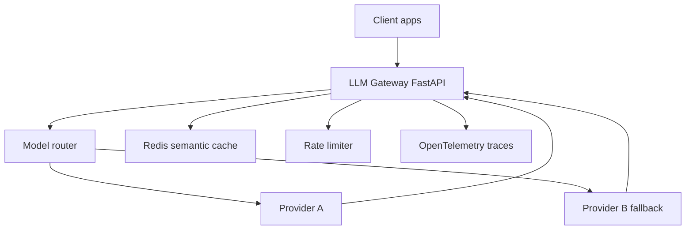

# Module 03 — PROJECT: LLM Gateway

> **Agent spawn**: `@Memory.md` + this file + `@modules/03-project-llm-gateway/NOTES.md`  
> **Nav**: ← [Module 02](../02-llm-infra/MODULE.md) · Next → [Module 04](../04-prompt-engineering/MODULE.md)

## At a glance

| | |
|---|---|
| Prerequisites | Modules 01–02 · `@Projects.md` |
| Duration | ~2–3 weeks |
| Project? | Yes |
| Exit test | Gateway milestones M1–M7 · `@Projects.md` |

## Visual map

> **Kaise padho**: Pehle diagram dekho → topics padho → session end pe "Redraw challenge" bina dekhe draw karo



```
Clients
   │
   ▼
┌─────────────────────────────────┐
│  LLM Gateway (FastAPI)          │
│  router │ cache │ rate limit    │
│  fallback chain │ OTEL export   │
└──────────┬──────────────────────┘
           ▼
    Provider A → (fail) → Provider B
```

### Mental model (1 line)

Gateway ek front door hai — route, cache, fallback, aur OTEL sab yahi pe centralize hote hain.

### Redraw challenge

Full gateway architecture: router, cache, fallback chain, OTEL — sab boxes ke saath draw karo.

## Read order

1. Objectives → 2. Feature matrix → 3. Learning hooks → 4. Milestones → 5. Interview prep

**Prerequisites**: Modules 01–02  
**Duration**: ~2–3 weeks implementation  
**Reference**: `@Projects.md` Project 1

## Objectives

Ship production-grade LLM proxy — **CV-defendable**.

## Feature matrix

| Feature | Why interviewers care |
|---------|----------------------|
| Complexity-based routing (Haiku/Sonnet/Opus) | Cost vs quality trade-off |
| Semantic cache (Redis) | Latency + cost reduction |
| Rate limit + token budgets | Multi-tenant SaaS readiness |
| Circuit breaker + fallback | Reliability |
| Cost tracking per request | FinOps / YC survival |
| SSE streaming | UX |
| OpenTelemetry / Langfuse | Debug production agents |

## Learning hooks

Pure distributed systems — tumhara comfort zone:

- Router = matching engine price tiers
- Cache = order book hot path
- Breaker = exchange connectivity monitor
- Metrics = crypto exchange Prometheus setup

## Milestones

| M | Deliverable | Pass |
|---|-------------|------|
| M1 | FastAPI skeleton + health + single provider passthrough | curl works |
| M2 | Dual provider + fallback on 5xx | Primary fail → secondary OK |
| M3 | Complexity classifier → model pick | 3 buckets route correctly on test set |
| M4 | Redis semantic cache | Similar prompt → cache hit |
| M5 | Rate limit + budget middleware | Over-budget → 402/429 |
| M6 | OTEL traces + cost field in span | Trace visible in Langfuse/Jaeger |
| M7 | SSE streaming end-to-end | Token stream in browser/curl |

## Interview prep

- "40% cost cut" claim kaise measure kiya? — A/B, cache hit rate, model mix
- p99 latency ka breakdown — cache vs LLM vs network
- Cache invalidation strategy

## Progress checklist

- [ ] Objectives recall bina notes ke
- [ ] Milestones M1–M7 pass
- [ ] NOTES.md session log updated

## NOTES.md

Track architecture decisions, benchmark numbers, failures.
