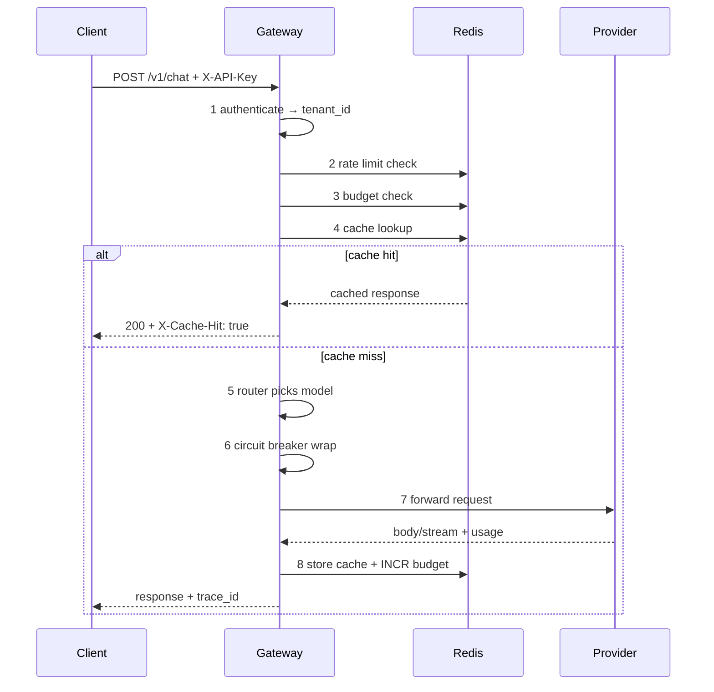
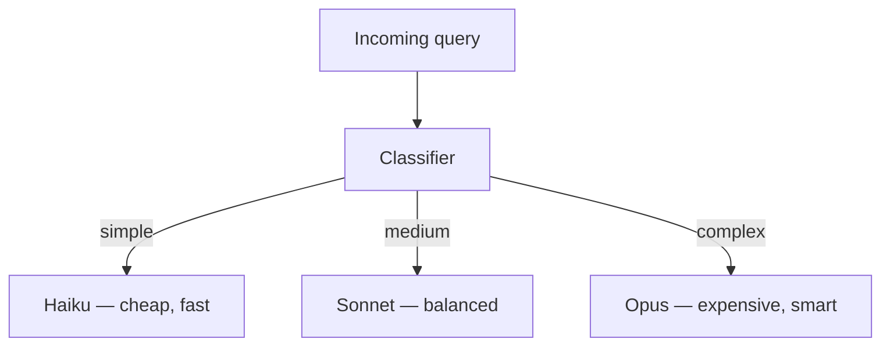
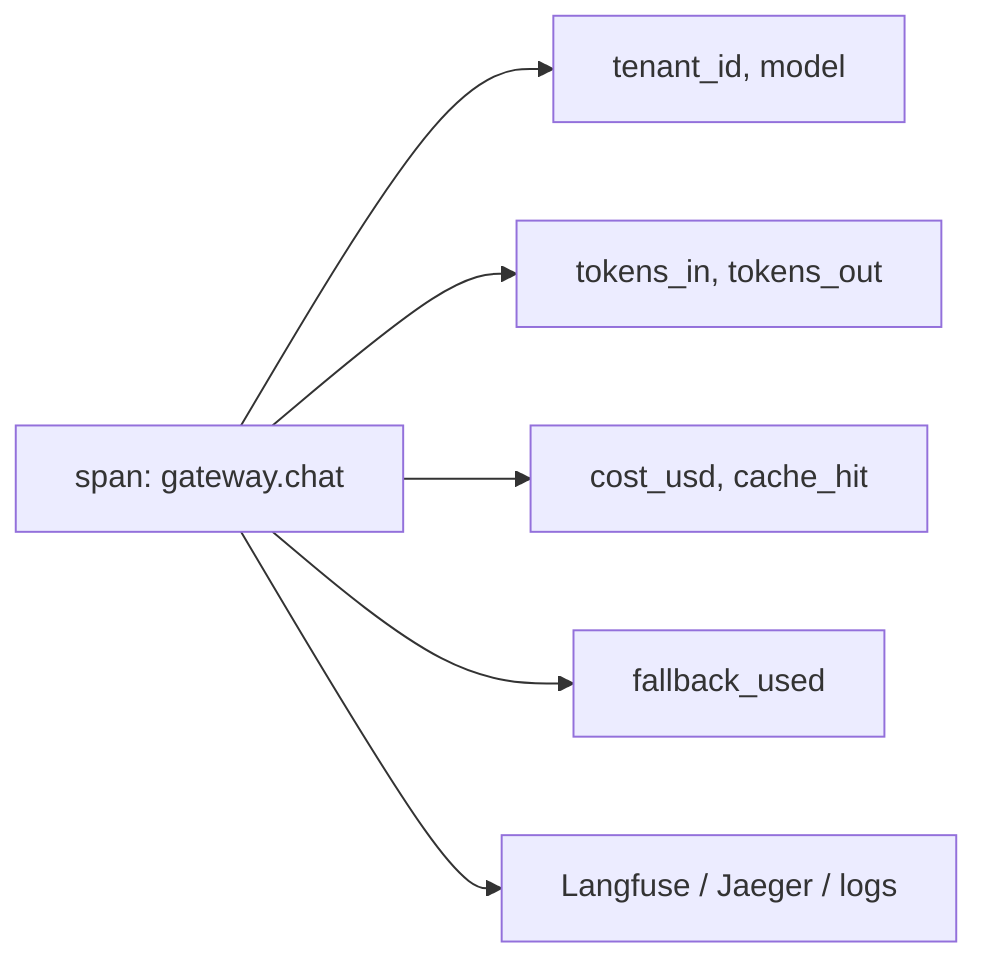

# Module 03 — LLM Gateway (concepts → Project C)

> **Padho**: Isi file mein **Theory** — bahar mat jao.  
> **Likho**: `practice/` folder. **Pucho**: Cursor chat `@MODULE.md`  
> **Nav**: ← [Module 02](../02-llm-infra/MODULE.md) · Next → [Module 04](../04-prompt-engineering/MODULE.md)

> **Format**: Textbook — **§0 terms pehle** (gateway, BFF, router). Architecture baad mein. Standard: `@MODULE-TEACHING-STANDARD.md`

> **Ship spec**: `@Projects.md` **Project C** (Go). Yeh module patterns sikhata hai; production ship Go mein, portfolio order ke hisaab se.

> **Kaun ke liye:** Modules 01–02 complete. 00e Go platform intro helpful.

## At a glance

| | |
|---|---|
| Prerequisites | Modules 01–02 · `@Projects.md` · 00a Redis · 00e Go (Phase 2 ship) |
| Duration | ~2–3 weeks (7 milestones) |
| Project? | Yes — learning sandbox Python; ship Project C Go |
| Exit test | Gateway architecture + "40% cost cut" defend bina notes ke |

## Visual map (simple — detail §0 ke baad)

```
Clients (web, mobile, internal services)
   │
   ▼
┌─────────────────────────────────┐
│  LLM GATEWAY (single front door)│
│  auth │ rate limit │ cache      │
│  router │ budget │ breaker │ OTEL│
└──────────┬──────────────────────┘
           ▼
    Provider A → (fail) → Provider B
```

**Mental model**: Gateway = **bank branch counter** — client ko ek address; andar routing, limits, audit, billing sab yahi. Provider keys client ke paas nahi.

**Redraw challenge**: Full gateway — router, cache, budgets, fallback chain, OTEL — sab boxes ke saath draw karo.

---

## Read order (strict — session table)

| Session | Padho | Karo |
|---------|-------|------|
| 1 | §0 Terms (gateway, BFF, router, tenant) | Read `@Projects.md` Project C overview |
| 2 | §1 Thesis + §2 Request lifecycle | **M1** gateway skeleton |
| 3 | §3 Model router | **M3** complexity router |
| 4 | §4 Cache + §5 Budgets | **M4**, **M5** |
| 5 | §6 Fallback + §2 recap | **M2** fallback router |
| 6 | §7 Tracing | **M6** tracing stub |
| 7 | §8 Milestones + SSE | **M7** stream passthrough + interview NOTES |

---

## Learning hooks (fintech parallels)

| Feature | Tera parallel |
|---------|---------------|
| LLM Gateway | Central **OMS** — orders ek pipe se |
| BFF (Backend-for-Frontend) | Mobile-specific API aggregation layer |
| Complexity router | Matching engine **price tiers** — simple vs complex instruments |
| Semantic cache | Hot path **order book** quote cache |
| Circuit breaker | Exchange connectivity monitor |
| Per-tenant budget | Account **credit limit** / margin |
| Token metering | Per-fill **commission** aggregation → invoice |
| OTEL spans | Trade lifecycle trace — order → fill → settlement |
| Outbox billing events | Usage event → Stripe (Projects.md spine) |

---

## Theory

### §0. Terms pehli baar — gateway vocabulary (40 min)

Modules 01–02 ne **provider call** aur **infra patterns** sikhaye. Ab un patterns ko **ek product** mein bundle karte hain — pehle words.

#### 0.1 Gateway — single front door

**Gateway** (yahan **LLM Gateway**) = ek HTTP service jisko saari client apps call karti hain; andar se yeh OpenAI, Anthropic, etc. ko forward karti hai.

| Term | Matlab |
|------|--------|
| **Front door** | Public URL + API keys — clients isi se baat karte hain |
| **Passthrough** | Request mostly as-is provider ko — learning M1 |
| **Multi-provider** | Ek gateway, multiple backends |
| **Tenant** | Customer org — `org_42`, billing isolate |

**Fintech analogy:** Tumhara app directly **NYSE** ko nahi bhejta — **broker gateway** se. Wahi role LLM gateway ki.

#### 0.2 BFF — Backend-for-Frontend (related idea)

**BFF** = client-type specific API layer — mobile ke liye alag shape, web ke liye alag.

| | Monolith API | BFF | LLM Gateway |
|---|--------------|-----|-------------|
| Purpose | General CRUD | UI-tailored aggregation | **AI calls** centralize |
| Example | `/users` | `/mobile/home-feed` | `/v1/chat` |

Project C gateway **BFF-like** hai AI domain ke liye — lekin focus: routing, cache, cost, not HTML shaping.

#### 0.3 Router — kaunsa model / provider

**Router** = decision engine: incoming query dekh ke **model tier** + **provider** pick karo.

```
Simple FAQ   → Haiku  (cheap)
Summarize    → Sonnet (balanced)
200-line code → Opus   (expensive)
```

**Fintech analogy:** Matching engine — small retail order **internalize**, large block **route to dark pool**. Complexity ke hisaab se venue/tier.

#### 0.4 Metering & budget terms

| Term | Matlab |
|------|--------|
| **Metering** | Har request pe tokens count → accumulate |
| **Soft budget** | Warning header — abhi allow |
| **Hard budget** | Stop — 402/429 |
| **402 Payment Required** | Quota khatam — SaaS common pattern |

#### 0.5 Security terms

| Term | Matlab |
|------|--------|
| **API key (tenant)** | Gateway issue karta hai — provider key nahi |
| **Key rotation** | Periodic new key — leak damage kam |
| **Per-tenant cache scope** | Tenant A ka cache B ko kabhi na mile |

#### 0.6 §0 checkpoint (NOTES)

1. Gateway vs direct provider call — client perspective se 2 faiday?
2. Router "matching engine tiers" se parallel kaise hai?
3. BFF aur LLM gateway same cheez hain?

**Common errors (concept):**

| Confusion | Sahi |
|-----------|------|
| "Gateway = just proxy" | Proxy + cache + limits + billing + observability |
| "One global cache" | Tenant-scoped mandatory |
| "Router = load balancer only" | Model **quality/cost** routing bhi |

---

### §1. Gateway kya hai — Project C thesis

#### Problem kya hai?

Dev teams alag-alag OpenAI keys, alag retry, alag cost tracking — **FinOps blind**, security risk. Product thesis: **LLM Gateway as a Service**.

```
Product value:
  Step 1 → One API key per team (gateway-issued)
  Step 2 → Automatic cost savings (router + cache)
  Step 3 → Usage dashboard + Stripe billing
  Step 4 → Observability — trace_id, cost per request
```

**Phases:**

| Phase | Stack | Goal |
|-------|-------|------|
| Learning (yeh module) | Python FastAPI sandbox | Patterns wire karo M1–M7 |
| Ship (Project C) | Go platform (00e) | Multi-tenant SaaS |

**Fintech analogy:** Product = **prime brokerage API** — clients trade through you; you manage venue relationships, limits, statements.

#### Who calls whom

```
❌ Mobile app ──sk-openai──► OpenAI  (key in app = leak)
✅ Mobile app ──gw_key──► LLM Gateway ──provider_key──► OpenAI
                              │
                              ├── Redis (cache, limits, budget)
                              └── OTEL / billing outbox
```

> **→ Practice M1** (pass: health + single provider passthrough curl)

---

### §2. Architecture layers — request lifecycle

#### Problem kya hai?

Bina ordered pipeline ke middleware random order mein chalega — budget check cache ke baad? Auth missing? **Lifecycle define karo** pehle.

#### Full sequence diagram (detail — §0 ke baad)



#### Step flow (numbered — interview whiteboard)

```
1 → Authenticate API key → resolve tenant_id
2 → Rate limit (Redis) — over → 429
3 → Budget check — hard over → 402
4 → Cache lookup (exact then semantic)
   4a → HIT → return + X-Cache-Hit: true, skip 5–7
5 → Router → model + provider
6 → Circuit breaker — OPEN → fallback path (§6)
7 → Call provider (SSE passthrough if stream)
8 → Parse usage → cost_usd
9 → Update Redis budget + cache store
10 → Emit OTEL span + structured log
11 → Return response + trace_id header
```

#### Response headers (client contract)

| Header | Matlab |
|--------|--------|
| `X-Trace-Id` | Support/debug correlation |
| `X-Cache-Hit` | `true` / `false` |
| `X-Model-Used` | Actual model after routing |
| `X-Budget-Warning` | Soft limit approaching |

**Common errors:**

| Symptom | Kyun | Fix |
|---------|------|-----|
| Budget never enforced | Check after provider call | Budget **before** step 7 |
| Cache cross-tenant | Key missing tenant_id | `cache:{tenant_id}:...` |
| Auth bypass on /health | Public route too wide | Only `/health` public |

> **→ Practice M1, M7** (skeleton + SSE E2E)

---

### §3. Model router — complexity-based routing

#### Problem kya hai?

Har query Opus pe bhejoge → **margin zero**. Har query Haiku pe → complex code fail. **Automatic tier pick** chahiye.



#### Complexity buckets

| Bucket | Signals | Example query |
|--------|---------|---------------|
| Simple | Short, FAQ, classify | "What are your hours?" |
| Medium | Summarize, multi-step | "Summarize this email" |
| Complex | Code, reasoning, long ctx | "Debug this 200-line function" |

#### Classifier options

| Method | Pros | Cons |
|--------|------|------|
| Rules (`len`, keywords) | Free, fast | Brittle |
| Small LLM call | Flexible | Extra cost/latency |
| Embedding vs exemplars | Tunable | Setup needed |

**Starter rule (M3):**

```python
def classify(query: str) -> str:
    if len(query) < 50:
        return "simple"      # → haiku tier
    if "```" in query or len(query) > 500:
        return "complex"     # → opus tier
    return "medium"          # → sonnet tier
```

| Line | Matlab |
|------|--------|
| `len(query) < 50` | Short → likely FAQ |
| `"```" in query` | Code block marker → complex |
| `len(query) > 500` | Long context → heavier model |
| return strings | Map to provider model IDs in config |

**Fintech analogy:** Retail **market order** internalized; large **block trade** smart router sends to specialized desk.

#### "40% cost cut" defend (interview)

```
Measure before/after:
  - Average cost per request = avg(cost_usd)
  - Cache hit rate ↑ → fewer provider calls
  - Model mix shift → more haiku, less opus
  - A/B same query set — quality score vs cost

Claim math example:
  Before: 100% sonnet-equivalent
  After:  50% haiku, 35% sonnet, 15% opus + 25% cache hit
  → blended cost drop ~35–45% (measure on YOUR traffic)
```

> **→ Practice M3** (pass: test set routes to 3 buckets correctly)

---

### §4. Cache — exact + semantic, tenant-scoped

#### Problem kya hai?

Gateway pe traffic repeat hoti hai — "password reset steps?" hazaron baar. Bina cache **provider bill** aur **latency** dono badhe.

#### Key strategies (line-by-line)

```
Exact cache key:
  cache_key = f"{tenant_id}:exact:{sha256(prompt)}:{model}"

Semantic cache:
  store: { tenant_id, embedding_vector, response, ttl }
  lookup: nearest neighbor where cosine_sim > 0.92
```

| Piece | Matlab |
|-------|--------|
| `tenant_id` prefix | **Mandatory** — no cross-tenant bleed |
| `sha256(prompt)` | Exact match fingerprint |
| `model` in key | Same words, different model → different answer |
| `embedding_vector` | Semantic lookup index |
| `0.92` threshold | Conservative — Module 02 §3 |

#### Invalidation rules

```
Rule 1 → TTL default (e.g. 24h FAQ, 1h policy)
Rule 2 → Prompt version bump → bust prefix `tenant:v2:*`
Rule 3 → Never cache tool side effects (payments, writes)
Rule 4 → Admin endpoint to purge tenant cache
```

**Fintech analogy:** Quote cache **per client tier** — institutional quote retail ko nahi dikhta.

**Common errors:**

| Symptom | Kyun | Fix |
|---------|------|-----|
| Stale policy answer | TTL too long | Shorter TTL on compliance content |
| Cache miss always | Model in key changes every route | Stabilize routed model in key |
| Security incident | Shared global semantic index | Partition by tenant_id |

> **→ Practice M4** (pass: near-duplicate prompt → cache hit, LLM skipped)

---

### §5. Rate limits + token budgets

#### Problem kya hai?

Ek tenant loop / bug → **unlimited tokens** → tumhara provider bill + doosre tenants slow. **Credit limit** jaisa hard stop chahiye.

#### Controls table

| Control | Type | HTTP response |
|---------|------|---------------|
| Requests/min | Rate limit | 429 Too Many Requests |
| Tokens/day soft | Budget warn | 200 + `X-Budget-Warning: 90%` |
| Tokens/day hard | Budget stop | 402 Payment Required |

#### Redis budget pattern

```python
key_used = f"budget:{tenant_id}:tokens_used"
key_limit = f"budget:{tenant_id}:limit"

used = redis.incrby(key_used, completion_tokens)
limit = int(redis.get(key_limit) or DEFAULT_LIMIT)

if used > limit:
    raise HTTPException(402, "Token budget exceeded")
elif used > limit * 0.9:
    response.headers["X-Budget-Warning"] = "90%"
```

| Line | Matlab |
|------|--------|
| `incrby(..., completion_tokens)` | After successful call, add billable output |
| `402` | Hard stop — SaaS "upgrade plan" |
| `0.9` soft warn | Ops alert before hard stop |

#### Billing spine (Projects.md)

```
LLM response
  → cost event { tenant_id, tokens, cost_usd, idempotency_key }
  → outbox table
  → worker → Stripe metered billing
```

**Fintech analogy:** Real-time **margin check** before order accept; post-trade **position update**.

**Common errors:**

| Symptom | Kyun | Fix |
|---------|------|-----|
| Budget drift | Failed calls still increment | Only increment on 200 + usage |
| Midnight reset wrong | UTC vs local | Document timezone; cron UTC |
| 402 on free tier | limit=0 | Seed limits on tenant create |

> **→ Practice M5** (pass: over-budget → 402 or 429 hard stop)

---

### §6. Fallback chain + circuit breaker

#### Problem kya hai?

Primary provider outage = product down + revenue loss. Module 02 patterns yahan **wire** hote hain.

```
Step 1 → Primary call wrapped in circuit breaker
Step 2 → 5xx or timeout → increment breaker
Step 3 → Breaker OPEN OR primary 503 → secondary provider
Step 4 → Log span attribute fallback_used=true
Step 5 → Both fail → 503 + Retry-After + no fake success
```

#### Decision table

| Primary result | Action |
|----------------|--------|
| 200 OK | Return; breaker success |
| 503 / timeout | Retry secondary; log fallback |
| Breaker OPEN | Skip primary; secondary immediately |
| 400 bad prompt | **No fallback** — return 400 to client |

```python
# Pseudocode shape
try:
    return call_primary_with_breaker(req)
except (ProviderError, CircuitOpen):
    return call_secondary(req)  # different model OK if disclosed
```

**Cost attribution:** Fallback model alag rate — `cost_usd` recalc with secondary model pricing.

> **→ Practice M2** (pass: simulate primary 5xx → secondary succeeds)

---

### §7. Tracing — OpenTelemetry + cost in span

#### Problem kya hai?

"p99 2.8s" — kahan gaya time? Interview mein **breakdown defend** karna hai.



#### Span attributes (line-by-line)

```json
{
  "name": "gateway.chat",
  "attributes": {
    "tenant_id": "org_42",
    "model": "claude-3-haiku",
    "tokens_in": 120,
    "tokens_out": 45,
    "cost_usd": 0.00012,
    "cache_hit": true,
    "latency_ms": 8,
    "fallback_used": false
  }
}
```

| Attribute | Defend question |
|-----------|-----------------|
| `cache_hit` | "Spike?" → hit rate dropped |
| `model` | "Cost up?" → more opus routing |
| `latency_ms` | p99 = mostly LLM when miss |
| `fallback_used` | Reliability vs quality tradeoff |

#### Latency budget (typical)

| Path | p99-ish |
|------|---------|
| Cache hit | ~5–20 ms |
| Haiku miss | ~400–900 ms |
| Opus miss | ~2–5 s |
| + Redis/network | ~5–50 ms |

**Interview line:** "Latency spike = cache miss rate up **OR** complexity router sending more to opus tier."

> **→ Practice M6** (pass: local trace/log shows cost fields)

---

### §8. Feature matrix → milestones map

#### Problem kya hai?

Project C bada hai — **incremental ship** bina overwhelm ke. Har milestone ek skill prove karta hai.

| Feature | Milestone | Theory § |
|---------|-----------|----------|
| Passthrough + `/health` | M1 | §1, §2 |
| Dual provider fallback | M2 | §6 |
| Complexity classifier | M3 | §3 |
| Redis semantic cache | M4 | §4 |
| Rate limit + budget | M5 | §5 |
| OTEL + cost span | M6 | §7 |
| SSE streaming E2E | M7 | §2 step 7 |

#### Milestone dependency graph

```
M1 (skeleton)
  → M2 (fallback)
  → M3 (router) ──→ M4 (cache)
  → M5 (budget) ──→ M6 (tracing)
  → M7 (streaming) — needs M1 base
```

**Go ship note:** Python sandbox proves logic; Project C same pipeline **chi router + middleware** (00e) mein.

> **→ Practice M1–M7** — ek milestone per session ideal

---

## Practice

> **Saare assignments ek jagah**: [`practice/README.md`](practice/README.md) — **§0 se start**.  
> Learning sandbox Python; ship `@Projects.md` Project C (Go) alag.  
> Stuck? Chat: `@modules/03-project-llm-gateway/MODULE.md @Projects.md`

| # | Theory § | File | Kya karna hai | Pass when |
|---|----------|------|---------------|-----------|
| M1 | §1, §2 | `practice/gateway_skeleton.py` | Health + passthrough | curl works |
| M2 | §6 | `practice/fallback_router.py` | Primary fail → secondary | 5xx sim → secondary OK |
| M3 | §3 | `practice/complexity_router.py` | 3-bucket classifier | test set routes OK |
| M4 | §4 | `practice/semantic_cache.py` | Similar prompt → hit | LLM skip on near-dup |
| M5 | §5 | `practice/budget_middleware.py` | Over-budget stop | 402/429 hard stop |
| M6 | §7 | `practice/tracing_stub.py` | Span + cost fields | trace visible locally |
| M7 | §2 | `practice/stream_passthrough.py` | SSE end-to-end | `curl -N` token stream |

### Setup

```bash
cd modules/03-project-llm-gateway/practice
python3 -m venv .venv && source .venv/bin/activate
pip install fastapi uvicorn httpx redis python-dotenv openai
# 00a Redis + optional Postgres for outbox later
```

### Interview prep (NOTES — M3+ ke baad)

- "40% cost cut" — cache hit % + model mix before/after numbers
- Cache invalidation strategy (§4 rules)
- Per-tenant key rotation procedure
- Request lifecycle 11 steps whiteboard

---

## Active recall (khud jawab likho NOTES mein)

1. Gateway router matching engine price tiers se kaise parallel hai?
2. Per-tenant cache scoping kyun mandatory hai?
3. "40% cost cut" claim kaise measure aur defend karoge?
4. Request lifecycle mein budget check provider call se **pehle** kyun?

**Chat drill** (optional): "Module 03 architecture whiteboard karo — 11 steps"

---

## Progress checklist

- [ ] §0 terms padh liye — gateway vs BFF clear
- [ ] Theory §1–§8 padh liya
- [ ] Redraw challenge kiya
- [ ] Practice M1–M7 pass
- [ ] Active recall + interview bullets NOTES mein
- [ ] NOTES architecture decisions logged

---

## Optional appendix (zarurat ho tab)

- [`@Projects.md` Project C](../../Projects.md) — full ship spec
- [OpenTelemetry Python](https://opentelemetry.io/docs/languages/python/) — M6 stuck pe
- Module 02 — rate limit, breaker, cache deep dive
