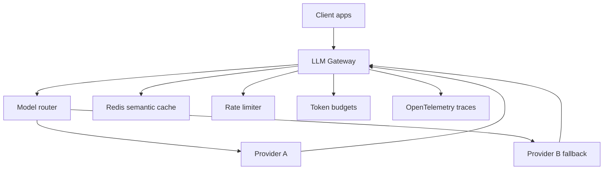
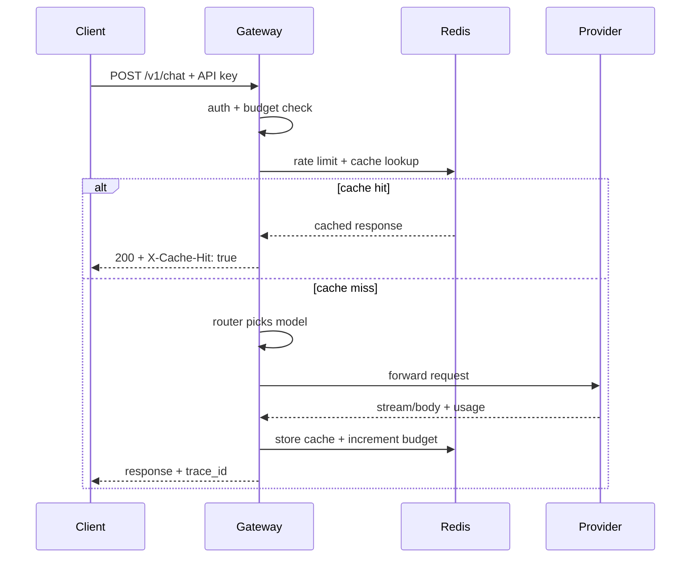
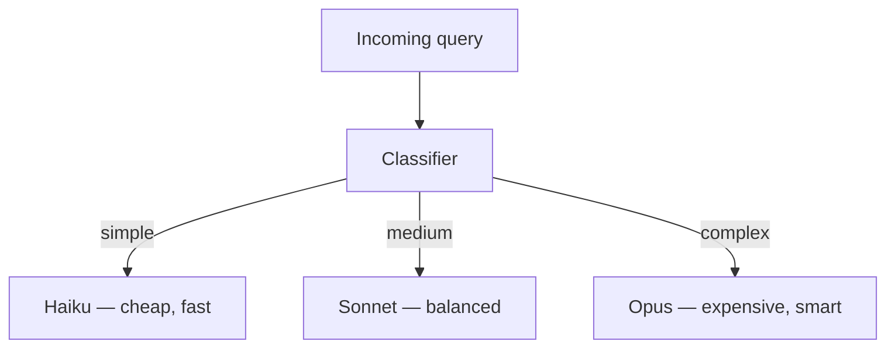
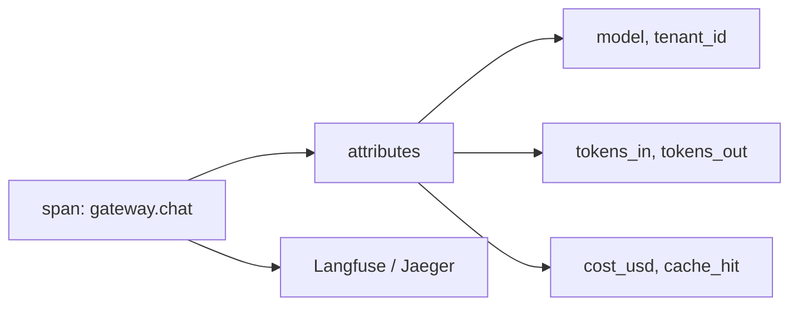

# Module 03 — LLM Gateway (concepts → Project C)

> **Padho**: Isi file mein **Theory** — bahar mat jao.  
> **Likho**: `practice/` folder. **Pucho**: Cursor chat `@MODULE.md`  
> **Nav**: ← [Module 02](../02-llm-infra/MODULE.md) · Next → [Module 04](../04-prompt-engineering/MODULE.md)

> **Ship spec**: `@Projects.md` **Project C** (Go). Yeh module patterns sikhata hai; production ship Go mein, portfolio order ke hisaab se.

## At a glance

| | |
|---|---|
| Prerequisites | Modules 01–02 · `@Projects.md` |
| Duration | ~2–3 weeks |
| Project? | Yes |
| Exit test | Gateway architecture + "40% cost cut" defend bina notes ke |

## Visual map



```
Clients
   │
   ▼
┌─────────────────────────────────┐
│  LLM Gateway                    │
│  router │ cache │ rate limit    │
│  budgets │ fallback │ OTEL     │
└──────────┬──────────────────────┘
           ▼
    Provider A → (fail) → Provider B
```

**Mental model**: Gateway ek front door hai — route, cache, fallback, budgets, aur OTEL sab yahi pe centralize hote hain.

**Redraw challenge**: Full gateway: router, cache, budgets, fallback chain, OTEL — sab boxes ke saath draw karo.

---

## Read order

1. Visual map → 2. **Theory** (neeche) → 3. **Practice** → 4. Chat agar doubt → 5. NOTES

---

## Learning hooks

| Feature | Tera parallel |
|---------|---------------|
| Complexity router | Matching engine price tiers |
| Semantic cache | Order book hot path |
| Circuit breaker | Exchange connectivity monitor |
| Per-tenant budget | Account trading limits |
| OTEL spans | Prometheus `/metrics` |

---

## Theory

### 1. Gateway kya hai — Project C thesis

`@Projects.md` Project C: **LLM Gateway as a Service** — dev teams ek endpoint se OpenAI + Anthropic use karein, routing/cache/cost/observability tum handle karo.

```
Product value:
  - One API key for team (per-tenant keys rotate)
  - Automatic cost savings (routing + cache)
  - Usage dashboard + Stripe billing
```

Phase 1 (learning): single-user FastAPI/Go proxy.  
Phase 2 (SaaS): multi-tenancy + metering + Stripe — same codebase extend.

---

### 2. Architecture layers — request lifecycle



```
1. Authenticate API key → tenant_id
2. Rate limit (Redis)
3. Budget check — over limit → 402/429
4. Cache lookup (exact or semantic)
5. Router → model + provider
6. Circuit breaker wrap
7. Call provider (SSE passthrough)
8. Log cost + OTEL span
9. Update tenant usage meter
```

---

### 3. Model router — complexity-based routing

Project C spec: **Haiku → Sonnet → Opus** by query complexity.



| Bucket | Signals | Example |
|--------|---------|---------|
| Simple | short, FAQ, classify | "What is your hours?" |
| Medium | summarize, multi-step | "Summarize this email" |
| Complex | code, reasoning, long context | "Debug this 200-line function" |

**Classifier options:** rules (token count), small LLM call, embedding distance to exemplars.

**Interview defend:** A/B test — same queries, compare quality score vs cost. "40% cut" = model mix shift + cache hit rate.

---

### 4. Cache — exact + semantic, tenant-scoped

```
cache_key = tenant_id + hash(prompt) + model     # exact
semantic_key = tenant_id + embedding_vector      # similarity search in Redis/vector
```

**Per-tenant scoping:** Tenant A ka cache Tenant B ko kabhi na mile — security + billing accuracy.

**Invalidation:** TTL default; prompt version change → bust cache prefix; no cache for tool side effects.

---

### 5. Rate limits + token budgets

| Control | Type | Response |
|---------|------|----------|
| Requests/min | rate limit | 429 |
| Tokens/day soft | budget warn | header `X-Budget-Warning` |
| Tokens/day hard | budget stop | 402 Payment Required |

```
Redis:
  budget:{tenant_id}:tokens_used → INCRBY completion_tokens
  compare to budget:{tenant_id}:limit
```

**Spine link:** usage events exactly-once → Stripe metered billing (Projects.md shared platform layer).

---

### 6. Fallback chain + circuit breaker

Module 02 recap — gateway mein wire:

```
Primary provider 5xx OR breaker OPEN
  → secondary provider (maybe different model tier)
  → if both fail: 503 + retry-after
```

Log `fallback_used: true` in span — cost attribution alag model pe.

---

### 7. Tracing — OpenTelemetry + cost in span



**p99 breakdown defend:**
- cache hit: ~5ms
- LLM call: 800ms–3s
- network: 50ms

Interview: "Latency spike = cache miss rate up OR Opus routing up."

---

### 8. Feature matrix → milestones map

| Feature | Milestone |
|---------|-----------|
| Passthrough + health | M1 |
| Dual provider fallback | M2 |
| Complexity classifier | M3 |
| Redis semantic cache | M4 |
| Rate limit + budget | M5 |
| OTEL + cost span | M6 |
| SSE streaming E2E | M7 |

---

## Practice

> **Saare assignments ek jagah**: [`practice/README.md`](practice/README.md) — problem statements, instructions, pass criteria.  
> Code **tum** likhoge Cursor mein. Stubs `practice/` mein hain (`TODO` search) — learning sandbox; ship `@Projects.md` Project C (Go) alag repo mein.  
> Stuck? Chat: `@modules/03-project-llm-gateway/MODULE.md @Projects.md`

| # | File | Kya karna hai | Pass when |
|---|------|---------------|-----------|
| M1 | `practice/gateway_skeleton.py` | Health + single provider passthrough | curl works |
| M2 | `practice/fallback_router.py` | Primary fail → secondary | 5xx simulated → secondary OK |
| M3 | `practice/complexity_router.py` | 3-bucket classifier | test set routes correctly |
| M4 | `practice/semantic_cache.py` | Similar prompt → cache hit | skip LLM on near-duplicate |
| M5 | `practice/budget_middleware.py` | Over-budget → 402/429 | hard stop works |
| M6 | `practice/tracing_stub.py` | Span with cost fields | trace visible locally |
| M7 | `practice/stream_passthrough.py` | SSE end-to-end | token stream in curl -N |

### M3 hints

- Start with rule-based: `len(query) < 50` → haiku bucket

### Interview prep (NOTES mein likho)

- "40% cost cut" — cache hit % + model mix before/after
- Cache invalidation strategy
- Per-tenant key rotation

---

## Active recall (khud jawab likho NOTES mein)

1. Gateway router matching engine price tiers se kaise parallel hai?
2. Per-tenant cache scoping kyun mandatory hai?
3. "40% cost cut" claim kaise measure aur defend karoge?

**Chat drill** (optional): "Module 03 architecture whiteboard karo"

---

## Progress checklist

- [ ] Theory Section 1–8 padh liya
- [ ] Redraw challenge kiya
- [ ] Practice M1–M7 pass
- [ ] Active recall NOTES mein likha
- [ ] NOTES architecture decisions logged

---

## Optional appendix (zarurat ho tab)

- [`@Projects.md` Project C](../../Projects.md) — full ship spec
- [OpenTelemetry Python](https://opentelemetry.io/docs/languages/python/) — SDK setup only if stuck on M6
