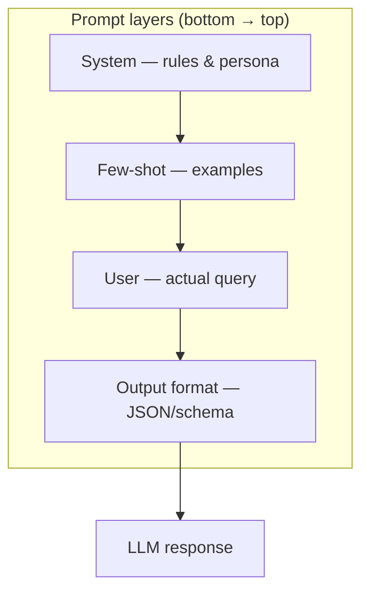

# Module 04 — Prompt Engineering

> **Agent spawn**: `@Memory.md` + this file + `@modules/04-prompt-engineering/NOTES.md`  
> **Nav**: ← [Module 03](../03-project-llm-gateway/MODULE.md) · Next → [Module 05](../05-rag-pgvector/MODULE.md)

## At a glance

| | |
|---|---|
| Prerequisites | Module 03 (gateway experience helps) |
| Duration | ~3–4 sessions |
| Project? | No |
| Exit test | Injection-resistant prompt + few-shot trade-offs bina notes ke |

## Visual map

> **Kaise padho**: Pehle diagram dekho → topics padho → session end pe "Redraw challenge" bina dekhe draw karo



```
┌─────────────────────────┐
│ Output format (top)     │  ← "return JSON with keys…"
├─────────────────────────┤
│ User message            │  ← actual question
├─────────────────────────┤
│ Few-shot examples       │  ← input→output pairs
├─────────────────────────┤
│ System prompt (base)    │  ← rules, persona, guardrails
└─────────────────────────┘
         ↓
       LLM
```

### Mental model (1 line)

Prompt ek stack hai — system base pe, examples beech mein, user query upar, output format sabse upar seal karta hai.

### Redraw challenge

System → few-shot → user → output format ki layered stack bina dekhe draw karo.

## Read order

1. Objectives → 2. Learning hooks → 3. Topics → 4. Assignments → 5. Coach se active recall

**Prerequisites**: Module 03 (gateway experience helps)  
**Duration**: ~3–4 sessions

## Objectives

1. Reliable prompts design — not magic strings
2. Structured output via prompts + schema
3. Prompt injection awareness

## Learning hooks

| Concept | Parallel |
|---------|----------|
| System prompt | Business rules / refund policy text |
| Few-shot examples | Golden test cases in recon |
| Output format enforcement | Zod response validation |
| Prompt versioning | API schema migrations |

## Topics

- Clarity, specificity, delimiters
- Few-shot vs zero-shot cost/quality
- Chain-of-thought: when helps, when hurts
- JSON mode / structured outputs intro
- Jailbreak & injection mitigations
- Prompt regression testing mindset

## Assignments

| # | Task | Passing criteria |
|---|------|------------------|
| A1 | Fix broken summarizer prompt | Stable bullet output 10/10 runs |
| A2 | Add few-shot for classification | Accuracy > baseline on 20 examples |
| A3 | Injection-resistant support bot prompt | 5 attack strings fail safely |

## Active recall

1. Few-shot examples token cost kaise control karoge?
2. CoT production mein kab band karna chahiye?
3. System vs developer message (Anthropic) difference?

## Progress checklist

- [ ] Objectives recall bina notes ke
- [ ] Assignments A1–A3 pass
- [ ] NOTES.md session log updated
