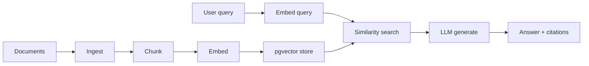
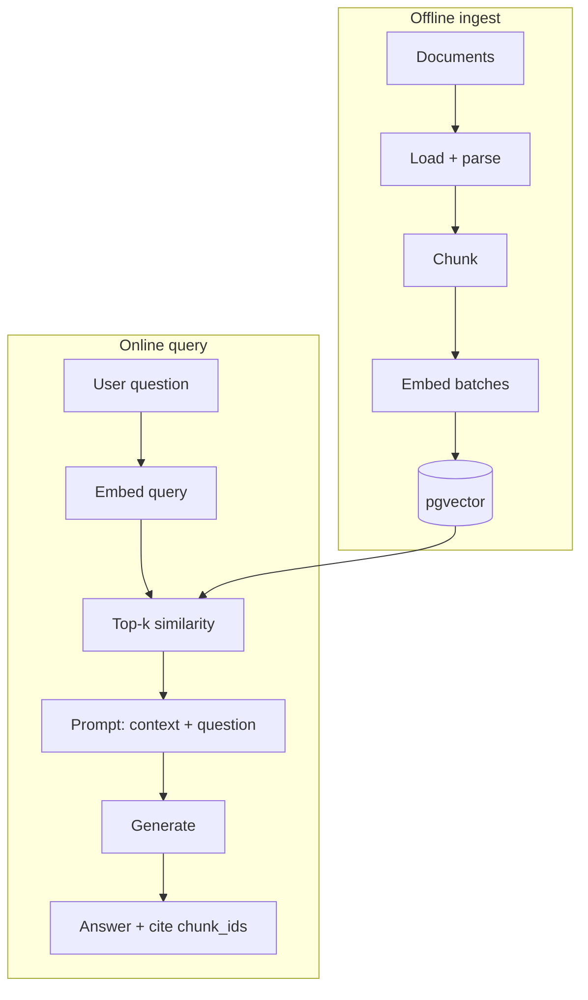
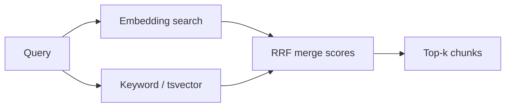

# Module 05 — RAG + pgvector

> **Padho**: Isi file mein **Theory** — bahar mat jao.  
> **Likho**: `practice/` folder. **Pucho**: Cursor chat `@MODULE.md`  
> **Ship**: **Python** `services/rag/` — Go platform phase 2 pe proxy karega (`@Projects.md` Project A).  
> **Nav**: ← [Module 04](../04-prompt-engineering/MODULE.md) · Next → [Module 06](../06-tools-function-calling/MODULE.md)

## At a glance

| | |
|---|---|
| Prerequisites | Module 04 |
| Duration | ~5–7 sessions |
| Project? | No |
| Exit test | Chunk/retrieve pipeline + 3 RAG failure modes bina notes ke |

## Visual map



```
docs → ingest → chunk → embed → [pgvector]
                                      ↑
query → embed query → retrieve top-k ─┘
                              ↓
                    context + prompt → LLM → answer
```

**Mental model**: RAG = pehle relevant chunks dhoondo (retrieve), phir unke saath LLM se jawab banao (generate).

**Redraw challenge**: Ingest → chunk → embed → store → retrieve → generate pipeline end-to-end bina dekhe draw karo.

---

## Read order

1. Visual map → 2. **Theory** (neeche) → 3. **Practice** → 4. Chat agar doubt → 5. NOTES

---

## Learning hooks

| Concept | Parallel |
|---------|----------|
| Chunking | CSV chunked import (5MB limits) |
| Embeddings | Fingerprint / hash similarity |
| Top-k retrieval | 4-strategy cascade — cheapest first |
| Hybrid search | IBAN + invoice combo matching |
| Re-ingestion | Ledger correction replay |

---

## Theory

### 1. RAG kyun — LLM ko fresh/private knowledge do

LLM training cutoff + company docs model ke weights mein nahi.

```
Naive: stuff entire PDF in prompt → context overflow + $$$ 
RAG:   retrieve only relevant chunks → cheaper + grounded
```

---

### 2. Pipeline — ingest to answer



---

### 3. Chunking strategies

| Strategy | How | Trade-off |
|----------|-----|-----------|
| Fixed size | 500 chars, overlap 50 | simple, may cut mid-sentence |
| Recursive | split by `\n\n`, then `.`, then char | better structure |
| Semantic | embed sentences, merge while similar | expensive ingest |

```
Chunk too SMALL → context missing, wrong retrieval
Chunk too LARGE → noise, "lost in the middle"
```

*(Active recall Q1 + Q3: lost in the middle = relevant info buried in long context, model ignores middle)*

**Overlap kyun:** sentence boundary pe cut na ho — last 50 tokens previous chunk se repeat.

---

### 4. Embeddings + pgvector

```sql
CREATE EXTENSION vector;

CREATE TABLE chunks (
  id SERIAL PRIMARY KEY,
  doc_id TEXT NOT NULL,
  content TEXT NOT NULL,
  embedding vector(1536),  -- model-dependent dims
  metadata JSONB,
  created_at TIMESTAMPTZ DEFAULT NOW()
);

CREATE INDEX ON chunks USING hnsw (embedding vector_cosine_ops);
```

**Similarity query:**

```sql
SELECT id, content, 1 - (embedding <=> $query_embedding) AS score
FROM chunks
ORDER BY embedding <=> $query_embedding
LIMIT 5;
```

| Index | Pros | Cons |
|-------|------|------|
| IVFFlat | faster build | recall trade-off |
| HNSW | better recall | more memory |

*(Active recall Q2: model change → re-embed ALL chunks, new dimensions)*

---

### 5. Hybrid search — dense + keyword



**Kab hybrid:**
- Exact IDs: invoice #12345 — embedding alone weak
- Acronyms, SKUs, IBAN — keyword wins
- Semantic paraphrase — dense wins

**Tera hook:** Bank recon — IBAN exact + fuzzy name = hybrid.

```
final_score = α * dense_score + (1-α) * bm25_score
# or Reciprocal Rank Fusion (RRF)
```

---

### 6. Failure modes — RAG kab fail hota hai

| Failure | Example | Fix |
|---------|---------|-----|
| Retrieval miss | answer in chunk never retrieved | smaller chunks, hybrid, rerank |
| Wrong chunk | similar but wrong doc | metadata filters, reranker |
| Hallucination | model ignores context | cite-or-abstain prompt, faithfulness eval |
| Injection in doc | "ignore instructions" in PDF | sanitize, separate delimiters |
| Stale index | policy updated, old chunks | re-ingest pipeline, version tags |

**Assignment A4:** 3 real failure queries document karo + fix proposal.

---

## Practice

> **Saare assignments ek jagah**: [`practice/README.md`](practice/README.md) — problem statements, instructions, pass criteria.  
> Code **tum** likhoge Cursor mein. Stubs `practice/` mein hain (`TODO` search).  
> Stuck? Chat: `@modules/05-rag-pgvector/MODULE.md` + error paste karo.

| # | File | Kya karna hai | Pass when |
|---|------|---------------|-----------|
| A1 | `practice/chunker.py` | Document loader + chunker | Chunks with overlap |
| A2 | `practice/embed_store.py` | Embed + pgvector store | Similarity returns relevant chunk |
| A3 | `practice/rag_endpoint.py` | RAG answer stub | Answer cites source chunk IDs |
| A4 | `practice/FAILURE_CASES.md` | 3 failure queries + fixes | Coach/self review |

### A1 hints

- `RecursiveCharacterTextSplitter` concept — implement simple version yourself first

### A2 hints

- Postgres from 00a docker — `CREATE EXTENSION vector;`

---

## Active recall (khud jawab likho NOTES mein)

1. Chunk size bada vs chota — trade-offs?
2. Embedding model change pe kya migrate karna padta hai?
3. "Lost in the middle" kya hai?

**Chat drill** (optional): "Module 05 — 3 RAG failure modes explain karo"

---

## Progress checklist

- [ ] Theory Section 1–6 padh liya
- [ ] Redraw challenge kiya
- [ ] Practice A1–A4 pass
- [ ] Active recall NOTES mein likha
- [ ] NOTES session log updated

---

## Optional appendix (zarurat ho tab)

- [pgvector README](https://github.com/pgvector/pgvector) — index tuning
- [OpenAI Embeddings guide](https://platform.openai.com/docs/guides/embeddings) — model dimensions
