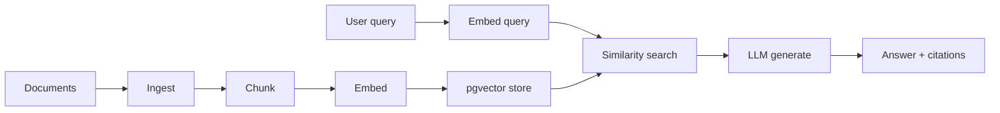

# Module 05 — RAG + pgvector

> **Agent spawn**: `@Memory.md` + this file + `@modules/05-rag-pgvector/NOTES.md`  
> **Nav**: ← [Module 04](../04-prompt-engineering/MODULE.md) · Next → [Module 06](../06-tools-function-calling/MODULE.md)

## At a glance

| | |
|---|---|
| Prerequisites | Module 04 |
| Duration | ~5–7 sessions |
| Project? | No |
| Exit test | Chunk/retrieve pipeline + 3 RAG failure modes bina notes ke |

## Visual map

> **Kaise padho**: Pehle diagram dekho → topics padho → session end pe "Redraw challenge" bina dekhe draw karo



```
docs → ingest → chunk → embed → [pgvector]
                                      ↑
query → embed query → retrieve top-k ─┘
                              ↓
                    context + prompt → LLM → answer
```

### Mental model (1 line)

RAG = pehle relevant chunks dhoondo (retrieve), phir unke saath LLM se jawab banao (generate).

### Redraw challenge

Ingest → chunk → embed → store → retrieve → generate pipeline end-to-end bina dekhe draw karo.

## Read order

1. Objectives → 2. Learning hooks → 3. Topics → 4. Assignments → 5. Coach se active recall

**Prerequisites**: Modules 04  
**Duration**: ~5–7 sessions

## Objectives

1. End-to-end RAG: ingest → embed → retrieve → generate
2. pgvector on Postgres — no Pinecone dependency for learning
3. Know when RAG fails

## Learning hooks

| Concept | Parallel |
|---------|----------|
| Chunking | CSV chunked import (5MB limits) |
| Embeddings | Fingerprint / hash similarity |
| Top-k retrieval | 4-strategy cascade — cheapest first |
| Hybrid search | IBAN + invoice combo matching |
| Re-ingestion | Ledger correction replay |

## Topics

- Embedding models (size, cost, multilingual)
- Chunking: fixed, recursive, semantic
- pgvector: IVFFlat/HNSW basics, indexes
- Metadata filters
- Reranking
- Evaluation: precision@k, faithfulness

## Assignments

| # | Task | Passing criteria |
|---|------|------------------|
| A1 | Document loader + chunker stub | Chunks with overlap |
| A2 | Embed + store in pgvector | Similarity query returns relevant chunk |
| A3 | RAG answer endpoint stub | Answer cites source chunk IDs |
| A4 | Failure case doc | 3 queries where RAG fails + fix proposal |

## Active recall

1. Chunk size bada vs chota — trade-offs?
2. Embedding model change pe kya migrate karna padta hai?
3. "Lost in the middle" kya hai?

## Progress checklist

- [ ] Objectives recall bina notes ke
- [ ] Assignments A1–A4 pass
- [ ] NOTES.md session log updated
