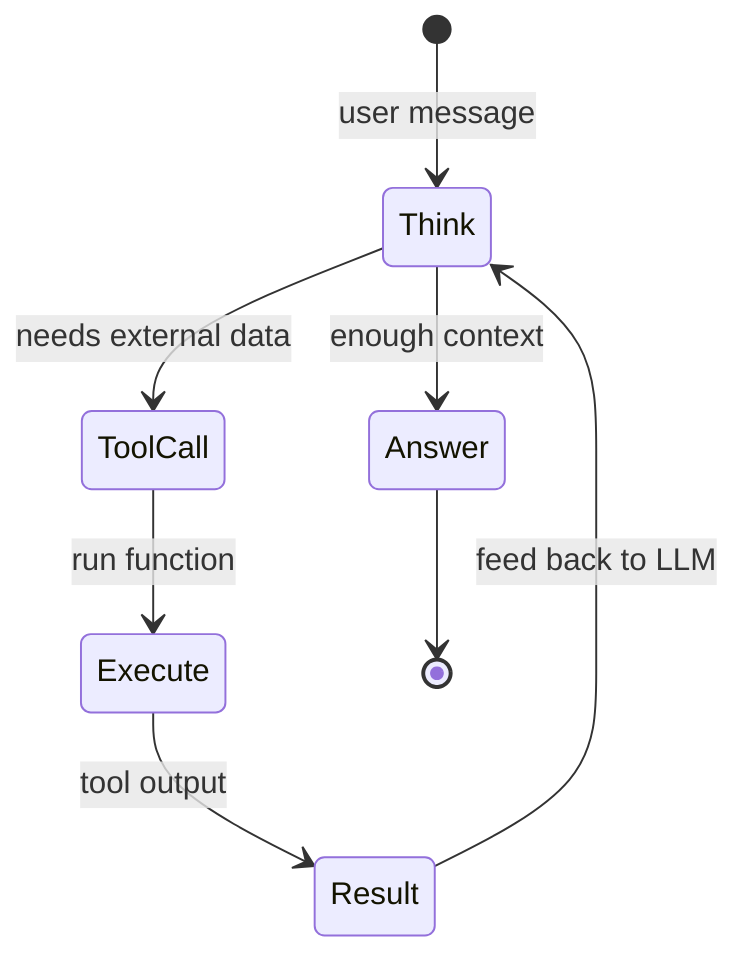

# Module 06 — Tools & Function Calling

> **Agent spawn**: `@Memory.md` + this file + `@modules/06-tools-function-calling/NOTES.md`  
> **Nav**: ← [Module 05](../05-rag-pgvector/MODULE.md) · Next → [Module 07](../07-agents-langgraph/MODULE.md)

## At a glance

| | |
|---|---|
| Prerequisites | Module 05 |
| Duration | ~4–6 sessions |
| Project? | No |
| Exit test | Tool call loop + idempotent tool design bina notes ke |

## Visual map

> **Kaise padho**: Pehle diagram dekho → topics padho → session end pe "Redraw challenge" bina dekhe draw karo



```
     ┌──────────┐
     │  THINK   │◄─────────────┐
     └────┬─────┘              │
          │ tool needed?       │
          ▼ yes                │
     ┌──────────┐         ┌────┴────┐
     │ TOOL CALL│ ──────► │ RESULT  │
     └──────────┘ execute └─────────┘
          │ no
          ▼
     ┌──────────┐
     │  ANSWER  │
     └──────────┘
```

### Mental model (1 line)

Agent loop: socho → tool call karo → result wapas LLM ko do → jab kaafi ho tab final answer.

### Redraw challenge

Think → tool call → result → answer loop (arrow wapas think pe) bina dekhe draw karo.

## Read order

1. Objectives → 2. Learning hooks → 3. Topics → 4. Assignments → 5. Coach se active recall

**Prerequisites**: Module 05  
**Duration**: ~4–6 sessions

## Objectives

1. LLM ko **actions** karwana — sirf text nahi
2. Pydantic schemas = tool contracts
3. Idempotent, safe tool design

## Learning hooks

| Concept | Parallel |
|---------|----------|
| Tool schema | Zod API validation |
| Tool call loop | Async refund chain stages |
| Idempotent tools | Payment duplicate-safe |
| Parallel tools | Independent chain stages |
| Tool errors | Stage failure + rollback |

## Topics

- OpenAI function calling vs Anthropic tool use
- JSON Schema / Pydantic model generation
- Tool choice: auto, required, none
- Handling malformed tool args
- Timeouts & retries on tool execution
- Structured outputs API

## Assignments

| # | Task | Passing criteria |
|---|------|------------------|
| A1 | Single tool: `get_balance(account_id)` stub | LLM calls tool, uses result in reply |
| A2 | Two-tool workflow stub | Sequential calls correct order |
| A3 | Idempotent `create_payment` with idempotency key | Duplicate call → same result, no double charge |

## Active recall

1. Tool result message ka role kya hota hai conversation mein?
2. LLM galat args bheje — retry strategy?
3. Structured outputs vs function calling — kab kya?

## Progress checklist

- [ ] Objectives recall bina notes ke
- [ ] Assignments A1–A3 pass
- [ ] NOTES.md session log updated
