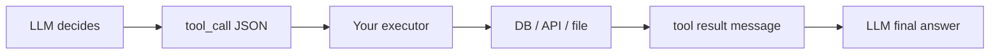
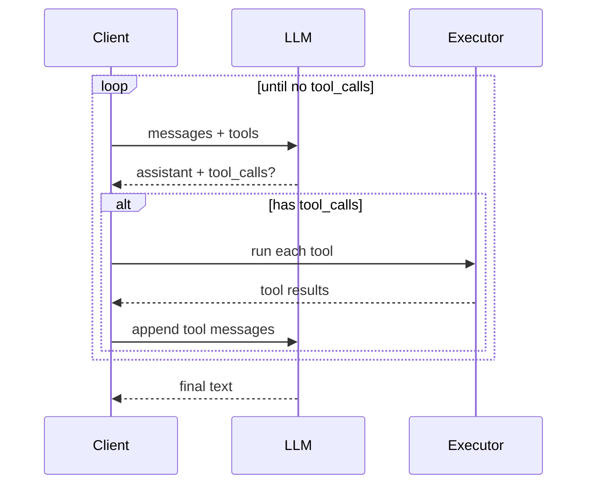

# Module 06 — Tools & Function Calling

> **Padho**: Isi file mein **Theory** — bahar mat jao.  
> **Likho**: `practice/` folder. **Pucho**: Cursor chat `@MODULE.md`  
> **Nav**: ← [Module 05](../05-rag-pgvector/MODULE.md) · Next → [Module 07](../07-agents-langgraph/MODULE.md)

> **Kaun ke liye:** Pehli baar tools / function calling seekh rahe ho. **§0 terms pehle**. Standard: `@MODULE-TEACHING-STANDARD.md`

## At a glance

| | |
|---|---|
| Prerequisites | Module 05 (RAG optional). Module 00c (Pydantic). Module 01 (messages API) |
| Duration | ~4–6 sessions |
| Project? | No |
| Exit test | Tool schema design + tool loop flow bina notes ke whiteboard karo |

## Visual map

```
User query
    ↓
LLM + tool definitions (JSON schema)
    ↓
tool_call { name, arguments }  ←── Pydantic validates args
    ↓
execute tool → result
    ↓
LLM synthesizes final response
```

**Mental model:** LLM **plan** karta hai (kaunsa tool, kya args) — tumhara code **validate + execute** karta hai. Model khud safely HTTP/DB call nahi karta.

**Redraw challenge:** User → LLM → tool_call → executor → result → final answer sequence bina dekhe draw karo.

---

## Read order (strict — session table)

| Session | Padho | Karo (Practice) |
|---------|-------|-----------------|
| 1 | §0 Terms + §1 Tools concept | JSON schema ek haath se likho |
| 2 | §2 Tool schemas | **A1** start — `tool_schemas.py` |
| 3 | §3 Tool call loop | **A1** complete — 10/10 tool pick |
| 4 | §4 Structured vs tools + §5 Pydantic | **A2** — `pydantic_tools.py` |
| 5 | §6 Idempotency + end-to-end | **A3** — `multi_step_loop.py` |

---

## Learning hooks (optional)

| Concept | Parallel |
|---------|----------|
| Tool JSON schema | OpenAPI request body |
| Tool call loop | Kafka consume → process → publish |
| Pydantic validation | Zod `.parse()` on API input |
| Structured output | Fixed response contract |
| Parallel tool calls | Batch order submission |

---

## Theory

### §0. Terms pehli baar — tools, function calling, JSON schema (20 min)

#### 0.1 Tool (function) kya hai?

**Tool** = LLM ke liye ek **named capability** jo tum define karte ho — jaise `get_weather(city)` ya `search_docs(query)`.

Model tool **nahi chalata**. Model kehta hai: *"Mujhe `get_weather` chahiye `city=Berlin` ke saath"* — tumhara Python usko run karta hai.

**Analogy:** Manager (LLM) memo likhta hai "warehouse se item #42 lao". Worker (tumhara code) actually warehouse jata hai.

#### 0.2 Function calling kya hai?

**Function calling** = provider ka feature jahan model response mein **structured tool request** de sakta hai — plain text ke bajay.

```json
{
  "tool_calls": [{
    "id": "call_abc",
    "type": "function",
    "function": {
      "name": "get_weather",
      "arguments": "{\"city\": \"Berlin\"}"
    }
  }]
}
```

| Field | Matlab |
|-------|--------|
| `tool_calls` | Zero ya zyada tools ek turn mein |
| `name` | Kaunsa tool |
| `arguments` | JSON **string** — parse karke validate karo |

OpenAI: `tool_calls` array. Anthropic: `tool_use` blocks. Loop same — §3.

#### 0.3 JSON Schema kya hai?

**JSON Schema** = parameters ka **shape** — types, required fields, descriptions.

```json
{
  "type": "object",
  "properties": {
    "city": { "type": "string", "description": "City name in English" }
  },
  "required": ["city"]
}
```

LLM is schema ko padh ke decide karta hai **kab** tool call karna hai aur **kya** args bhejne hain.

**Analogy:** HTML form — `city` text field required, `limit` number optional.

#### 0.4 Tool result message

Tool chalne ke baad tum LLM ko **result** wapas bhejte ho — naya message:

```python
{"role": "tool", "tool_call_id": "call_abc", "content": '{"temp_c": 18, "condition": "cloudy"}'}
```

Phir LLM final natural language jawab banata hai.

#### 0.5 Terms quick reference

| Term | Ek line |
|------|---------|
| Tool definition | name + description + parameters schema |
| Executor | Tumhara code jo tool run karta hai |
| Tool loop | Call LLM → tool? → run → LLM again — jab tak done |
| Parallel tool calls | Ek turn mein multiple tools |
| Structured output | Final answer fixed JSON — action nahi (§4) |

**§0 checkpoint:**
1. Model khud database query karta hai ya request return karta hai?
2. `arguments` string hai ya object? (API response mein)
3. JSON Schema mein `description` kyun likhte hain?

---

### §1. Tools = LLM ko APIs dena, execution tumhara (→ A1 concept)

#### Problem kya hai?

User: "Berlin ka weather kaisa hai aur docs mein refund policy dhoondo."

Model ke paas live data nahi. Tum tools doge — model plan karega kaunsa pehle.



| Kaun decide | Kya |
|-------------|-----|
| LLM (probabilistic) | Kaunsa tool, kya arguments |
| Tum (deterministic) | Validate, auth, rate limit, actual IO |

**Security rule:** Kabhi bhi model ke bole bina write action mat chalao. Allowlist = sirf registered tools.

---

### §2. Tool schemas — JSON Schema shape (→ A1)

#### Problem kya hai?

Galat schema → model galat tool pick kare ya args todo.

#### Poora tool definition — line by line

```python
TOOLS = [
    {
        "type": "function",
        "function": {
            "name": "search_docs",
            "description": (
                "Search internal company documentation by keyword. "
                "Use when the user asks about policies, refunds, or product docs."
            ),
            "parameters": {
                "type": "object",
                "properties": {
                    "query": {
                        "type": "string",
                        "description": "Search terms, e.g. 'refund policy'",
                    },
                    "limit": {
                        "type": "integer",
                        "description": "Max results, default 5",
                    },
                },
                "required": ["query"],
            },
        },
    },
    {
        "type": "function",
        "function": {
            "name": "get_weather",
            "description": (
                "Get current weather for a city. "
                "Use when the user asks about temperature, rain, or forecast."
            ),
            "parameters": {
                "type": "object",
                "properties": {
                    "city": {
                        "type": "string",
                        "description": "City name, e.g. Berlin",
                    },
                },
                "required": ["city"],
            },
        },
    },
]
```

| Field | Kyun matter |
|-------|-------------|
| `name` | Short, unique — routing key |
| `description` | **Kab** use kare — quality critical (model mostly isse decide karta hai) |
| `parameters` | JSON Schema — types + required |
| `required` | Missing arg → validation fail before execute |

#### Stub implementations

```python
def search_docs(query: str, limit: int = 5) -> dict:
    # Production: real DB / RAG
    fake_db = [
        {"id": "doc1", "title": "Refund Policy", "snippet": "30 day returns..."},
    ]
    hits = [d for d in fake_db if query.lower() in d["title"].lower()]
    return {"results": hits[:limit]}

def get_weather(city: str) -> dict:
    # Production: real weather API
    return {"city": city, "temp_c": 18, "condition": "partly cloudy"}
```

| Line | Matlab |
|------|--------|
| Stub | Learning ke liye fake data — shape real rakho |
| `return dict` | JSON-serializable — tool result string banega |

**Description quality test:**

```
Bad:  "search_docs" / "Searches docs"
Good: "Use when user asks about policies..." — disambiguates from weather
```

**Common errors (§2):**

| Symptom | Kyun | Fix |
|---------|------|-----|
| Wrong tool 10% time | Descriptions overlap | Narrow "Use when..." per tool |
| Invalid JSON args | Schema vague | `required`, types explicit |
| Model never calls tool | Description too strict | Examples in description |

> **→ Practice A1** (`tool_schemas.py`) — 2 tools, 10 prompts, correct tool 10/10.

---

### §3. Tool call loop (→ A1, A3)

#### Problem kya hai?

Ek API call enough nahi — model pehle tool maangega, result dekh ke final jawab banayega.

#### Loop — line by line

```python
from openai import OpenAI
import json

client = OpenAI()

TOOL_IMPL = {
    "search_docs": search_docs,
    "get_weather": get_weather,
}

def run_with_tools(user_message: str) -> str:
    messages = [{"role": "user", "content": user_message}]

    while True:
        response = client.chat.completions.create(
            model="gpt-4o-mini",
            messages=messages,
            tools=TOOLS,
            tool_choice="auto",
        )
        msg = response.choices[0].message
        messages.append(msg)

        if not msg.tool_calls:
            return msg.content or ""

        for tc in msg.tool_calls:
            name = tc.function.name
            args = json.loads(tc.function.arguments)
            fn = TOOL_IMPL[name]
            result = fn(**args)
            messages.append({
                "role": "tool",
                "tool_call_id": tc.id,
                "content": json.dumps(result),
            })
```

| Line | Matlab |
|------|--------|
| `while True` | Tab tak loop jab tak model tools maangta hai |
| `tools=TOOLS` | Available capabilities pass |
| `tool_choice="auto"` | Model decide — force specific tool bhi kar sakte ho |
| `messages.append(msg)` | Assistant message with tool_calls history mein |
| `if not msg.tool_calls` | Done — final text return |
| `json.loads(tc.function.arguments)` | String → dict |
| `fn(**args)` | Python unpack — `search_docs(query="x")` |
| `role: tool` | Result wapas model ko |



#### Parallel tool calls

Model ek turn mein `search_docs` + `get_weather` dono maang sakta hai — **dono execute** karo, dono results append:

```python
for tc in msg.tool_calls:
    # ... run each — order usually doesn't matter for read-only
```

#### Error handling — tool fail pe kya bhejo

```python
try:
    result = fn(**args)
except Exception as e:
    result = {"error": str(e), "retry_hint": "Check city spelling"}
messages.append({
    "role": "tool",
    "tool_call_id": tc.id,
    "content": json.dumps(result),
})
```

LLM user se clarify kar sakta hai — structured error better than crash.

**Test:**

```python
print(run_with_tools("What's the weather in Tokyo?"))
# Expected: mentions temp/condition from stub

print(run_with_tools("Find our refund policy in docs"))
# Expected: search_docs used, policy mentioned
```

**Common errors (§3):**

| Error | Kyun | Fix |
|-------|------|-----|
| Infinite loop | Tool result format wrong | Valid JSON string in `content` |
| `KeyError` on tool name | Typo in TOOL_IMPL | Names match schema exactly |
| Empty final answer | `msg.content` None while tool_calls | Normal — next iteration |

> **→ Practice A3** (`multi_step_loop.py`) — query needing 2 tools in sequence.

---

### §4. Structured outputs vs tool calling

#### Problem kya hai?

Dono JSON dete hain — confuse mat ho kab kaunsa.

| Use | Kab | Example |
|-----|-----|---------|
| **Structured output** | Final answer fixed schema | `{"bullets": [...]}` report |
| **Tool calling** | External actions, multi-step | DB search, send email |

Same user query — intent se decide:

```
"Return sales summary as JSON"     → structured output (no side effect)
"Look up sales in DB then email"   → tools (DB + email)
```

Structured output = **ek** LLM call, shape enforced.  
Tools = **loop**, side effects, fresh data.

*(Active recall: Module 04 `response_format` = structured output side)*

---

### §5. Pydantic validation — args execute se pehle (→ A2)

#### Problem kya hai?

Model ne `limit: "five"` bhej diya — bina validation ke DB crash.

```python
from pydantic import BaseModel, Field

class SearchDocsArgs(BaseModel):
    query: str = Field(description="Search terms")
    limit: int = Field(default=5, ge=1, le=20)

class GetWeatherArgs(BaseModel):
    city: str = Field(min_length=1)

SCHEMA_MAP = {
    "search_docs": SearchDocsArgs,
    "get_weather": GetWeatherArgs,
}

def validate_tool_call(name: str, arguments_json: str) -> BaseModel:
    model_cls = SCHEMA_MAP[name]
    return model_cls.model_validate_json(arguments_json)
```

| Line | Matlab |
|------|--------|
| `BaseModel` | Pydantic — auto validation |
| `ge=1, le=20` | limit bounds — bad values reject |
| `model_validate_json` | JSON string → typed object |
| `Field(description=...)` | Extra hint — schema mein bhi OK |

#### Safe execute wrapper

```python
def safe_execute(name: str, arguments_json: str) -> dict:
    try:
        args = validate_tool_call(name, arguments_json)
    except ValidationError as e:
        return {"error": "invalid_args", "details": e.errors()}
    fn = TOOL_IMPL[name]
    return fn(**args.model_dump())
```

| Line | Matlab |
|------|--------|
| `ValidationError` | Args galat — execute **se pehle** catch |
| `model_dump()` | Pydantic → plain dict for `**kwargs` |
| Never call DB on invalid | Security + stability |

**Test invalid args:**

```python
safe_execute("search_docs", '{"query": "x", "limit": 999}')
# error — limit > 20

safe_execute("get_weather", '{"city": ""}')
# error — min_length
```

**Common errors (§5):**

| Symptom | Kyun | Fix |
|---------|------|-----|
| Validation pass, logic fail | Business rules not in Pydantic | Custom validators |
| Double schema | OpenAI schema + Pydantic drift | Pydantic se schema generate (advanced) |

> **→ Practice A2** (`pydantic_tools.py`) — invalid args rejected pre-execute.

---

### §6. Idempotent tools — retries safe banao

#### Problem kya hai?

Network retry → same tool do baar → **double refund**.

```
send_refund(order_id, amount)  ← DANGEROUS if called twice
```

**Fix pattern:**

```python
class RefundArgs(BaseModel):
    order_id: str
    amount: float
    idempotency_key: str  # client-generated UUID

def send_refund(order_id: str, amount: float, idempotency_key: str) -> dict:
    # DB: UNIQUE(idempotency_key) — second call returns same result, no double charge
    ...
```

| Tool type | Idempotency |
|-----------|-------------|
| Read-only (`search_docs`) | Easy — same result |
| Write (`charge_card`) | **Must** idempotency key + DB constraint |

Tera hook: outbox + exactly-once (Module 11) — same mental model.

---

### End-to-end walkthrough — weather + docs, start se finish

**Goal:** User message → correct tool(s) → validated args → stub result → natural answer.

**Step 1 — Setup**

```bash
cd modules/06-tools-function-calling/practice
python3 -m venv .venv && source .venv/bin/activate
pip install openai pydantic python-dotenv
cp .env.example .env 2>/dev/null || true
```

**Step 2 — Define TOOLS** (§2 code) + stubs

**Step 3 — Loop** (§3 `run_with_tools`)

**Step 4 — Add Pydantic** (§5 `safe_execute` in loop instead of raw `fn(**args)`)

**Step 5 — Multi-step query**

```python
q = "What's the weather in Berlin and search docs for refund policy?"
print(run_with_tools(q))
```

Expected flow:
1. Model may call `get_weather` and `search_docs` (parallel or sequential)
2. Tool results append
3. Final answer combines weather + policy snippet

**Step 6 — Regression 10 prompts (A1 pass)**

```python
TESTS = [
    ("Weather in Paris?", "get_weather"),
    ("Search docs for shipping", "search_docs"),
    # ... 8 more
]
for prompt, expected_tool in TESTS:
    # log which tool called — assert expected_tool
```

| Step | Verify |
|------|--------|
| 1 | API key works |
| 2 | Schema descriptions distinct |
| 3 | Loop terminates |
| 4 | Bad args never hit stub |
| 5 | Multi-tool answer coherent |
| 6 | 10/10 routing |

**Common errors (end-to-end):**

| Symptom | Kyun | Fix |
|---------|------|-----|
| Only first tool runs | Loop breaks early | Append all tool results before next LLM call |
| JSON in final answer | Model confused | Clear tool descriptions |
| Wrong city in weather | Args not validated | Pydantic + confirm in tests |

---

## Practice

> **Saare assignments ek jagah**: [`practice/README.md`](practice/README.md)

| # | Theory § | File | Kya karna hai | Pass when |
|---|----------|------|---------------|-----------|
| A1 | §2, §3 | `practice/tool_schemas.py` | 2 tools: search_docs + get_weather | LLM picks correct tool 10/10 |
| A2 | §5 | `practice/pydantic_tools.py` | Pydantic-validated args | Invalid args rejected pre-execute |
| A3 | §3, §6 | `practice/multi_step_loop.py` | 2-tool chain stub | Query needing 2 tools completes |

---

## Active recall (khud jawab likho NOTES mein)

1. Tool description quality output pe kyun matter karti hai?
2. Tool call fail ho — LLM ko kya message bhejoge?
3. Structured output vs tool calling — same query pe kab alag choose?
4. Idempotency write tools pe kyun zaroori?

**Chat drill** (optional): "Module 06 — tool loop whiteboard karo"

---

## Progress checklist

- [ ] §0 terms clear (tool, function calling, JSON schema)
- [ ] Theory §1–§6 padh liya
- [ ] End-to-end walkthrough chalaya
- [ ] Redraw challenge kiya
- [ ] Practice A1–A3 pass
- [ ] Active recall NOTES mein likha

---

## Optional appendix

- [OpenAI Function calling](https://platform.openai.com/docs/guides/function-calling) — message shapes
- [Anthropic Tool use](https://docs.anthropic.com/en/docs/build-with-claude/tool-use) — tool_result format
