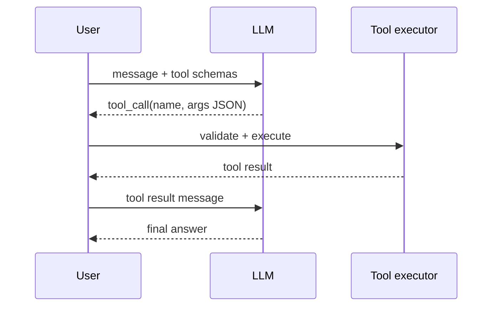
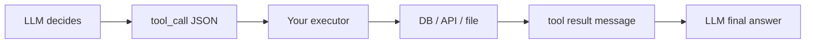
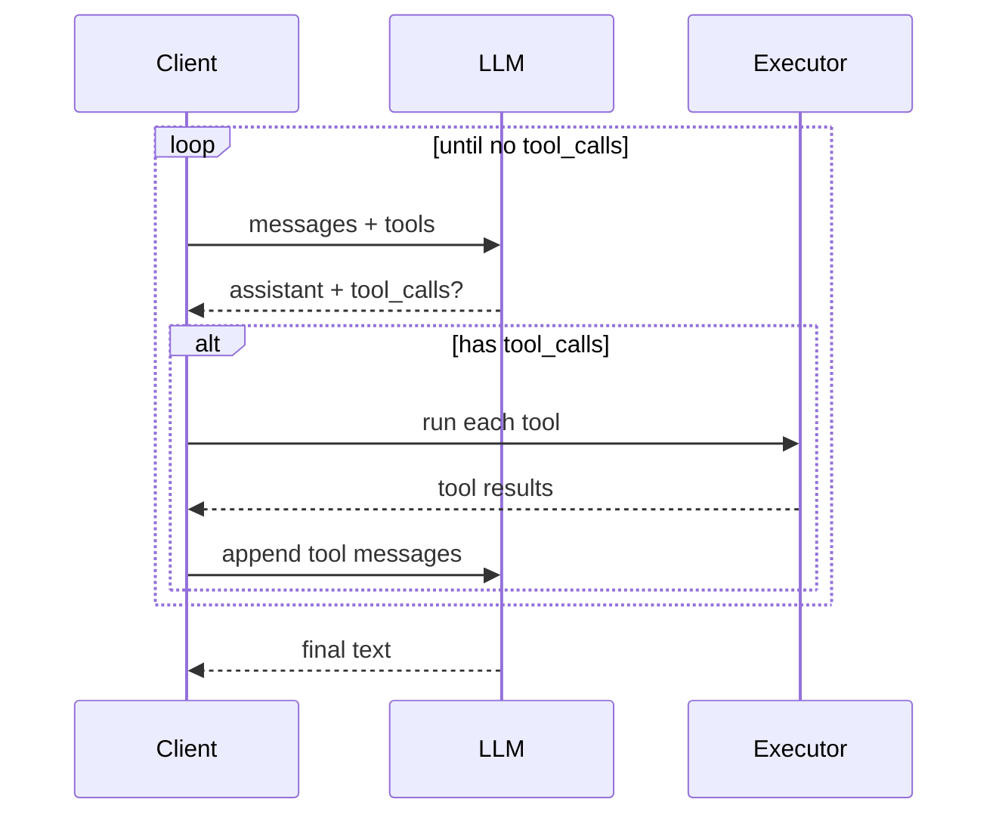

# Module 06 — Tools & Function Calling

> **Padho**: Isi file mein **Theory** — bahar mat jao.  
> **Likho**: `practice/` folder. **Pucho**: Cursor chat `@MODULE.md`  
> **Nav**: ← [Module 05](../05-rag-pgvector/MODULE.md) · Next → [Module 07](../07-agents-langgraph/MODULE.md)

## At a glance

| | |
|---|---|
| Prerequisites | Module 05 |
| Duration | ~4–6 sessions |
| Project? | No |
| Exit test | Tool schema design + structured output flow bina notes ke |

## Visual map



```
User query
    ↓
LLM + tool definitions (JSON schema)
    ↓
tool_call { name, arguments }  ←── Pydantic validates args
    ↓
execute tool → result
    ↓
LLM synthesizes final response
```

**Mental model**: LLM sirf plan karta hai — tool schema batata hai kya invoke ho sakta hai; tumhara code validate + execute karta hai.

**Redraw challenge**: User → LLM → tool_call → executor → result → final answer sequence bina dekhe draw karo.

---

## Read order

1. Visual map → 2. **Theory** (neeche) → 3. **Practice** → 4. Chat agar doubt → 5. NOTES

---

## Learning hooks

| Concept | Parallel |
|---------|----------|
| Tool JSON schema | OpenAPI request body |
| Tool call loop | Kafka consume → process → publish |
| Pydantic validation | Zod `.parse()` on API input |
| Structured output | Fixed response contract |
| Parallel tool calls | Batch order submission |

---

## Theory

### 1. Tools = LLM ko APIs dena, execution tumhara

Model **khud** HTTP call nahi karta safely — wo **tool_call request** return karta hai, tum execute karte ho.



**LLM decides:** kaunsa tool, kya arguments (probabilistic)  
**Tum decide:** validate, auth, rate limit, idempotency, actual IO

---

### 2. Tool schemas — JSON Schema shape

```json
{
  "type": "function",
  "function": {
    "name": "search_docs",
    "description": "Search internal docs by keyword. Use when user asks about policies.",
    "parameters": {
      "type": "object",
      "properties": {
        "query": { "type": "string", "description": "Search terms" },
        "limit": { "type": "integer", "default": 5 }
      },
      "required": ["query"]
    }
  }
}
```

| Field | Kyun matter |
|-------|-------------|
| `name` | routing — short, unique |
| `description` | LLM ko batata hai KAB use kare — quality critical |
| `parameters` | JSON Schema — types + required |

**OpenAI vs Anthropic:** `tools` array vs `tool_use` blocks — same loop, different message shapes.

---

### 3. Tool call loop



**Parallel tool calls:** model ek turn mein `search_docs` + `get_weather` dono maang sakta hai — execute parallel, results sab append.

**Error handling:** *(Active recall Q2)*
```
tool result: { "error": "Invalid city code", "retry_hint": "Use ISO country" }
```
LLM ko structured error do — wo user se clarify kar sakta hai.

---

### 4. Structured outputs vs tool calling

| Use | Kab |
|-----|-----|
| Structured output | Final answer fixed schema (JSON report) |
| Tool calling | External actions + multi-step |

Same query pe:
- "Return sales summary as JSON" → structured output
- "Look up sales in DB then email report" → tools

*(Active recall Q3)*

---

### 5. Pydantic validation — args execute se pehle

```python
class SearchDocsArgs(BaseModel):
    query: str = Field(description="Search terms")
    limit: int = Field(default=5, ge=1, le=20)

# tool_call.arguments JSON → SearchDocsArgs.model_validate_json(...)
# invalid → reject BEFORE DB call
```

**Description in Field** = LLM ko extra hint (schema mein bhi duplicate OK).

---

### 6. Idempotent tools — retries safe banao

```
send_refund(order_id, amount)  ← DANGEROUS if called twice
  → use idempotency_key in tool args
  → DB unique constraint on key
  → second call returns same result, no double refund
```

**Read-only tools** (`search_docs`) — idempotency easy  
**Write tools** (`write_webhook`, `charge_card`) — MUST idempotent

Tera hook: outbox + exactly-once — same mental model (Module 11).

---

## Practice

> **Saare assignments ek jagah**: [`practice/README.md`](practice/README.md) — problem statements, instructions, pass criteria.  
> Code **tum** likhoge Cursor mein. Stubs `practice/` mein hain (`TODO` search).  
> Stuck? Chat: `@modules/06-tools-function-calling/MODULE.md` + error paste karo.

| # | File | Kya karna hai | Pass when |
|---|------|---------------|-----------|
| A1 | `practice/tool_schemas.py` | 2 tools: search_docs + get_weather | LLM picks correct tool 10/10 |
| A2 | `practice/pydantic_tools.py` | Pydantic-validated args | Invalid args rejected pre-execute |
| A3 | `practice/multi_step_loop.py` | 2-tool chain stub | Query needing 2 tools completes |

---

## Active recall (khud jawab likho NOTES mein)

1. Tool description quality output pe kyun matter karti hai?
2. Tool call fail ho — LLM ko kya message bhejoge?
3. Structured output vs tool calling — same query pe kab alag choose?

**Chat drill** (optional): "Module 06 — tool loop whiteboard karo"

---

## Progress checklist

- [ ] Theory Section 1–6 padh liya
- [ ] Redraw challenge kiya
- [ ] Practice A1–A3 pass
- [ ] Active recall NOTES mein likha
- [ ] NOTES session log updated

---

## Optional appendix (zarurat ho tab)

- [OpenAI Function calling](https://platform.openai.com/docs/guides/function-calling) — message shapes
- [Anthropic Tool use](https://docs.anthropic.com/en/docs/build-with-claude/tool-use) — tool_result format
