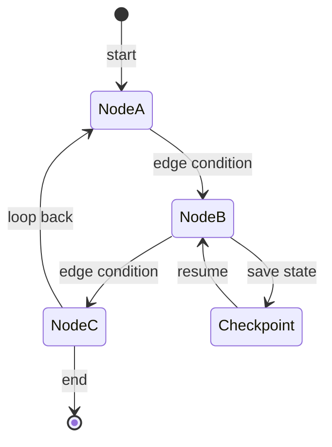
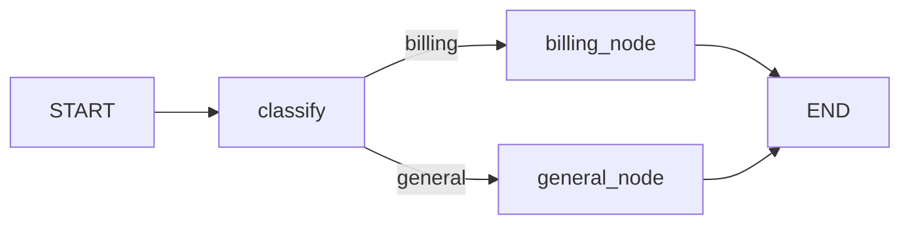
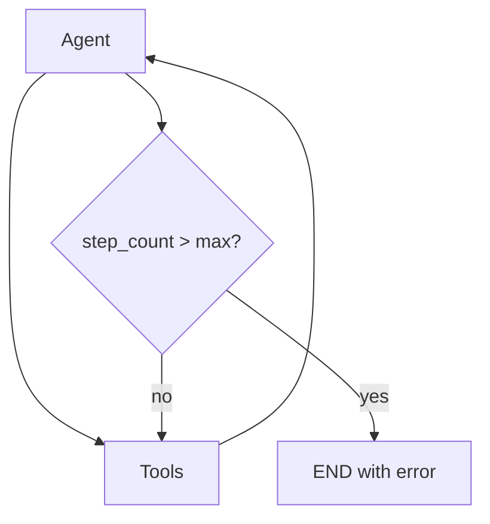

# Module 07 — Agents & LangGraph

> **Padho**: Isi file mein **Theory** — bahar mat jao.  
> **Likho**: `practice/` folder. **Pucho**: Cursor chat `@MODULE.md`  
> **Nav**: ← [Module 06](../06-tools-function-calling/MODULE.md) · Next → [Module 08](../08-mcp/MODULE.md)

## At a glance

| | |
|---|---|
| Prerequisites | Module 06 |
| Duration | ~5–8 sessions |
| Project? | No |
| Exit test | Agent loop guards + checkpoint resume bina notes ke |

## Visual map



```
LangGraph state graph

  [START] ──► (node: plan) ──► (node: act) ──► (node: check)
                  ▲                              │
                  └──────── retry loop ──────────┘

  ◆ checkpoint = saved state (resume after crash)
  ─── edges = conditional routing
```

**Mental model**: LangGraph = nodes (steps) + edges (routing) + checkpoints (state save) — agent flow ek graph hai, linear script nahi.

**Redraw challenge**: 3 nodes, conditional edges, aur checkpoint save/resume points bina dekhe draw karo.

---

## Read order

1. Visual map → 2. **Theory** (neeche) → 3. **Practice** → 4. Chat agar doubt → 5. NOTES

---

## Learning hooks

| Concept | Parallel |
|---------|----------|
| Agent loop | Kafka worker consume → process → publish |
| State graph | 5-stage refund state machine |
| Checkpoints | Savepoints — resume after crash |
| Conditional edge | Stage failure routing |
| Memory | Session state vs Postgres ledger |

---

## Theory

### 1. Agent = loop + state + tools

```
while not done:
    think → maybe call tool → update state → check stop condition
```

Linear script break hota hai jab:
- branching (success vs retry)
- human approval
- crash recovery

→ **graph** better fit.

---

### 2. LangGraph StateGraph — nodes aur edges



```python
# Mental model (not full code)
State = TypedDict with messages, step_count, route, ...

graph.add_node("classify", classify_fn)
graph.add_node("respond", respond_fn)
graph.add_conditional_edges("classify", router_fn)
graph.add_edge("respond", END)
```

**Node** = pure function `(state) → partial state update`  
**Edge** = fixed next OR conditional function

---

### 3. ReAct loop — reason + act

```
Thought: user wants weather in Delhi
Action: get_weather(city="Delhi")
Observation: 38°C
Thought: I can answer now
Answer: Delhi mein 38°C hai
```

LangGraph mein: `agent` node → `tools` node → wapas `agent` node until no tool_calls.

---

### 4. Loops — power + danger



**Infinite loop rokna:** *(Active recall Q1)*
- `max_iterations` hard cap
- detect repeated identical tool calls
- timeout per run
- human interrupt (Module 09)

---

### 5. Checkpoints — durability

```
Run 1: plan → act → [CRASH]
Run 2: resume from checkpoint → act continues
```

| Storage | Kab |
|---------|-----|
| MemorySaver | local dev |
| PostgresSaver | production — thread_id keyed |

*(Active recall Q2: Postgres for production — survives restart, multi-instance)*

**Thread ID** = conversation/run identifier — same user session resume.

---

### 6. Memory patterns

```
Short-term: messages[] in state — current thread
Long-term: vector store / SQL — cross-session facts

"User prefers Hinglish" → long-term store
"This turn's tool results" → short-term state only
```

---

### 7. Single agent vs graph — kab graph?

*(Active recall Q3)*

| Single loop OK | Graph zaroori |
|----------------|---------------|
| 1 tool, linear | branching workflows |
| prototype | HITL gates |
| | multiple specialists |
| | checkpoint + audit |

---

## Practice

> Code **tum** likhoge Cursor mein. Stubs `practice/` mein hain.  
> Stuck? Chat: `@modules/07-agents-langgraph/MODULE.md` + error paste karo.

| # | File | Kya karna hai | Pass when |
|---|------|---------------|-----------|
| A1 | `practice/two_node_graph.py` | classify → respond | Routing 10/10 test inputs |
| A2 | `practice/tool_agent_graph.py` | Tool-calling agent graph | Multi-step task completes |
| A3 | `practice/checkpoint_resume.py` | Kill mid-run → resume | State continues from checkpoint |

### A3 hints

- `MemorySaver` or sqlite checkpointer for local test

---

## Active recall (khud jawab likho NOTES mein)

1. Agent infinite loop kaise rokoge production mein?
2. Checkpoint storage kahan — memory vs Postgres?
3. Single agent vs graph — kab graph zaroori?

**Chat drill** (optional): "Module 07 — checkpoint flow explain karo"

---

## Progress checklist

- [ ] Theory Section 1–7 padh liya
- [ ] Redraw challenge kiya
- [ ] Practice A1–A3 pass
- [ ] Active recall NOTES mein likha
- [ ] NOTES session log updated

---

## Optional appendix (zarurat ho tab)

- [LangGraph Introduction](https://langchain-ai.github.io/langgraph/) — official concepts
- [LangGraph Persistence](https://langchain-ai.github.io/langgraph/concepts/persistence/) — checkpointer setup
