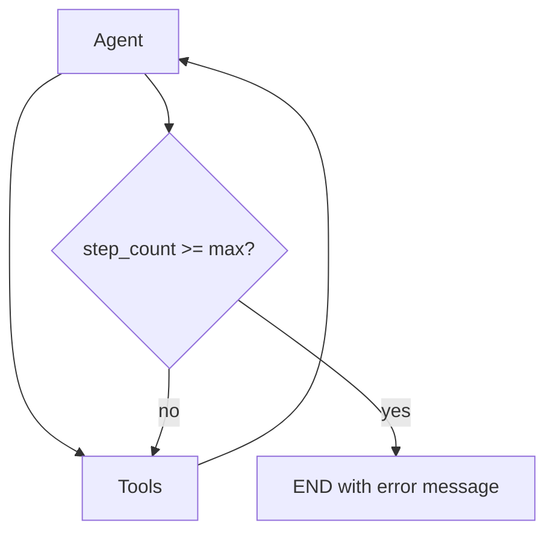

# Module 07 — Agents & LangGraph

> **Padho**: Isi file mein **Theory** — bahar mat jao.  
> **Likho**: `practice/` folder. **Pucho**: Cursor chat `@MODULE.md`  
> **Nav**: ← [Module 06](../06-tools-function-calling/MODULE.md) · Next → [Module 08](../08-mcp/MODULE.md)

> **Format**: Textbook — §0 pehle (terms from zero). `@MODULE-TEACHING-STANDARD.md`

## At a glance

| | |
|---|---|
| Prerequisites | Module 06 (tool calling loop samajh aana chahiye). 00c FastAPI recommended |
| Duration | ~5–8 sessions — ek section padho, uska Practice karo, phir agla |
| Project? | No (Project B mein yahi graph use hoga — Module 11) |
| Exit test | Agent loop guards + checkpoint resume bina notes ke explain karo |

## Visual map

**Mental model (pehle §0 padho, phir yeh diagram dubara dekho):**

```
LangGraph = state machine jisme har step ek NODE hai

  [START] ──► (classify) ──► (respond) ──► [END]
                  │
                  └── conditional edge ──► (billing path) ya (general path)

  ◆ checkpoint = run ka snapshot (crash ke baad resume)
  ─── edge = "agla node kaun" — fixed ya condition se
```

**Redraw challenge**: 3 nodes, 1 conditional edge, 1 checkpoint save point — bina MODULE dekhe paper pe draw karo.

---

## Read order (strict — mat chhodna)

| Session | Padho | Karo (Practice) |
|---------|-------|-----------------|
| 1 | §0 Terms + §1 Problem | Terminal mein pseudo-loop likhke socho kahan break hoga |
| 2 | §2 StateGraph — pehla graph | **A1** start — `two_node_graph.py` |
| 3 | §3 ReAct loop | **A1** complete + **A2** start |
| 4 | §4 Loop guards | **A2** — `tool_agent_graph.py` |
| 5 | §5 Checkpoints | **A3** — `checkpoint_resume.py` |
| 6 | §6 Memory + §7 Kab graph? | Active recall NOTES mein |
| 7 | Poora module dubara + redraw | Checklist complete |

---

## Learning hooks (tera parallel — optional)

| Concept | Tum already jaante ho |
|---------|----------------------|
| Agent loop | Kafka worker: message lo → process → publish → repeat |
| State graph | 5-stage refund state machine — har stage ek node |
| Checkpoints | DB savepoint — crash ke baad wahi se resume |
| Conditional edge | Payment fail → retry queue; success → settlement |
| Short-term memory | Request-scoped context vs Postgres ledger (long-term) |

---

## Theory

### §0. Terms pehli baar — agent, state graph, checkpoint

Module 06 mein tumne **tool call loop** dekha: LLM → tool → result → LLM. **Agent** us loop ka naam hai jab LLM khud decide karta hai kab rukna hai, kaunsa tool, kitni baar.

#### 0.1 Agent — simple definition

```
Agent = LLM + tools + loop + stop condition

  User: "Delhi ka weather batao aur meri calendar mein reminder daalo"
       ↓
  LLM sochta hai (reason)
       ↓
  Tool call: get_weather("Delhi")
       ↓
  Result milta hai (observe)
       ↓
  LLM dubara sochta hai — aur tool ya final answer
       ↓
  Jab done → user ko jawab
```

| Term | Matlab | Analogy |
|------|--------|---------|
| **Agent** | LLM jo steps plan karke tools use karta hai | Ops person jo ticket dekhta hai, system call karta hai, phir decide karta hai |
| **Tool** | External action (DB, API, file) — Module 06 | Internal API endpoint |
| **State** | Run ki poori memory ek object mein | Workflow run record — kya hua, kahan tak pahunche |
| **Node** | Ek step ka code — state in, partial update out | Refund pipeline ka ek stage |
| **Edge** | Agla node kaun | `if approved → execute else → replan` |
| **Checkpoint** | State ka disk pe save | Outbox row commit — baad mein worker resume |

#### 0.2 State graph — Zapier clone se parallel

Tumne Zapier-style automation banaya: trigger → step 1 → step 2 → … → done. Kabhi step fail → alag branch. **LangGraph StateGraph** wahi idea hai, bas har step Python function hai aur **state** ek shared dict/TypedDict.

```
Zapier workflow:          LangGraph:
  Trigger                    START node
  Action: Gmail              node "send_email"
  Filter: if amount > 500    conditional edge
  Action: Slack              node "notify_slack"
  Done                       END
```

**Farq:** Zapier UI mein draw karte ho; LangGraph code mein `graph.add_node()` + `add_edge()`.

#### 0.3 Pehla chhota example — symbols samjho

```python
from typing import TypedDict, Literal
from langgraph.graph import StateGraph, START, END

class AgentState(TypedDict):
    messages: list          # conversation history
    route: str              # "billing" | "general"
    step_count: int         # loop guard ke liye

def classify_node(state: AgentState) -> dict:
    # Sirf jo change karna hai woh return — poora state nahi
    last = state["messages"][-1]["content"]
    route = "billing" if "invoice" in last.lower() else "general"
    return {"route": route, "step_count": state.get("step_count", 0) + 1}

def respond_node(state: AgentState) -> dict:
    # route ke hisaab se alag response logic
    return {"messages": state["messages"] + [{"role": "assistant", "content": f"Handled: {state['route']}"}]}

def pick_next(state: AgentState) -> Literal["respond"]:
    return "respond"  # hamesha respond pe jao (simple edge)

graph = StateGraph(AgentState)
graph.add_node("classify", classify_node)
graph.add_node("respond", respond_node)
graph.add_edge(START, "classify")
graph.add_conditional_edges("classify", pick_next)  # ya direct add_edge
graph.add_edge("respond", END)
app = graph.compile()
```

**Line-by-line:**

| Line / symbol | Matlab |
|---------------|--------|
| `TypedDict` | State ka shape — keys fixed, type-safe |
| `AgentState` | Poori run ki memory ka schema |
| `classify_node(state)` | Ek node = function; input poora state |
| `return {"route": ...}` | **Partial update** — sirf badli fields; baaki merge |
| `StateGraph(AgentState)` | Graph banaya — state type lock |
| `add_node("classify", fn)` | Naam + function register |
| `add_edge(START, "classify")` | Pehla step hamesha classify |
| `add_conditional_edges(...)` | Function decide karega agla node |
| `compile()` | Runnable app — `.invoke()` se chalao |

**Terminal try (concept):**

```bash
cd modules/07-agents-langgraph/practice
python3 -c "from langgraph.graph import StateGraph; print('langgraph OK')"
# Expected: langgraph OK
```

| Error message | Kyun | Fix |
|---------------|------|-----|
| `ModuleNotFoundError: langgraph` | venv / install nahi | `pip install langgraph langchain-openai` |
| `KeyError: 'messages'` | State mein key missing invoke pe | Initial state mein saari required keys do |
| `InvalidUpdateError` | Node ne galat type return kiya | Return dict keys TypedDict se match karo |

**§0 checkpoint (khud jawab):**
1. Node kya return karta hai — poora state ya partial?
2. Edge fixed vs conditional — example bolo?
3. Checkpoint save kyun — crash ke bina bhi kab useful?

---

### §1. Problem pehle — linear script kahan toot-ta hai

**Problem:** Module 06 ka `while` loop chhote demos ke liye theek hai. Production workflow mein:

```
User refund request
  → classify intent
  → fetch order (tool)
  → if amount > 5000 → HUMAN APPROVAL   ← yahan script messy
  → if approved → refund (tool)
  → if fail → retry ya escalate         ← aur messy
  → notify user
```

Agar yeh sab ek `while` loop + 15 `if` mein likho:
- crash ke baad kahan resume? — pata nahi
- test karna mushkil — har branch alag
- audit trail — kaunse step pe kya hua?

**Isliye graph:** har step = node, routing = edge, save = checkpoint. Tumhara **outbox pattern** bhi yahi soch hai — state durable, steps idempotent.

**Request flow (mental):**
1. User message aata hai → initial state banata hai
2. Graph `invoke(state)` — node by node chalta hai
3. Har node state update karta hai
4. Edge decide karta hai next
5. END ya error pe ruk jata hai

> **→ Practice A1** (pass: `two_node_graph.py` — classify → respond, 10/10 routing)

---

### §2. StateGraph — nodes aur edges detail se

#### 2.1 Node rules (yeh yaad rakho)

```
Node function signature:  (state: AgentState) -> dict

Rules:
  1. Node side effect KAR sakta hai (LLM call, DB) — lekin test ke liye pure rakho jahan ho sake
  2. Return hamesha PARTIAL update dict
  3. LangGraph merge karta hai — purani state + naya patch
  4. Node naam string unique — "classify", "tools", "agent"
```

#### 2.2 Conditional edge — router function

```python
def route_after_classify(state: AgentState) -> Literal["billing_respond", "general_respond"]:
    if state["route"] == "billing":
        return "billing_respond"
    return "general_respond"

graph.add_conditional_edges(
    "classify",
    route_after_classify,
    # optional mapping — node names router return se match
)
```

| Line | Matlab |
|------|--------|
| `route_after_classify` | Router = chhota function, state padhke string return |
| Return value | Agle node ka **naam** — graph mein registered hona chahiye |
| `add_conditional_edges` | Is node ke baad dynamic routing |

**Zapier parallel:** Filter step — "Amount > 500" true → Slack path, false → Email path.

#### 2.3 Graph compile aur invoke

```python
app = graph.compile(checkpointer=memory)  # checkpointer §5 mein

config = {"configurable": {"thread_id": "user-42-session-1"}}
result = app.invoke(
    {"messages": [{"role": "user", "content": "invoice #99 status?"}], "step_count": 0},
    config=config,
)
print(result["messages"][-1])
```

| Step | Kya hota hai |
|------|--------------|
| 1 | Initial state dict banao |
| 2 | `thread_id` config mein — checkpoint key |
| 3 | `invoke` START se END tak chalata hai |
| 4 | Return = final merged state |

| Error message | Kyun | Fix |
|---------------|------|-----|
| `KeyError: thread_id` | Checkpointer on hai, config missing | `configurable.thread_id` do |
| `GraphRecursionError` | Bahut zyada steps — infinite loop | `step_count` guard + `recursion_limit` |
| Node not found | Router ne galat string return | Router return values = `add_node` names |

> **→ Practice A1** complete karo abhi agar start kiya tha

---

### §3. ReAct loop — reason + act graph mein

**ReAct** = **Re**ason + **Act**. LLM pehle sochta hai, phir tool call, phir observation, phir dubara sochta hai.

```
Thought: User wants weather in Delhi
Action:  get_weather(city="Delhi")
Observation: {"temp_c": 38}
Thought: I have enough info
Answer: Delhi mein abhi 38°C hai
```

LangGraph mein yeh **2-node loop** hai:

```
        ┌──────────────┐
        │  agent node  │  ← LLM call, maybe tool_calls in response
        └──────┬───────┘
               │
        tool_calls? ──yes──► tools node ──► wapas agent
               │
              no
               ▼
              END
```

```python
def should_continue(state: AgentState) -> Literal["tools", "__end__"]:
    last = state["messages"][-1]
    if getattr(last, "tool_calls", None):
        return "tools"
    return "__end__"

graph.add_conditional_edges("agent", should_continue)
graph.add_edge("tools", "agent")  # loop back
```

| Symbol | Matlab |
|--------|--------|
| `agent` node | LLM ko messages bhejo, jawab state mein append |
| `tools` node | Har `tool_call` execute, result message append |
| `should_continue` | Agar tool_calls → tools; warna END |
| Loop edge `tools → agent` | Observation ke baad dubara reason |

**Module 06 connection:** Tool loop wahi hai — bas ab graph nodes mein baanta hai, `if` chain nahi.

> **→ Practice A2** (pass: `tool_agent_graph.py` — multi-step task complete)

---

### §4. Loops — power + production danger

Agent loop unlimited chal sakta hai — **production mein yeh incident hai.**

```python
MAX_ITERATIONS = 10

def agent_node(state: AgentState) -> dict:
    if state["step_count"] >= MAX_ITERATIONS:
        return {
            "messages": state["messages"] + [
                {"role": "assistant", "content": "Stopped: max steps reached"}
            ]
        }
    # ... normal LLM call
    return {"step_count": state["step_count"] + 1, ...}
```

**4 guards — interview ready:**

| Guard | Kya rokta hai | Kaise |
|-------|---------------|-------|
| `max_iterations` | 50 tool calls | Hard cap `step_count` |
| Repeated tool detection | Same call bar bar | Last N calls hash compare |
| Timeout | 5 min hang | `asyncio.wait_for` / worker deadline |
| Human interrupt | Runaway agent | Module 09 HITL kill switch |



| Error message | Kyun | Fix |
|---------------|------|-----|
| `GraphRecursionError` | LangGraph default limit (25) hit | Guard pehle + sensible `recursion_limit` |
| Same tool 20 times | LLM stuck | Detect duplicate + break with user message |
| Bill explode | No cap | `max_iterations` + cost budget (Module 10) |

> **→ Practice A2** mein `max_iterations` guard zaroor lagao

---

### §5. Checkpoints — durability (savepoint jaisa)

**Problem:** Server restart beech mein — bina checkpoint user dubara start se karega, duplicate refund risk.

```
Run 1:  plan → act → [CRASH]
Run 2:  resume from checkpoint → act continues → done
```

**Tera outbox parallel:**

| Outbox pattern | LangGraph checkpoint |
|----------------|---------------------|
| TX commit = event durable | Node ke baad state save |
| Worker crash → dubara consume | `invoke` same `thread_id` se resume |
| `idempotency_key` | `thread_id` + checkpoint version |

```python
from langgraph.checkpoint.memory import MemorySaver

memory = MemorySaver()
app = graph.compile(checkpointer=memory)

config = {"configurable": {"thread_id": "run-abc-123"}}

# Pehli baar — beech mein ruk sakta hai (interrupt ya crash test)
app.invoke(initial_state, config)

# Resume — same thread_id, state wahi se
app.invoke(None, config)  # ya Command(resume=...) pattern SDK version ke hisaab se
```

| Storage | Kab use | Tradeoff |
|---------|---------|----------|
| `MemorySaver` | Local dev, practice A3 | Restart = data gone |
| `SqliteSaver` | Local integration test | File persist |
| `PostgresSaver` | Production | Multi-instance, survives deploy |

**Thread ID** = conversation / workflow run ki unique key. Same user ki nayi run = naya `thread_id`.

| Error message | Kyun | Fix |
|---------------|------|-----|
| Checkpoint empty on resume | Galat `thread_id` | Same ID verify karo |
| State stale | Purana checkpoint overwrite | Version / interrupt pattern check karo |
| Postgres connection fail | `DATABASE_URL` missing | Env + `PostgresSaver` setup |

> **→ Practice A3** (pass: kill mid-run → same `thread_id` se resume)

---

### §6. Memory patterns — short vs long term

```
Short-term (state["messages"]):
  - Is run ki conversation + tool results
  - Checkpoint ke saath persist ho sakta hai
  - Context window limit — purane messages summarize/truncate

Long-term (vector DB / SQL):
  - "User prefers Hinglish"
  - "Acme Corp ka billing contact Raj hai"
  - Cross-session facts — alag store, retrieve node se inject
```

| Data | Kahan | Example |
|------|-------|---------|
| Current turn tool output | Short-term state | `search` ke 5 chunks |
| User preference | Long-term store | Language = Hinglish |
| Workflow progress | Checkpoint + optional DB | Step 3 of 5 done |

Module 11 mein workflow history Postgres mein — yahi long-term.

---

### §7. Single agent loop vs graph — kab graph zaroori?

| Single `while` loop OK | Graph zaroori |
|----------------------|---------------|
| 1–2 tools, linear | Branching workflows |
| Prototype / hackathon | HITL gates (Module 09) |
| No crash recovery need | Checkpoint + audit |
| One role | Multiple specialists (researcher + executor) |

**Rule of thumb:** Agar whiteboard pe 3+ boxes aur "agar yeh toh woh" arrows hain → graph likho.

---

## Practice

> **Saare assignments ek jagah**: [`practice/README.md`](practice/README.md)  
> Code **tum** likhoge. Stubs mein `TODO` search karo.  
> Stuck? `@modules/07-agents-langgraph/MODULE.md` + error paste.

| # | Theory § | File | Pass when |
|---|----------|------|-----------|
| A1 | §0, §1, §2 | `practice/two_node_graph.py` | classify → respond, 10/10 routing |
| A2 | §3, §4 | `practice/tool_agent_graph.py` | Multi-step tool task + `max_iterations` |
| A3 | §5 | `practice/checkpoint_resume.py` | Kill mid-run → resume same state |

---

## Active recall (khud jawab likho NOTES mein)

1. Agent infinite loop production mein kaise rokoge? — kam se kam 3 tareeke.
2. Checkpoint memory vs Postgres — kab kaunsa?
3. Zapier workflow ko LangGraph terms mein map karo (trigger → ?, step → ?).
4. Node partial update kyun return karta hai — poora state kyun nahi?

**Chat drill** (optional): "Module 07 — checkpoint flow + outbox parallel explain karo"

---

## Progress checklist

- [ ] §0 terms — agent, node, edge, checkpoint — bina dekhe bol sakta hoon
- [ ] Session read order follow kiya (ek din mein poora mat padhna)
- [ ] Practice A1–A3 pass
- [ ] Redraw challenge kiya
- [ ] Active recall NOTES mein likha
- [ ] NOTES session log updated

---

## Optional appendix (zarurat ho tab)

- [LangGraph Introduction](https://langchain-ai.github.io/langgraph/) — official concepts
- [LangGraph Persistence](https://langchain-ai.github.io/langgraph/concepts/persistence/) — checkpointer setup
- Module 06 — tool loop (agent graph ka foundation)
- Module 11 — poora workflow graph production mein
