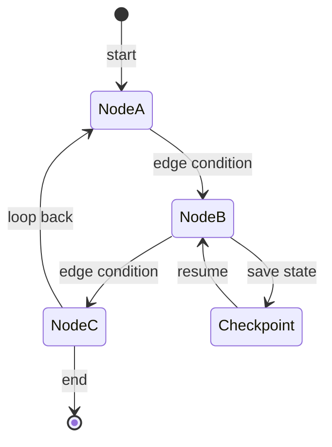

# Module 07 — Agents & LangGraph

> **Agent spawn**: `@Memory.md` + this file + `@modules/07-agents-langgraph/NOTES.md`  
> **Nav**: ← [Module 06](../06-tools-function-calling/MODULE.md) · Next → [Module 08](../08-mcp/MODULE.md)

## At a glance

| | |
|---|---|
| Prerequisites | Module 06 |
| Duration | ~5–8 sessions |
| Project? | No |
| Exit test | Agent loop guards + checkpoint resume bina notes ke |

## Visual map

> **Kaise padho**: Pehle diagram dekho → topics padho → session end pe "Redraw challenge" bina dekhe draw karo



```
LangGraph state graph

  [START] ──► (node: plan) ──► (node: act) ──► (node: check)
                  ▲                              │
                  └──────── retry loop ──────────┘

  ◆ checkpoint = saved state (resume after crash)
  ─── edges = conditional routing
```

### Mental model (1 line)

LangGraph = nodes (steps) + edges (routing) + checkpoints (state save) — agent flow ek graph hai, linear script nahi.

### Redraw challenge

3 nodes, conditional edges, aur checkpoint save/resume points bina dekhe draw karo.

## Read order

1. Objectives → 2. Learning hooks → 3. Topics → 4. Assignments → 5. Coach se active recall

**Prerequisites**: Module 06  
**Duration**: ~5–8 sessions

## Objectives

1. Agent = loop + state + tools — architecture samjho
2. LangGraph graphs: nodes, edges, conditional routing
3. Checkpointing for durability

## Learning hooks

| Concept | Parallel |
|---------|----------|
| Agent loop | Kafka worker consume → process → publish |
| State graph | 5-stage refund state machine |
| Checkpoints | Savepoints — resume after crash |
| Conditional edge | Stage failure routing |
| Memory | Session state vs Postgres ledger |

## Topics

- ReAct pattern (reason + act)
- LangGraph: StateGraph, nodes, END
- Human messages in loop
- Persistence & thread IDs
- Max iteration guards
- Short vs long-term memory patterns

## Assignments

| # | Task | Passing criteria |
|---|------|------------------|
| A1 | 2-node graph: classify → respond | Routing works on 10 test inputs |
| A2 | Tool-calling agent graph stub | Completes multi-step task |
| A3 | Checkpoint resume stub | Kill mid-run → resume from last state |

## Active recall

1. Agent infinite loop kaise rokoge production mein?
2. Checkpoint storage kahan — memory vs Postgres?
3. Single agent vs graph — kab graph zaroori?

## Progress checklist

- [ ] Objectives recall bina notes ke
- [ ] Assignments A1–A3 pass
- [ ] NOTES.md session log updated
