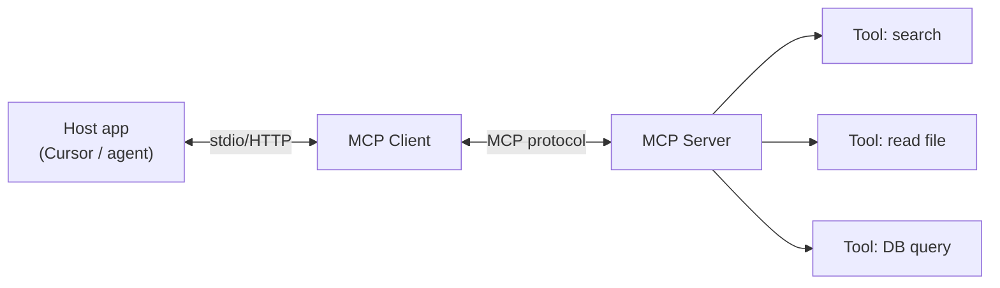
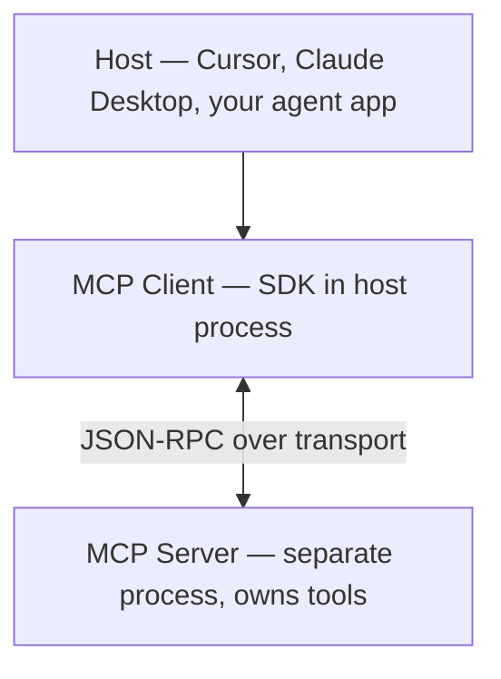
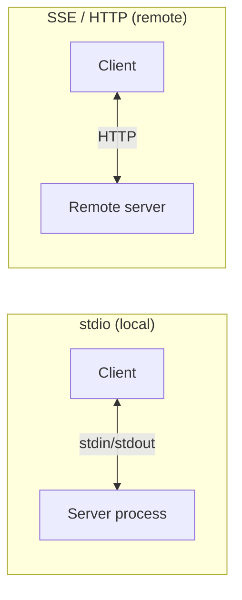
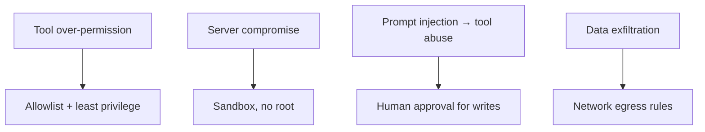

# Module 08 — MCP (Model Context Protocol)

> **Padho**: Isi file mein **Theory** — bahar mat jao.  
> **Likho**: `practice/` folder. **Pucho**: Cursor chat `@MODULE.md`  
> **Nav**: ← [Module 07](../07-agents-langgraph/MODULE.md) · Next → [Module 09](../09-multi-agent-hitl/MODULE.md)

## At a glance

| | |
|---|---|
| Prerequisites | Module 07 |
| Duration | ~3–5 sessions |
| Project? | No |
| Exit test | MCP vs inline tools + threat model bina notes ke |

## Visual map



```
Host (Cursor IDE)
    ↔  MCP Client (in-process)
            ↔  MCP Server (separate process)
                    ├── tool: search
                    ├── tool: read_file
                    └── tool: run_query
```

**Mental model**: Host MCP Client se baat karta hai, Client Server se — tools process ke bahar, protocol se plug-in hote hain.

**Redraw challenge**: Host ↔ Client ↔ MCP Server ↔ Tools chain bina dekhe draw karo.

---

## Read order

1. Visual map → 2. **Theory** (neeche) → 3. **Practice** → 4. Chat agar doubt → 5. NOTES

---

## Learning hooks

| Concept | Parallel |
|---------|----------|
| MCP server | Microservice with OpenAPI |
| Tool listing | API discovery / swagger |
| Resource URIs | REST resource paths |
| Auth | JWT-scoped integrations |

---

## Theory

### 1. MCP kya solve karta hai

Har integration ke liye custom Python function likhoge → N agents × M tools = spaghetti.

```
MCP = USB-C for AI tools
  - standard discovery (list tools)
  - standard invoke (call tool)
  - standard resources (read context)
```

*(Active recall Q1: MCP vs hardcoded — jab third-party tools, multiple hosts, team-shared integrations)*

---

### 2. Host, Client, Server — roles



| Component | Kaam |
|-----------|------|
| **Host** | UI + orchestration — user interact karta hai |
| **Client** | Protocol client — connect, list, invoke |
| **Server** | Tools/resources implement — DB, files, APIs |

**Cursor example:** Cursor = Host, built-in MCP Client, tumhara `postgres-mcp` = Server.

---

### 3. Tools vs Resources

```
Tools     = actions  → search_db(query), send_webhook(url)
Resources = read-only context → file://docs/policy.md, db://schema
```

Agent pehle resources padh sakta hai, phir tool call kare.

---

### 4. Transports — stdio vs SSE/HTTP



| Transport | Kab |
|-----------|-----|
| `stdio` | Local dev, Cursor config, subprocess spawn |
| `SSE` / `HTTP` | Remote shared server, team infra |

```
# Cursor mcp.json mental model
{
  "mcpServers": {
    "my-db": {
      "command": "python",
      "args": ["server.py"]
    }
  }
}
```

---

### 5. LangGraph / gateway se wire karna

```
Agent graph node "tools"
  → MCP Client.list_tools()
  → LLM picks tool
  → MCP Client.call_tool(name, args)
  → result back to agent state
```

Inline Python tools se farq: server alag deploy, version, auth scope.

---

### 6. Security — threat model



| Risk | Mitigation |
|------|------------|
| Excessive agency | write tools behind HITL (Module 09) |
| Server crash | *(Active recall Q2)* graceful degrade — agent informs user, retry |
| Name collision | *(Active recall Q3)* prefix tools `servername_tool` |
| Untrusted MCP | vet server code, pin versions |

---

## Practice

> Code **tum** likhoge Cursor mein. Stubs `practice/` mein hain.  
> Stuck? Chat: `@modules/08-mcp/MODULE.md` + error paste karo.

| # | File | Kya karna hai | Pass when |
|---|------|---------------|-----------|
| A1 | `practice/mcp_server.py` | `read_db` + `write_webhook` stubs | Client discovers + invokes both |
| A2 | `practice/agent_mcp_wire.py` | Wire MCP into agent | Agent uses external MCP tool |
| A3 | `practice/THREAT_MODEL.md` | 5 risks + mitigations | Review complete |

---

## Active recall (khud jawab likho NOTES mein)

1. MCP kab use karoge vs hardcoded Python functions?
2. MCP server crash — agent behavior kya honi chahiye?
3. Multiple MCP servers — tool name collision kaise handle?

**Chat drill** (optional): "Module 08 — MCP security 3 risks"

---

## Progress checklist

- [ ] Theory Section 1–6 padh liya
- [ ] Redraw challenge kiya
- [ ] Practice A1–A3 pass
- [ ] Active recall NOTES mein likha
- [ ] NOTES session log updated

---

## Optional appendix (zarurat ho tab)

- [MCP Introduction](https://modelcontextprotocol.io/introduction) — protocol overview
- [MCP Build server](https://modelcontextprotocol.io/docs/develop/build-server) — Python quickstart
