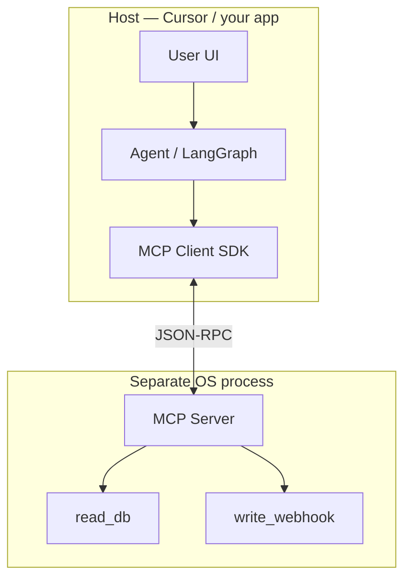
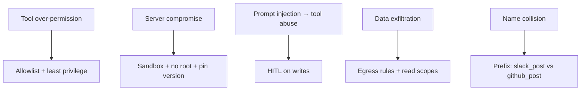

# Module 08 — MCP (Model Context Protocol)

> **Padho**: Isi file mein **Theory** — bahar mat jao.  
> **Likho**: `practice/` folder. **Pucho**: Cursor chat `@MODULE.md`  
> **Nav**: ← [Module 07](../07-agents-langgraph/MODULE.md) · Next → [Module 09](../09-multi-agent-hitl/MODULE.md)

> **Format**: Textbook — §0 pehle (terms from zero). `@MODULE-TEACHING-STANDARD.md`

## At a glance

| | |
|---|---|
| Prerequisites | Module 07 (LangGraph agent + tools node). Module 06 tool schemas |
| Duration | ~3–5 sessions |
| Project? | No (Project B mein MCP tools wire — Module 11 M3) |
| Exit test | Host vs Client vs Server + threat model bina notes ke explain karo |

## Visual map

**Mental model (§0 ke baad yeh samajh aayega):**

```
Cursor IDE (Host)
    ↔  MCP Client (IDE ke andar, SDK)
            ↔  MCP Server (alag process — tumhara Python script)
                    ├── tool: read_db
                    ├── tool: write_webhook
                    └── resource: file://policy.md
```

**Redraw challenge**: Host → Client → Server → Tool chain — arrows ke saath bina dekhe draw karo. Stdio transport kahan fit hota hai likho.

---

## Read order (strict — mat chhodna)

| Session | Padho | Karo (Practice) |
|---------|-------|-----------------|
| 1 | §0 Terms + §1 Problem | Cursor settings mein MCP section dekho (read-only) |
| 2 | §2 Roles + §3 Tools vs Resources | **A1** start — `mcp_server.py` |
| 3 | §4 Transports | **A1** complete — client se discover + invoke |
| 4 | §5 LangGraph wire + §6 Security | **A2** — `agent_mcp_wire.py` |
| 5 | §6 Threat model deep | **A3** — `THREAT_MODEL.md` |
| 6 | Active recall + redraw | Checklist |

---

## Learning hooks (tera parallel — optional)

| Concept | Tum already jaante ho |
|---------|----------------------|
| MCP Server | Microservice with OpenAPI — ek kaam, alag deploy |
| `list_tools` | Swagger `/openapi.json` — discovery |
| Resource URI | REST `GET /files/{id}` — read-only context |
| stdio transport | Subprocess spawn — jaise `kubectl port-forward` local |
| Auth on server | JWT-scoped integration — tenant credentials |

---

## Theory

### §0. Terms pehli baar — MCP host, client, server

Module 06–07 mein tools **tumhare Python code ke andar** the — `def search_docs(...)`. Jab 10 integrations × 3 agents ho jayein, har jagah copy-paste + version mess.

**MCP (Model Context Protocol)** = tools ke liye **standard plug-in port** — jaise USB-C: ek format, alag devices.

#### 0.1 Teen roles — confusion mat karo

| Role | Kaun hota hai | Real example |
|------|---------------|--------------|
| **Host** | App jahan user baithta hai | Cursor IDE, Claude Desktop, tumhara FastAPI dashboard |
| **Client** | Host ke andar protocol library | Cursor ka built-in MCP client, tumhara `mcp` Python client |
| **Server** | Alag process — tools implement karta hai | `mcp_server.py`, `postgres-mcp`, `github-mcp` |

```
User types in Cursor (Host)
  → Host ka MCP Client connect karta hai Server se
  → Client: "tools list bhejo"
  → Server: [read_db, write_webhook, ...]
  → LLM tool pick karta hai
  → Client: call_tool("read_db", {query: "..."})
  → Server execute karke result return
```

**Important:** User Server se direct baat nahi karta — hamesha Host → Client → Server.

#### 0.2 Tool vs Resource vs Prompt (protocol concepts)

| Capability | Kya hai | Agent use |
|------------|---------|-----------|
| **Tool** | Action — side effect ho sakta hai | `write_webhook`, `send_email` |
| **Resource** | Read-only context | `file://docs/refund-policy.md` |
| **Prompt** | Pre-built template (optional) | "Summarize this ticket" template |

Module practice mein **Tools** focus — Resources A2+ mein optional read.

#### 0.3 Mini mental code — server stub

```python
# Simplified shape — asli SDK alag ho sakta hai, idea same hai
from mcp.server import Server
from mcp.server.stdio import stdio_server

server = Server("practice-db")

@server.tool()
async def read_db(query: str) -> str:
    """Run read-only SQL query. Use for lookups."""
    rows = [{"id": 1, "status": "paid"}]  # stub
    return str(rows)

@server.tool()
async def write_webhook(url: str, payload: dict) -> str:
    """POST payload to URL. DESTRUCTIVE — needs approval in prod."""
    print(f"STUB webhook → {url}: {payload}")
    return "ok"

async def main():
    async with stdio_server() as (read, write):
        await server.run(read, write)

# if __name__ == "__main__": asyncio.run(main())
```

**Line-by-line:**

| Line / symbol | Matlab |
|---------------|--------|
| `Server("practice-db")` | Server instance — naam logging ke liye |
| `@server.tool()` | Decorator — yeh function MCP tool ban gaya |
| `read_db(query: str)` | Tool schema args se auto-generate hota hai |
| Docstring | LLM ko description — Module 06 schema `description` jaisa |
| `stdio_server()` | Transport: stdin/stdout pipes — parent process se baat |
| `server.run(read, write)` | Event loop — JSON-RPC messages suno |

**§0 checkpoint:**
1. Host aur Server alag kyun hote hain?
2. Tool aur Resource mein farq?
3. Cursor mein tumhara `mcp_server.py` kaun sa role play karta hai?

| Error message | Kyun | Fix |
|---------------|------|-----|
| `Connection closed` | Server start nahi / crash | Server logs dekho, `python mcp_server.py` manually |
| Tool not in list | Decorator / register miss | `@server.tool()` + server restart |
| `JSON-RPC parse error` | Invalid message format | SDK version match karo |

---

### §1. Problem pehle — hardcoded tools kahan fail

**Problem:** Project B mein Slack, Postgres, webhook, email — har ek ke liye agent repo mein Python function?

```
N agents × M integrations = N×M copies
  - Slack API change → 3 jagah fix
  - Credential har function mein alag
  - Team B ka DB tool Team A reuse nahi kar sakti
```

**MCP solve:**
- Ek **Server** per integration domain (DB server, comms server)
- Koi bhi **Host** (Cursor, tumhara agent) same Server plug kar sakta hai
- Discovery standard — `list_tools()` — naye tool ke liye agent code change kam

**Kab MCP nahi chahiye:**
- Sirf 1 internal function, 1 prototype
- Latency bahut critical (extra process hop)
- Tool logic agent ke saath tightly coupled honi chahiye

> **→ Practice A1** (pass: server 2 tools expose, client discover + invoke)

---

### §2. Host, Client, Server — wire diagram detail



**Request flow:**
1. Host agent ko user message milta hai
2. Client connected servers se `list_tools()` — merged tool list
3. Tools LLM ko schema ke saath (Module 06 format jaisa)
4. LLM `tool_call` return karta hai
5. Client `call_tool(name, args)` Server ko bhejta hai
6. Server result JSON — agent state mein append

| Component | Deploy | Crash impact |
|-----------|--------|--------------|
| Host | User machine / your cloud | UI down |
| Client | Host process ke andar | Host restart = reconnect |
| Server | Subprocess ya remote container | Tools unavailable — graceful degrade |

---

### §3. Tools vs Resources — kab kya

```
Tools     = verbs  → search_db(q), send_slack(msg), write_webhook(url, body)
Resources = nouns  → file://policy/refund.md, db://schema/invoices
```

**Typical agent flow:**
1. Resource read — context load ("refund policy kya hai?")
2. Tool call — action ("query overdue invoices")
3. Tool call — write ("send email") — HITL gate (Module 09)

```python
# Client side — conceptual
tools = await session.list_tools()
# tools.tools = [{name: "read_db", description: "...", inputSchema: {...}}, ...]

result = await session.call_tool("read_db", {"query": "SELECT * FROM orders LIMIT 5"})
# result.content = text / structured data for LLM
```

| Error message | Kyun | Fix |
|---------------|------|-----|
| `Tool not found: read_db` | Typo ya server alag | `list_tools()` se exact name |
| Invalid args | Schema mismatch | `inputSchema` ke against validate |
| Timeout | Slow DB / network | Per-tool timeout + retry policy |

---

### §4. Transports — stdio vs HTTP/SSE

| Transport | Kaise | Kab |
|-----------|-------|-----|
| **stdio** | Parent spawn: `python server.py`, pipes stdin/stdout | Cursor local config, dev |
| **SSE / HTTP** | Remote URL `https://mcp.company.com/slack` | Team shared, production |

**Cursor `mcp.json` mental model:**

```json
{
  "mcpServers": {
    "practice-db": {
      "command": "python",
      "args": ["/absolute/path/to/mcp_server.py"],
      "env": { "DATABASE_URL": "postgresql://..." }
    }
  }
}
```

| Field | Matlab |
|-------|--------|
| `practice-db` | Server alias — logs mein dikhega |
| `command` + `args` | OS subprocess spawn — stdio transport |
| `env` | Server ko secrets — **prompt mein kabhi mat daalo** |

**Flow stdio:**
1. Cursor `python mcp_server.py` spawn
2. Client ↔ Server stdin/stdout pe JSON-RPC
3. Cursor band → subprocess kill

| Error message | Kyun | Fix |
|---------------|------|-----|
| `ENOENT python` | Wrong command path | Full path `python3` ya venv python |
| Server instant exit | Import error in server | Terminal mein manually run karke traceback dekho |
| Remote 401 | HTTP auth missing | Bearer token / mTLS config |

> **→ Practice A1** stdio transport se complete karo

---

### §5. LangGraph agent se MCP wire karna

Module 07 ka `tools` node ab **inline functions** ki jagah **MCP client** use karega.

```
LangGraph "agent" node
  → LLM returns tool_call
  → "tools" node:
       if tool from MCP:
         mcp_client.call_tool(name, args)
       else:
         local_python_fn(name, args)
  → result → messages → wapas "agent"
```

```python
# Conceptual tools node
async def mcp_tools_node(state: AgentState) -> dict:
    last = state["messages"][-1]
    results = []
    for tc in last.tool_calls:
        if tc.name in mcp_tool_names:
            out = await mcp_session.call_tool(tc.name, tc.args)
        else:
            out = LOCAL_TOOLS[tc.name](**tc.args)
        results.append(format_tool_message(tc.id, out))
    return {"messages": state["messages"] + results}
```

| Line | Matlab |
|------|--------|
| `mcp_tool_names` | `list_tools()` se cache — startup pe ek baar |
| `call_tool` | Network/subprocess hop — latency add |
| Local fallback | Internal tools MCP mein daalne ki zarurat nahi |

**Inline vs MCP tradeoff:**

| | Inline Python | MCP Server |
|---|---------------|------------|
| Setup | Fast | Extra process |
| Reuse | Copy paste | Plug same server |
| Versioning | Git monolith | Server semver alag |
| Security boundary | Same process | Process isolation |

> **→ Practice A2** (pass: agent external MCP tool se task complete)

---

### §7. Multiple MCP servers — naming, auth, failure

**Problem:** Project B mein Slack MCP + Postgres MCP + custom webhook server — teen processes.

```
Agent startup:
  for server in configured_servers:
      session = connect(server)
      tools += session.list_tools()   # merge with prefix

Tool call:
  if name.startswith("slack_"):
      slack_session.call_tool(...)
```

| Pattern | Example |
|---------|---------|
| Prefix | `db_read`, `slack_post` |
| Server alias in config | `mcp_servers: [db, slack]` |
| Per-tenant enable | Tenant A sirf db — slack off |

**Auth:** har server ko scoped credential — tenant vault se env inject, rotate without agent redeploy.

**Partial failure:** ek server down → baaki tools available; LLM ko batayo kaunse tools unavailable.

| Error message | Kyun | Fix |
|---------------|------|-----|
| Duplicate tool names | Merge without prefix | Rename on register |
| Wrong server for tool | Routing table missing | `tool_to_server` map |

---

### §6. Security — threat model (OWASP LLM06)

MCP se tools **bahar** aate hain — attack surface badhti hai.



| Risk | Example | Mitigation |
|------|---------|------------|
| Excessive agency | "Delete all rows" tool | Write tools HITL + allowlist tables |
| Server crash | DB MCP down | Agent: "Tool unavailable, retry later" — user ko clear message |
| Untrusted server | Random GitHub MCP | Vet code, pin commit, separate creds |
| Credential leak | API key in tool args log | Vault per tenant — Module 11 |
| Tool name collision | 2 servers both `search` | Prefix `db_search`, `docs_search` |

**Server crash — agent behavior:**
```
❌ Galat: silent fail, LLM hallucinate answer
✅ Sahi: tool result = {"error": "mcp_db unavailable", "retryable": true}
         LLM user ko honest message
```

| Error message | Kyun | Fix |
|---------------|------|-----|
| MCP server OOM | Heavy query | Query limits + read-only DB user |
| Permission denied | Tool needs admin | Least-privilege DB role |

> **→ Practice A3** (pass: `THREAT_MODEL.md` — 5 risks + mitigations)

---

## Practice

> **Saare assignments**: [`practice/README.md`](practice/README.md)  
> Stuck? `@modules/08-mcp/MODULE.md` + error paste.

| # | Theory § | File | Pass when |
|---|----------|------|-----------|
| A1 | §0–§4 | `practice/mcp_server.py` | Client discovers + invokes `read_db` + `write_webhook` |
| A2 | §5 | `practice/agent_mcp_wire.py` | LangGraph agent MCP tool se task complete |
| A3 | §6 | `practice/THREAT_MODEL.md` | 5 risks + mitigations documented |

---

## Active recall (khud jawab likho NOTES mein)

1. MCP kab use karoge vs hardcoded Python function? — 3 criteria.
2. Host, Client, Server — ek line each, Cursor example ke saath.
3. MCP server crash — agent ko kya karna chahiye? User kya dekhe?
4. Do servers same tool name — fix?

**Chat drill** (optional): "Module 08 — MCP security 3 risks whiteboard"

---

## Progress checklist

- [ ] §0 — host/client/server bina dekhe explain
- [ ] Session table follow kiya
- [ ] Practice A1–A3 pass
- [ ] Redraw challenge
- [ ] Active recall NOTES
- [ ] NOTES session log

---

## Optional appendix

- [MCP Introduction](https://modelcontextprotocol.io/introduction)
- [MCP Build server](https://modelcontextprotocol.io/docs/develop/build-server)
- Module 07 — LangGraph tools node
- Module 11 M3 — production MCP + credential vault
