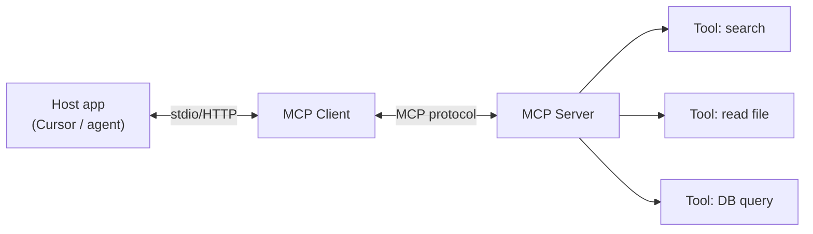

# Module 08 — MCP (Model Context Protocol)

> **Agent spawn**: `@Memory.md` + this file + `@modules/08-mcp/NOTES.md`  
> **Nav**: ← [Module 07](../07-agents-langgraph/MODULE.md) · Next → [Module 09](../09-multi-agent-hitl/MODULE.md)

## At a glance

| | |
|---|---|
| Prerequisites | Module 07 |
| Duration | ~3–5 sessions |
| Project? | No |
| Exit test | MCP vs inline tools + threat model bina notes ke |

## Visual map

> **Kaise padho**: Pehle diagram dekho → topics padho → session end pe "Redraw challenge" bina dekhe draw karo



```
Host (Cursor IDE)
    ↔  MCP Client (in-process)
            ↔  MCP Server (separate process)
                    ├── tool: search
                    ├── tool: read_file
                    └── tool: run_query
```

### Mental model (1 line)

Host MCP Client se baat karta hai, Client Server se — tools process ke bahar, protocol se plug-in hote hain.

### Redraw challenge

Host ↔ Client ↔ MCP Server ↔ Tools chain bina dekhe draw karo.

## Read order

1. Visual map → 2. **Padhai kahan se** (links padho) → 3. Topics tick → 4. Coach recall → 5. Assignments

**Prerequisites**: Module 07  
**Duration**: ~3–5 sessions

## Objectives

1. MCP architecture: hosts, clients, servers
2. Tools/resources expose karna standard protocol se
3. Zapier-style integrations ko MCP tools banao

## Learning hooks

| Concept | Parallel |
|---------|----------|
| MCP server | Microservice with OpenAPI |
| Tool listing | API discovery / swagger |
| Resource URIs | REST resource paths |
| Auth | JWT-scoped integrations |

## Padhai kahan se (Study material)

> **Topics = checklist. Neeche padho → phir Coach → phir Assignment.**  
> Poora flow: [[HOW-TO-STUDY|HOW-TO-STUDY.md]]

### Session 1 (~50 min) — MCP architecture

| # | Topic (checklist) | Padho yahan | Time |
|---|-------------------|-------------|------|
| 1 | MCP overview | [Model Context Protocol — Introduction](https://modelcontextprotocol.io/introduction) — hosts, clients, servers | 20 min |
| 2 | Core concepts | [MCP — Architecture](https://modelcontextprotocol.io/docs/concepts/architecture) — tools, resources, transports | 20 min |
| 3 | vs inline tools | Topics — MCP vs inline function definitions | 10 min |

**Session 1 ke baad Coach se pucho:** "MCP kab use karoge vs hardcoded Python functions?" (Active recall Q1)

### Session 2 (~40 min) — Building + security

| # | Topic (checklist) | Padho yahan | Time |
|---|-------------------|-------------|------|
| 1 | Build a server | [MCP — Build server quickstart](https://modelcontextprotocol.io/docs/develop/build-server) — Python skim | 25 min |
| 2 | Security | Topics — sandbox, allowlists + threat model mindset | 15 min |

**Session 2 ke baad:** Assignment A1 start (Cursor)

### Optional video (1 dekh lo, 1x speed ok)

- [MCP Explained](https://www.youtube.com/watch?v=7j_NE6Pjv-E) — visual learner ke liye Host ↔ Client ↔ Server chain

### Coach prompt (padhai ke baad)

```
@Memory.md @modules/08-mcp/MODULE.md

Maine Session 1–2 resources padh liye. Flowchart ke saath explain karo:
Host ↔ MCP Client ↔ MCP Server ↔ Tools. Phir 3 security risks + mitigations.
Code mat likh.
```

## Topics

- MCP vs inline function definitions
- stdio vs SSE transport
- Building a minimal MCP server (Python)
- Connecting LangGraph / gateway to MCP tools
- Security: sandbox, allowlists

## Assignments

| # | Task | Passing criteria |
|---|------|------------------|
| A1 | MCP server: `read_db` + `write_webhook` stubs | Client discovers + invokes both |
| A2 | Wire MCP tool into agent from Module 07 | Agent uses external MCP tool |
| A3 | Threat model doc | 5 risks + mitigations |

## Active recall

1. MCP kab use karoge vs hardcoded Python functions?
2. MCP server crash — agent behavior kya honi chahiye?
3. Multiple MCP servers — tool name collision kaise handle?

## Progress checklist

- [ ] Objectives recall bina notes ke
- [ ] Assignments A1–A3 pass
- [ ] NOTES.md session log updated
