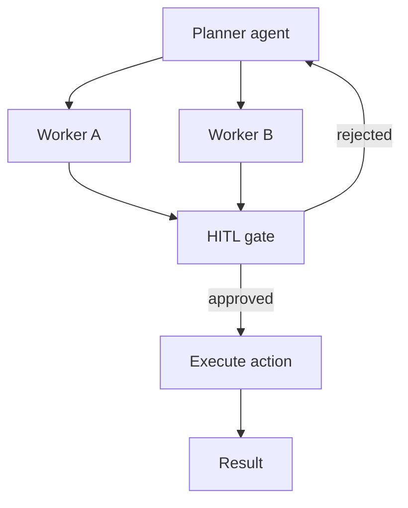
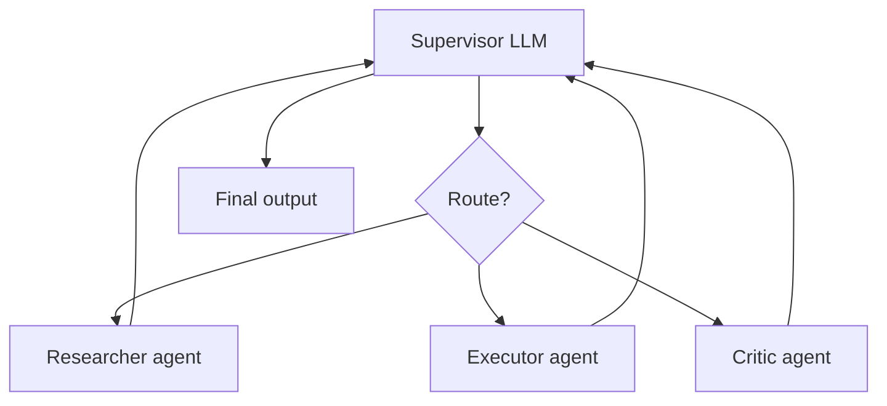

# Module 09 — Multi-Agent & Human-in-the-Loop

> **Padho**: Isi file mein **Theory** — bahar mat jao.  
> **Likho**: `practice/` folder. **Pucho**: Cursor chat `@MODULE.md`  
> **Nav**: ← [Module 08](../08-mcp/MODULE.md) · Next → [Module 10](../10-evals-llmops/MODULE.md)

## At a glance

| | |
|---|---|
| Prerequisites | Module 08 |
| Duration | ~4–6 sessions |
| Project? | No |
| Exit test | HITL gate + supervisor routing bina notes ke |

## Visual map



```
Planner ──► Worker A ──┐
         └► Worker B ──┼──► [HITL GATE] ──approve──► execute
                        │         │
                        │      reject
                        └─────────┘ (back to planner)
```

**Mental model**: Planner workers ko task deta hai, lekin risky action HITL gate se guzarna zaroori — human approve kare tab hi execute.

**Redraw challenge**: Planner → workers → HITL gate → execute flow (reject arrow wapas planner pe) bina dekhe draw karo.

---

## Read order

1. Visual map → 2. **Theory** (neeche) → 3. **Practice** → 4. Chat agar doubt → 5. NOTES

---

## Learning hooks

| Concept | Parallel |
|---------|----------|
| Planner / worker agents | Orchestrator vs Kafka workers |
| HITL approval | Manager sign-off on large refund |
| Excessive agency | Atomic deactivation safety |
| Agent handoff | Stage output → next stage input |
| Rollback on reject | Savepoint rollback |

---

## Theory

### 1. Multi-agent kyun — ek agent sab nahi kar sakta

```
Single agent problems:
  - prompt bloat (too many tools)
  - role confusion
  - cost (big model for simple routing)
```

**Split roles:** planner routes, specialists execute.

---

### 2. Supervisor pattern



```
Supervisor reads task + worker outputs
  → assigns next worker OR finishes
```

**Tera hook:** Kafka orchestrator — message type decide karke right worker ko bhejo.

**Cost control:** *(Active recall Q3)*
- small model supervisor, big model only for hard steps
- max delegation depth
- cache researcher results

---

### 3. Specialist agents

| Agent | Role |
|-------|------|
| Researcher | gather context, read-only tools |
| Executor | write tools, side effects |
| Critic | review before ship — optional overhead |

*(Active recall Q2: critic worth it jab high-stakes output; skip for simple FAQ)*

---

### 4. HITL gates — irreversible actions pe


**LangGraph:** `interrupt_before` node — graph pause, state persisted, resume on approve.

```
Actions needing HITL:
  - send money, delete data, external webhook
  - NOT: read search, summarize
```

*(Active recall Q1: sync HITL = user waits in UI, high trust, bad for async jobs; async HITL = queue approval, email/Slack, better for long workflows)*

---

### 5. Audit log — har step traceable

```json
{
  "run_id": "run_abc",
  "step": 3,
  "agent": "executor",
  "action": "propose_refund",
  "payload": {"order_id": "o_1", "amount": 500},
  "hitl_status": "approved",
  "approved_by": "user_42",
  "timestamp": "2026-06-26T10:00:00Z"
}
```

Interview: "Show me why this refund happened" → audit trail.

**Rollback on reject:** savepoint — proposed action never executed, state wapas planner pe.

---

## Practice

> **Saare assignments ek jagah**: [`practice/README.md`](practice/README.md) — problem statements, instructions, pass criteria.  
> Code **tum** likhoge Cursor mein. Stubs `practice/` mein hain (`TODO` search).  
> Stuck? Chat: `@modules/09-multi-agent-hitl/MODULE.md` + error paste karo.

| # | File | Kya karna hai | Pass when |
|---|------|---------------|-----------|
| A1 | `practice/supervisor_router.py` | Route to 2 specialists | Correct routing 8/10 tasks |
| A2 | `practice/hitl_gate.py` | Pause before irreversible action | Reject → rollback path |
| A3 | `practice/audit_log.py` | Log each agent step | Queryable decision trail |

---

## Active recall (khud jawab likho NOTES mein)

1. HITL sync vs async approval — product impact?
2. Critic agent kab worth it vs overhead?
3. Multi-agent cost control strategies?

**Chat drill** (optional): "Module 09 — HITL flow whiteboard"

---

## Progress checklist

- [ ] Theory Section 1–5 padh liya
- [ ] Redraw challenge kiya
- [ ] Practice A1–A3 pass
- [ ] Active recall NOTES mein likha
- [ ] NOTES session log updated

---

## Optional appendix (zarurat ho tab)

- [LangGraph Multi-agent](https://langchain-ai.github.io/langgraph/concepts/multi_agent/) — supervisor patterns
- [LangGraph Human-in-the-loop](https://langchain-ai.github.io/langgraph/how-tos/human_in_the_loop/) — interrupt API
