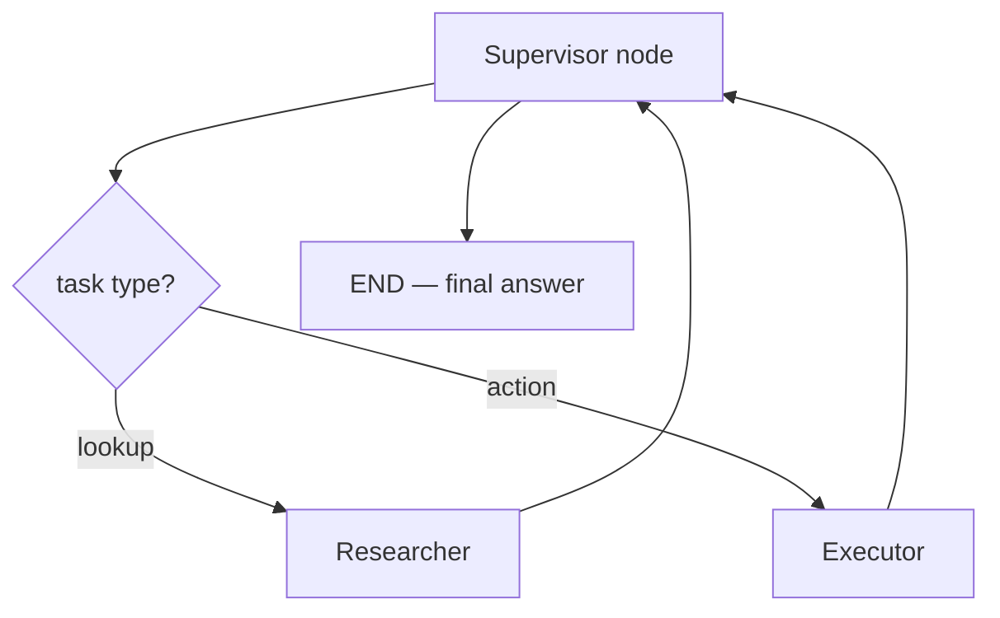
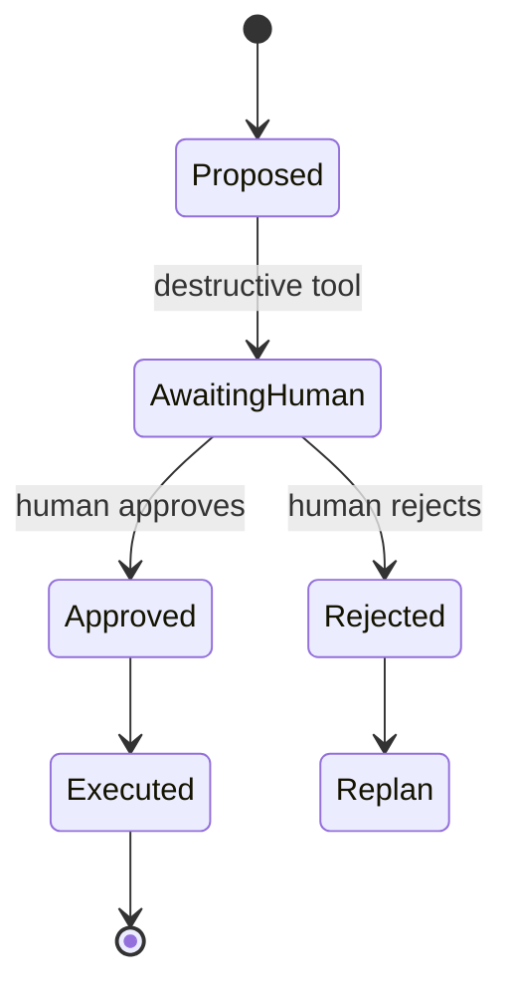

# Module 09 — Multi-Agent & Human-in-the-Loop

> **Padho**: Isi file mein **Theory** — bahar mat jao.  
> **Likho**: `practice/` folder. **Pucho**: Cursor chat `@MODULE.md`  
> **Nav**: ← [Module 08](../08-mcp/MODULE.md) · Next → [Module 10](../10-evals-llmops/MODULE.md)

> **Format**: Textbook — §0 pehle (terms from zero). `@MODULE-TEACHING-STANDARD.md`

## At a glance

| | |
|---|---|
| Prerequisites | Module 07 (LangGraph) + Module 08 (MCP tools). Module 06 structured outputs |
| Duration | ~4–6 sessions |
| Project? | No (Project B HITL gates — Module 11 M4) |
| Exit test | Supervisor routing + HITL interrupt flow bina notes ke whiteboard karo |

## Visual map

**Mental model (§0 ke baad):**

```
User task
    ↓
Supervisor (routes)
    ├── Researcher (read-only tools)
    └── Executor (write tools)
              ↓
        [HITL GATE] ──approve──► execute irreversible action
              │
           reject → rollback → supervisor replan
```

**Redraw challenge**: Planner → 2 workers → HITL gate → execute. Reject arrow wapas planner pe. Audit log kahan likho mark karo.

---

## Read order (strict — mat chhodna)

| Session | Padho | Karo (Practice) |
|---------|-------|-----------------|
| 1 | §0 Terms + §1 Problem | Socho: kaunse actions bina human ke nahi chalne chahiye |
| 2 | §2 Supervisor pattern | **A1** start — `supervisor_router.py` |
| 3 | §3 Specialist agents | **A1** complete — 8/10 routing |
| 4 | §4 HITL gates | **A2** — `hitl_gate.py` |
| 5 | §5 Audit + rollback | **A3** — `audit_log.py` |
| 6 | Active recall + redraw | Checklist |

---

## Learning hooks (tera parallel — optional)

| Concept | Tum already jaante ho |
|---------|----------------------|
| Supervisor | Kafka orchestrator — message type → right consumer |
| Specialist worker | Domain microservice — billing service vs notify service |
| HITL approval | Manager sign-off on large refund — savepoint se pehle |
| Rollback on reject | TX rollback — proposed action execute nahi hua |
| Audit log | Payment audit trail — har state transition logged |

---

## Theory

### §0. Terms pehli baar — multi-agent, HITL

#### 0.1 Multi-agent — ek LLM sab kyun nahi

**Multi-agent** = ek task ke liye **alag roles** wale agents — har ek limited tools + focused prompt.

```
Single mega-agent problems:
  - Prompt mein 20 tools → LLM confuse ("galat tool pick")
  - Ek model har kaam — mehnga (Opus se "hello" route)
  - Blame mushkil — kaunse step ne galat refund kiya?
```

**Split:**
| Agent | Role | Tools |
|-------|------|-------|
| Supervisor | Route + synthesize | Usually no writes |
| Researcher | Gather facts | Read-only: search, get_order |
| Executor | Side effects | Write: refund, webhook |
| Critic (optional) | Review before ship | Read output, no external IO |

#### 0.2 HITL — Human-in-the-Loop

**HITL** = irreversible ya high-risk action se pehle **human approve** mandatory.

```
❌ Bina HITL: Agent → send_refund($50,000) → done
✅ HITL ke saath: Agent → PROPOSE refund → PAUSE → human OK → execute
```

**Tera payment parallel:** Large refund → manager approval queue — execute tab jab sign-off. LangGraph mein `interrupt_before` = graph pause, state save, UI se approve/reject.

#### 0.3 Terms table

| Term | Matlab |
|------|--------|
| **Handoff** | Ek agent output doosre agent input ban jata hai |
| **Supervisor** | Central router — kaunsa worker next |
| **HITL gate** | Node jahan graph rukta hai human ke liye |
| **Interrupt** | LangGraph API — run pause, checkpoint persist |
| **Resume** | `approve` ya `reject` ke baad graph aage |
| **Audit trail** | Har step JSON log — interview defence |

**§0 checkpoint:**
1. Multi-agent kab zaroori — 2 reasons?
2. HITL sirf "slow" workflows ke liye hai ya safety ke liye bhi?
3. Handoff example — researcher se executor ko kya milta hai?

---

### §1. Problem pehle — ek agent + 15 tools production mein

**Problem:** Project B user bolega: "Overdue invoice pe email bhejo aur Slack task banao aur agar amount > 10k ho toh refund initiate karo."

Ek agent ke saath:
- Refund tool galti se email step pe call ho sakta hai
- $10k refund bina approval
- Debugging: 40 tool calls ek thread mein

**Solution architecture:**
1. **Supervisor** task todta hai / worker choose karta hai
2. **Researcher** sirf data laata hai
3. **Executor** write propose karta hai
4. **HITL** destructive propose pe pause
5. **Audit** har transition log

```
Payment system jaisa:
  Orchestrator → Validation worker → Approval gate → Posting worker
```

> **→ Practice A1** (pass: supervisor 2 specialists ko 8/10 sahi route)

---

### §2. Supervisor pattern — routing graph



```python
from typing import Literal
from langgraph.graph import StateGraph, START, END

class TeamState(TypedDict):
    messages: list
    next_worker: str
    task: str
    step_log: list

def supervisor_node(state: TeamState) -> dict:
  # LLM ya rules: "research" | "execute" | "finish"
    decision = route_task(state["task"], state["messages"])
    return {"next_worker": decision, "step_log": state["step_log"] + [{"agent": "supervisor", "decision": decision}]}

def route_supervisor(state: TeamState) -> Literal["researcher", "executor", "finish"]:
    w = state["next_worker"]
    if w == "finish":
        return "finish"
    return w  # "researcher" or "executor"

graph.add_node("supervisor", supervisor_node)
graph.add_node("researcher", researcher_node)
graph.add_node("executor", executor_node)
graph.add_conditional_edges("supervisor", route_supervisor)
graph.add_edge("researcher", "supervisor")
graph.add_edge("executor", "supervisor")
```

**Line-by-line:**

| Line | Matlab |
|------|--------|
| `next_worker` | Supervisor ka decision state mein |
| `route_supervisor` | Conditional edge — agla node naam |
| `researcher → supervisor` | Worker khatam → wapas boss ko report |
| `step_log` | Audit ke liye — har supervisor decision |

**Cost control (production):**

| Strategy | Kaise |
|----------|-------|
| Small model supervisor | Haiku route, Sonnet sirf hard execute |
| Max delegation depth | 10 supervisor loops ke baad stop |
| Cache researcher | Same `order_id` query dubara mat karo |

| Error message | Kyun | Fix |
|---------------|------|-----|
| Infinite supervisor loop | Kabhi `finish` nahi | `max_delegations` + forced END |
| Wrong worker | Vague task | Supervisor prompt mein examples |

---

### §3. Specialist agents — least privilege tools

```python
RESEARCHER_TOOLS = ["search_orders", "get_invoice"]  # read-only
EXECUTOR_TOOLS = ["send_email", "propose_refund"]     # writes — HITL ke pehle

def researcher_node(state: TeamState) -> dict:
    # Sirf RESEARCHER_TOOLS LLM ko dikhao
    ...
    return {"messages": updated, "step_log": ...}
```

| Agent | Model size | Tools | Risk |
|-------|------------|-------|------|
| Researcher | Small OK | Read | Low |
| Executor | Larger | Write | High — HITL |
| Critic | Medium | None | Catches bad drafts |

**Critic kab worth it:**
- High-stakes external email / legal text → worth
- Internal lookup summary → overhead, skip

> **→ Practice A1** complete

---

### §4. HITL gates — LangGraph interrupt

**Destructive actions list (Project B):**
- `send_payment`, `write_webhook`, `delete_record`, `issue_refund`
- **NOT HITL:** `search_docs`, `summarize`, `list_orders`



```python
from langgraph.checkpoint.memory import MemorySaver

memory = MemorySaver()
app = graph.compile(
    checkpointer=memory,
    interrupt_before=["execute_destructive"],  # is node se PEHLE pause
)

config = {"configurable": {"thread_id": "run-xyz"}}

# Run until interrupt
app.invoke(initial_state, config)
# State saved — human UI shows proposal

# Approve path
app.invoke({"approve": True}, config)  # resume — execute runs

# Reject path — alag invoke ya Command pattern
app.invoke({"approve": False}, config)  # → replan edge
```

**Line-by-line:**

| Line | Matlab |
|------|--------|
| `interrupt_before=[...]` | Named node se pehle graph STOP |
| `checkpointer` | Pause pe state disk/memory mein |
| `thread_id` | Resume key — same run |
| `approve: True/False` | Human input — next edge decide |

**Sync vs Async HITL (product):**

| Mode | UX | Kab |
|------|-----|-----|
| **Sync** | User screen pe wait — "Approve?" button | High trust, fast decisions |
| **Async** | Email/Slack approval — run days tak pause | Long workflows, enterprise |

| Error message | Kyun | Fix |
|---------------|------|-----|
| Resume without checkpoint | `checkpointer=None` | `MemorySaver` / Postgres |
| Double execute on approve | Idempotency missing | `idempotency_key` on execute |
| Interrupt never hits | Node name typo | `interrupt_before` exact match |

> **→ Practice A2** (pass: reject → replan path works)

---

### §5. Audit log — har step traceable

**Problem:** Customer support: "Yeh refund kyun hua?" — production mein jawab audit se aata hai.

```json
{
  "run_id": "run_abc",
  "step": 3,
  "agent": "executor",
  "action": "propose_refund",
  "payload": {"order_id": "o_1", "amount": 500},
  "hitl_status": "approved",
  "approved_by": "user_42",
  "timestamp": "2026-06-26T10:00:00Z"
}
```

```python
def append_audit(state: TeamState, agent: str, action: str, payload: dict) -> list:
    entry = {
        "run_id": state["run_id"],
        "step": len(state["step_log"]) + 1,
        "agent": agent,
        "action": action,
        "payload": payload,
        "timestamp": datetime.utcnow().isoformat() + "Z",
    }
    return state["step_log"] + [entry]
```

**Rollback on reject:**
- Proposed action **execute nahi hua** — koi side effect nahi
- State `next_worker = "supervisor"` — replan
- Audit: `hitl_status: "rejected"`

**Query pattern:**
```python
def get_trail(run_id: str, logs: list) -> list:
    return [e for e in logs if e["run_id"] == run_id]
```

| Error message | Kyun | Fix |
|---------------|------|-----|
| Audit gap | Node ne log skip kiya | Har node exit pe `step_log` update |
| PII in logs | Full card number logged | Redact sensitive fields |

> **→ Practice A3** (pass: `run_id` se poora trail query)

---

### §6. Production patterns — sync UI, kill switch, quotas

Module practice CLI approve use karta hai. Production mein teen cheezein extra:

#### 6.1 HITL UI contract

```
Graph pause hone pe API return:
{
  "status": "awaiting_approval",
  "run_id": "run_xyz",
  "proposal": { "tool": "issue_refund", "args": {...} },
  "expires_at": "2026-06-28T12:00:00Z"
}

Approve POST /runs/run_xyz/approve  → graph resume
Reject  POST /runs/run_xyz/reject   → replan edge
```

| Field | Kyun |
|-------|------|
| `expires_at` | Stale proposals auto-reject — security |
| `proposal` | Human exactly kya approve kar raha hai dekhe |
| `run_id` | Audit + resume key |

#### 6.2 Kill switch (OWASP excessive agency)

```python
TENANT_KILL_SWITCH = os.getenv("AGENT_EXECUTION_ENABLED", "true") == "true"

def executor_node(state: TeamState) -> dict:
    if not TENANT_KILL_SWITCH:
        return {"messages": state["messages"] + [
            {"role": "assistant", "content": "Execution disabled by admin."}
        ]}
    ...
```

Ops team ek toggle se saare writes rok sakti hai — bina deploy ke (feature flag / Redis).

#### 6.3 Per-tenant execution quota

```
if tenant.monthly_runs >= tenant.plan_limit:
    return error — hard stop (Phase 2 spine)
```

Multi-agent loops mein quota jaldi exhaust — supervisor `max_delegations` + cost cap Module 10 se link.

| Error message | Kyun | Fix |
|---------------|------|-----|
| Orphaned paused run | User ne approve nahi kiya | Expiry job + notify |
| Kill switch race | Check only at start | Check har write node pe |

---

## Practice

> **Saare assignments**: [`practice/README.md`](practice/README.md)  
> Stuck? `@modules/09-multi-agent-hitl/MODULE.md` + error paste.

| # | Theory § | File | Pass when |
|---|----------|------|-----------|
| A1 | §1–§3 | `practice/supervisor_router.py` | 8/10 tasks sahi specialist |
| A2 | §4 | `practice/hitl_gate.py` | Interrupt + approve/reject paths |
| A3 | §5 | `practice/audit_log.py` | Queryable trail by `run_id` |

---

## Active recall (khud jawab likho NOTES mein)

1. HITL sync vs async — product impact ek example each?
2. Critic agent kab worth it vs skip?
3. Multi-agent cost control — 3 strategies?
4. Reject ke baad rollback kyun "safe" hai — execute node touch hua?

**Chat drill** (optional): "Module 09 — refund HITL flow whiteboard"

---

## Progress checklist

- [ ] §0 terms — multi-agent, HITL, interrupt, audit
- [ ] Session table follow
- [ ] Practice A1–A3 pass
- [ ] Redraw challenge
- [ ] Active recall NOTES
- [ ] NOTES session log

---

## Optional appendix

- [LangGraph Multi-agent](https://langchain-ai.github.io/langgraph/concepts/multi_agent/)
- [LangGraph Human-in-the-loop](https://langchain-ai.github.io/langgraph/how-tos/human_in_the_loop/)
- Module 07 checkpoints — HITL resume foundation
- Module 11 M4 — production HITL + credential vault
