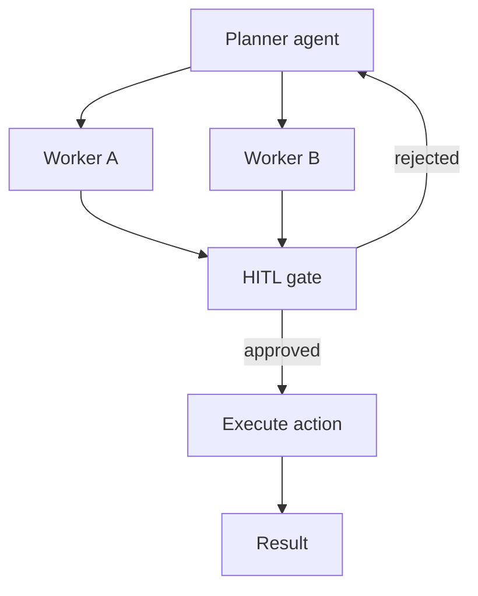

# Module 09 — Multi-Agent & Human-in-the-Loop

> **Agent spawn**: `@Memory.md` + this file + `@modules/09-multi-agent-hitl/NOTES.md`  
> **Nav**: ← [Module 08](../08-mcp/MODULE.md) · Next → [Module 10](../10-evals-llmops/MODULE.md)

## At a glance

| | |
|---|---|
| Prerequisites | Module 08 |
| Duration | ~4–6 sessions |
| Project? | No |
| Exit test | HITL gate + supervisor routing bina notes ke |

## Visual map

> **Kaise padho**: Pehle diagram dekho → topics padho → session end pe "Redraw challenge" bina dekhe draw karo



```
Planner ──► Worker A ──┐
         └► Worker B ──┼──► [HITL GATE] ──approve──► execute
                        │         │
                        │      reject
                        └─────────┘ (back to planner)
```

### Mental model (1 line)

Planner workers ko task deta hai, lekin risky action HITL gate se guzarna zaroori — human approve kare tab hi execute.

### Redraw challenge

Planner → workers → HITL gate → execute flow (reject arrow wapas planner pe) bina dekhe draw karo.

## Read order

1. Objectives → 2. Learning hooks → 3. Topics → 4. Assignments → 5. Coach se active recall

**Prerequisites**: Module 08  
**Duration**: ~4–6 sessions

## Objectives

1. Multi-agent orchestration patterns
2. HITL before irreversible actions
3. Safety vs latency trade-offs

## Learning hooks

| Concept | Parallel |
|---------|----------|
| Planner / worker agents | Orchestrator vs Kafka workers |
| HITL approval | Manager sign-off on large refund |
| Excessive agency | Atomic deactivation safety |
| Agent handoff | Stage output → next stage input |
| Rollback on reject | Savepoint rollback |

## Topics

- Supervisor pattern
- Specialist agents (researcher, executor, critic)
- Approval gates & timeout
- Audit log of agent decisions
- Delegation boundaries

## Assignments

| # | Task | Passing criteria |
|---|------|------------------|
| A1 | Supervisor routes to 2 specialist stubs | Correct routing 8/10 tasks |
| A2 | HITL pause: irreversible action needs approve | Reject → rollback path works |
| A3 | Audit log schema + write on each agent step | Queryable decision trail |

## Active recall

1. HITL sync vs async approval — product impact?
2. Critic agent kab worth it vs overhead?
3. Multi-agent cost control strategies?

## Progress checklist

- [ ] Objectives recall bina notes ke
- [ ] Assignments A1–A3 pass
- [ ] NOTES.md session log updated
