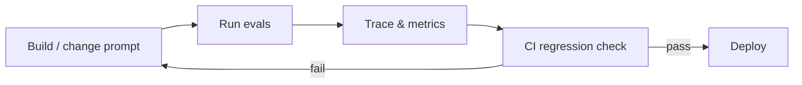

# Module 10 — Evals & LLMOps

> **Agent spawn**: `@Memory.md` + this file + `@modules/10-evals-llmops/NOTES.md`  
> **Nav**: ← [Module 09](../09-multi-agent-hitl/MODULE.md) · Next → [Module 11](../11-project-agentic-workflow/MODULE.md)

## At a glance

| | |
|---|---|
| Prerequisites | Module 09 |
| Duration | ~4–6 sessions |
| Project? | No |
| Exit test | Golden dataset + eval CI threshold bina notes ke |

## Visual map

> **Kaise padho**: Pehle diagram dekho → topics padho → session end pe "Redraw challenge" bina dekhe draw karo



```
  build change
       ↓
   run evals (golden dataset)
       ↓
   trace + score metrics
       ↓
   CI threshold check ──fail──► fix & loop
       │
      pass
       ↓
    deploy
```

### Mental model (1 line)

Har prompt/model change eval se guzarta hai — trace dikhao, CI threshold fail ho to ship mat karo.

### Redraw challenge

Build → eval → trace → regression CI loop (fail arrow wapas build pe) bina dekhe draw karo.

## Read order

1. Objectives → 2. Learning hooks → 3. Topics → 4. Assignments → 5. Coach se active recall

**Prerequisites**: Module 09  
**Duration**: ~4–6 sessions

## Objectives

1. LLM apps ko **test** karna — unit tests insufficient
2. Trajectory + outcome evals
3. Production monitoring loop

## Learning hooks

| Concept | Parallel |
|---------|----------|
| Golden datasets | Bank recon golden CSV cases |
| Trajectory eval | Full refund chain integration test |
| Regression CI | GitHub Actions on PR |
| Trace analysis | Prometheus alert on error rate |
| Cost dashboard | Exchange fee monitoring |

## Topics

- Exact match vs LLM-as-judge evals
- DeepEval / custom scorers
- Langfuse: traces, scores, datasets
- Prompt/version pinning
- Canary deployments for prompt changes
- SLIs: latency, cost/request, eval pass rate

## Assignments

| # | Task | Passing criteria |
|---|------|------------------|
| A1 | 10 golden Q&A pairs for RAG or agent | JSON dataset committed |
| A2 | Scorer stub: trajectory steps match expected | Pass/fail report |
| A3 | CI script runs evals on prompt change | Fails if score drops > threshold |

## Active recall

1. LLM-as-judge bias kya hai?
2. Eval dataset production data se kaise alag rakho?
3. Online vs offline evals — kab kya?

## Progress checklist

- [ ] Objectives recall bina notes ke
- [ ] Assignments A1–A3 pass
- [ ] NOTES.md session log updated
