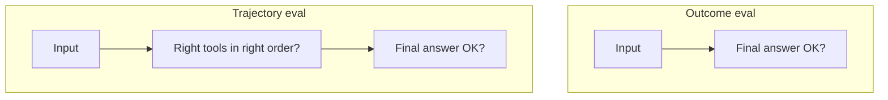

# Module 10 — Evals & LLMOps

> **Padho**: Isi file mein **Theory** — bahar mat jao.  
> **Likho**: `practice/` folder. **Pucho**: Cursor chat `@MODULE.md`  
> **Nav**: ← [Module 09](../09-multi-agent-hitl/MODULE.md) · Next → [Module 11](../11-project-agentic-workflow/MODULE.md)

> **Format**: Textbook — §0 pehle (terms from zero). `@MODULE-TEACHING-STANDARD.md`

## At a glance

| | |
|---|---|
| Prerequisites | Modules 05–09 (RAG + agents samajh aaye). Module 00a Git basics |
| Duration | ~4–6 sessions |
| Project? | No (Project A/B/C sab mein eval harness — Module 11 M6) |
| Exit test | Golden dataset + trajectory eval + CI threshold bina notes ke explain karo |

## Visual map

**Mental model (§0 ke baad):**

```
  code / prompt change
         ↓
   golden dataset pe eval run
         ↓
   scores + traces (Langfuse)
         ↓
   CI: pass rate ≥ baseline?
         ↓
    yes → deploy          no → fix loop
```

**Redraw challenge**: Build → eval → trace → CI gate loop. Fail arrow wapas build pe. Offline vs online eval alag box mein.

---

## Read order (strict — mat chhodna)

| Session | Padho | Karo (Practice) |
|---------|-------|-----------------|
| 1 | §0 Terms + §1 Problem | Socho: tumhare Zapier clone mein kaunse "golden cases" the |
| 2 | §2 Outcome vs trajectory | **A1** — `golden_dataset.json` (10 cases) |
| 3 | §3 Scorers | **A2** start — `trajectory_scorer.py` |
| 4 | §4 Langfuse traces | **A2** complete |
| 5 | §5 CI regression + §6 Online/offline | **A3** — `ci_eval.sh` |
| 6 | §7 SLIs + active recall | Checklist |

---

## Learning hooks (tera parallel — optional)

| Concept | Tum already jaante ho |
|---------|----------------------|
| Golden dataset | Bank recon golden CSV — known input → expected output |
| Trajectory eval | Full refund integration test — har step assert |
| Regression CI | GitHub Actions — PR pe tests fail → no merge |
| Trace | Distributed trace — OpenTelemetry spans |
| Cost dashboard | Exchange fee monitoring per tenant |

---

## Theory

### §0. Terms pehli baar — evals, LLMOps

LLM apps **probabilistic** hain — same prompt, alag jawab. Normal `assert response == "hello"` **flaky** — model update pe toot jata hai.

#### 0.1 Eval — kya measure karte hain

| Term | Matlab | Example |
|------|--------|---------|
| **Eval** | Systematic test — score distribution | 100 questions → 92% pass |
| **Golden dataset** | Curated input + expected output pairs | `{"input": "...", "expected": "..."}` |
| **Scorer** | Pass/fail ya 0–1 number compute | exact match, JSON schema, LLM judge |
| **Trajectory** | Steps list — kaunse tools, kis order | `["search", "hitl", "refund"]` |
| **LLMOps** | LLM app ka ops — eval + trace + deploy gates | CI eval + Langfuse + alerts |
| **Regression** | Naya change purana score girata hai | Prompt v2: 87% vs baseline 92% |

#### 0.2 LLMOps vs classic MLOps

```
Classic ML:  train → validate accuracy → deploy model weights
LLMOps:      prompt/graph change → eval pass rate → deploy config
             (model weights often vendor-managed)
```

**Tera angle:** Payments mein reconciliation golden files — yahan **golden prompts/workflows**.

#### 0.3 Mini golden record

```json
{
  "id": "case_01",
  "input": "Refund order o_123 if amount under 500",
  "expected_output": "Refund initiated for o_123",
  "expected_steps": ["get_order", "propose_refund", "hitl", "execute_refund"]
}
```

**Line-by-line:**

| Field | Matlab |
|-------|--------|
| `id` | Stable name — CI report mein |
| `input` | User / trigger simulation |
| `expected_output` | Outcome eval target |
| `expected_steps` | Trajectory eval — order matters |

**§0 checkpoint:**
1. Eval aur unit test mein farq?
2. Trajectory eval kyun zaroori agent apps mein?
3. Golden dataset production logs se copy karna safe hai?

| Error message | Kyun | Fix |
|---------------|------|-----|
| `JSONDecodeError` | Golden file invalid | `python -m json.tool golden_dataset.json` |
| Empty expected | Incomplete case | Har case mein `input` + `expected_output` |

---

### §1. Problem pehle — "lagta hai theek hai" ship karna

**Problem:** Tumne planner prompt change kiya — demo pe ek baar chal gaya. Production pe:
- 30% workflows galat tool order
- HITL skip ho raha hai destructive pe
- RAG answers sahi lagte hain par citations missing

**Bina eval:** customer complaint → firefight → rollback blind.

**Evals se:**
```
PR open → ci_eval.sh → pass rate 87% < baseline 92% → merge block
```

Payment parallel: nightly recon golden file — mismatch → alert, deploy nahi.

> **→ Practice A1** (pass: 10 valid golden cases committed)

---

### §2. Outcome eval vs trajectory eval



| Type | Poochta hai | Example fail |
|------|-------------|--------------|
| **Outcome** | End result sahi? | Jawab sahi — par bina HITL refund ho gaya |
| **Trajectory** | Process sahi? | `execute_refund` before `hitl` |

**Agent apps:** outcome-only **dangerous** — galat process baad mein incident.

```python
def score_trajectory(actual_steps: list[str], expected_steps: list[str]) -> bool:
    # Strict: exact order match (practice A2)
    return actual_steps == expected_steps

def score_outcome(actual: str, expected: str) -> bool:
    return expected.lower() in actual.lower()  # simple contains — production mein better scorer
```

| Error message | Kyun | Fix |
|---------------|------|-----|
| False pass outcome | Loose scorer | Trajectory add karo |
| False fail trajectory | Extra benign step | Allow optional steps list |

> **→ Practice A2** (pass: trajectory scorer report)

---

### §3. Scorers — exact match se LLM-as-judge

| Scorer | Kab | Weakness |
|--------|-----|----------|
| Exact match | Classification, fixed strings | Flaky on paraphrase |
| Regex / JSON schema | Structured output | Syntax only, not semantics |
| Embedding similarity | Paraphrase OK | Threshold tune |
| LLM-as-judge | Open-ended quality | Bias |

```python
# LLM-as-judge — conceptual
JUDGE_PROMPT = """
Score 1-5: Does ANSWER correctly address QUESTION given CONTEXT?
Return JSON: {"score": int, "reason": str}
"""
```

**Judge bias (interview):**
- Verbose answers score higher
- Same model family judge + generator — lenient
- Position bias — pehla option prefer

**Mitigations:** alag judge model, blind A/B, human audit 5% sample.

| Error message | Kyun | Fix |
|---------------|------|-----|
| Judge JSON invalid | Model didn't follow schema | Structured output on judge |
| Scores drift over time | Model version change | Pin judge model version |

---

### §4. Langfuse — traces, scores, datasets

**Langfuse** = LLM app observability — har run trace, scores attach, dataset batch runs.

```
Production trace (ek user request):
  trace_id: abc
    span: planner.llm_call     (tokens, latency, prompt hash)
    span: tool.search_orders   (args, result summary)
    span: hitl.wait            (duration)
    span: executor.refund      (idempotency_key)
  score: trajectory_match = 1.0
  score: cost_usd = 0.04
```

```python
# Conceptual SDK usage
from langfuse import Langfuse
langfuse = Langfuse()

trace = langfuse.trace(name="workflow_run", user_id="tenant_1")
generation = trace.generation(name="planner", model="claude-sonnet", input=prompt, output=plan)
trace.score(name="valid_json", value=1.0)
```

| Concept | Matlab |
|---------|--------|
| Trace | Poori request ki tree |
| Span | Ek step — LLM call, tool, DB |
| Score | Eval result attach |
| Dataset | Golden cases — batch `dataset.run()` |

**Debug flow:** user complaint → `trace_id` → spans dekho → kaunse step fail.

| Error message | Kyun | Fix |
|---------------|------|-----|
| Traces missing | SDK key / init | `LANGFUSE_*` env vars |
| High cardinality | `user_id` random each call | Stable tenant id |

---

### §5. CI regression — prompt change gate

```bash
#!/bin/bash
# ci_eval.sh mental model
BASELINE=0.92
THRESHOLD_DELTA=0.05
MIN_PASS=$(python -c "print($BASELINE - $THRESHOLD_DELTA)")

RESULT=$(python trajectory_scorer.py --json)
PASS_RATE=$(echo "$RESULT" | jq .pass_rate)

if (( $(echo "$PASS_RATE < $MIN_PASS" | bc -l) )); then
  echo "REGRESSION: $PASS_RATE < $MIN_PASS"
  exit 1
fi
echo "OK: $PASS_RATE"
exit 0
```

**Flow:**
1. PR opens → GitHub Actions `bash ci_eval.sh`
2. Scorer golden dataset pe chalta hai
3. `pass_rate` baseline − delta se kam → exit 1 → merge block
4. Pass → merge allowed

**Metadata pin:**
```python
trace.metadata = {"prompt_version": "planner_v1.2", "graph_hash": "abc123"}
```

| Error message | Kyun | Fix |
|---------------|------|-----|
| CI flaky | Temperature > 0 on eval | `temperature=0` eval runs |
| Baseline stale | Never updated after real improvement | Baseline bump intentional PR |

> **→ Practice A3** (pass: `bash ci_eval.sh` exits 1 on regression)

---

### §6. Online vs offline evals

| | Offline | Online |
|---|---------|--------|
| **Kab** | Pre-deploy CI | Post-deploy production |
| **Data** | Golden synthetic/sanitized | Sample live traffic |
| **Cost** | Batch — predictable | Ongoing spend |
| **Privacy** | Full control | PII risk — careful |
| **Catches** | Known regressions | Drift, new user patterns |

**Eval data ≠ production PII:**
- Synthetic invoices
- Sanitized subset — mask names, card numbers
- Never copy prod DB wholesale into git

**Online examples:**
- Random 1% traces → LLM judge
- User thumbs up/down → weak signal but useful
- Alert: weekly pass rate drop 5%

---

### §7. SLIs — kya dashboard pe rakho

| SLI | Kyun |
|-----|------|
| Latency p50 / p99 | UX + timeout tuning |
| Cost per request / per task | Margin per tenant |
| Eval pass rate | Quality trend |
| HITL approval rate | UX friction signal |
| Tool error rate | MCP / integration health |
| Cache hit rate | Gateway savings (Project C) |

Project B interview line: "Trajectory eval CI gate + Langfuse cost-per-task — ship se pehle regressions block."

---

### §8. Eval workflow step-by-step — pehli baar CI setup

**Problem:** "Eval baad mein karenge" = kabhi nahi. Pehle din se golden file + scorer.

**Step flow:**
1. `golden_dataset.json` commit — 10 cases minimum, badhate jao
2. `trajectory_scorer.py` — har case pe pass/fail
3. Locally run: `python trajectory_scorer.py` — pass rate dekho
4. `ci_eval.sh` — baseline set (`BASELINE_PASS_RATE=0.9`)
5. GitHub Actions / local pre-push: script exit code check
6. Prompt change → eval → pass rate compare → merge ya fix

```bash
cd modules/10-evals-llmops/practice
python3 -m venv .venv && source .venv/bin/activate
pip install pydantic python-dotenv
python trajectory_scorer.py
# Expected: Pass rate: 0.XX (N/N cases)
bash ci_eval.sh
echo $?   # 0 = OK, 1 = regression
```

| Step | Galat approach | Sahi approach |
|------|----------------|---------------|
| Golden data | Prod DB copy | Synthetic + sanitized |
| Scorer | Sirf `==` exact | Outcome + trajectory alag |
| CI | Manual "looks fine" | `exit 1` automated |
| Baseline | Kabhi update nahi | Intentional PR jab improve |

#### 8.1 Golden case quality checklist

Har case mein yeh ho:
- [ ] `id` unique stable
- [ ] `input` realistic user phrase
- [ ] `expected_output` measurable (contains / JSON keys)
- [ ] `expected_steps` order matters where safety matters (HITL before execute)
- [ ] Edge case: kam se kam 2 failure-style inputs (invalid request → graceful error)

| Error message | Kyun | Fix |
|---------------|------|-----|
| `pass_rate` always 1.0 | Trivial golden | Harder cases add |
| CI slow | Live LLM har PR | Stub/scorer offline for CI, nightly full |

> **→ Practice A3** dubara run karo — baseline artificially high karke regression simulate karo

---

## Practice

> **Saare assignments**: [`practice/README.md`](practice/README.md)  
> Stuck? `@modules/10-evals-llmops/MODULE.md` + error paste.

| # | Theory § | File | Pass when |
|---|----------|------|-----------|
| A1 | §0–§2 | `practice/golden_dataset.json` | 10 valid cases, trajectory fields |
| A2 | §2–§4 | `practice/trajectory_scorer.py` | Pass/fail report on dataset |
| A3 | §5 | `practice/ci_eval.sh` | Exit 1 when pass rate drops |

---

## Active recall (khud jawab likho NOTES mein)

1. LLM-as-judge bias — 3 types + 1 mitigation each?
2. Eval dataset production se alag kaise rakho?
3. Outcome pass + trajectory fail — real incident example bolo?
4. CI baseline 92% — prompt change 87% — kya karna chahiye?

**Chat drill** (optional): "Module 10 — outcome vs trajectory + CI gate"

---

## Progress checklist

- [ ] §0 — eval, golden, trajectory, LLMOps terms
- [ ] Session table follow
- [ ] Practice A1–A3 pass
- [ ] Redraw challenge
- [ ] Active recall NOTES
- [ ] NOTES session log

---

## Optional appendix

- [Langfuse Docs](https://langfuse.com/docs)
- [DeepEval Getting started](https://docs.confident-ai.com/docs/getting-started)
- Module 05 — RAG eval overlap
- Module 11 M6 — workflow eval harness
