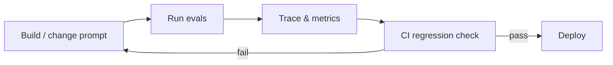
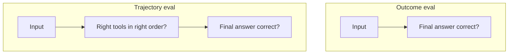
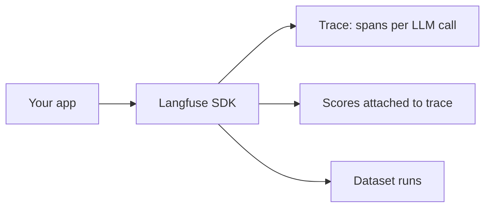

# Module 10 — Evals & LLMOps

> **Padho**: Isi file mein **Theory** — bahar mat jao.  
> **Likho**: `practice/` folder. **Pucho**: Cursor chat `@MODULE.md`  
> **Nav**: ← [Module 09](../09-multi-agent-hitl/MODULE.md) · Next → [Module 11](../11-project-agentic-workflow/MODULE.md)

## At a glance

| | |
|---|---|
| Prerequisites | Module 09 |
| Duration | ~4–6 sessions |
| Project? | No |
| Exit test | Golden dataset + eval CI threshold bina notes ke |

## Visual map



```
  build change
       ↓
   run evals (golden dataset)
       ↓
   trace + score metrics
       ↓
   CI threshold check ──fail──► fix & loop
       │
      pass
       ↓
    deploy
```

**Mental model**: Har prompt/model change eval se guzarta hai — trace dikhao, CI threshold fail ho to ship mat karo.

**Redraw challenge**: Build → eval → trace → regression CI loop (fail arrow wapas build pe) bina dekhe draw karo.

---

## Read order

1. Visual map → 2. **Theory** (neeche) → 3. **Practice** → 4. Chat agar doubt → 5. NOTES

---

## Learning hooks

| Concept | Parallel |
|---------|----------|
| Golden datasets | Bank recon golden CSV cases |
| Trajectory eval | Full refund chain integration test |
| Regression CI | GitHub Actions on PR |
| Trace analysis | Prometheus alert on error rate |
| Cost dashboard | Exchange fee monitoring |

---

## Theory

### 1. Unit tests LLM ke liye kyun kaafi nahi

```
assert response == "exact string"  ← flaky, model updates break tests
```

LLM apps need **probabilistic evals** — score distributions, thresholds, golden sets.

---

### 2. Outcome eval vs trajectory eval



| Type | Measures | Example |
|------|----------|---------|
| **Outcome** | final answer quality | RAG answer matches golden |
| **Trajectory** | steps taken | called `search` before `refund`, not skipped HITL |

**Agent apps:** trajectory critical — sahi jawab galat process se aaya = production incident baad mein.

---

### 3. Scorers — exact match vs LLM-as-judge

```
Exact match:     output == expected_string     (classification)
Regex/JSON:      schema valid + key fields      (structured)
LLM-as-judge:    rubric score 1-5              (open-ended quality)
```

*(Active recall Q1: judge bias — judge favors verbose, same model family, position bias)*

**Mitigations:** separate judge model, blind comparison, human audit sample.

---

### 4. Langfuse — traces, scores, datasets



```
Production trace:
  span: rag.query
    ├── retrieval (chunks, scores)
    ├── llm.generate (prompt, completion, tokens)
    └── score: faithfulness = 0.85
```

**Datasets:** golden Q&A JSON → batch run → compare scores across prompt versions.

---

### 5. CI regression — prompt change gate

```bash
# PR opens → run evals
python run_evals.py --dataset golden.json --threshold 0.9
# exit 1 if pass_rate < baseline - delta
```

```
baseline v1.2: pass_rate 92%
PR changes prompt
new run: 87%  → CI FAIL → no merge
```

**Pin prompt version** in trace metadata — reproduce failures.

---

### 6. Online vs offline evals

*(Active recall Q3)*

| Offline | Online |
|---------|--------|
| golden dataset, CI | production sample, user thumbs |
| pre-deploy | drift detection post-deploy |
| cheap batch | expensive, privacy care |

*(Active recall Q2: eval data ≠ production PII — synthetic + sanitized subset)*

---

### 7. SLIs to track

- latency p50/p99
- cost per request
- eval pass rate
- cache hit rate (gateway)
- HITL approval rate

---

## Practice

> **Saare assignments ek jagah**: [`practice/README.md`](practice/README.md) — problem statements, instructions, pass criteria.  
> Code **tum** likhoge Cursor mein. Stubs `practice/` mein hain (`TODO` search).  
> Stuck? Chat: `@modules/10-evals-llmops/MODULE.md` + error paste karo.

| # | File | Kya karna hai | Pass when |
|---|------|---------------|-----------|
| A1 | `practice/golden_dataset.json` | 10 golden Q&A pairs | JSON committed |
| A2 | `practice/trajectory_scorer.py` | Steps match expected | Pass/fail report |
| A3 | `practice/ci_eval.sh` | Eval on prompt change | Fails if score drops > threshold |

---

## Active recall (khud jawab likho NOTES mein)

1. LLM-as-judge bias kya hai?
2. Eval dataset production data se kaise alag rakho?
3. Online vs offline evals — kab kya?

**Chat drill** (optional): "Module 10 — outcome vs trajectory eval"

---

## Progress checklist

- [ ] Theory Section 1–7 padh liya
- [ ] Redraw challenge kiya
- [ ] Practice A1–A3 pass
- [ ] Active recall NOTES mein likha
- [ ] NOTES session log updated

---

## Optional appendix (zarurat ho tab)

- [Langfuse Docs](https://langfuse.com/docs) — traces + datasets
- [DeepEval Getting started](https://docs.confident-ai.com/docs/getting-started) — scorer examples
