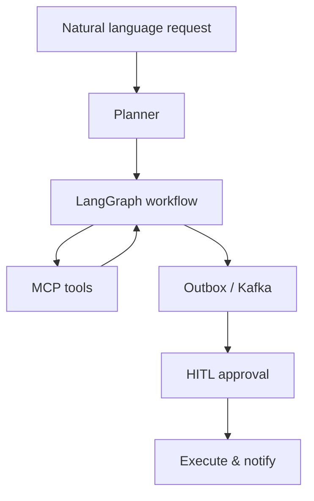

# Module 11 — PROJECT: Agentic Workflow Engine

> **Agent spawn**: `@Memory.md` + this file + `@modules/11-project-agentic-workflow/NOTES.md`  
> **Nav**: ← [Module 10](../10-evals-llmops/MODULE.md) · End

## At a glance

| | |
|---|---|
| Prerequisites | Modules 01–10 · `@Projects.md` |
| Duration | ~3–4 weeks |
| Project? | Yes |
| Exit test | Workflow milestones M1–M7 · `@Projects.md` |

## Visual map

> **Kaise padho**: Pehle diagram dekho → topics padho → session end pe "Redraw challenge" bina dekhe draw karo



```
User NL query
     ↓
  Planner (decompose)
     ↓
  LangGraph state machine
     ├── MCP tools (external actions)
     └── Outbox → Kafka → HITL gate
                              ↓
                         execute + audit log
```

### Mental model (1 line)

NL se plan banta hai, LangGraph orchestrate karta hai, MCP tools + Kafka outbox + HITL sab ek workflow engine mein milte hain.

### Redraw challenge

NL → plan → LangGraph → MCP + outbox/Kafka → HITL → execute full architecture bina dekhe draw karo.

## Read order

1. Objectives → 2. Feature matrix → 3. Milestones → 4. CV narrative

**Prerequisites**: Modules 01–10  
**Duration**: ~3–4 weeks  
**Reference**: `@Projects.md` Project 2

## Objectives

Zapier clone ke upar **AI orchestration layer** — highest-premium portfolio piece.

## Feature matrix

| Feature | Your unfair advantage |
|---------|----------------------|
| NL → workflow plan | LangGraph planning |
| MCP tools | Standard integrations |
| Structured outputs | Pydantic — Zod brain |
| HITL checkpoints | Rootstock savepoint mindset |
| Outbox + Kafka execution | Already built in Zapier clone |
| Eval harness | Trajectory scoring |
| Domain: payments/refunds | Interview domain depth |

## Milestones

| M | Deliverable | Pass |
|---|-------------|------|
| M1 | NL intent → structured workflow JSON | Valid schema 90%+ on test phrases |
| M2 | LangGraph executes linear workflow | 3-step workflow completes |
| M3 | MCP + custom tools wired | External + DB tools work |
| M4 | HITL on destructive steps | Pause → approve/reject |
| M5 | Outbox exactly-once execution | Duplicate webhook → single effect |
| M6 | Eval suite + Langfuse traces | Regression catches bad plan |
| M7 | Demo: "refund workflow" end-to-end | Recordable demo + README |

## CV narrative

Combine: distributed systems (Rootstock + Zapier clone) + agents (LangGraph + MCP + evals).

## Progress checklist

- [ ] Objectives recall bina notes ke
- [ ] Milestones M1–M7 pass
- [ ] NOTES.md session log updated

## NOTES.md

Architecture diagrams, eval scores over time, failure postmortems.
