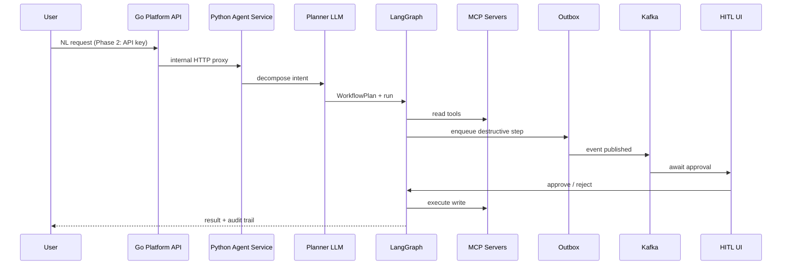
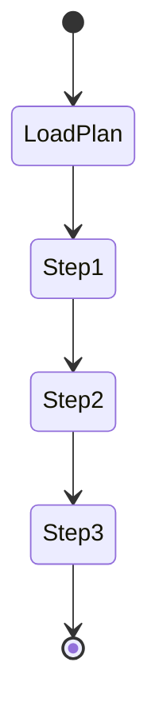

# Module 11 — PROJECT: Agentic Workflow (→ Project B)

> **Padho**: Isi file mein **Theory** — bahar mat jao.  
> **Likho**: `practice/` folder. **Pucho**: Cursor chat `@MODULE.md`  
> **Nav**: ← [Module 10](../10-evals-llmops/MODULE.md) · End  
> **Ship**: **Python** agents in `services/agent/` · **Go** platform from Project A (`@Projects.md` Project B).

> **Format**: Textbook — §0 pehle (terms + milestones from zero). `@MODULE-TEACHING-STANDARD.md`

## At a glance

| | |
|---|---|
| Prerequisites | Modules 01–10 complete. `@Projects.md` Project B padha hua |
| Duration | ~3–4 weeks (Phase 1 practice sandbox → Phase 2 monorepo ship) |
| Project? | **Yes — Project B** (AI Workflow Automation SaaS) |
| Exit test | M1–M7 milestones + full architecture + CV bullets bina notes ke defend karo |

## Visual map

**Mental model (§0 ke baad poora system):**

```
User natural language
        ↓
   Planner (NL → WorkflowPlan JSON)
        ↓
   LangGraph state machine
        ├── MCP tools (Slack, DB, webhooks)
        ├── read steps → direct execute
        └── write steps → Outbox → Kafka → HITL gate
                                    ↓
                              approve → execute (idempotent)
                                    ↓
                              audit log + Langfuse trace + meter 1 run
```

**Redraw challenge**: NL → plan → graph → MCP + outbox/Kafka → HITL → execute. Go platform layer alag box mein (auth, metering). Phase 1 vs Phase 2 label karo.

---

## Read order (strict — mat chhodna)

| Session | Padho | Karo (Practice) |
|---------|-------|-----------------|
| 1 | §0 Terms + milestones map | `@Projects.md` Project B ek baar read |
| 2 | §1 Thesis + §2 Architecture | **M1** start — `nl_to_workflow.py` |
| 3 | §3 NL → plan (M1 detail) | **M1** pass — 90%+ valid JSON |
| 4 | §4 LangGraph linear (M2) | **M2** — `linear_workflow_graph.py` |
| 5 | §5 MCP wire (M3) | **M3** — `mcp_tools_wire.py` |
| 6 | §6 HITL (M4) | **M4** — `hitl_destructive.py` |
| 7 | §7 Outbox exactly-once (M5) | **M5** — `outbox_stub.py` |
| 8 | §8 Eval harness (M6) | **M6** — `eval_harness.py` |
| 9 | §9 Demo + §10 Phase 2 | **M7** — `demo_refund/` |
| 10 | CV narrative + active recall | NOTES architecture diagram |

---

## Learning hooks (tera unfair advantage)

| Feature | Tum already jaante ho | Module se naya |
|---------|----------------------|----------------|
| NL → workflow | — | LangGraph planner + Pydantic |
| Tool execution | Kafka consumer | MCP + graph tools node |
| Exactly-once | Outbox + idempotency_key | Billing = same guarantee |
| HITL | Manager refund approval | `interrupt_before` |
| Eval | Golden recon CSV | Trajectory on workflow steps |
| Multi-tenant | — | Phase 2 Go spine reuse Project A |

---

## Theory

### §0. Terms pehli baar — Project B, milestones, agentic workflow

Yeh module **sab kuch jodta hai** — Modules 06–10 practice hai, yahan **ship-ready system** ka map hai.

#### 0.1 Project B ek line mein

**AI Workflow Automation SaaS:** user natural language mein automation describe kare — agent plan banaye, tools connect kare, **safely** run kare.

```
Product pitch (Projects.md):
  "Runs are billed and executed exactly once —
   never dropped, never doubled."
```

**Billable unit:** `task_run` (ek workflow execution complete).  
**Tiers:** monthly run volume.  
**Tera moat:** Zapier clone ka outbox/Kafka + AI orchestration — reliability story investors/engineers dono ko samajh aati hai.

#### 0.2 Agentic workflow — term

| Term | Matlab |
|------|--------|
| **Workflow** | Trigger + ordered steps — tumhara Zapier JSON jaisa |
| **Agentic** | Steps fixed nahi — LLM plan karta hai kaunse tools, kya order |
| **WorkflowPlan** | Pydantic model — machine-readable plan |
| **Task run** | Ek execution instance — meter yahi |
| **Destructive step** | Side effect — refund, webhook, delete |
| **Milestone (M1–M7)** | Practice sandbox mein ordered deliverables |

#### 0.3 Milestones map — overview (detail §3–§9)

| M | Deliverable | Ek line mein kya |
|---|-------------|------------------|
| **M1** | NL → workflow JSON | User sentence → valid `WorkflowPlan` |
| **M2** | Linear LangGraph | 3 steps order mein — no branch yet |
| **M3** | MCP + custom tools | External + inline tools same graph |
| **M4** | HITL destructive | Pause before write — approve/reject |
| **M5** | Outbox exactly-once | Duplicate enqueue → single effect + single bill |
| **M6** | Eval + Langfuse | Bad planner change CI mein fail |
| **M7** | Refund demo E2E | Recordable walkthrough + README |

**Phase 1 (yeh module practice):** Python AI core, single user, no Stripe.  
**Phase 2 (monorepo ship):** Go platform wrap — auth, tenants, metering, Stripe (`@Projects.md`).

#### 0.4 WorkflowPlan shape — pehle schema samjho

```python
from pydantic import BaseModel

class WorkflowStep(BaseModel):
    id: str
    tool: str
    args: dict
    needs_hitl: bool = False

class WorkflowPlan(BaseModel):
    trigger: str
    steps: list[WorkflowStep]
```

**Line-by-line:**

| Line | Matlab |
|------|--------|
| `WorkflowStep.id` | Stable step id — audit / logs |
| `tool` | MCP ya local tool name |
| `args` | Tool arguments — LLM fills |
| `needs_hitl` | True → execute se pehle human gate |
| `trigger` | `schedule_daily`, `webhook`, `manual` |

**Example plan:**

```json
{
  "trigger": "schedule_daily",
  "steps": [
    {"id": "s1", "tool": "query_overdue_invoices", "args": {"days": 30}, "needs_hitl": false},
    {"id": "s2", "tool": "send_email", "args": {"template": "overdue"}, "needs_hitl": false},
    {"id": "s3", "tool": "create_slack_task", "args": {"channel": "#ops"}, "needs_hitl": true}
  ]
}
```

**§0 checkpoint:**
1. Billable unit kya hai Project B mein?
2. M1 vs M7 — farq ek sentence each?
3. `needs_hitl: true` ka matlab runtime pe kya hoga?

| Error message | Kyun | Fix |
|---------------|------|-----|
| `ValidationError` WorkflowPlan | LLM ne invalid JSON | Stricter prompt + repair pass |
| Unknown tool in plan | Tool registry mein nahi | Allowlist tools planner ko do |

---

### §1. Project B thesis — kyun yeh project tumhare liye

**Who pays:** ops teams, solo founders — manual multi-step kaam automate.  
**Why you win:** exactly-once execution + billing — payments background, not tutorial code.

```
Competitors pitch "AI magic"
You pitch "AI + ledger-grade execution"
```

**Interview narrative arc:**
1. User describes automation in NL
2. Planner produces validated graph plan
3. LangGraph executes with MCP tools
4. Destructive → HITL
5. Outbox ensures once-only side effects
6. Eval CI catches planner regressions
7. Phase 2: per-tenant meter → Stripe

> **→ Practice M1** start after §3 padh lo — ya abhi schema explore karo

---

### §2. End-to-end architecture — polyglot



**Phase 1 vs Phase 2:**

| Layer | Phase 1 (practice) | Phase 2 (ship) |
|-------|-------------------|----------------|
| Entry | `python` / FastAPI direct | Go `platform/` — auth, tenant |
| Metering | Log only | Idempotent usage events → Stripe |
| Credentials | `.env` | Per-tenant encrypted vault |
| HITL UI | CLI / stub approve | Next.js dashboard |

```
Monorepo (Projects.md):
  apps/web/          → HITL + admin UI
  platform/          → GO — spine
  services/agent/    → PYTHON — yeh module ka output
```

**Request flow numbered:**
1. User NL message platform pe (ya practice CLI)
2. Planner LLM → `WorkflowPlan` JSON
3. Pydantic validate — fail fast invalid plan
4. LangGraph compile — steps as nodes
5. Read steps run inline
6. Destructive step → outbox row same TX as run state
7. Worker Kafka se → HITL queue
8. Approve → execute with `idempotency_key`
9. Meter exactly one `task_run` (Phase 2)
10. Langfuse trace + audit log complete

---

### §3. M1 — NL → structured workflow plan

**Problem:** Raw LLM text execute nahi kar sakte — schema chahiye.

```
User: "When invoice overdue 30 days, email client and create Slack task"
```

**Planner prompt rules (concept):**
- Sirf allowlisted tools
- `needs_hitl: true` on writes / payments / webhooks
- JSON only — no markdown

```python
def nl_to_workflow(nl_request: str) -> WorkflowPlan:
    raw = call_planner_llm(nl_request, TOOL_ALLOWLIST)
    plan = WorkflowPlan.model_validate_json(raw)
    return plan
```

| Step | Kya |
|------|-----|
| 1 | User NL string |
| 2 | LLM structured output (Module 06) |
| 3 | `WorkflowPlan.model_validate` |
| 4 | Invalid → user ko error, no partial run |

**M1 pass criteria:** `TEST_PHRASES` list — **90%+** valid schema.

```python
TEST_PHRASES = [
    "Every morning check overdue invoices and email clients",
    "When payment fails send Slack alert to #billing",
    # ... 10+ phrases
]

def eval_m1() -> float:
    ok = sum(1 for p in TEST_PHRASES if try_parse(p)) 
    return ok / len(TEST_PHRASES)
```

| Error message | Kyun | Fix |
|---------------|------|-----|
| `JSONDecodeError` | LLM markdown fence | `response_format` / repair |
| Wrong tool name | Allowlist leak | Prompt + post-validate allowlist |
| Missing `needs_hitl` on refund | Prompt gap | Examples in prompt for destructive |

> **→ Practice M1** (pass: 90%+ on `TEST_PHRASES`)

---

### §4. M2 — LangGraph linear 3-step workflow

**Problem:** Plan hai — ab execute karna hai. Pehle **linear** — branch baad mein.



```python
class RunState(TypedDict):
    plan: WorkflowPlan
    current_step: int
    step_results: dict
    messages: list

def execute_step_node(state: RunState) -> dict:
    step = state["plan"].steps[state["current_step"]]
    result = run_tool(step.tool, step.args)
    return {
        "current_step": state["current_step"] + 1,
        "step_results": {**state["step_results"], step.id: result},
    }

def should_continue(state: RunState) -> Literal["execute_step", "__end__"]:
    if state["current_step"] >= len(state["plan"].steps):
        return "__end__"
    return "execute_step"
```

**Line-by-line:**

| Line | Matlab |
|------|--------|
| `current_step` | Index — linear iterator |
| `run_tool` | Local registry — M3 mein MCP mix |
| Loop via conditional edge | Saare steps until done |

**Zapier parallel:** Sequential actions — step 2 tab jab step 1 success.

| Error message | Kyun | Fix |
|---------------|------|-----|
| Step skip | Index bug | Log each step id before run |
| Partial results lost | State merge miss | `step_results` dict append |

> **→ Practice M2** (pass: 3-step E2E completes)

---

### §5. M3 — MCP integration + custom tools

**Problem:** Saare tools Python mein mat rakho — Slack/DB alag MCP servers.

```
workflow step s3: tool=slack_post
  → mcp_client.call_tool("slack_post", args)
workflow step s1: tool=query_overdue_invoices
  → local Python (internal business logic)
```

```python
async def run_tool(name: str, args: dict) -> str:
    if name in MCP_TOOLS:
        return await mcp_session.call_tool(name, args)
    if name in LOCAL_TOOLS:
        return LOCAL_TOOLS[name](**args)
    raise ValueError(f"Unknown tool: {name}")
```

**Credential rule (Phase 2):** API keys **vault** se — MCP server env inject, **kabhi prompt mein nahi**.

| Tool type | Example | MCP? |
|-----------|---------|------|
| Generic Slack | `slack_post` | Yes — shared server |
| Your domain SQL | `query_overdue_invoices` | Local — business logic |
| Webhook write | `write_webhook` | Yes + HITL |

| Error message | Kyun | Fix |
|---------------|------|-----|
| MCP timeout | Network | Retry + degrade message |
| Tool prefix collision | Two MCP servers | `slack_` / `db_` prefix |

> **→ Practice M3** (pass: MCP + local both work)

---

### §6. M4 — HITL on destructive steps

**Problem:** `write_webhook`, `issue_refund` bina human ke — OWASP LLM06 excessive agency.

```python
def route_step(state: RunState) -> Literal["execute_step", "hitl_gate", "__end__"]:
    if state["current_step"] >= len(state["plan"].steps):
        return "__end__"
    step = state["plan"].steps[state["current_step"]]
    if step.needs_hitl:
        return "hitl_gate"
    return "execute_step"

app = graph.compile(
    checkpointer=memory,
    interrupt_before=["hitl_gate"],
)
```

**Flow:**
1. Graph `hitl_gate` pe pause — UI shows proposal
2. Human approve → `execute_step` for that step
3. Reject → `replan` node (M1 planner dubara ya user edit)

**Sync vs async:** Practice = sync CLI `approve y/n`. Production = web queue (Module 09).

| Error message | Kyun | Fix |
|---------------|------|-----|
| HITL bypass | `needs_hitl` false on write | Planner eval + schema default |
| Double execute on resume | No idempotency | M5 keys |

> **→ Practice M4** (pass: reject triggers replan)

---

### §7. M5 — Outbox + Kafka exactly-once execution

**Problem:** Worker crash ya retry — duplicate webhook = duplicate refund = **double billing**.

**Tera existing Zapier pattern:**

```sql
BEGIN;
  UPDATE workflow_runs SET status = 'pending_execute' WHERE id = $1;
  INSERT INTO outbox (event_type, payload, idempotency_key)
  VALUES ('execute_step', $payload, $key);
COMMIT;
-- worker polls outbox → publishes Kafka → executes once
```

```python
def enqueue_execute(step_id: str, run_id: str, idempotency_key: str):
    with db.transaction():
        db.execute("UPDATE workflow_runs SET status = %s WHERE id = %s", ("pending", run_id))
        db.execute(
            "INSERT INTO outbox (event_type, payload, idempotency_key) VALUES (%s, %s, %s)",
            ("execute_step", {"step_id": step_id, "run_id": run_id}, idempotency_key),
        )

def worker_execute(idempotency_key: str, fn):
    if db.exists("processed_keys", idempotency_key):
        return db.get("processed_keys", idempotency_key)  # same result, no-op
    result = fn()
    db.insert("processed_keys", idempotency_key, result)
    return result
```

**Billing link:**

| Execution | Billing |
|-----------|---------|
| Duplicate side effect | Duplicate Stripe usage → angry customer |
| Exactly-once effect | Exactly-one `task_run` meter event |
| Outbox duplicate publish | Worker idempotency → still one effect |

**Interview line:** "Outbox makes intent durable; Kafka delivers; idempotency_key makes effect once — billing uses same key family."

| Error message | Kyun | Fix |
|---------------|------|-----|
| Double webhook | No idempotency | Unique constraint on key |
| Lost event | No outbox TX | Same transaction as state update |
| Outbox poison | Bad payload | DLQ + alert |

> **→ Practice M5** (pass: duplicate enqueue → single side effect)

---

### §8. M6 — Eval harness + Langfuse

**Problem:** Planner prompt tweak se silent breakage — M1 90% se 70% gir jaye bina kisi ko pata.

```python
# golden_nl_phrases.json → expected WorkflowPlan shape / expected_steps
def eval_planner_regression() -> dict:
    results = []
    for case in golden_cases:
        plan = nl_to_workflow(case["input"])
        valid = validate_plan(plan, case)
        results.append(valid)
    pass_rate = sum(results) / len(results)
    return {"pass_rate": pass_rate, "details": results}
```

**Trajectory eval (Module 10):**
```python
expected_steps = ["query_overdue", "send_email", "hitl", "slack_post"]
actual_steps = trace.get_tool_sequence(run_id)
assert trajectory_score(actual_steps, expected_steps)
```

**Langfuse per run:**
- `prompt_version`, `plan_hash`, `cost_usd`, `trajectory_match`
- Dashboard: cost per task, p99 latency, fail reasons

**CI gate:** `eval_harness.py` exit 1 if pass_rate < baseline − delta.

| Error message | Kyun | Fix |
|---------------|------|-----|
| Eval pass but prod fail | Golden too easy | Add edge cases from incidents |
| Langfuse 401 | Keys | `.env` |

> **→ Practice M6** (pass: intentionally bad plan fails harness)

---

### §9. M7 — Refund workflow demo E2E

**Problem:** Portfolio ko **recordable story** chahiye — fintech domain tumhara.

**Demo script (`demo_refund/`):**
1. User: "If order o_99 charge disputed, partial refund 50% after approval"
2. Planner → plan with `get_order`, `propose_refund` (HITL), `execute_refund`
3. Graph runs — HITL pause — approve
4. Outbox → single execution
5. Audit log + Langfuse trace show

**README must include:**
- Architecture diagram (redraw challenge wala)
- `./run_demo.sh` steps
- Measured numbers: latency, cost, eval pass rate (placeholder OK Phase 1)

| Error message | Kyun | Fix |
|---------------|------|-----|
| Demo flake | Live LLM variance | Temperature 0 + stub option |

> **→ Practice M7** (pass: runnable demo + README)

---

### §10. Phase 2 wrap — Go platform spine

Practice sandbox **single-user** hai. Ship ke liye Project A spine reuse:

| Spine feature | Project B use |
|---------------|---------------|
| Multi-tenancy | Workflow runs isolated per org |
| Usage metering | `task_run` idempotent count |
| Stripe metered | Monthly invoice by runs |
| Per-tenant budget | Hard stop LLM spend |
| Credential vault | MCP secrets per tenant |

```
User → Go API (auth) → Python agent (internal)
         ↓
    meter task_run (exactly once with execution)
```

**Do not restart codebase** — practice code `services/agent/` mein move + wrap.

---

### §11. CV narrative — 3 defendable bullets

Shape (Projects.md — numbers measure karke replace karo):

1. "Built multi-tenant AI workflow SaaS on Postgres outbox + Kafka with exactly-once execution and billing, human-in-the-loop checkpoints, least-privilege MCP tools, and per-tenant credential vault; metered N task runs with zero double-billing."

2. "LangGraph orchestration + MCP integrations; trajectory eval CI blocked planner regressions; Langfuse cost-per-task tracking."

3. "Refund workflow demo — HITL + audit trail + idempotent execute — domain-grounded fintech automation."

**Chat drill:** whiteboard full architecture 10 min mein.

---

## Practice

> **Saare assignments**: [`practice/README.md`](practice/README.md)  
> Learning sandbox — ship `@Projects.md` Project B in monorepo.  
> Stuck? `@modules/11-project-agentic-workflow/MODULE.md @Projects.md`

| # | Theory § | File | Pass when |
|---|----------|------|-----------|
| M1 | §3 | `practice/nl_to_workflow.py` | 90%+ valid on test phrases |
| M2 | §4 | `practice/linear_workflow_graph.py` | 3-step E2E |
| M3 | §5 | `practice/mcp_tools_wire.py` | MCP + local tools |
| M4 | §6 | `practice/hitl_destructive.py` | Reject → replan |
| M5 | §7 | `practice/outbox_stub.py` | Duplicate → single effect |
| M6 | §8 | `practice/eval_harness.py` | Bad plan fails CI |
| M7 | §9 | `practice/demo_refund/` | Recordable demo + README |

---

## Active recall (khud jawab likho NOTES mein)

1. Outbox exactly-once execution aur billing guarantee kaise link hain? — 3 sentences.
2. HITL destructive steps pe mandatory kyun — compliance + safety?
3. M1 se M7 order kyun fixed hai — agar M5 pehle karoge toh kya miss?
4. Phase 1 vs Phase 2 — kya reuse, kya naya?
5. CV ke 3 bullets — apne words mein.

**Chat drill** (optional): "Module 11 — full architecture + outbox whiteboard"

---

## Progress checklist

- [ ] §0 milestones map samajh aa gaya
- [ ] `@Projects.md` Project B read
- [ ] Practice M1–M7 pass
- [ ] Redraw challenge — Go + Python boxes ke saath
- [ ] Active recall NOTES
- [ ] NOTES: architecture diagram + eval scores + demo link
- [ ] Phase 2 plan noted (platform reuse)

---

## Optional appendix

- [`@Projects.md` Project B](../../Projects.md) — full ship spec
- [Transactional outbox pattern](https://microservices.io/patterns/data/transactional-outbox.html)
- Modules 07–10 — building blocks
- Project A spine — Phase 2 prerequisite
