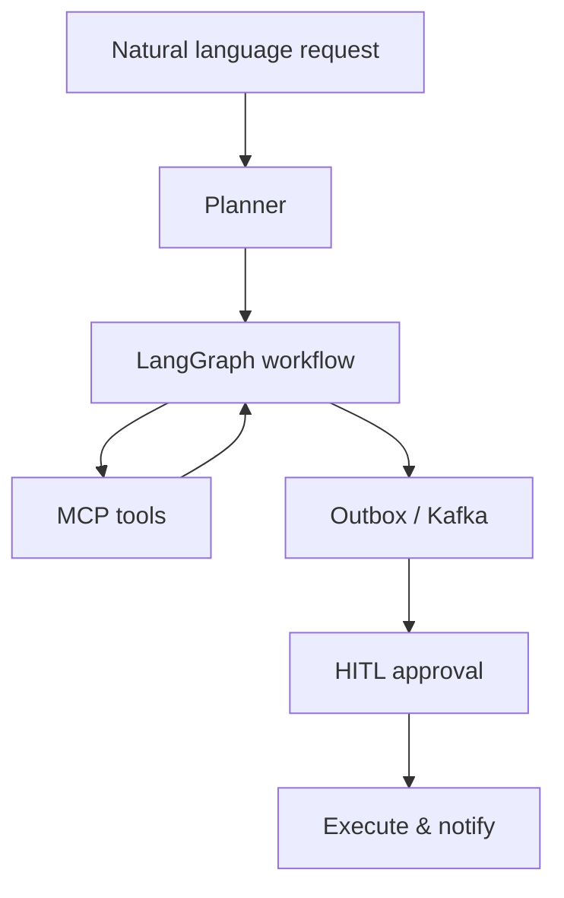
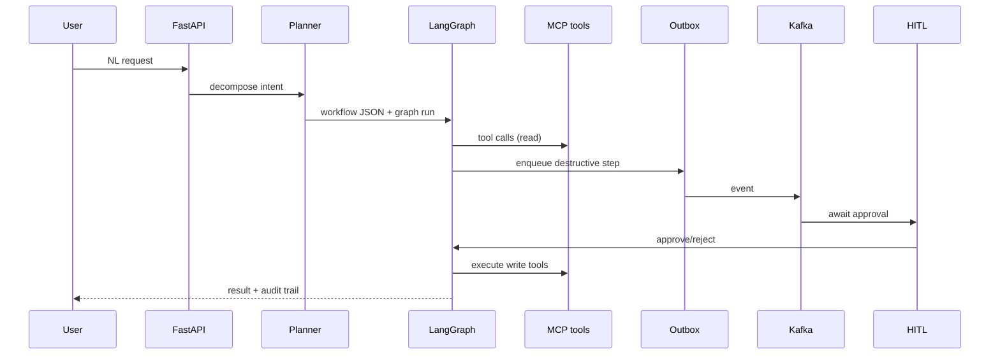
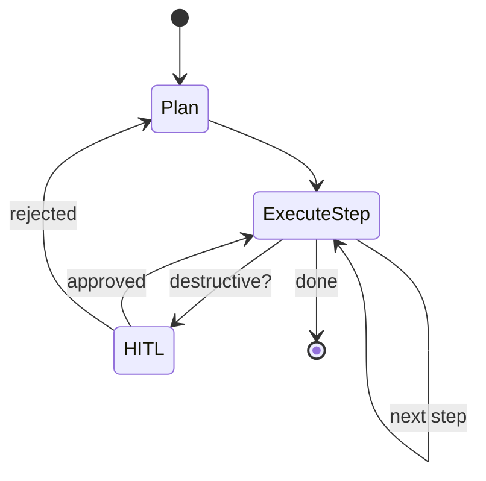

# Module 11 — PROJECT: Agentic Workflow (→ Project B)

> **Padho**: Isi file mein **Theory** — bahar mat jao.  
> **Likho**: `practice/` folder. **Pucho**: Cursor chat `@MODULE.md`  
> **Nav**: ← [Module 10](../10-evals-llmops/MODULE.md) · End

> **Ship spec**: `@Projects.md` **Project B** — AI Workflow Automation SaaS.

## At a glance

| | |
|---|---|
| Prerequisites | Modules 01–10 · `@Projects.md` |
| Duration | ~3–4 weeks |
| Project? | Yes |
| Exit test | Workflow milestones · Project B defend bina notes ke |

## Visual map



```
User NL query
     ↓
  Planner (decompose)
     ↓
  LangGraph state machine
     ├── MCP tools (external actions)
     └── Outbox → Kafka → HITL gate
                              ↓
                         execute + audit log
```

**Mental model**: NL se plan banta hai, LangGraph orchestrate karta hai, MCP tools + Kafka outbox + HITL sab ek workflow engine mein milte hain.

**Redraw challenge**: NL → plan → LangGraph → MCP + outbox/Kafka → HITL → execute full architecture bina dekhe draw karo.

---

## Read order

1. Visual map → 2. **Theory** (neeche) → 3. **Practice** → 4. Chat agar doubt → 5. NOTES

---

## Learning hooks

| Feature | Your unfair advantage |
|---------|----------------------|
| NL → workflow plan | LangGraph planning |
| MCP tools | Standard integrations |
| Structured outputs | Pydantic — Zod brain |
| HITL checkpoints | Rootstock savepoint mindset |
| Outbox + Kafka execution | Already built in Zapier clone |
| Eval harness | Trajectory scoring |

---

## Theory

### 1. Project B thesis — `@Projects.md`

**AI Workflow Automation SaaS:** users natural language mein automation describe karein, agent plan + connect tools + run safely.

```
Product pitch:
  "Runs are billed and executed exactly once — never dropped, never doubled."
```

Billable unit: **task runs**. Tiers by monthly volume.  
Yeh tumhara Zapier clone + AI orchestration layer.

---

### 2. End-to-end architecture



---

### 3. NL → structured workflow plan (M1)

```
User: "When invoice overdue 30 days, email client and create Slack task"

Planner output (JSON schema):
{
  "trigger": "schedule_daily",
  "steps": [
    {"id": "s1", "tool": "query_overdue_invoices", "args": {"days": 30}},
    {"id": "s2", "tool": "send_email", "args": {...}, "needs_hitl": false},
    {"id": "s3", "tool": "create_slack_task", "args": {...}, "needs_hitl": true}
  ]
}
```

**Pydantic validation** — invalid plan reject before run.  
Eval: 90%+ valid schema on test phrases (M1 pass criteria).

---

### 4. LangGraph orchestration (M2–M4)



- Linear workflow pehle (M2)
- MCP + custom tools wire (M3)
- HITL on destructive steps (M4) — Module 09 patterns

---

### 5. Outbox + Kafka — exactly-once execution (M5)

```
Tera existing pattern (Zapier clone):

  BEGIN TX
    UPDATE workflow_run SET status='pending_execute'
    INSERT INTO outbox (event_type, payload, idempotency_key)
  COMMIT

  Worker reads outbox → Kafka → execute once
  idempotency_key unique → duplicate webhook = no-op
```

**Billing link:** completed run metered **exactly once** — double execution = double charge + angry customer.

Interview defend: outbox = source of truth; Kafka = delivery; worker idempotency = effect once.

---

### 6. MCP integration (M3)

External tools via MCP servers — Slack, DB, webhooks.  
Credential vault per tenant (encrypted) — Projects.md spine.

```
workflow step → MCP client.call_tool("slack_post", args)
             → NOT raw API key in prompt
```

---

### 7. HITL + audit (M4)

Destructive steps: `send_payment`, `delete_record`, `write_webhook`  
Pause graph → notify human → approve/reject → resume or replan.

Audit log every step — Module 09 schema.

---

### 8. Eval harness + Langfuse (M6)

```
Golden NL phrases → expected workflow JSON (trajectory)
Golden runs → expected tool order (trajectory eval)
Regression: bad planner change caught before deploy
```

Langfuse traces per run — cost per task, debug failed plans.

---

### 9. Milestones map

| M | Deliverable |
|---|-------------|
| M1 | NL → workflow JSON 90%+ valid |
| M2 | LangGraph linear 3-step workflow |
| M3 | MCP + custom tools |
| M4 | HITL destructive steps |
| M5 | Outbox exactly-once |
| M6 | Eval suite + Langfuse |
| M7 | Demo: refund workflow E2E |

---

### 10. CV narrative

Combine: distributed systems (outbox/Kafka) + agents (LangGraph/MCP) + evals (trajectory) + fintech domain (refund demo).

---

## Practice

> **Saare assignments ek jagah**: [`practice/README.md`](practice/README.md) — problem statements, instructions, pass criteria.  
> Code **tum** likhoge Cursor mein. Stubs `practice/` mein hain (`TODO` search) — learning sandbox; ship `@Projects.md` Project B in main codebase.  
> Stuck? Chat: `@modules/11-project-agentic-workflow/MODULE.md @Projects.md`

| # | File | Kya karna hai | Pass when |
|---|------|---------------|-----------|
| M1 | `practice/nl_to_workflow.py` | NL → workflow JSON | 90%+ valid on test set |
| M2 | `practice/linear_workflow_graph.py` | 3-step LangGraph | Completes E2E |
| M3 | `practice/mcp_tools_wire.py` | MCP + custom tools | External + DB tools work |
| M4 | `practice/hitl_destructive.py` | HITL pause/approve | Reject replans |
| M5 | `practice/outbox_stub.py` | Idempotent execution | Duplicate → single effect |
| M6 | `practice/eval_harness.py` | Trajectory regression | Bad plan fails CI |
| M7 | `practice/demo_refund/` | Refund workflow demo | Recordable + README |

---

## Active recall (khud jawab likho NOTES mein)

1. Outbox exactly-once execution aur billing guarantee kaise link hote hain?
2. HITL checkpoint destructive steps pe kyun mandatory?
3. CV narrative — 3 defendable bullets?

**Chat drill** (optional): "Module 11 — full architecture whiteboard"

---

## Progress checklist

- [ ] Theory Section 1–10 padh liya
- [ ] Redraw challenge kiya
- [ ] Practice M1–M7 pass
- [ ] Active recall NOTES mein likha
- [ ] NOTES architecture + eval scores logged

---

## Optional appendix (zarurat ho tab)

- [`@Projects.md` Project B](../../Projects.md) — full ship spec
- [Transactional outbox pattern](https://microservices.io/patterns/data/transactional-outbox.html) — exactly-once deep dive
