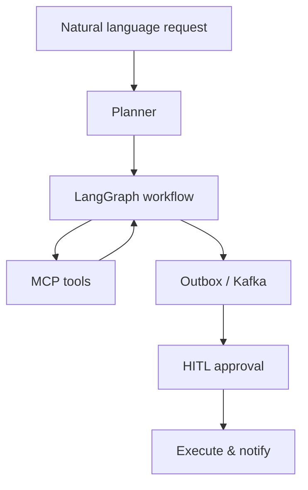

# Module 11 — PROJECT: Agentic Workflow (→ Project B)

> **Agent spawn**: `@Memory.md` + this file + `@modules/11-project-agentic-workflow/NOTES.md`  
> **Nav**: ← [Module 10](../10-evals-llmops/MODULE.md) · End

## At a glance

| | |
|---|---|
| Prerequisites | Modules 01–10 · `@Projects.md` |
| Duration | ~3–4 weeks |
| Project? | Yes |
| Exit test | Workflow milestones · `@Projects.md` **Project B** |

## Visual map

> **Kaise padho**: Pehle diagram dekho → topics padho → session end pe "Redraw challenge" bina dekhe draw karo



```
User NL query
     ↓
  Planner (decompose)
     ↓
  LangGraph state machine
     ├── MCP tools (external actions)
     └── Outbox → Kafka → HITL gate
                              ↓
                         execute + audit log
```

### Mental model (1 line)

NL se plan banta hai, LangGraph orchestrate karta hai, MCP tools + Kafka outbox + HITL sab ek workflow engine mein milte hain.

### Redraw challenge

NL → plan → LangGraph → MCP + outbox/Kafka → HITL → execute full architecture bina dekhe draw karo.

## Read order

1. Visual map → 2. **Padhai kahan se** (links padho) → 3. Topics tick → 4. Coach recall → 5. Assignments

**Prerequisites**: Modules 01–10  
**Duration**: ~3–4 weeks  
**Reference**: `@Projects.md` Project 2

## Padhai kahan se (Study material)

> **Topics = checklist. Neeche padho → phir Coach → phir Assignment.**  
> Poora flow: [[HOW-TO-STUDY|HOW-TO-STUDY.md]]

### Session 1 (~50 min) — LangGraph + outbox backbone

| # | Topic (checklist) | Padho yahan | Time |
|---|-------------------|-------------|------|
| 1 | Project B spec | [[Projects|Projects.md]] — Project B: NL workflow, outbox, HITL, billing | 20 min |
| 2 | LangGraph orchestration | [LangGraph — Introduction](https://langchain-ai.github.io/langgraph/) — state machine for workflows | 15 min |
| 3 | Outbox pattern | [[Projects|Projects.md]] — outbox + exactly-once sections + [Microservices.io — Transactional outbox](https://microservices.io/patterns/data/transactional-outbox.html) skim | 15 min |

**Session 1 ke baad Coach se pucho:** "Outbox exactly-once execution aur billing guarantee kaise link hote hain?"

### Session 2 (~40 min) — Integration patterns

| # | Topic (checklist) | Padho yahan | Time |
|---|-------------------|-------------|------|
| 1 | HITL + MCP | Module 09 HITL recap + Module 08 MCP recap (5 min each) | 10 min |
| 2 | Eval harness | Module 10 — Langfuse traces + regression mindset | 15 min |
| 3 | Feature matrix | Re-read Feature matrix — map unfair advantages to milestones | 15 min |

**Session 2 ke baad:** Milestone M1 start (Cursor + `@Projects.md`)

### Coach prompt (padhai ke baad)

```
@Memory.md @modules/11-project-agentic-workflow/MODULE.md @Projects.md

Maine Session 1–2 resources padh liye. Architecture diagram ke saath explain karo:
NL → LangGraph → MCP + outbox/Kafka → HITL → execute. Phir CV narrative — 3 defendable bullets.
Code mat likh.
```

## Objectives

Zapier clone ke upar **AI orchestration layer** — highest-premium portfolio piece.

## Feature matrix

| Feature | Your unfair advantage |
|---------|----------------------|
| NL → workflow plan | LangGraph planning |
| MCP tools | Standard integrations |
| Structured outputs | Pydantic — Zod brain |
| HITL checkpoints | Rootstock savepoint mindset |
| Outbox + Kafka execution | Already built in Zapier clone |
| Eval harness | Trajectory scoring |
| Domain: payments/refunds | Interview domain depth |

## Milestones

| M | Deliverable | Pass |
|---|-------------|------|
| M1 | NL intent → structured workflow JSON | Valid schema 90%+ on test phrases |
| M2 | LangGraph executes linear workflow | 3-step workflow completes |
| M3 | MCP + custom tools wired | External + DB tools work |
| M4 | HITL on destructive steps | Pause → approve/reject |
| M5 | Outbox exactly-once execution | Duplicate webhook → single effect |
| M6 | Eval suite + Langfuse traces | Regression catches bad plan |
| M7 | Demo: "refund workflow" end-to-end | Recordable demo + README |

## CV narrative

Combine: distributed systems (Rootstock + Zapier clone) + agents (LangGraph + MCP + evals).

## Progress checklist

- [ ] Objectives recall bina notes ke
- [ ] Milestones M1–M7 pass
- [ ] NOTES.md session log updated

## NOTES.md

Architecture diagrams, eval scores over time, failure postmortems.
