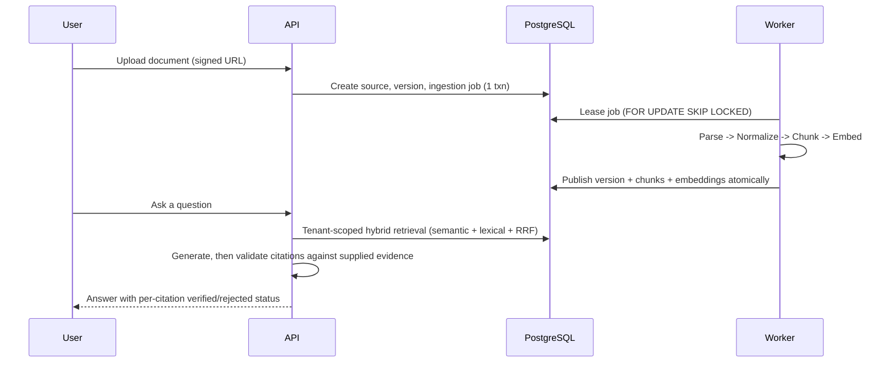

# Atlas AI — project mental model

Read this first, every time you come back after a gap. Everything else in this folder hangs off
this page. Grounded in `codevoks/atlas-ai` as of phase-11 completion (all 11 phases `Complete` per
`docs/internal/engineering-history/project-status.md`).

## What is Atlas?

A **multi-tenant SaaS** that lets a workspace upload documents, get them turned into searchable,
citable evidence, ask questions and get **grounded answers with post-verified citations**, and run
a **bounded, human-approved research workflow** over that evidence. The entire golden path —
ingestion, hybrid retrieval, grounded generation, evaluation, bounded research, security guardrails
— runs at **$0**, on local Postgres and deterministic local AI adapters, with paid providers as
opt-in adapter-compatible swaps, never required.

One-line pitch (interview-ready): *"A production-shaped RAG platform where tenant isolation,
citation integrity, and idempotent async processing are enforced in code, not just claimed in a
design doc — and where I can run the whole thing, including agentic research with a human approval
gate, without spending a rupee."*

## What problem does it solve?

Most RAG demos are single-tenant, single-shot, and trust the model's citations. Atlas treats four
things as first-class engineering problems instead of afterthoughts:

1. **Which tenant can see which chunk** — tenant isolation is a *correctness property*, checked
   server-side from membership, never from a client-supplied workspace ID.
2. **Is this citation real** — citations are validated *after* generation against the exact
   evidence spans supplied, never trusted because they're well-formatted.
3. **What happens when a worker dies mid-ingestion** — an explicit, resumable job state machine
   with leases, heartbeats, bounded retries, and atomic publication; no double-processing, no
   silently stuck documents.
4. **What stops an agent from doing something irreversible** — the bounded research workflow has a
   hard human-approval gate before final synthesis, allowlisted tools only (no shell, no arbitrary
   HTTP), and budgets.

## Why is it more than a basic RAG wrapper?

A basic RAG wrapper is: embed a query, cosine-search a vector store, stuff results into a prompt,
trust whatever the model says came from where. Atlas differs in every one of those steps:

- Retrieval is **hybrid** (semantic + lexical) fused with **deterministic RRF**, inside the *same*
  tenant/authorization filter on both branches — not bolted on after the fact.
- Evidence is **typed and versioned** `(workspace_id, chunk_id, document_version_id)`, frozen into
  an immutable `AnswerEvidence` row before generation ever runs.
- Citation checking is a **separate post-generation validator**, not "the model said `[1]` so it
  must be evidence #1."
- Everything that produced an answer — parser version, chunker version, embedding-set
  provider/model/version, generation prompt version — is **persisted provenance**, so nothing gets
  silently compared across incompatible configs.
- There's a real **offline evaluation harness** (Recall@K, MRR, citation-verified rate) scored
  against the same production retrieval/answer services, not a metrics-only shortcut.
- There's a **bounded agentic layer** on top of the deterministic RAG core, gated behind checkpoints,
  budgets, and human approval — added deliberately *after* the deterministic path was proven, per
  the "deterministic before agentic" invariant (`docs/decisions.md` D15).

## Major components

| Component | Owns | Must not own |
|---|---|---|
| `apps/web` (Next.js) | UI, BFF, session UX, safe rendering | Domain authorization, direct DB/provider access |
| `apps/api` (FastAPI) | Auth context, use cases, transactions, search/RAG orchestration | Long-running parsing/embedding, provider logic in routes |
| `apps/worker` (Python) | Durable ingestion jobs, leases, retries | Browser concerns, authorization bypass |
| PostgreSQL | **Sole authoritative store** — tenants, jobs, chunks, embeddings (exact-cosine baseline today), evaluations, research state | Large blobs, ephemeral locks as the *only* correctness mechanism |
| Object storage (local FS adapter) | Immutable source blobs, tenant-prefixed keys | Authorization decisions, mutable job state |
| Provider adapters | Typed embedding/generation/reranking/tool ports, deterministic local fakes as default | Business policy, unconditional paid calls |

Logical layering inside `apps/api` and `apps/worker`: **domain → application → infrastructure /
retrieval / ai / api**. Imports point inward — domain has no framework/provider dependency;
application depends on ports; infrastructure implements ports; routes/job consumers adapt external
input. This is the same shape an interviewer will recognize as hexagonal/ports-and-adapters.

## What is authoritative for what

- **PostgreSQL**: the single source of truth for everything transactional — including the current
  vector baseline (exact cosine over JSONB-stored vectors). No Redis in the default local stack
  yet; Redis is ephemeral coordination/cache only if/when introduced, never authoritative (D03/D07).
- **FastAPI**: the *only* place authorization decisions and RAG orchestration happen. Next.js never
  talks to Postgres or a provider directly.
- **The worker**: owns the ingestion job state machine end to end, but derives tenant scope from
  the authorized, immutable job record — never from message payload alone.
- **Object storage**: holds immutable blobs (raw upload + normalized derived artifact), addressed
  by tenant-prefixed keys the client never chooses.

## The golden end-to-end flow

Nothing is searchable until a document version **atomically publishes** as `READY` — no chunk or
embedding is visible before that. This single invariant is worth being able to explain cold: it's
what makes ingestion crash-safe and what makes "why can't I search my just-uploaded doc yet"
answerable precisely (eventual consistency, bounded by the job state machine, not indefinite).

## How to use the rest of this folder

- Zoom into a specific phase → `01-phases.md`.
- Zoom into a specific concept (tenancy, hybrid retrieval, citation validation, idempotency, ...) →
  `02-concepts.md`.
- Need a picture of a specific flow (ingestion state machine, security boundaries, research state
  machine) → `03-architecture-flows.md`.
- Prepping for an interview → `04-interview-questions.md`.
- Five-minute pre-interview refresh → `05-revision-cheatsheet.md`.
