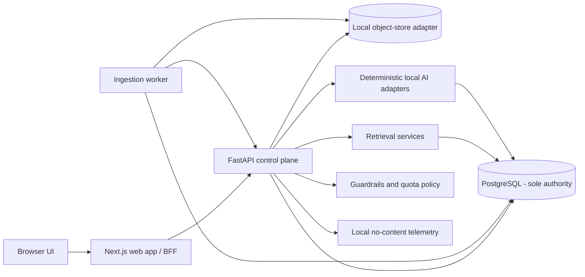
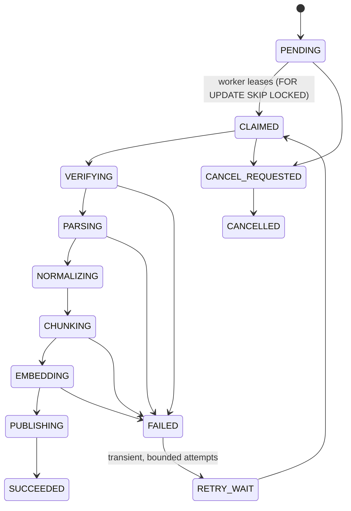
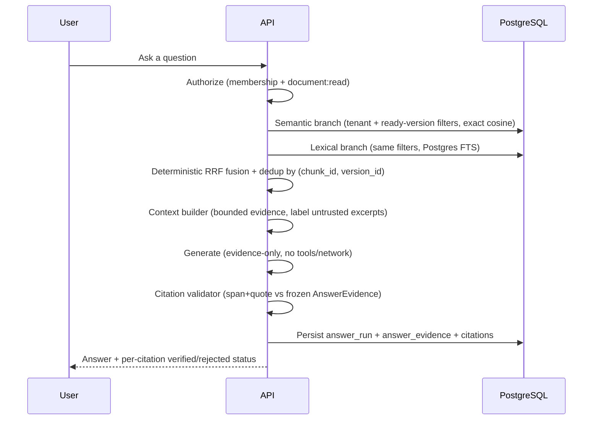
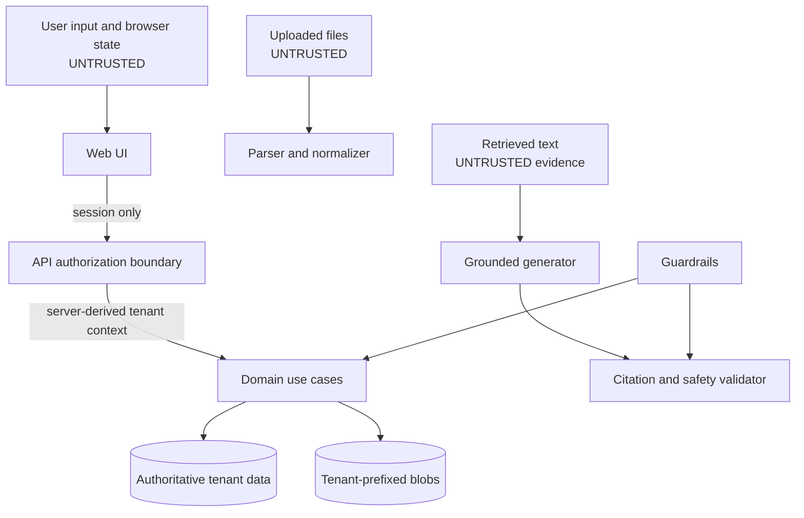
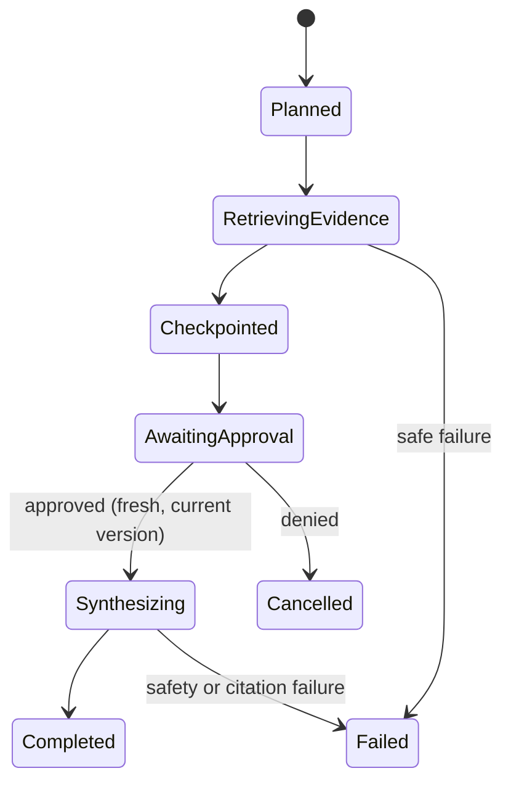
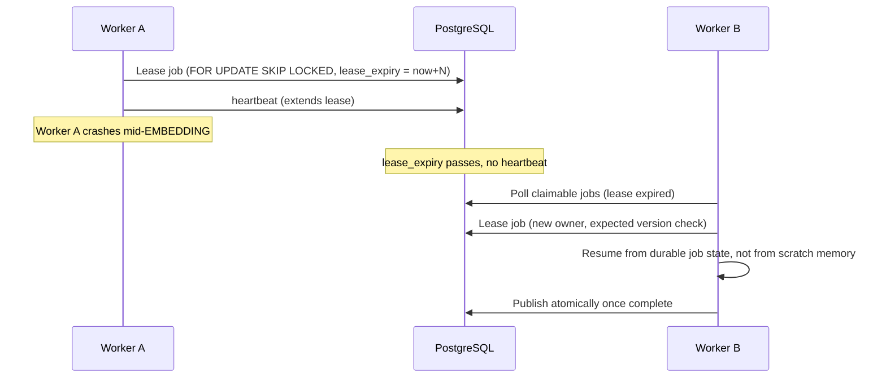

# Atlas AI — architecture flows (diagram-first)

Pictures first, then the one or two sentences that make each picture defensible in an interview.
Source of truth for the diagrams: `docs/system-design-visuals.md`, `docs/architecture.md`, and the
README in the implementation repo — reproduced/adapted here for study, not copied verbatim in bulk.

## 1. System context and trust boundaries

**Say this cold:** "Next.js never touches Postgres or a provider directly — everything goes through
FastAPI, which is the only place authorization decisions happen. That's one transaction boundary
and one place a tenant filter can't be forgotten."

## 2. Ingestion state machine

**Say this cold:** "Nothing is searchable until PUBLISHING completes atomically — chunks and
embeddings for a document version become visible in the same transaction as the version flipping to
READY. That's what makes a worker crash mid-pipeline safe: a half-processed version is never
half-visible."

## 3. Golden RAG flow (search → grounded answer)

**Say this cold:** "Both retrieval branches run under the exact same authorization filters — there
is no fusion step that runs *outside* the access-control boundary. And citation checking happens
*after* generation, against a frozen evidence snapshot the model can't influence."

## 4. Security / trust boundary map

**Say this cold:** "Everything crossing a trust boundary — uploaded files, retrieved text, tool
output — is treated as data, never as instructions. System/developer policy always outranks
content. That single sentence is the entire prompt-injection defense philosophy in this system."

## 5. Bounded research state machine

**Say this cold:** "The run cannot reach Synthesizing without an explicit, *current* human approval
— a stale approval version fails as a conflict, not a silent pass. Tools are limited to Atlas
retrieval and a local policy catalog; nothing that touches the outside world."

## 6. Worker failure/recovery (lease model)

**Say this cold:** "A worker's authority to publish is checked against lease owner *and* expected
job version at publish time — a worker that thinks it still owns a job but has actually lost its
lease can't corrupt state. Recovery is just 'another worker claims the same durable row,' not a
special crash-recovery code path."

## 7. Database responsibilities (who owns what)

| Store | Owns | Never owns |
|---|---|---|
| PostgreSQL | tenants, memberships, jobs, chunks, embeddings (JSONB exact-cosine baseline), evaluations, research state, security events, audit | large blobs, correctness resting solely on ephemeral locks |
| Object storage (local FS adapter) | immutable raw + normalized derived blobs, tenant-prefixed keys | authorization decisions, mutable job state |
| Redis | not in the default local stack yet; if introduced: ephemeral coordination/cache/rate-limit only | ever being the system of record |

**Say this cold:** "There is exactly one authoritative store — Postgres — including the current
vector baseline. That's a deliberate simplification (D03/D09): one transaction boundary, one place
tenant filters live, lower operational burden, at the cost of exact-cosine instead of an ANN index."
