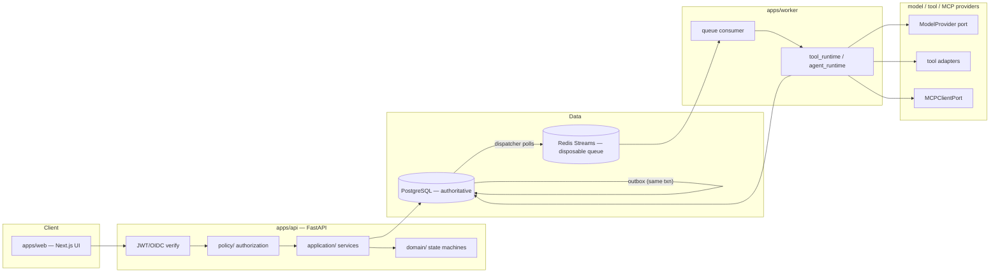
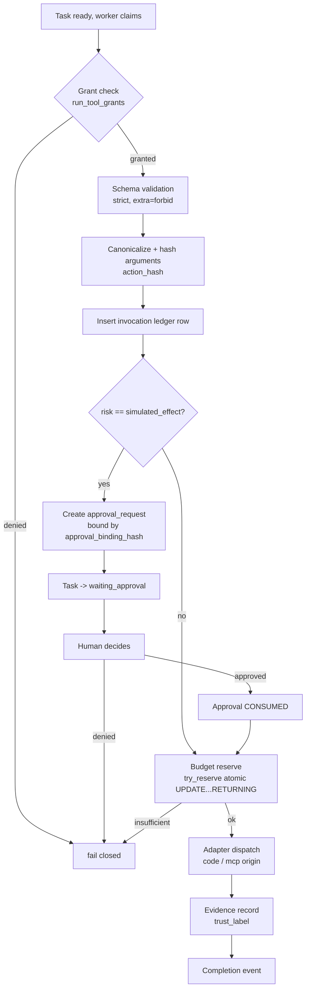
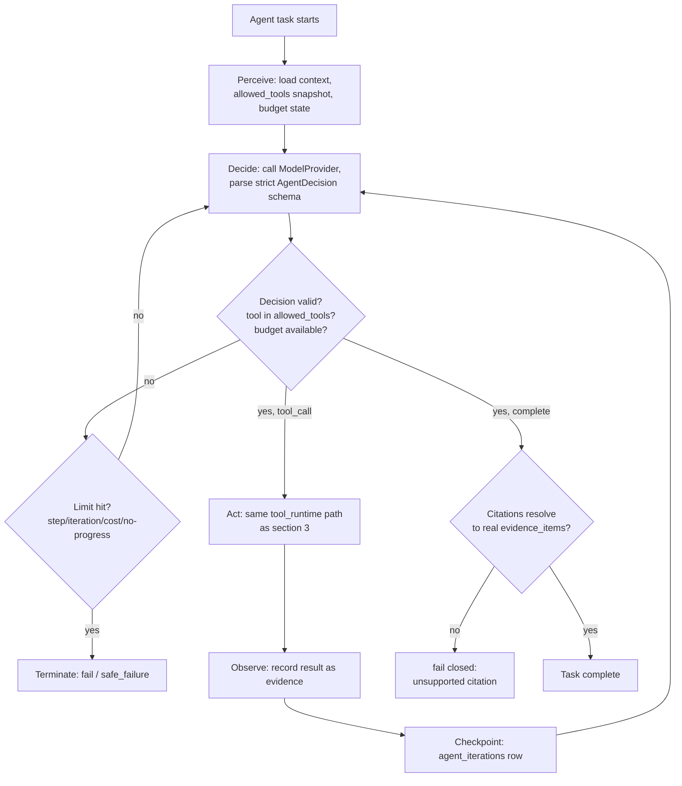
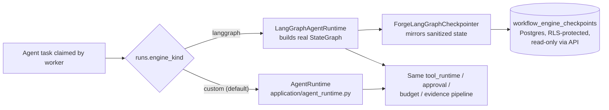
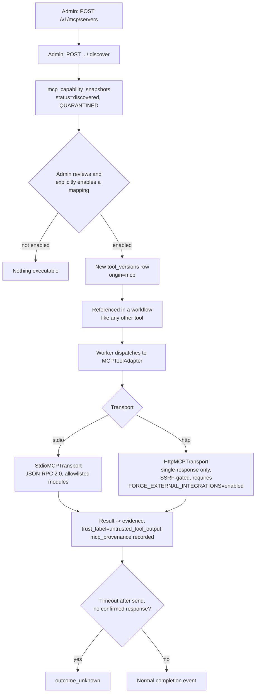
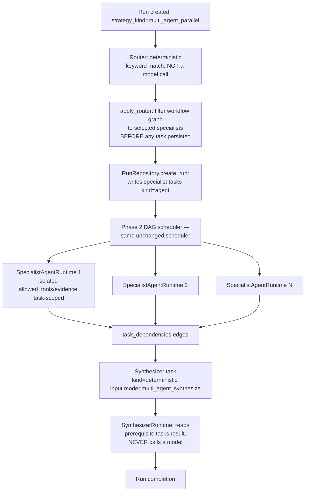
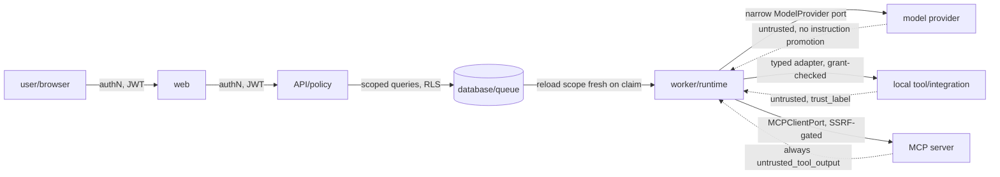

# Forge AI — architecture flows

Diagram-first walkthroughs of flows that exist **end-to-end in code** (per the grounding pass —
see [`01-phases.md`](01-phases.md)/[`02-concepts.md`](02-concepts.md) for pointers). Only flows
with real implementation are included. Use these as the "draw it from memory" redraw-challenge
material — see `LEARNING-STATUS.md`.

## 1. Overall architecture



Key point to say out loud when redrawing: **the outbox write and the state-change write are the
same Postgres transaction** — Redis only carries a *notification*, never the fact of record.

## 2. Durable run lifecycle (sequence)

```mermaid
sequenceDiagram
    participant C as Client
    participant API as apps/api
    participant PG as Postgres
    participant OUT as Outbox dispatcher
    participant Q as Redis Streams
    participant W as apps/worker

    C->>API: POST /v1/runs
    API->>PG: BEGIN: create run + tasks + outbox row (1 txn)
    PG-->>API: committed
    API-->>C: 201 run created
    OUT->>PG: poll due_unpublished
    OUT->>Q: publish task-ready message
    W->>Q: claim message (at-least-once)
    W->>PG: reload grants/policy/scope fresh, take attempt lease
    W->>PG: execute (tool_runtime or agent_runtime)
    W->>PG: BEGIN: write result + execution_event (1 txn)
    PG-->>W: committed
    Note over W,PG: if W crashes here, lease expires;<br/>recovery scan reclaims + republishes
```

Redraw check: can you say *why* a worker crash between "claim" and "commit result" is safe? (Lease
expires → recovery scan resets task to `ready` → republished → re-executed idempotently via the
invocation-ledger canonical hash.)

## 3. Tool execution path



Note: approval sits *between* invocation-ledger insertion and budget reservation — you approve the
exact hashed action, then still have to clear budget before it actually runs.

## 4. Approval pause/resume

```mermaid
sequenceDiagram
    participant TR as tool_runtime (worker)
    participant PG as Postgres
    participant H as Human (approver, ≠ requester)
    participant API as apps/api

    TR->>PG: risk=simulated_effect detected
    TR->>PG: INSERT approval_requests (approval_binding_hash = SHA256(sorted-key JSON))
    TR->>PG: task/attempt -> waiting_approval
    Note over TR: worker attempt ends here; no polling loop
    H->>API: POST /v1/approvals/{id}:decide
    API->>API: reject if approver == requester (approval_self_forbidden)
    API->>PG: BEGIN: write decision, mark request resolved (1 txn, commits before response)
    PG-->>API: committed
    API->>PG: emit new outbox message (resume)
    Note over PG: worker re-claims resumed task
    TR->>PG: check approval CONSUMED? no -> consume now, proceed
    TR->>PG: execute adapter, mark approval CONSUMED
```

Interview trap to rehearse: "can a modified action reuse this approval?" — no, because
`approval_binding_hash` is computed over the canonical arguments; change one argument and the hash
(and thus the approval row it matches) no longer matches.

## 5. Bounded agent loop (perceive-decide-act-observe)



Every arrow back into "Decide" is a bounded iteration, checkpointed to `agent_iterations` — this is
the concrete meaning of "loops live inside bounded state machines, never as workflow-DAG cycles."

## 6. Custom engine vs. LangGraph engine dispatch



The load-bearing fact: both branches converge on the *identical* Section-3 tool execution pipeline.
LangGraph's `StateGraph` manages its own node/edge execution; it does not manage authorization,
approvals, budgets, or the record of what happened — Postgres does, via the mirrored checkpoint.

## 7. MCP path



Key line for interviews: an enabled MCP tool is, from that point forward, indistinguishable in the
authorization/approval/budget pipeline from a code-registered tool — the *only* MCP-specific
additions are quarantine-at-discovery, the SSRF/zero-cost gate on the transport, and the mandatory
`untrusted_tool_output` trust label on its results.

## 8. Multi-agent fan-out/fan-in



Two things worth quizzing yourself on: (1) where exactly does authority live — at the
`apply_router` filtering step, before persistence, not inside any agent; (2) why is the synthesizer
deterministic code and not a model call — because aggregation of already-validated specialist
outputs doesn't need a model's judgment, and keeping it deterministic keeps the whole fan-in
auditable and cheap.

## 9. Trust boundaries (where every crossing authenticates + labels provenance)



Every solid arrow is an authenticated/authorized crossing; every dotted arrow is content coming
*back* that is treated as data-with-provenance, never as instruction — this is the same
untrusted-content discipline applied uniformly to model output, local tool output, and MCP output.

## 10. Failure/recovery map (which layer catches what)

| Failure | Caught by | Guarantee |
|---|---|---|
| Redis lost entirely | Nothing needed — outbox already durable in Postgres | Delay, not loss |
| Worker crashes mid-attempt | Recovery scan (lease expiry + `FOR UPDATE SKIP LOCKED`) | Task resets to `ready`, re-attempted, budget reservation released (post-final-audit fix) |
| External effect ambiguous (timeout after send) | `outcome_unknown` status | Never silently retried or assumed successful |
| Model hallucinates a tool | Grant check against `run_tool_grants`/`allowed_tools` | Fails closed |
| Model's action needs a human | `ApprovalPolicy` + binding hash | Blocks until explicit, hash-bound approval |
| Agent loop runs forever | Step/iteration/cost/no-progress limits | Deterministic termination |
| Budget exhausted mid-run | Atomic `try_reserve` `UPDATE...RETURNING` | Fail-closed stop, no race |
| Approval reused for a modified action | Hash mismatch | Rejected — old approval doesn't match new hash |
| Malicious MCP tool description | Trust label + no-instruction-promotion (heuristic flag is advisory only) | Content never becomes an instruction |
