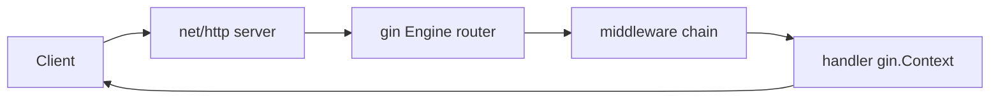

# Go (Gin) — Home

> Backend framework vault. ← [[Backend/README|Backend Index]] · ship target: **LLM Gateway (Project C)**

## Quick links
| Doc | Kya hai |
|-----|---------|
| [[Backend/Go-Gin/Memory\|Memory]] | Coach rules, profile, CV→Go hooks |
| [[Backend/Go-Gin/Prompt\|Prompt]] | Hinglish coach persona |
| [[Backend/Go-Gin/LEARNING-PLAN\|LEARNING-PLAN]] | **Full syllabus** |
| [[Backend/Go-Gin/VISUAL-STUDY-GUIDE\|VISUAL-STUDY-GUIDE]] | Goroutines + request flow + spaced-rep |

## Why Go/Gin for you
High-throughput infra ka tool — LLM Gateway, proxies, microservices. Goroutines + channels = tumhare Kafka/async mental model ka natural fit. Gin = sabse popular Go web framework (net/http pe built); foundations net/http + concurrency pe rakhe hain (asli new part).

## Modules
| # | Module | Notes | Focus |
|---|--------|-------|-------|
| 00 | [[Backend/Go-Gin/modules/00-foundations/MODULE\|Foundations]] | [[Backend/Go-Gin/modules/00-foundations/NOTES\|NOTES]] | Go basics, net/http, Gin setup |
| 01 | [[Backend/Go-Gin/modules/01-routing-handlers/MODULE\|Routing & Handlers]] | [[Backend/Go-Gin/modules/01-routing-handlers/NOTES\|NOTES]] | gin.Context, groups |
| 02 | [[Backend/Go-Gin/modules/02-validation-serialization/MODULE\|Binding & Validation]] | [[Backend/Go-Gin/modules/02-validation-serialization/NOTES\|NOTES]] | struct tags, ShouldBind |
| 03 | [[Backend/Go-Gin/modules/03-middleware/MODULE\|Middleware]] | [[Backend/Go-Gin/modules/03-middleware/NOTES\|NOTES]] | gin middleware, context |
| 04 | [[Backend/Go-Gin/modules/04-database-orm/MODULE\|Database (GORM/sqlx)]] | [[Backend/Go-Gin/modules/04-database-orm/NOTES\|NOTES]] | GORM/sqlx, migrations |
| 05 | [[Backend/Go-Gin/modules/05-auth-security/MODULE\|Auth & Security]] | [[Backend/Go-Gin/modules/05-auth-security/NOTES\|NOTES]] | JWT middleware |
| 06 | [[Backend/Go-Gin/modules/06-concurrency-async/MODULE\|Goroutines & Channels]] 🔥 | [[Backend/Go-Gin/modules/06-concurrency-async/NOTES\|NOTES]] | goroutines, channels, context |
| 07 | [[Backend/Go-Gin/modules/07-error-handling-resilience/MODULE\|Errors & Resilience]] | [[Backend/Go-Gin/modules/07-error-handling-resilience/NOTES\|NOTES]] | error values, timeouts |
| 08 | [[Backend/Go-Gin/modules/08-testing/MODULE\|Testing]] | [[Backend/Go-Gin/modules/08-testing/NOTES\|NOTES]] | httptest, table tests |
| 09 | [[Backend/Go-Gin/modules/09-observability/MODULE\|Observability]] | [[Backend/Go-Gin/modules/09-observability/NOTES\|NOTES]] | OTEL, Prometheus |
| 10 | [[Backend/Go-Gin/modules/10-deploy-capstone/MODULE\|Deploy & Capstone]] 🔥 | [[Backend/Go-Gin/modules/10-deploy-capstone/NOTES\|NOTES]] | Docker, build, LLM gateway |

## Request flow (mental model)


## Vault path
```
/Users/vansh/Desktop/Code/Learning/Backend/Go-Gin
```
