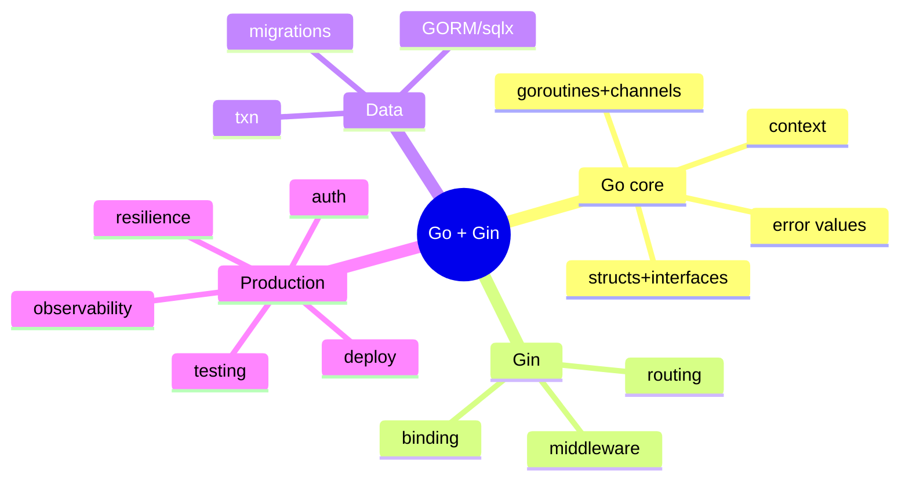

# Go (Gin) — Learning Plan (Full Syllabus)

> Visual learner: har module `## Visual map`. Start: `@VISUAL-STUDY-GUIDE.md`. No standard topic left out.

## Mind map

---

## Module 00 — Foundations
**Topics**: Go basics for a TS dev (packages, `go mod`, types, structs, methods, **interfaces** (implicit), slices/maps, `error` interface, `defer`); **net/http** server (the foundation Gin sits on: `http.HandlerFunc`, `ServeMux`); Gin setup (`gin.Default()`, run); project layout (`cmd/`, `internal/`, handlers/services/repo).
**Assignments**: A1 net/http hello server, then the same in Gin; A2 a struct + interface + method.
**Exit**: structs+interfaces; error interface; net/http vs Gin; `go mod`.

## Module 01 — Routing & Handlers
**Topics**: `gin.Engine`, `gin.Context`; route methods; path params (`:id`), query (`c.Query`); `c.JSON`/`c.String`/status; route **groups** (`r.Group("/api")`); param binding; static/file serving.
**Assignments**: A1 CRUD routes with `gin.Context`; A2 group under `/api/v1`.
**Exit**: gin.Context role; params vs query; groups.

## Module 02 — Binding & Validation
**Topics**: Request structs + **struct tags** (`json:"name"`, `binding:"required,min=1"`); `ShouldBindJSON`/`ShouldBindQuery`/`ShouldBindUri`; validator (go-playground); custom validators; response structs; handling bind errors → 400.
**Assignments**: A1 bind+validate a request struct (required/min/email); A2 custom validator + clean 400 errors.
**Exit**: struct-tag binding (= Pydantic/Zod analog); ShouldBind vs MustBind; validation error → 400.

## Module 03 — Middleware
**Topics**: `gin.HandlerFunc` middleware; `c.Next()` / `c.Abort()`; global vs group vs route middleware; `c.Set`/`c.Get` (request-scoped values); built-ins (Logger, Recovery, CORS); ordering; storing request-id; **`context.Context`** via `c.Request.Context()`.
**Assignments**: A1 request-id + logging middleware; A2 auth-guard middleware that aborts 401.
**Exit**: Next vs Abort; middleware ordering; c.Set vs context.Context.

## Module 04 — Database (GORM / sqlx)
**Topics**: `database/sql` + driver; **GORM** (models, auto-migrate, CRUD, relations, transactions) vs **sqlx** (explicit SQL, performance); connection pool (`SetMaxOpenConns`); migrations (golang-migrate); transactions + rollback (CV: ledger); `context` deadline on queries; repository pattern.
**Assignments**: A1 GORM or sqlx CRUD with a repo; A2 migration + a transaction that rolls back.
**Exit**: GORM vs sqlx trade-off; pool tuning; ctx on queries; txn rollback.

## Module 05 — Auth & Security
**Topics**: JWT (golang-jwt) create/verify; auth middleware extracting/validating Bearer; password hashing (bcrypt); RBAC via context value; secure headers; CORS; rate limiting (per-IP/token, Redis); secrets via env.
**Assignments**: A1 login→JWT→protected group via auth middleware; A2 role check in middleware.
**Exit**: JWT in middleware; bcrypt; RBAC via context.

## Module 06 — Goroutines & Channels 🔥
**Topics**: goroutines (`go f()`, cheap); **channels** (buffered/unbuffered, `select`, close); "share memory by communicating"; **worker pool** pattern (CV: Kafka workers); `sync.WaitGroup`, `sync.Mutex`, `errgroup`; **`context`** cancellation/deadline/propagation; **goroutine leaks** + the **race detector** (`-race`); fan-out/fan-in; `singleflight` (dedupe concurrent calls — gateway gold).
**Assignments**: A1 fan-out N upstream calls with `errgroup` + ctx timeout; A2 worker pool consuming a channel; A3 find a goroutine leak with `-race`/pprof and fix.
**Exit**: goroutine vs thread; channel + select; worker pool; context cancellation; leak/race detection.

## Module 07 — Error Handling & Resilience
**Topics**: error values, wrapping (`fmt.Errorf("...: %w", err)`), `errors.Is/As`; sentinel errors; panic/recover (only at boundaries); `c.Error` + centralized error middleware; timeouts (`context.WithTimeout`, `http.Client` timeout); retries+backoff; circuit breaker (sony/gobreaker — CV: fallback); graceful shutdown (`http.Server.Shutdown`).
**Assignments**: A1 error-wrapping chain + central error middleware; A2 upstream call with ctx timeout + retry + breaker.
**Exit**: error wrapping/Is/As; panic/recover boundary; ctx timeout; graceful shutdown.

## Module 08 — Testing
**Topics**: `testing` package; **table-driven tests**; `net/http/httptest` (`httptest.NewRecorder`, test Gin handlers); testify (asserts/mocks); interface-based mocking (small interfaces help); test DB; `-race` in CI; benchmarks (`Benchmark*`).
**Assignments**: A1 table-driven handler test with httptest; A2 mock a repo interface.
**Exit**: table tests; httptest for handlers; mocking via interfaces.

## Module 09 — Observability
**Topics**: structured logging (slog/zerolog) + request-id; OpenTelemetry (otelgin middleware, spans, propagation); Prometheus (`promhttp`, custom metrics, RED); health/readiness; pprof for profiling; per-request latency/cost.
**Assignments**: A1 slog structured logs + request-id; A2 `/metrics` + custom counter + otelgin spans.
**Exit**: slog/zerolog; otelgin; promhttp; pprof.

## Module 10 — Deploy & Capstone 🔥
**Topics**: `go build` static binary; tiny Docker image (distroless/scratch, multi-stage); env config; graceful shutdown in container; perf (GOMAXPROCS, connection reuse, `pprof`); **Capstone: the LLM Gateway** — reverse-proxy to model providers with routing by complexity, Redis semantic cache, rate limit + per-user budget, circuit breaker + fallback, OTEL tracing, SSE passthrough.
**Assignments**: A1 multi-stage Docker (scratch) + graceful shutdown; A2 capstone gateway (subset) with routing + cache + breaker + metrics.
**Exit**: static binary + tiny image; graceful shutdown; a defendable gateway (CV bullet: ~40% cost cut, p99).

---

## Weekly rhythm
Mon–Tue concept+recall · Wed–Thu build · Fri concurrency/resilience + NOTES · Sat spaced recall · Sun capstone.

## Spaced repetition checklist (har 2 modules)
- [ ] error value idiom + wrapping
- [ ] goroutine + channel + select
- [ ] context cancellation/deadline
- [ ] worker pool pattern
- [ ] gin middleware Next/Abort
- [ ] graceful shutdown
- [ ] race detector usage
