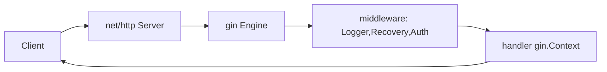

# Go (Gin) Visual Study Guide — Vansh

> Diagrams pehle, redraw se recall.

## Request flow


## Goroutines + channels (the core new skill)
```
go worker(ch)            // launch cheap goroutine
ch := make(chan Job, 10) // buffered channel = queue
for j := range ch { ... }// consume until closed

WORKER POOL (CV: Kafka workers):
 jobs --> [chan] --> goroutine1
                 --> goroutine2   --> results [chan]
                 --> goroutine3
"Share memory by communicating" — pass data via channels, not shared vars.
```

## context.Context (request lifecycle)
```
ctx, cancel := context.WithTimeout(r.Context(), 2*time.Second)
defer cancel()
// pass ctx as FIRST arg downstream; cancellation propagates to all goroutines/queries
// gateway: client disconnect -> ctx cancelled -> upstream call aborted (no wasted cost)
```

## error idiom (vs TS try/catch)
```
val, err := doThing()
if err != nil {
    return fmt.Errorf("doThing failed: %w", err)  // wrap, keep chain
}
errors.Is(err, ErrNotFound) / errors.As(err, &target)  // inspect
// panic/recover ONLY at boundaries (middleware Recovery), not for control flow
```

## TS ↔ Go bridge
```
try/catch        -> (val, err) + if err != nil
class            -> struct + methods + small interface
Promise.all      -> errgroup / WaitGroup over goroutines
async/await(libuv)-> goroutines + channels (true parallelism)
AbortController  -> context.Context cancellation
```

## Spaced-rep recall bank
1. error value vs exception?
2. unbuffered vs buffered channel?
3. worker pool kaise?
4. context cancellation kya rokta (gateway cost)?
5. goroutine leak kaise detect?
6. Next vs Abort?
