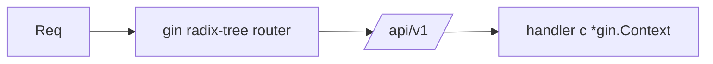

# Module 01 — Routing & Handlers

> **Agent**: `@Memory.md` + `@Prompt.md` + this + `@NOTES.md` · ← [00](../00-foundations/MODULE.md) · Next → [02 Binding](../02-validation-serialization/MODULE.md)

## Visual map
```
r := gin.Default()
v1 := r.Group("/api/v1")
v1.GET("/items/:id", h)     // c.Param("id")
v1.GET("/items", h)         // c.Query("q")
func h(c *gin.Context){ c.JSON(200, gin.H{"ok": true}) }
```

**Mental model**: `*gin.Context` = ek request ki sab cheez (params, body, response writer, request-scoped store). Groups = prefix + shared middleware (versioning, auth boundary). Gin radix-tree router = fast.

**Redraw**: router → group → handler(context).

## Objectives
1. `gin.Engine`, `*gin.Context`
2. Path params vs query
3. JSON/status responses
4. Route groups

## Topics
- Route methods; `c.Param`, `c.Query`, `c.JSON`/`c.String`/`c.Status`
- `r.Group()` (prefix + middleware); param binding
- `gin.H`; static/file serving

## Assignments
| # | Task | Passing criteria |
|---|------|------------------|
| A1 | CRUD routes using `*gin.Context` | All verbs respond JSON |
| A2 | Group under `/api/v1` | Routes namespaced |

## Active recall
1. gin.Context kya hold karta?
2. Param vs Query?
3. Groups kab?

## Checklist
- [ ] Router→handler from memory · [ ] A1,A2 · [ ] NOTES updated
